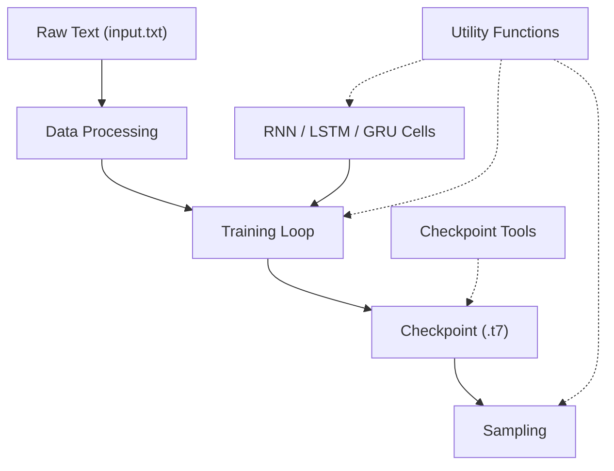

# char-rnn — Wiki

# char-rnn

**Multi-layer character-level recurrent neural network** for language modeling and text generation. char-rnn ingests a text corpus, trains an RNN to predict the next character in a sequence, and generates novel text that stylistically resembles the training data. It supports three architectures — vanilla RNN, LSTM, and GRU — with optional GPU acceleration via CUDA or OpenCL.

> **Note:** The [torch-rnn](https://github.com/jcjohns/torch-rnn) project by Justin Johnson is now recommended as the default implementation. It offers a cleaner codebase, uses Adam optimization, and hard-codes sensible defaults.

## Architecture



## How It Works

The system follows a straightforward pipeline:

1. **Prepare data** — The [Data Processing](data-processing.md) module reads a raw text file, builds a character vocabulary, encodes the text into numerical tensors, and splits it into minibatches ready for training.

2. **Train the model** — The [Training and Sampling](training-and-sampling.md) module unrolls one of the three [Recurrent Neural Networks](recurrent-neural-networks.md) cell types across time, feeds in the minibatches, and optimizes the network parameters. It periodically evaluates on a validation split and saves checkpoints.

3. **Generate text** — The same module's `sample.lua` script loads a saved checkpoint and generates text by sampling from the model's output distribution one character at a time.

4. **Inspect and convert** — The [Checkpoint Tools](checkpoint-tools.md) utilities let you convert GPU-trained checkpoints to CPU format and inspect stored training options or validation losses.

The [Utility Functions](utility-functions.md) module provides shared low-level routines — tensor cloning, parameter flattening, and network replication — used across training, cell construction, and sampling.

## Getting Started

### Prerequisites

- [Torch](http://torch.ch/) (with `nngraph` and `optim` packages)
- Optional: `cunn` for CUDA, `clnn`/`cunn` for OpenCL

### Training

```bash
th train.lua -input_dir data/my_corpus/ -rnn_size 128 -num_layers 2 -gpuid 0
```

This trains a default LSTM model on the text in `data/my_corpus/`, saving checkpoints periodically.

### Sampling

```bash
th sample.lua checkpoint.t7 -length 2000 -temperature 0.7
```

Loads a checkpoint and generates 2000 characters of text.

### Converting a GPU Checkpoint to CPU

```bash
th convert_gpu_cpu_checkpoint.lua checkpoint.t7
```

## Key Concepts

- **One-hot encoding** — Characters are represented as one-hot vectors at the input layer; the network projects them into a dense embedding internally.
- **Unrolling** — Each RNN cell function constructs a *single timestep*. The training loop handles unrolling across time steps.
- **Inter-layer dropout** — Dropout is applied between recurrent layers, not within them.
- **Checkpoint format** — Models are serialized as Torch `.t7` files containing the protos (network graphs), training options, and validation loss history.