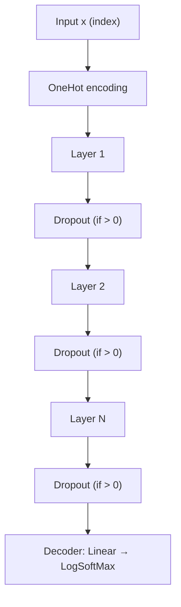

# Recurrent Neural Networks

# Recurrent Neural Networks Module

## Overview

This module provides three recurrent neural network architectures — **vanilla RNN**, **LSTM**, and **GRU** — implemented as Torch/nngraph computation graphs. All three share a common multi-layer design with one-hot input encoding, inter-layer dropout, and a shared decoder structure. Each function constructs a single **timestep** of the recurrent cell; unrolling across time is handled externally by the training loop.

## Common Architecture

All three cells follow the same structural pattern:



**Shared characteristics:**

| Feature | Detail |
|---|---|
| Input encoding | `OneHot(input_size)` on the raw input index |
| Inter-layer dropout | Applied to the output of every hidden layer except the first, controlled by the `dropout` parameter |
| Top-level dropout | Applied to the final layer's hidden state before decoding |
| Decoder | `nn.Linear(rnn_size, input_size)` → `nn.LogSoftMax()` |
| Output | `nn.gModule` containing the full computation graph |
| Layer sizing | First layer takes `input_size` dimensions; all subsequent layers take `rnn_size` dimensions |

### Input/Output Contract

Each function returns a graph whose **inputs** are the current timestep's data and **outputs** include both the recurrent states and the prediction:

- **Inputs**: `{x, prev_state_1, prev_state_2, ...}` — the input token followed by previous hidden states (and previous cell states for LSTM)
- **Outputs**: `{next_state_1, next_state_2, ..., logsoft}` — updated states followed by log-probabilities over the vocabulary

---

## API Reference

All three functions share the same signature:

```lua
model.gru(input_size, rnn_size, n, dropout)
model.lstm(input_size, rnn_size, n, dropout)
model.rnn(input_size, rnn_size, n, dropout)
```

| Parameter | Type | Description |
|---|---|---|
| `input_size` | number | Vocabulary size / number of distinct input tokens. Also determines the decoder output dimension. |
| `rnn_size` | number | Hidden state dimension for every layer. |
| `n` | number | Number of stacked recurrent layers. |
| `dropout` | number | Dropout probability between layers. Defaults to `0` (no dropout). |

### Return Value

An `nn.gModule` — a compiled nngraph computation graph ready for use with Torch's `nn.Sequencer` or manual time-step unrolling.

---

## Model Details

### RNN (`model/RNN.lua`)

The simplest recurrence. A single hidden state `h` is updated at each timestep:

```
h_t = tanh(W_ih * x_t + W_hh * h_{t-1})
```

**Graph inputs** (`n + 1` total): `x`, `prev_h[1]`, ..., `prev_h[n]`

**Graph outputs** (`n + 1` total): `next_h[1]`, ..., `next_h[n]`, `logsoft`

**Per-layer computation:**

1. Compute input-to-hidden: `i2h = Linear(input_size_L, rnn_size)(x)`
2. Compute hidden-to-hidden: `h2h = Linear(rnn_size, rnn_size)(prev_h)`
3. Sum and apply nonlinearity: `next_h = Tanh(i2h + h2h)`

No gating mechanisms — gradient flow is uncontrolled, making this architecture prone to vanishing/exploding gradients on long sequences.

---

### LSTM (`model/LSTM.lua`)

Long Short-Term Memory network with coupled input/forget gates (no bias terms). Maintains both a cell state `c` and a hidden state `h` per layer.

**Graph inputs** (`2n + 1` total): `x`, `prev_c[1]`, `prev_h[1]`, ..., `prev_c[n]`, `prev_h[n]`

**Graph outputs** (`2n + 1` total): `next_c[1]`, `next_h[1]`, ..., `next_c[n]`, `next_h[n]`, `logsoft`

**Per-layer computation:**

The four gate/transform projections are computed as a single fused operation for efficiency:

1. `all_input_sums = Linear(input_size_L, 4*rnn_size)(x) + Linear(rnn_size, 4*rnn_size)(prev_h)`
2. Split into four chunks of size `rnn_size`: `n1`, `n2`, `n3`, `n4`
3. Decode gates and transforms:
   - `in_gate = σ(n1)` — input gate
   - `forget_gate = σ(n2)` — forget gate
   - `out_gate = σ(n3)` — output gate
   - `in_transform = tanh(n4)` — candidate cell content
4. Update cell state: `next_c = forget_gate ⊙ prev_c + in_gate ⊙ in_transform`
5. Compute hidden output: `next_h = out_gate ⊙ tanh(next_c)`

The fused 4× projection is annotated with names `i2h_L` and `h2h_L` for each layer `L`, and the decoder is annotated as `decoder`.

> **Note:** This implementation does not include peephole connections or bias terms.

---

### GRU (`model/GRU.lua`)

Gated Recurrent Unit as described in [Cho et al. (2014)](http://arxiv.org/pdf/1412.3555v1.pdf). Maintains a single hidden state `h` per layer, using update and reset gates.

**Graph inputs** (`n + 1` total): `x`, `prev_h[1]`, ..., `prev_h[n]`

**Graph outputs** (`n + 1` total): `next_h[1]`, ..., `next_h[n]`, `logsoft`

**Per-layer computation:**

1. Compute gates using a shared `new_input_sum` helper:
   - `update_gate = σ(W_ih * x + W_hh * prev_h)`
   - `reset_gate = σ(W_ih * x + W_hh * prev_h)`
2. Compute candidate hidden state:
   - `gated_hidden = reset_gate ⊙ prev_h`
   - `hidden_candidate = tanh(W_ih * x + W_hh * gated_hidden)`
3. Interpolate between previous and candidate states:
   - `next_h = update_gate ⊙ hidden_candidate + (1 - update_gate) ⊙ prev_h`

The interpolation in step 3 is implemented as:
```
zh   = update_gate ⊙ hidden_candidate
zhm1 = (1 - update_gate) ⊙ prev_h
next_h = zh + zhm1
```

Where `(1 - update_gate)` is computed via `AddConstant(1)` after `MulConstant(-1)`.

> **Note:** The update and reset gates use **separate** `Linear` modules (created by separate calls to `new_input_sum`), so their weights are not shared despite having identical input structure.

---

## Dropout Application

Dropout is applied at two points, both using `nn.Dropout(dropout)`:

1. **Between layers**: Applied to the output of layer `L-1` before it feeds into layer `L` (for `L ≥ 2`). Not applied to the first layer's input.
2. **Before the decoder**: Applied to the top hidden layer's output before the linear projection.

When `dropout = 0` (the default), no dropout nodes are inserted into the graph.

---

## Integration Notes

- **OneHot dependency**: All three models reference a global `OneHot` class for input encoding. This must be defined in the runtime environment before the graph is constructed.
- **Sequencing**: Each function builds a single timestep. To process a sequence, wrap the returned `gModule` in `nn.Sequencer` or manually feed outputs back as inputs across timesteps.
- **State initialization**: The caller is responsible for providing zero tensors or learned initial states for `prev_h` (and `prev_c` for LSTM) at the start of each sequence.
- **Annotated nodes**: LSTM annotates `i2h_L`, `h2h_L` (per layer), and `decoder`. These names can be used to access specific parameters after construction, e.g., for weight regularization or custom initialization.