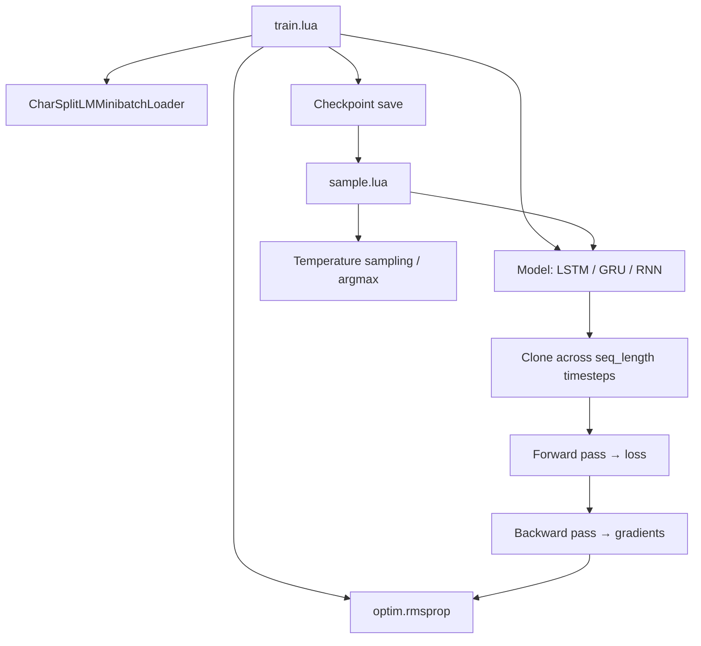

# Training and Sampling

# Training and Sampling Module

## Overview

This module implements the full lifecycle of a character-level multi-layer recurrent neural network: training on text corpora and generating new text by sampling from a trained model. It supports LSTM, GRU, and vanilla RNN architectures with GPU acceleration via CUDA or OpenCL.

The module consists of two standalone scripts:

- **`train.lua`** — Trains a language model on text data, periodically evaluating on a validation split and saving checkpoints.
- **`sample.lua`** — Loads a saved checkpoint and generates text by sampling from the model one character at a time.

---

## Architecture



---

## Training (`train.lua`)

### Command-Line Options

Options are parsed via `torch.CmdLine` and organized into four groups:

| Group | Key Options | Default |
|---|---|---|
| **Data** | `-data_dir` | `data/tinyshakespeare` |
| **Model** | `-rnn_size`, `-num_layers`, `-model` | `128`, `2`, `lstm` |
| **Optimization** | `-learning_rate`, `-learning_rate_decay`, `-learning_rate_decay_after`, `-decay_rate`, `-dropout`, `-seq_length`, `-batch_size`, `-max_epochs`, `-grad_clip`, `-train_frac`, `-val_frac` | `2e-3`, `0.97`, `10`, `0.95`, `0`, `50`, `50`, `50`, `5`, `0.95`, `0.05` |
| **Bookkeeping** | `-seed`, `-print_every`, `-eval_val_every`, `-checkpoint_dir`, `-savefile`, `-accurate_gpu_timing` | `123`, `1`, `1000`, `cv`, `lstm`, `0` |
| **GPU** | `-gpuid`, `-opencl` | `0`, `0` |

The `-model` flag accepts `lstm`, `gru`, or `rnn`. The `-init_from` flag allows resuming training from a checkpoint, which overrides `-rnn_size`, `-num_layers`, and `-model` to match the saved model.

### Data Loading

`CharSplitLMMinibatchLoader.create(data_dir, batch_size, seq_length, split_sizes)` loads and splits the input text into train/validation/test fractions. The test fraction is computed as `1 - train_frac - val_frac`. The loader exposes `vocab_size`, `vocab_mapping`, `ntrain`, and per-split batch iterators.

### Model Construction

When not resuming from a checkpoint, the script constructs a prototype network for a single timestep by calling the appropriate model module:

```lua
protos.rnn = LSTM.lstm(vocab_size, rnn_size, num_layers, dropout)
-- or
protos.rnn = GRU.gru(vocab_size, rnn_size, num_layers, dropout)
-- or
protos.rnn = RNN.rnn(vocab_size, rnn_size, num_layers, dropout)
```

A `ClassNLLCriterion` is attached as `protos.criterion`. When resuming via `-init_from`, both `protos` and `opt` are loaded from the checkpoint, and the script asserts that the vocabulary is compatible.

### State Initialization

`init_state` is a table of zero tensors, one per hidden state per layer. For LSTM models, each layer contributes two tensors (cell state `c` and hidden state `h`), so the total length is `2 * num_layers`. For GRU and RNN, it is `num_layers`. All tensors have shape `(batch_size, rnn_size)` and are moved to GPU if applicable.

### Parameter Handling

`model_utils.combine_all_parameters(protos.rnn)` flattens all learnable parameters into a single 1D tensor `params`, with `grad_params` as its gradient counterpart. When randomly initialized, parameters are drawn from `Uniform(-0.08, 0.08)`.

**LSTM forget gate bias initialization:** After random init, the script locates the `i2h_*` nodes in the computation graph and sets the forget gate bias slice to `1.0`. This encourages the model to remember early in training. The bias tensor is indexed as `[{{rnn_size+1, 2*rnn_size}}]`, corresponding to the second gate block in the `i, f, o, g` ordering.

### Cloning Across Time

The prototype networks are cloned `seq_length` times to unroll the RNN in time:

```lua
clones[name] = model_utils.clone_many_times(proto, opt.seq_length, not proto.parameters)
```

The third argument controls whether to share parameters — the `criterion` shares parameters (it's stateless), while the `rnn` does not (each timestep clone shares the same underlying weights but has independent graph nodes).

### Preprocessing (`prepro`)

Transposes input/target tensors from `(batch_size, seq_length)` to `(seq_length, batch_size)` for efficient timestep iteration, then transfers to GPU memory if applicable.

### Validation Evaluation (`eval_split`)

Evaluates the average cross-entropy loss over an entire data split:

1. Resets the batch pointer for the given split.
2. Iterates over all batches (or `max_batches` if specified).
3. Runs a full forward pass through all `seq_length` timesteps per batch, accumulating loss.
4. Carries the final RNN state forward across batches (truncated BPTT within a split).
5. Returns `loss / seq_length / n` (average per-character loss).

The model is set to `evaluate()` mode before each forward pass to disable dropout.

### Forward/Backward Pass (`feval`)

This is the closure passed to `optim.rmsprop`. It performs:

1. **Minibatch fetch** — `loader:next_batch(1)` gets the next training batch.
2. **Forward pass** — Iterates timesteps 1 through `seq_length`, feeding each input and previous state into `clones.rnn[t]`. Accumulates loss via `clones.criterion[t]`. The model is set to `training()` mode.
3. **Backward pass** — Iterates timesteps `seq_length` down to 1. Backpropagates through the criterion first, then through the RNN. Gradient on the state at each timestep is accumulated from both the loss and the future timestep. The gradient on input (`k == 1`) is discarded.
4. **State carry** — The final hidden state becomes `init_state_global` for the next minibatch (BPTT state carry).
5. **Gradient clipping** — `grad_params:clamp(-grad_clip, grad_clip)` prevents exploding gradients.

Returns `(loss / seq_length, grad_params)`.

### Main Training Loop

```lua
for i = 1, iterations do
    -- i is the global iteration counter
    -- epoch = i / loader.ntrain
```

Each iteration:

| Step | Condition | Action |
|---|---|---|
| Optimize | Every iteration | `optim.rmsprop(feval, params, optim_state)` |
| LR decay | `i % ntrain == 0` and `epoch >= learning_rate_decay_after` | Multiply `optim_state.learningRate` by `learning_rate_decay` |
| Validate & checkpoint | `i % eval_val_every == 0` or last iteration | Call `eval_split(2)`, save checkpoint |
| Print | `i % print_every == 0` | Log loss, gradient norm ratio, time |
| GC | `i % 10 == 0` | `collectgarbage()` |
| NaN check | Every iteration | Break if `loss ~= loss` |
| Explosion check | Every iteration | Break if `loss > 3 * loss0` |

**Checkpoint format:** Saved as a `.t7` file containing `protos`, `opt`, `train_losses`, `val_loss`, `val_losses`, `i`, `epoch`, and `vocab`. The filename encodes the model name, epoch, and validation loss: `lm_{savefile}_epoch{X}_{val_loss}.t7`.

**Timing note:** By default, GPU timing is approximate because CUDA operations are asynchronous. Set `-accurate_gpu_timing 1` to call `cutorch.synchronize()` for precise timing at the cost of slight overhead.

---

## Sampling (`sample.lua`)

### Command-Line Options

| Option | Default | Description |
|---|---|---|
| `-model` (required) | — | Path to checkpoint `.t7` file |
| `-seed` | `123` | Random seed |
| `-sample` | `1` | `0` = argmax, `1` = stochastic sampling |
| `-primetext` | `""` | Seed text to warm up the hidden state |
| `-length` | `2000` | Number of characters to generate |
| `-temperature` | `1` | Sampling temperature (lower = more conservative) |
| `-gpuid` | `0` | GPU device (`-1` for CPU) |
| `-opencl` | `0` | Use OpenCL instead of CUDA |
| `-verbose` | `1` | Print diagnostics (`0` = silent, text only) |

### Sampling Procedure

1. **Load checkpoint** — Restores `protos` and `opt`. The RNN is set to `evaluate()` mode.
2. **Build inverse vocabulary** — `ivocab` maps integer indices back to characters.
3. **Initialize state** — Zero tensors of shape `(1, rnn_size)` per state per layer (batch size 1 for sampling).
4. **Prime (optional)** — If `-primetext` is provided, each character is fed through the RNN sequentially to warm up the hidden state. Each character is printed as it is processed. If no prime text is given, the initial prediction is a uniform distribution over all characters.
5. **Generate loop** — For `length` iterations:
   - **Select next character:**
     - If `-sample 0`: argmax over log probabilities.
     - If `-sample 1`: divide log probabilities by temperature, exponentiate, renormalize, then sample via `torch.multinomial`.
   - **Forward pass** — Feed the selected character and current state into the RNN.
   - **Print** — Output the sampled character via `io.write`.

The generated text is printed to stdout as it is produced, with a trailing newline at the end.

### Temperature

The temperature parameter controls the sharpness of the output distribution:

- **Temperature < 1** — Sharper distribution; the model favors high-probability characters. Approaches argmax as temperature → 0.
- **Temperature = 1** — Unmodified distribution.
- **Temperature > 1** — Flatter distribution; more random/diverse output.

---

## GPU Support

Both scripts support three compute backends, selected at startup:

| Backend | Packages | Flag |
|---|---|---|
| CPU | (default) | `-gpuid -1` |
| CUDA | `cunn`, `cutorch` | `-gpuid N -opencl 0` |
| OpenCL | `clnn`, `cltorch` | `-gpuid N -opencl 1` |

If the requested GPU packages are not found, both scripts fall back to CPU mode and overwrite `opt.gpuid` to `-1`. The GPU device index uses Lua's 1-based indexing internally (`gpuid + 1`).

**Important:** A checkpoint trained on GPU must be sampled on GPU, and vice versa. The sampling script prints a warning about this.

---

## Resuming Training

To resume from a checkpoint:

```bash
th train.lua -init_from cv/lm_lstm_epoch2.50_1.2345.t7
```

When `-init_from` is set:

- The saved `protos` replace the newly constructed model.
- `opt.rnn_size`, `opt.num_layers`, and `opt.model` are overwritten from the checkpoint to ensure architectural compatibility.
- The vocabulary is checked for exact compatibility (same characters mapped to same indices).
- Random parameter initialization is skipped; the checkpoint's parameters are used.
- The optimizer state (`optim_state`) is **not** saved/restored, so RMSprop momentum resets. This is a known limitation.

---

## Key Design Decisions

- **Truncated BPTT with state carry:** Hidden states persist across minibatch boundaries during both training and evaluation, providing temporal continuity. Gradients do not propagate across boundaries.
- **Forget gate bias:** LSTM forget gates are initialized to 1.0, following Jozefowicz et al. (2015), to prevent early training instability where the network forgets too aggressively.
- **Gradient clipping:** Element-wise clamping at `[-grad_clip, grad_clip]` prevents gradient explosions without rescaling.
- **RMSprop:** The optimizer of choice, with per-epoch learning rate decay triggered after `learning_rate_decay_after` epochs.
- **NaN/explosion guards:** Training halts if the loss becomes NaN or exceeds 3× the initial loss, preventing wasted compute on diverged runs.