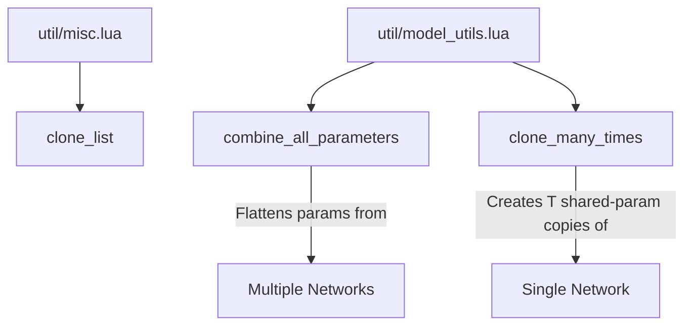

# Utility Functions

# Utility Functions Module

The utility module provides low-level tensor and model manipulation routines used throughout the codebase. It is split across two files: `util/misc.lua` for general-purpose helpers and `util/model_utils.lua` for network parameter management.

## Overview



---

## `util/misc.lua`

A small collection of standalone utility functions. Currently contains a single function.

### `clone_list(tensor_list, zero_too)`

Creates a deep copy of a list of tensors.

**Parameters:**

| Parameter | Type | Description |
|---|---|---|
| `tensor_list` | table | A key-value table of tensors to clone |
| `zero_too` | bool | If truthy, each cloned tensor is zeroed out after cloning |

**Returns:** A new table with the same keys, where each value is a cloned (and optionally zeroed) tensor.

**Notes:**

- Uses `pairs` for iteration, so both array-style and dictionary-style tables are supported.
- The original tensors are never modified.

---

## `util/model_utils.lua`

A module (`local model_utils = {}`) providing utilities for flattening parameters across multiple networks and cloning networks with shared parameters. Adapted from [wojciechz/learning_to_execute](https://github.com/wojciechz/learning_to_execute).

### `model_utils.combine_all_parameters(...)`

Flattens and concatenates all parameters and gradients from one or more network modules into single contiguous tensors. This is the multi-module equivalent of `module:getParameters()`.

**Parameters:**

| Parameter | Type | Description |
|---|---|---|
| `...` | nn.Module\* | Variadic list of network modules |

**Returns:** Two flat tensors:
1. `flatParameters` — a 1D tensor containing all unique parameters
2. `flatGradParameters` — a 1D tensor containing all unique gradients

**How it works:**

The function handles **shared parameters** correctly — when two modules share underlying storage, the shared region is only counted once in the flat output.

Internally, the `flatten` helper:

1. **Collects unique storages.** Each parameter tensor is backed by a storage object. The function builds a set of unique storages (keyed by pointer address) and assigns each a running offset into a combined flat buffer.

2. **Re-points parameters into a flat tensor.** Each parameter tensor is re-seated (`:set`) to reference the appropriate region of the combined flat storage, preserving its original size and stride.

3. **Compacts away holes.** When storages overlap or have gaps, a mask/cumsum pass identifies unused slots ("holes") and produces a compact `flatUsedParameters` tensor. Parameters are re-seated a second time into this compact storage.

4. **Copies original values.** The original storage data is copied into the flat tensor so that parameter values are preserved.

**Usage:**

```lua
local model_utils = require 'util/model_utils'
local flat_params, flat_grads = model_utils.combine_all_parameters(rnn, criterion, encoder)
-- flat_params and flat_grads are now single flat tensors
-- suitable for optimization routines like optim.rmsprop or optim.adam
```

**Important:** After calling this function, the original parameter tensors in each module are **views into** the returned flat tensors. Mutating the flat tensor mutates the module parameters, and vice versa.

---

### `model_utils.clone_many_times(net, T)`

Creates `T` independent clones of a network that **share parameters** with the original. This is the standard pattern for unrolling recurrent networks across time steps.

**Parameters:**

| Parameter | Type | Description |
|---|---|---|
| `net` | nn.Module | The network to clone |
| `T` | number | Number of clones to produce |

**Returns:** A table of `T` cloned networks (indices 1 through T).

**How it works:**

1. Extracts the original network's parameters, gradients, and (if present) `parametersNoGrad`.
2. Serializes the network to a `torch.MemoryFile` (in-memory binary).
3. For each time step `t = 1..T`:
   - Deserializes a fresh deep copy from the memory file.
   - Re-points every parameter and gradient tensor in the clone to the **original** tensor's storage using `:set()`. This means all clones and the original share the same parameter values — updating one updates all.
   - If the network has `parametersNoGrad`, those are also shared.
4. Returns the array of clones.

**Usage:**

```lua
local model_utils = require 'util/model_utils'
local clones = model_utils.clone_many_times(rnn, seq_length)
-- clones[1] through clones[seq_length] share parameters with rnn
for t = 1, seq_length do
    local output = clones[t]:forward(inputs[t])
    -- ...
end
```

**Notes:**

- `collectgarbage()` is called after each clone to free intermediate deserialization objects.
- Each clone gets its own `MemoryFile` reader to avoid pointer aliasing issues during deserialization.
- The memory file is closed after all clones are created.

---

## Design Rationale

**Why `combine_all_parameters` instead of `getParameters`?** The standard `nn.Module:getParameters()` only works on a single module and doesn't handle the case where you need a single flat parameter vector spanning multiple independent networks (e.g., an RNN plus a criterion). This function generalizes that operation.

**Why `clone_many_times` instead of simple deep copy?** A naive deep copy would duplicate parameter storage, breaking gradient accumulation across time steps. By re-pointing cloned parameters to the originals, backpropagation through any clone accumulates gradients into the shared gradient tensors — which is exactly what BPTT requires.

**Why is `flatten` so complex?** The `flatten` helper accounts for shared storage between parameter tensors. If two parameters share the same underlying storage region, that region should appear only once in the flat output. The mask-and-cumsum compaction step removes duplicate slots that arise from overlapping storages, ensuring the returned flat tensor has no redundancy.