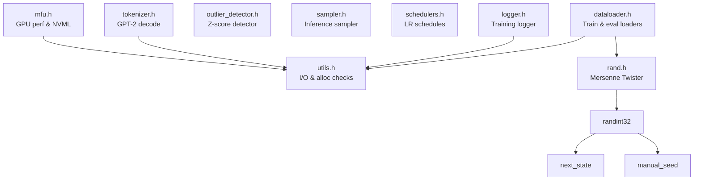
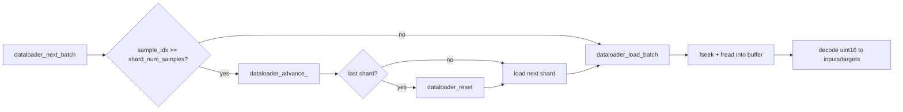

# Core Utilities

# Core Utilities

The `llmc/` directory contains the shared utility layer for the training framework. These headers are self-contained (header-only C) and provide everything from safe I/O wrappers to a PyTorch-compatible RNG, data loading, learning rate scheduling, and GPU monitoring. Every other module in the codebase — the model, the training loop, the checkpoint system — depends on these headers.

## Architecture



The dependency graph is intentionally flat: most headers depend only on `utils.h` for checked I/O, and `dataloader.h` additionally depends on `rand.h` for shuffling. No circular dependencies exist.

---

## Error-Checked I/O and Allocation (`utils.h`)

### Design Pattern

Every risky C standard library call is wrapped by an `extern inline` function that validates the return value and a macro that injects `__FILE__` and `__LINE__`. On failure, the wrapper prints structured diagnostics to stderr and calls `exit(EXIT_FAILURE)`. This eliminates silent failures and makes bugs trivially locatable.

**Always use the macro form** — it captures the call site automatically:

| Macro | Wraps | Failure mode detected |
|---|---|---|
| `fopenCheck(path, mode)` | `fopen` | Returns `NULL` |
| `freadCheck(ptr, size, nmemb, stream)` | `fread` | Short read (EOF, error, or partial) |
| `fwriteCheck(ptr, size, nmemb, stream)` | `fwrite` | Short write |
| `fcloseCheck(fp)` | `fclose` | Returns non-zero |
| `fseekCheck(fp, off, whence)` | `fseek` | Returns non-zero |
| `mallocCheck(size)` | `malloc` | Returns `NULL` |
| `scloseCheck(sockfd)` | `close` | Returns non-zero |
| `closesocketCheck(sockfd)` | `closesocket` (Windows only) | Returns non-zero |
| `tokenCheck(tokens, count, vocab)` | Manual loop | Token outside `[0, vocab_size)` |

`fopenCheck` includes two hints in its error output: one about the dataset directory migration (May 2024), and another suggesting to re-run the Python training script. These are the most common failure points for new users.

### Token Validation

`tokenCheck` iterates over an array of token IDs and verifies each falls within `[0, vocab_size)`. This is called during data loading to catch corrupted or mismatched token files early.

### Filesystem Helpers

- **`create_dir_if_not_exists(dir)`** — Calls `stat()` then `mkdir()` with mode `0700` if the directory doesn't exist. No-op if `dir` is `NULL`.
- **`find_max_step(output_log_dir)`** — Scans a directory for files matching the pattern `DONE_*`, parses the step number from each filename, and returns the maximum. Returns `-1` if the directory is `NULL` or can't be opened. Used for checkpoint resume logic.
- **`ends_with_bin(str)`** — Returns non-zero if `str` ends with `.bin`. Used for filtering shard files.

---

## Random Number Generation (`rand.h`)

A Mersenne Twister MT19937 implementation that is **numerically identical to PyTorch** (`torch.manual_seed` / `torch.randint` / `tensor.normal_()`). This is critical: it allows the C training loop to reproduce the exact same weight initializations and data shuffles as the Python reference, enabling bit-exact verification.

### State and Seeding

```c
mt19937_state state;
manual_seed(&state, 137);
```

`mt19937_state` holds the 624-element state array, a left counter, a next index, and the twist matrix constants. `manual_seed` initializes the state from a 32-bit seed using the standard MT19937 initialization recurrence.

If `randint32` is called on an uninitialized state (detected by checking the `MATRIX_A` constants), it auto-seeds with the MT19937 default seed `5489`.

### Integer Generation

- **`randint32(state)`** — Returns a uniformly distributed `unsigned int` in `[0, 2^32)`. Calls `next_state` to regenerate the state array when exhausted, then applies the standard MT tempering transforms.
- **`randint64(state)`** — Concatenates two `randint32` calls into a 64-bit value.

### Float Generation

- **`randfloat32(state)`** — Returns a `float` in `[0, 1)` by taking the upper 24 bits of `randint32` and dividing by `2^24`. This matches PyTorch's precision.
- **`randfloat64(state)`** — Returns a `double` in `[0, 1)` by taking the upper 53 bits of `randint64` and dividing by `2^53`.

### Distributions

- **`uniform_(data, numel, from, to, state)`** — Fills `data` with `numel` uniform samples in `[from, to)`.
- **`normal_(data, numel, mean, std, state)`** — Fills `data` with Gaussian samples. Uses two codepaths:
  - **`numel >= 16`**: Delegates to `normal_fill`, which generates uniform samples in batches of 16 and applies the Box-Muller transform via `normal_fill_16`. The last partial block of 16 is recomputed to maintain PyTorch numerical identity.
  - **`numel < 16`**: Uses a scalar Box-Muller with `randfloat64` for higher precision, caching the second sample for the next call.

### Permutations

- **`init_identity_permutation(data, numel)`** — Fills `data[i] = i`.
- **`random_permutation(data, numel, state)`** — Fisher-Yates shuffle using `randint32` for index selection.

---

## Training Logger (`logger.h`)

A minimal append-only logger that writes to `<log_dir>/main.log`. Only rank 0 in distributed training writes logs (`logger->active` is set to 0 for all other ranks).

### API

```c
Logger logger;
logger_init(&logger, log_dir, process_rank, resume);
```

- If `resume == 0`, the log file is wiped clean on init. If `resume == 1`, new entries are appended.
- `log_dir` must be shorter than 500 characters (asserted internally).

| Function | Log format |
|---|---|
| `logger_log_train(logger, step, train_loss, lr, grad_norm)` | `s:<step> trl:<loss> lr:<lr> norm:<norm>` |
| `logger_log_val(logger, step, val_loss)` | `s:<step> tel:<loss>` |
| `logger_log_eval(logger, step, val)` | `s:<step> eval:<val>` |

Each call opens the file in append mode, writes one line, and closes it. This is intentionally stateless — no file handle is held open between calls, ensuring crash safety.

---

## Model Flops Utilization (`mfu.h`)

Computes the theoretical peak FLOP/s for a given GPU and precision mode, and (when NVML is available) queries live GPU telemetry.

### Peak FLOP/s Lookup

```c
float flops = get_flops_promised("NVIDIA A100-SXM4-80GB", MFUH_PRECISION_BF16);
// Returns value in units of 1e12 (TFLOP/s)
```

The function searches a built-in `gpu_db[]` table of ~40 GPU models. Each entry maps to an architecture family (`VOLTA`, `AMPERE_DATACENTER`, `AMPERE_CONSUMER`, `HOPPER`, `ADA`) with reference peak FLOP/s, core count, and clock speed. For non-flagship GPUs, the peak is linearly scaled:

```
adjusted = reference_flops × (actual_cores / reference_cores) × (actual_mhz / reference_mhz)
```

Precision modes (`MFUH_PRECISION_FP32`, `MFUH_PRECISION_FP16`, `MFUH_PRECISION_BF16`) select the appropriate column from the `PerfData` struct. Returns `-1.0f` if the GPU is unknown or the precision mode is unsupported on that architecture (e.g., BF16 on Volta).

### GPU Telemetry (NVML)

When compiled with NVML (`#if __has_include(<nvml.h>)`), the header provides:

- **`nvml_get_device()`** — Lazily initializes NVML and returns a handle to GPU 0.
- **`get_gpu_utilization_info()`** — Returns a `GPUUtilInfo` struct with clock speeds, power usage/limit, temperature, fan speed, throttle reason, and averaged GPU/memory utilization from the driver's sample buffers (up to 128 samples).
- **`get_throttle_reason(bits)`** — Converts the NVML throttle bitfield into a human-readable string: `"power cap"`, `"thermal cap"`, `"other cap"`, or `"no cap"`.

Without NVML, `get_gpu_utilization_info()` prints an error and exits.

---

## Outlier Detector (`outlier_detector.h`)

A sliding-window z-score detector for monitoring training loss and gradient norms. Uses `double` arithmetic internally to avoid drift in the running sum/sum-of-squares.

### Usage

```c
OutlierDetector detector;
init_detector(&detector);

double z = update_detector(&detector, loss_value);
if (isnan(z)) {
    // Still filling the window, no z-score available yet
} else if (fabs(z) > threshold) {
    // Outlier detected
}
```

The window size is a compile-time constant (`OUTLIER_DETECTOR_WINDOW_SIZE = 128`), avoiding dynamic allocation. During the first 128 calls, `update_detector` returns `nan("")` while building up the window. After that, it maintains a circular buffer: the oldest value is subtracted from the running sums, the new value is added, and the z-score `(new_value - mean) / std_dev` is returned. If `std_dev == 0`, returns `0.0`.

---

## Inference Sampler (`sampler.h`)

Lightweight token sampling for generation. Uses a xorshift64* RNG (distinct from the MT19937 used in training) and softmax-based categorical sampling.

- **`random_u32(state)`** — xorshift64* returning the upper 32 bits.
- **`random_f32(state)`** — Returns a `float` in `[0, 1)` by taking the upper 24 bits of `random_u32`.
- **`sample_softmax(logits, n, coin)`** — Given raw logits and a random `coin` in `[0, 1)`, computes the softmax CDF and returns the sampled index. Avoids a full normalization pass by scaling `coin` by the sum of exponentials instead.

---

## Learning Rate Schedulers (`schedulers.h`)

Four schedule types, all sharing the same `LearningRateScheduler` config struct:

```c
LearningRateScheduler sched;
lr_scheduler_init(&sched, "cosine", 3e-4, 250, 10000, 0.1);
float lr = get_learning_rate(&sched, step);
```

| Field | Meaning |
|---|---|
| `learning_rate` | Peak learning rate |
| `warmup_iterations` | Steps for linear warmup |
| `train_num_batches` | Total training steps |
| `final_learning_rate_frac` | Final LR as fraction of peak (e.g., `0.1` means decay to 10% of peak) |

### Schedule Types

**Cosine** (`"cosine"`) — Linear warmup from 0 to `learning_rate`, then cosine decay to `learning_rate × final_learning_rate_frac`. The standard schedule for GPT-2/GPT-3 training.

**Linear** (`"linear"`) — Linear warmup, then linear decay to `learning_rate × final_learning_rate_frac`.

**Constant** (`"constant"`) — Returns `learning_rate` regardless of step. Warmup and decay are ignored.

**WSD** (`"wsd"`) — Warmup-Stable-Decay from [arXiv:2405.18392](https://arxiv.org/abs/2405.18392). Linear warmup, constant plateau until 80% of total steps, then `1 - sqrt(decay_ratio)` decay to `learning_rate × final_learning_rate_frac`. Set `final_learning_rate_frac` to `0.0` for full decay.

All schedules use `step + 1` during warmup (so step 0 gives a non-zero LR) and include assertions that decay ratios stay in `[0, 1]`.

---

## Tokenizer (`tokenizer.h`)

GPT-2 **decode-only** tokenizer. Encodes token IDs → strings. Encoding (string → tokens) is not supported because it requires regex, which is non-trivial in C.

### File Format

The tokenizer binary file has a 256-`uint32_t` header:
- `header[0]` = magic number `20240328`
- `header[1]` = version (1 or 2)
- `header[2]` = vocab size
- `header[3]` = EOT token ID (version 2 only; version 1 assumes 50256)

Following the header, each token is stored as: one `unsigned char` length byte, then `length` bytes of token content.

### API

```c
Tokenizer tokenizer;
tokenizer_init(&tokenizer, "gpt2_tokenizer.bin");

const char *text = tokenizer_decode(&tokenizer, token_id);
safe_printf(text);

tokenizer_free(&tokenizer);
```

- **`tokenizer_init`** — Reads the binary file, allocates the token table. Sets `init_ok = 0` if the file can't be opened (non-fatal; decode calls become no-ops).
- **`tokenizer_decode`** — Returns the string for a given token ID, or `NULL` if out of range or uninitialized.
- **`safe_printf`** — Prints a token string, filtering out non-printable, non-whitespace control characters. Handles single-byte tokens specially.
- **`tokenizer_free`** — Frees the token table and all allocated token strings.

---

## Data Loaders (`dataloader.h`)

### Training DataLoader

Serves sharded training data for distributed training. Each shard is a binary file with a 256-`int32` header (magic `20240520`, version `1`, token count) followed by `uint16_t` token IDs.

```c
DataLoader loader;
dataloader_init(&loader, "data/*.bin", B, T, rank, num_procs, 1);
dataloader_next_batch(&loader);
// loader.inputs and loader.targets are now populated
dataloader_free(&loader);
```

**Distributed partitioning**: The global batch is `num_processes × B × T` tokens. Each process reads its own slice (`local_batch_offset_bytes = rank × B × T × sizeof(uint16_t)`) from the current position in the shard file.

**Shuffling**: When `should_shuffle = 1`, both inter-shard and intra-shard shuffling are applied using the MT19937 RNG seeded with `42 + process_rank`. Shard order is permuted on each epoch reset; sample order within a shard is permuted when the shard is loaded.

**Epoch handling**: When all samples in a shard are exhausted, `dataloader_advance_` loads the next shard. When the last shard is exhausted, `dataloader_reset` starts a new epoch.

**Resume**: `dataloader_resume(loader, shard_idx, sample_idx)` restores position for checkpoint resumption.

#### Data Flow



### EvalLoader

Loads multiple-choice evaluation datasets (e.g., HellaSwag, MMLU). Each example has a shared context and 4 completions; the correct one is identified by a label.

```c
EvalLoader loader;
evalloader_init(&loader, "hellaswag.bin", B, T, rank, num_procs);
evalloader_next_batch(&loader);
// Run forward pass to get losses[B*T]
int correct = evalloader_stat_losses(&loader, losses);
evalloader_free(&loader);
```

**Batch packing**: Each example occupies 4 rows in the batch (one per completion). `can_fit_examples = B / 4` examples are packed per batch. The context tokens are replicated across all 4 rows; completion tokens follow the context. The `mask` array marks which positions belong to completions (where loss should be averaged).

**Scoring**: `evalloader_stat_losses` averages the loss over masked positions for each completion, then checks whether the completion with the lowest average loss matches the label. Returns the count of correct examples.

**Distributed work**: Examples are divided evenly across processes. Each process seeks to its assigned start position using the `<EXAMPLE_BYTES>` field for efficient skipping.

---

## Cross-Module Integration

The training loop (`train_gpt2.c`) ties these utilities together:

1. **Startup**: `dataloader_init` loads and validates all shards, `tokenizer_init` loads the vocab, `logger_init` prepares the log file.
2. **Each step**: `dataloader_next_batch` feeds `inputs`/`targets` to the model. `get_learning_rate` computes the current LR. `logger_log_train` records metrics. `update_detector` monitors for loss spikes.
3. **Checkpointing**: `find_max_step` determines the latest checkpoint. `dataloader_resume` restores data position.
4. **Evaluation**: `evalloader_next_batch` constructs multiple-choice batches. `evalloader_stat_losses` scores them.
5. **Generation**: `sample_softmax` and `random_f32` drive autoregressive token sampling. `tokenizer_decode` + `safe_printf` render output.
6. **MFU reporting**: `get_flops_promised` provides the denominator for MFU calculation. `get_gpu_utilization_info` adds hardware telemetry.