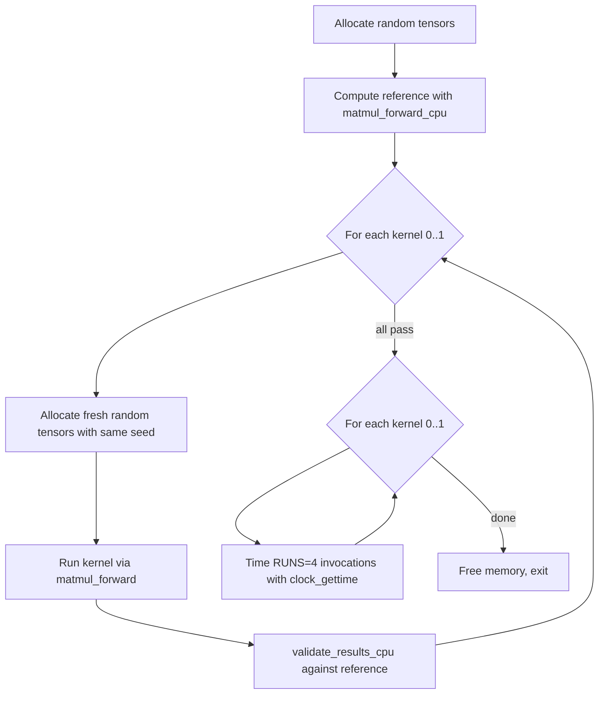

# CPU Reference Kernels

# CPU Reference Kernels — Matrix Multiplication Forward Pass

## Overview

This module provides CPU-side reference implementations for the matrix multiplication forward pass, the dominant operation in transformer inference and training. It serves two purposes:

1. **Correctness baseline** — the naive `matmul_forward_cpu` kernel is the ground truth against which GPU or optimized CPU kernels are validated.
2. **Optimization testbed** — an optimized tiled kernel (`matmul_forward_ngc92`) demonstrates a CPU-side performance technique and is benchmarked against the baseline in the built-in test harness.

## Tensor Layouts and Semantics

All kernels implement the same operation:

```
out[b][t][o] = bias[o] + sum_i( inp[b][t][i] * weight[o][i] )
```

| Tensor | Shape | Stride convention | Notes |
|--------|-------|-------------------|-------|
| `inp` | (B, T, C) | Row-major | Input activations |
| `weight` | (OC, C) | Row-major | Weight matrix |
| `bias` | (OC) | — | May be `NULL`; omitted from accumulation when absent |
| `out` | (B, T, OC) | Row-major | Output activations |

`OC` denotes "output channels." A typical use is the MLP expansion layer where `OC = 4 * C`.

## Kernel Implementations

### Kernel 0 — `matmul_forward_cpu`

The straightforward triple-nested-loop implementation:

```
for each (b, t):
    for each output channel o:
        val = bias[o]   (or 0.0f if bias is NULL)
        for each input channel i:
            val += inp[b,t,i] * weight[o,i]
        out[b,t,o] = val
```

No tiling, no vectorization hints. Serves as the readability reference and correctness oracle.

### Kernel 1 — `matmul_forward_ngc92`

An optimized variant that collapses the `B` and `T` dimensions into a single strided loop and tiles it with a factor of `LOOP_UNROLL = 8`. The key insight: each weight element `weight[o*C + i]` is loaded once and reused across 8 consecutive batch-time steps, keeping 8 partial sums in registers so the compiler can emit fused multiply-add (FMA) instructions.

**Restriction:** `B * T` must be a multiple of 8. The function prints an error and returns early if this invariant is violated.

Structure of the tiled loop:

```
for obt in [0, B*T, step=8]:        // collapsed batch-time, tiled by 8
    for o in [0, OC):
        result[0..7] = bias[o]       // 8 accumulators in registers
        for i in [0, C):
            w = weight[o*C + i]      // load weight once
            for ibt in [0..7]:
                result[ibt] += inp[(obt+ibt)*C + i] * w
        out[(obt+ibt)*OC + o] = result[ibt]  // write back
```

Compile with `-Ofast` (or MSVC `/O2 /fp:fast`) to ensure the inner loop is auto-vectorized into FMAs.

## Dispatch — `matmul_forward`

```c
void matmul_forward(int kernel_num, float* out,
    const float* inp, const float* weight, const float* bias,
    int B, int T, int C, int OC);
```

Selects the implementation at runtime via `kernel_num`:

| `kernel_num` | Function called |
|--------------|-----------------|
| 0 | `matmul_forward_cpu` |
| 1 | `matmul_forward_ngc92` |
| other | prints error, calls `exit(1)` |

## Validation Utility — `validate_results_cpu`

```c
void validate_results_cpu(const float* kernel_result, const float* cpu_reference,
    const char* name, int num_elements, float tolerance);
```

Compares two buffers element-wise using a **relative tolerance** check:

```
|cpu_reference[i] - kernel_result[i]| <= tolerance + |cpu_reference[i]|
```

This accounts for floating-point drift proportional to the magnitude of the reference value. On mismatch, up to 10 discrepancies are printed before the process exits with failure. The first 5 element pairs are always printed for quick inspection.

## Test Harness — `main`

The built-in `main` function runs a full validate-then-benchmark workflow:



**Default problem size:** `B=8, T=1024, C=768, OC=3072` — representative of a GPT-2-small MLP layer.

**Random data generation:** `make_random_float` fills arrays with values in `[-1, 1)` using `rand()` seeded with `srand(137)`. The same seed is used for both reference and kernel allocations to ensure bit-identical inputs during validation.

**Timing:** Uses `clock_gettime(CLOCK_MONOTONIC)` across `RUNS=4` iterations, reported in milliseconds.

## Build Notes

MSVC examples from the source header:

```bash
# Default (host ISA)
cl.exe /O2 /fp:fast /Qvec-report:2 /I. /I ..\..\dev matmul_forward.c

# Force AVX
cl.exe /O2 /fp:fast /Qvec-report:2 /arch:AVX /I. /I ..\..\dev matmul_forward.c

# Force AVX2
cl.exe /O2 /fp:fast /Qvec-report:2 /arch:AVX2 /I. /I ..\..\dev matmul_forward.c
```

`/Qvec-report:2` causes the compiler to report which loops were auto-vectorized — useful for confirming that the inner accumulation loop in `matmul_forward_ngc92` is vectorized.

For GCC/Clang:

```bash
gcc -O3 -ffast-math -march=native -o matmul_forward matmul_forward.c
```

## Adding a New Kernel

1. Implement a function with the same signature as `matmul_forward_cpu`.
2. Increment `NUM_KERNELS`.
3. Add a `case` to the `switch` in `matmul_forward`.
4. The test harness will automatically validate and benchmark the new kernel — no changes to `main` required.