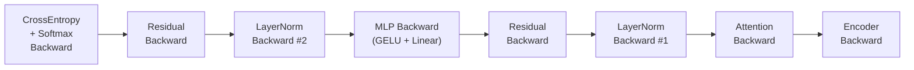

# CUDA Backward Kernels

# CUDA Backward Kernels

GPU implementations of the backward pass kernels for a GPT-2 transformer training loop. Each operation is provided as a set of progressively optimized CUDA kernels, with a CPU reference for correctness validation and a version dispatch mechanism for benchmarking.

## Backward Pass Data Flow

The backward pass reverses through the transformer block in this order:



Each node in this diagram corresponds to one of the kernel files in this module.

## Common Patterns

### Version Dispatch

Every kernel module exposes a top-level dispatch function (e.g. `attention_backward`, `layernorm_backward`) that takes a `kernel_num` integer argument and routes to the appropriate implementation. This allows A/B testing and benchmarking of different optimization strategies from a single codebase.

### CPU Reference

Each file contains a `_cpu` suffix function implementing the same math on the CPU. These serve as ground truth for correctness checks and as readable documentation of the algorithm.

### Launcher Functions

Intermediate `launch_softmax_N` / `layernorm_backwardN` functions set up grid dimensions and call the CUDA kernel. Template-based kernels (those parameterized on `BlockSize`) use a `dispatch_launch` helper that maps runtime block sizes to compile-time constants via `std::integral_constant`.

### Testing Harness

Each file's `main()` function:
1. Runs the CPU reference to produce expected outputs
2. Runs the GPU kernel and validates against CPU with a tolerance
3. Benchmarks across multiple `block_size` values (32–1024)

---

## Attention Backward

**File:** `attention_backward.cu`

The most complex backward kernel. Implements the full backward pass through multi-head causal self-attention.

### Mathematical Decomposition

The forward pass is the sequence: **permute → QKᵀ matmul → softmax → AV matmul → unpermute**. The backward reverses each step:

| Step | Forward | Backward | Implementation |
|------|---------|----------|----------------|
| 5 | unpermute: `(B,NH,T,HS) → (B,T,C)` | `unpermute_kernel_backward` | elementwise index remapping |
| 4 | `vaccum = att @ V` | `datt = Vᵀ @ dvaccum`, `dV = attᵀ @ dvaccum` | cuBLAS `SgemmStridedBatched` |
| 3 | softmax over rows of `preatt` | `dpreatt` from `datt` and `att` | custom CUDA kernels (8 versions) |
| 2 | `preatt = Q @ Kᵀ` | `dQ = K @ dpreattᵀ`, `dK = Q @ dpreatt` | cuBLAS `SgemmStridedBatched` |
| 1 | permute: `(B,T,3C) → 3×(B,NH,T,HS)` | `permute_kernel_backward` | elementwise index remapping |

### Softmax Backward Kernel Evolution

The softmax backward is the computational bottleneck. The derivative of the autoregressive softmax for row `t` is:

```
dpreatt[t3] = scale * Σ_{t2≤t} att[t2] * (𝟙{t2==t3} - att[t3]) * datt[t2]
```

This requires an O(T²) reduction per (b, h) pair. The eight kernel versions optimize this differently:

| Version | Strategy | Key Idea |
|---------|----------|----------|
| `kernel1` | Naive | Single thread per `t3`, loops over all `b,h,t` — severe load imbalance |
| `kernel2` | Parallelize over `t3,b,h` | Uses 2D grid `(T, B*NH)` — better balance |
| `kernel3` | Warp-level parallelism | One warp per `t3`, warp-reduce over `t2` loop — coalesced access |
| `kernel4` | Register reuse (UNROLL=8) | Each warp handles 8 consecutive `t3` values, reusing loaded `att[t2]` and `datt[t2]` across all 8 |
| `kernel5` | Branch elimination | Splits the `t2` loop into three regions: before/after the diagonal indicator, avoiding per-element `if` — significant perf gain |
| `kernel6` | Shared memory tiling | Block-level cooperation: loads `att[t2]*datt[t2]` into shared memory, all threads read — becomes compute-bound |
| `kernel7` | Mathematical simplification | Derives closed-form: `dpreatt[t3] = scale * att[t3] * (datt[t3] - Σ att[t2]*datt[t2])` — single reduction per row, then elementwise |
| `kernel8` | Production tuning | Adds streaming loads (`__ldcs`/`__stcs`), reversed block order (longest rows start first), `T_per_block=4` for data reuse |

**Kernel 7's simplification** is the key insight. Expanding the sum:

```
Σ_{t2} att[t2] * (𝟙{t2==t3} - att[t3]) * datt[t2]
= att[t3] * datt[t3] - att[t3] * Σ_{t2} att[t2] * datt[t2]
= att[t3] * (datt[t3] - local_sum)
```

This reduces the problem from O(T²) per output element to O(T) for the reduction plus O(1) per element.

### Entry Point

```c
void attention_backward(int kernel_num,
    float* dinp, float* dqkvr, float* dpreatt, float* datt, float* dvaccum,
    const float* dout,
    const float* inp, const float* qkvr, const float* preatt,
    const float* att, const float* vaccum,
    int B, int T, int C, int NH, int block_size);
```

All gradient buffers (`dinp`, `dqkvr`, `dpreatt`, `datt`, `dvaccum`) must be zeroed before calling. The cuBLAS operations use `beta=1.0f` to accumulate.

### Memory Layouts

| Buffer | Shape | Notes |
|--------|-------|-------|
| `inp` / `dinp` | `(B, T, 3C)` | Interleaved QKV |
| `qkvr` / `dqkvr` | `(3, B, NH, T, HS)` | Permuted: Q, K, V contiguous |
| `preatt` / `dpreatt` | `(B, NH, T, T)` | Full dense matrix (upper triangle unused) |
| `att` / `datt` | `(B, NH, T, T)` | Causal: upper triangle is zero |
| `vaccum` / `dvaccum` | `(B, NH, T, HS)` | Before unpermute |
| `out` / `dout` | `(B, T, C)` | Final output |

---

## Cross-Entropy + Softmax Backward

**File:** `crossentropy_softmax_backward.cu`

Fuses the backward pass through both cross-entropy loss and softmax into a single kernel. The combined gradient is:

```
dlogits[v] = (probs[v] - 𝟙{v==target}) * dloss
```

This is the standard softmax-cross-entropy fused derivative, avoiding the need to materialize an intermediate Jacobian.

### Kernel Versions

| Version | Strategy |
|---------|----------|
| `kernel1` | Parallelize over `(B, T, V)` — one thread per logit. Each thread reads `dlosses[b,t]` and `targets[b,t]` once, computes `(p - indicator) * dloss`, and accumulates into `dlogits`. |

Only one version exists because the kernel is already memory-bandwidth-bound: each element requires one read from `probs` and one read-modify-write to `dlogits`, with negligible compute.

### Entry Point

```c
void crossentropy_softmax_backward(int kernel_num,
    float* dlogits,
    const float* dlosses, const float* probs, const int* targets,
    int B, int T, int V, int block_size);
```

`dlogits` is accumulated into (not overwritten), matching the pattern where residual connections add their gradients later.

---

## Encoder Backward

**File:** `encoder_backward.cu`

Backward through the GPT-2 positional encoder, which sums token embeddings and position embeddings:

```
out[b,t,c] = wte[inp[b,t], c] + wpe[t, c]
```

The gradients are scatter-adds: each `dout[b,t,c]` contributes to both `dwte[inp[b,t], c]` and `dwpe[t, c]`.

### Kernel Versions

| Version | Strategy | Trade-off |
|---------|----------|-----------|
| `kernel1` | Parallelize over `(B,T,C)`, use `atomicAdd` for `dwte` and `dwpe` | High parallelism, but atomics on `dwte` are contended (many tokens map to same vocabulary entry) |
| `kernel2` | Parallelize over `C` only, loop over `B*T` | No atomics needed, but poor GPU utilization (only `C` threads) and serial loop |

Kernel 1 is faster in practice because the atomic contention on `dwte` is mitigated by the random distribution of token IDs across a large vocabulary.

### Entry Point

```c
void encoder_backward(int kernel_num,
    float* dwte, float* dwpe,
    const float* dout, const int* inp,
    int B, int T, int C, int block_size);
```

---

## GELU Backward

**File:** `gelu_backward.cu`

Backward through the Gaussian Error Linear Unit activation used in GPT-2's MLP:

```
GELU(x) = 0.5 * x * (1 + tanh(√(2/π) * (x + 0.044715 * x³)))
```

The local gradient is:

```
dGELU/dx = 0.5*(1 + tanh_out) + x * 0.5 * sech²(tanh_arg) * √(2/π) * (1 + 3*0.044715*x²)
```

### Kernel Versions

| Version | Strategy |
|---------|----------|
| `kernel1` | Scalar: one element per thread |
| `kernel2` | Vectorized: uses `Packed128` (`x128`) to process 4 elements per thread (FP32) or 8 (BF16), with `load128cs`/`store128` for coalesced 128-bit memory access |

Kernel 2 achieves near-peak memory bandwidth by reducing the total number of memory transactions.

### Entry Point

```c
void gelu_backward(int kernel_num,
    floatX* dinp, const floatX* inp, const floatX* dout,
    int B, int T, int C, int block_size);
```

Supports `floatX` which resolves to `float`, `__half`, or `__nv_bfloat16` depending on compile-time defines (`ENABLE_BF16`, `ENABLE_FP16`).

---

## LayerNorm Backward

**File:** `layernorm_backward.cu`

Backward through layer normalization. This is the second most complex kernel after attention.

### Mathematical Formulation

Given forward: `out = rstd * (inp - mean) * weight + bias`, the backward computes three gradients:

**Input gradient** (per element):
```
dinp[i] = rstd * (weight[i]*dout[i] - dnorm_mean - norm[i]*dnorm_norm_mean)
```
where `norm[i] = (inp[i] - mean) * rstd`, `dnorm_mean = Σ weight[i]*dout[i] / C`, and `dnorm_norm_mean = Σ weight[i]*dout[i]*norm[i] / C`.

**Weight and bias gradients** (reduced across all B*T positions):
```
dweight[i] = Σ_{b,t} norm[b,t,i] * dout[b,t,i]
dbias[i]   = Σ_{b,t} dout[b,t,i]
```

The challenge is that `dweight` and `dbias` require a reduction across the entire batch, while `dinp` is per-position.

### Kernel Evolution

| Version | Strategy | Key Details |
|---------|----------|-------------|
| `kernel1` | Naive | One thread per `(b,t)`, loops over `C`. Uses `atomicAdd` for `dweight`/`dbias` — heavy contention |
| `kernel2` | Shared memory partial sums | Warps accumulate `dweight`/`dbias` into shared memory, then one atomic per C-element per block. Uses `floatX` template params for mixed precision |
| `kernel3` | Grid-stride loops | Each block processes multiple `(b,t)` positions via grid-stride. Shared memory for partial `dweight`/`dbias`. Final write uses `atomicAddX` (handles BF16/FP16 atomics) |
| `kernel4` | atomicCAS for BF16 | Replaces BF16 `atomicAdd` with 32-bit `atomicCAS` loop on `__nv_bfloat162` pairs — avoids non-native atomic instructions |
| `kernel5` | FP32 scratchpad per block | Each block writes partial sums to a per-block FP32 scratch region. Last block to finish (via `atomicAdd` on a flag) reduces all partial sums and writes final `dweight`/`dbias` |
| `kernel6` | Single shared FP32 scratchpad | All blocks atomically add into one shared FP32 scratch. Last block converts FP32→floatX and writes. Simpler than kernel 5 but more atomic contention |
| `kernel7` | No cooperative groups | Same as kernel 6 but uses manual `warpReduceSum` instead of `cg::reduce` — wider compiler compatibility |
| `kernel8` | Vectorized loads + shared memory reindexing | Uses `x128` loads. Reorders shared memory indices to avoid 8-way bank conflicts (atomics are 32-bit, but `x128` packs 4 values). `store128cg` for L2-cached `dinp` writes |
| `kernel9` | Inter-warp reduction in shared memory | Non-zero warps write partial sums to `dbias_tmp_shared`/`dweight_tmp_shared`; warp 0 reads and accumulates — eliminates atomics within a block. Cache-line-aligned scratch. Final reduction uses `f128` vectors |
| `kernel10` | Vectorized shared memory access | Uses `f128` (4×float) for shared memory reads/writes, avoiding bank conflicts without index reordering. Extremely register-heavy — uses `__launch_bounds__(512, 2)` to limit register pressure. Careful pointer arithmetic to avoid register spills |

### Shared Memory Bank Conflict Strategy (Kernels 8–10)

The core tension: `x128` loads group 4 consecutive `floatX` values, but shared memory atomics operate on individual 32-bit floats. Naively mapping `x128` index `k` to shared memory index `k` causes an 8-way bank conflict (4 values × 2 banks apart).

- **Kernel 8/9**: Reorder the shared memory index so that `x128` element `x` maps to `shared_index + x * WARP_SIZE`, spreading accesses across different banks.
- **Kernel 10**: Use `f128` (128-bit float vector) for shared memory access, which naturally avoids bank conflicts at the cost of higher shared memory consumption.

### Entry Point

```c
void layernorm_backward(int kernel_num,
    floatX* dinp, floatX* dweight, floatX* dbias, float* scratch,
    const floatX* dout, const floatX* inp, const floatX* weight,
    const floatX* mean, const floatX* rstd,
    int B, int T, int C, int block_size);
```

The `scratch` buffer is required for kernels 5–10. Its size depends on the kernel version and grid dimensions. For kernel 9, it must hold at least `2*C*gridDim.x + 128` floats (partial sums + cache-line-aligned flag).

---

## Build Instructions

Each file can be compiled standalone for testing:

```bash
# Attention backward (requires cuBLAS)
nvcc -O3 --use_fast_math -lcublas -lcublasLt attention_backward.cu -o attention_backward

# Cross-entropy + softmax backward
nvcc -O3 --use_fast_math crossentropy_softmax_backward.cu -o crossentropy_softmax_backward

# Encoder backward
nvcc -O3 --use_fast_math encoder_backward.cu -o encoder_backward

# GELU backward (BF16 enabled by default)
nvcc -O3 --use_fast_math gelu_backward.cu -o gelu_backward

# LayerNorm backward (BF16 enabled by default)
nvcc -O3 --use_fast_math layernorm_backward.cu -o layernorm_backward
```

Run with a kernel version number as the first argument:

```bash
./attention_backward 8    # Use kernel version 8
./layernorm_backward 10   # Use kernel version 10
```

If no argument is given, version 1 is used by default.

### Common Header Dependency

All files include `common.h`, which provides:
- `cublasCheck`, `cudaCheck` — error-checking macros
- `make_random_float`, `make_zeros_float` — host memory helpers
- `validate_result` — CPU↔GPU comparison with tolerance
- `benchmark_kernel` — timing wrapper with warmup
- `ceil_div` — integer ceiling division
- `floatX`, `x128`, `f128`, `load128`/`store128` — mixed-precision types and vectorized memory ops (when `ENABLE_BF16` or `ENABLE_FP16` is defined)
- `cublas_handle` — global cuBLAS handle
- `warpReduceSum` — manual warp-level reduction (used by kernels that avoid cooperative groups)