# CUDA Forward Kernels

# CUDA Forward Kernels

GPU kernel implementations for the forward pass of a GPT-2 transformer. Each operation is provided in multiple versions that progressively increase in optimization, from naive CPU ports to fused, vectorized, low-precision kernels.

## Architecture

All kernel files share a common structure and set of conventions:

```
┌─────────────────────────────────────────┐
│  CPU reference implementation           │  correctness baseline
├─────────────────────────────────────────┤
│  GPU kernel versions (1..N)            │  increasing optimization
├─────────────────────────────────────────┤
│  Kernel launcher functions             │  grid/block dimension setup
├─────────────────────────────────────────┤
│  Dispatch function                     │  selects version at runtime
├─────────────────────────────────────────┤
│  main()                                │  standalone test + benchmark
└─────────────────────────────────────────┘
```



```mermaid
graph TD
    A[attention_forward] --> A1[v1: naive 3-kernel]
    A --> A3[v3: cuBLAS + softmax]
    A --> A4[v4: fused scale + online softmax]
    A --> A5[v5: FP16/BF16 of v4]
    A --> A10[v10: cuDNN flash attention]

    B[crossentropy_forward] --> B1[v1: parallel B,T]

    C[encoder_forward] --> C1[v1: parallel B,T loop C]
    C --> C2[v2: parallel B,T,C]
    C --> C3[v3: float4 vectorized]

    D[fused_residual_forward] --> D1[v1: separate residual + layernorm]
    D --> D3[v3: warp-per-token]
    D --> D4[v4: x128 + single-pass variance]
    D --> D5[v5: shared memory weights]
    D --> D6[v6: multi-warp persistent threads]

    E[gelu_forward] --> E1[v1: scalar elementwise]
    E --> E2[v2: x128 packed elementwise]

    F[layernorm_forward] --> F1[v1: one-thread-per-row]
    F --> F3[v3: warp cooperative groups]
    F --> F4[v4: single-pass variance]
    F --> F5[v5: block-per-row]
    F --> F6[v6: shared memory + x128]
```

## Common Infrastructure

### Data Types

- **`floatX`** — Conditional typedef: `__half` when `ENABLE_FP16` is defined, `__nv_bfloat16` when `ENABLE_BF16` is defined, otherwise `float`. All low-precision kernels use this alias.
- **`x128` / `Packed128<floatX>`** — 128-bit packed type holding `128 / sizeof(floatX)` elements. Used for vectorized loads/stores via `load128()`, `load128cs()`, `store128()`, `store128cs()`. The `cs` suffix is a cache-streaming hint for data that won't be reused soon.

### Reduction Primitives

- **`warpReduceSum()`** / **`warpReduceMax()`** — Warp-level reductions using `__shfl_down_sync`.
- **`cg::reduce(warp, val, op)`** — Cooperative groups variant used in attention kernels for cleaner warp reductions.
- **Shared memory reductions** — Block-level reductions when multiple warps cooperate (see layernorm kernel 5, fused residual kernel 6).

### Conventions

- **`block_size`** parameter — Every launcher accepts a thread-block size for tuning. Typical values tested: 32, 64, 128, 256, 512, 1024.
- **`ceil_div(a, b)`** — Integer ceiling division for grid size calculation.
- **`cudaCheck()`** / **`cublasCheck()`** — Error-checking macros that assert on CUDA/cuBLAS errors.
- **`first_run_validation`** — Global bool that forces FP32↔low-precision conversions on the first call so correctness can be validated against CPU results. Set to `false` after validation for performance runs.

---

## Attention Forward (`attention_forward.cu`)

Causal multi-head self-attention. The most complex module with the widest version spread.

### Tensor Layouts

| Tensor | Shape | Notes |
|--------|-------|-------|
| `inp` | (B, T, 3C) | Interleaved QKV: Q at offset 0, K at C, V at 2C per token |
| `preatt` | (B, NH, T, T) | Pre-softmax attention scores |
| `att` | (B, NH, T, T) | Post-softmax attention weights |
| `out` | (B, T, C) | Output, heads concatenated |

The interleaved QKV layout means Q, K, V for head `h` at position `t` are at offsets `h*hs`, `h*hs + C`, `h*hs + 2*C` within the token's 3C-wide slice.

### Version Progression

**Version 1** — Three separate kernels launched sequentially:
1. `attention_query_key_kernel1` — One thread per (b, h, t, t2) cell. Computes Q·K dot product with serial reduction over head dimension. Sets future positions to `-INFINITY` for causal masking.
2. `attention_softmax_kernel1` — One thread per (b, h, t) row. Serial max-finding, exp, and normalization.
3. `attention_value_kernel1` — One thread per (b, h, t). Serial accumulation of weighted values.

**Version 2** — Flash attention (tiled SRAM). Adapted from [flash-attention-minimal](https://github.com/tspeterkim/flash-attention-minimal). Uses online softmax with running `m` (max) and `l` (sum) per row. Tiles Q, K, V into SRAM blocks of size `Bc × d` / `Br × d`. Requires `permute_kernel` to rearrange from interleaved QKV to separate (B, NH, T, HS) tensors, and `unpermute_kernel` to convert back. **~3× slower than v1** due to SRAM tiling overhead at these sizes.

**Version 3** — cuBLAS-based, ~20× faster than v1:
1. `permute_kernel` — Rearranges QKV to (B, NH, T, HS) layout.
2. `cublasSgemmStridedBatched` — Batched GEMM for QK^T.
3. `scale_kernel` — Elementwise scale by `1/√(hs)` and causal masking (sets future to `-INFINITY`).
4. `softmax_forward_kernel4` — Block-parallel softmax with warp reductions and shared memory for inter-warp reduction.
5. `cublasSgemmStridedBatched` — Batched GEMM for att×V.
6. `unpermute_kernel` — Convert output back to (B, T, C).

**Version 4** — Fused optimizations over v3:
- Replaces `scale_kernel` + `softmax_forward_kernel4` with `softmax_forward_kernel5`, which fuses the scale multiplication, uses online softmax algorithm, and is directly autoregressive (only computes the lower triangular part). Uses `float4` vectorized reads and cooperative groups warp reductions.

**Version 5** — FP16/BF16 version of v4:
- `permute_kernel_lowp` — Converts FP32 input to `floatX` during permute.
- `cublasGemmStridedBatchedEx` — Low-precision batched GEMM with `CUBLAS_LOWP` data type and `CUBLAS_LOWP_COMPUTE` compute type.
- `softmax_forward_kernel5_lowp` — Same algorithm as kernel5 but operates on `floatX` with explicit casts for arithmetic.
- `unpermute_kernel_lowp` — Converts `floatX` back to FP32 output.

**Version 6** — Same as v5 but with `skip_permute=true`, skipping the permute/unpermute steps. Unrealistic but useful for measuring the overhead of FP32↔FP16 conversions.

**Version 10** (requires `ENABLE_CUDNN`) — cuDNN Flash Attention via the `cudnn_frontend` graph API:
- Builds an SDPA (Scaled Dot Product Attention) graph with causal masking.
- Q, K, V strides are set to match the interleaved QKV layout directly, eliminating the need for an external permute.
- Graphs are cached in `user_maintained_cache_fwd` keyed by `graph->key()` to avoid the slow `build_operation_graph()` on subsequent calls.
- Workspace is dynamically allocated up to the required size (capped implicitly by cuDNN at ~256 MiB).
- On first run, `fp32_to_lowp_kernel` converts input and `lowp_to_fp32_kernel` converts output for validation.

**Version 11** — Same as v10 but skips FP16↔FP32 conversions (full low-precision pipeline).

### Key Softmax Kernels

`softmax_forward_kernel4` — General-purpose block-parallel softmax for (N, C) tensors. Uses thread coarsening, warp-level `warpReduceMax`/`warpReduceSum`, shared memory for inter-warp reduction. Requires `2 * warpsPerBlock * sizeof(float)` shared memory.

`softmax_forward_kernel5` — Attention-specific autoregressive softmax. Fuses `inv_temperature` (scale), only processes the causal lower triangle. Uses online softmax: maintains running `maxval` and `sumval` while iterating in groups of 4 via `float4` reads. Warp-cooperative groups for final reduction. Recomputes exp values during the write phase rather than storing and reloading.

### Permute/Unpermute

The interleaved QKV layout `(B, T, 3, NH, HS)` must be rearranged to `(B, NH, T, HS)` for cuBLAS. `permute_kernel` maps index `(b, nh, n, d)` → input offset with stride `3*NH*HS` between Q/K/V. `unpermute_kernel` reverses this for the output.

---

## Cross-Entropy Forward (`crossentropy_forward.cu`)

Computes per-token cross-entropy loss from probabilities and target indices.

### Version 1

`crossentropy_forward_kernel1` — One thread per (b, t). Reads `probs[b, t, targets[b,t]]` and computes `-logf(...)`. Simple and memory-bound.

---

## Encoder Forward (`encoder_forward.cu`)

GPT-2 positional encoder: token embedding lookup + positional embedding addition.

### Tensor Layouts

| Tensor | Shape |
|--------|-------|
| `inp` | (B, T) — integer token indices |
| `wte` | (V, C) — token embedding table |
| `wpe` | (T, C) — positional embedding table |
| `out` | (B, T, C) — `wte[inp[b,t]] + wpe[t]` |

### Version Progression

**Version 1** — One thread per (b, t), serial loop over C. Each thread does two gather reads and C writes.

**Version 2** — One thread per (b, t, c). Fully parallel. Single read from `wte[ix*C + c]` and `wpe[t*C + c]`, single write. Better memory coalescing since adjacent threads read adjacent channels.

**Version 3** — `x128` vectorized version of v2. Each thread processes `x128::size` elements (4 for FP32, 8 for FP16/BF16). Uses `load128cs` for streaming reads and `store128` for output (non-streaming, to keep data in cache for downstream ops). Grid size divided by `x128::size`.

---

## Fused Residual + LayerNorm Forward (`fused_residual_forward.cu`)

Combines the residual connection (`inp1 + inp2`) with subsequent layer normalization into a single pass, avoiding the write-back and re-read of the intermediate residual.

### Version Progression

**Version 1** — Unfused baseline. Launches `residual_forward_kernel1` (elementwise add) then `layernorm_forward_kernel1` (per-row layernorm) as separate kernels.

**Version 2** — First fusion attempt. One thread per token (b, t). Serial loops over C for residual sum, variance, and normalization. **Uncoalesced access** — threads in a warp access non-contiguous memory, causing terrible performance.

**Version 3** — One warp per token. `dim3(32, block_y)` block layout where `threadIdx.x` is the lane within the warp and `threadIdx.y` selects the token. Coalesced reads since lane `x` reads position `c = threadIdx.x` with stride 32. Uses `warpReduceSum` for mean and variance.

**Version 4** — Adds `x128` vectorization and single-pass variance estimation. Uses the identity `var(x) = E[x²] - E[x]²` to compute mean and variance in one pass over the data. Uses a **zigzag loop**: forward iteration for the residual+stats pass, then backward iteration for the normalization pass. The backward iteration ensures that by the time the normalization pass reads `residual[c]`, the write from the forward pass has already been committed from the write-back stage. Uses `load128cs`/`store128cs` for streaming.

**Version 5** — Loads weight and bias into **shared memory** before processing. Eliminates the zigzag loop because residual values are also cached in shared memory (`s_res`). Shared memory layout: `s_weight[C/x128]`, `s_bias[C/x128]`, `s_res[C/x128]` per `threadIdx.y`. Requires `(2 + block_y) * C * sizeof(floatX)` shared memory. Falls back to kernel 4 if `cudaFuncSetAttribute` for large shared memory fails.

**Version 6** — **Multi-warp per token with persistent threads**. Uses `dim3(32, block_y, block_z)` where `block_z` sub-blocks each handle a different token. Multiple warps (`block_y`) cooperate on a single token for large C. Weights and biases loaded once into shared memory and reused across all tokens processed by the block. Each sub-block has its own `s_res` and reduction buffers (`s_mean`, `s_var`). Interleaved `s_mean`/`s_var` layout eliminates extra `__syncthreads` between loop iterations. Launches with occupancy-based grid size (`cuda_threads_per_SM * cuda_num_SMs / block_size`).

### Shared Memory Layout (Kernel 6)

```
params:
  [0 .. C)                        → s_weight (x128 packed)
  [C .. 2C)                       → s_bias (x128 packed)
  [2C .. (2+blockDim.z)*C)        → s_res[threadIdx.z] (x128 packed, per sub-block)
  [(2+blockDim.z)*C .. +32*blockDim.z) → s_mean[threadIdx.z] (float, per sub-block)
  [+32*blockDim.z .. +64*blockDim.z)   → s_var[threadIdx.z] (float, per sub-block)
```

---

## GELU Forward (`gelu_forward.cu`)

Gaussian Error Linear Unit activation used in GPT-2's MLP.

Formula: `0.5 * x * (1 + tanh(√(2/π) * (x + 0.044715 * x³)))`

### Version Progression

**Version 1** — One thread per element. Scalar read, compute, write.

**Version 2** — `x128` packed. Each thread processes `x128::size` elements. Loads with `load128cs` (streaming), stores with `store128` (non-streaming) to keep results in cache for the next layer.

---

## LayerNorm Forward (`layernorm_forward.cu`)

Standard layer normalization: normalize, then scale by learned weight and bias.

### Version Progression

**Version 1** — One thread per (b, t). Serial loops for mean, variance, and output. Two-pass (mean then variance).

**Version 2** — Three-kernel decomposition: `mean_kernel` (shared memory reduction), `rstd_kernel` (shared memory reduction), `normalization_kernel` (fully parallel over B×T×C). Each kernel is a separate launch.

**Version 3** — One warp per row using cooperative groups. `cg::reduce` for warp-level sum. Two-pass (mean then variance). Uses `__ldcs`/`__stcs` streaming hints.

**Version 4** — Same structure as v3 but uses **single-pass variance**: `var = mean(x²) - mean(x)²`. Accumulates `sum` and `sum2` simultaneously during the coarsening loop, then one `cg::reduce` call for each.

**Version 5** — One **block** per row (not just one warp). Shared memory for inter-warp reduction of `shared_sum[warp_id]` and `shared_sum2[warp_id]`. Final reduction done by lane 0 of the first warp. Better for large C where one warp doesn't provide enough parallelism.

**Version 6** — Inspired by `fused_residual_forward_kernel5`. Loads weight and bias into shared memory. Caches input in shared memory (`s_in`) to avoid re-reading from global memory during normalization. Uses `x128` vectorized loads. Block layout `dim3(WARP_SIZE, block_y)` with `threadIdx.y` selecting the row.

---

## Building and Running

Each `.cu` file is self-contained and can be compiled standalone:

```bash
# Attention (without cuDNN)
nvcc -O3 --use_fast_math -lcublas -lcublasLt attention_forward.cu -o attention_forward

# Attention (with cuDNN)
nvcc -I/PATH/TO/cudnn-frontend/include -DENABLE_CUDNN -O3 --use_fast_math \
     -lcublas -lcublasLt -lcudnn attention_forward.cu -o attention_forward

# Other kernels
nvcc -O3 --use_fast_math -lcublas -lcublasLt layernorm_forward.cu -o layernorm_forward
nvcc -O3 --use_fast_math encoder_forward.cu -o encoder_forward
nvcc -O3 --use_fast_math gelu_forward.cu -o gelu_forward
nvcc -O3 --use_fast_math crossentropy_forward.cu -o crossentropy_forward
nvcc -O3 --use_fast_math fused_residual_forward.cu -o fused_residual_forward
```

Run with kernel version as argument:

```bash
./attention_forward 4        # run kernel version 4
./layernorm_forward 5        # run kernel version 5
```

Each binary validates against the CPU reference on the first run, then benchmarks across multiple block sizes.

## Design Patterns and Optimization Strategies

### Parallelism Granularity

| Strategy | Used in | Tradeoff |
|----------|---------|----------|
| One thread per row | layernorm v1, fused_residual v2 | Simple, but serial inner loop |
| One warp per row | layernorm v3/v4, fused_residual v3/v4, attention v1 fused | Good balance for moderate C |
| One block per row | layernorm v5/v6, fused_residual v5/v6 | Better for large C, uses shared memory |
| One thread per element | encoder v2, gelu v1 | Maximum parallelism, memory-bound |
| Persistent threads | fused_residual v6 | Amortizes shared memory loads across tokens |

### Memory Access Optimization

1. **Coalesced access** — Adjacent threads read adjacent memory addresses. Warp-per-token layouts (threadIdx.x = lane) naturally achieve this.
2. **Vectorized loads** — `x128`/`Packed128` packs 4 FP32 or 8 FP16/BF16 values into a single 128-bit transaction, reducing instruction count and improving bandwidth utilization.
3. **Cache streaming** — `__ldcs`/`__stcs` and `load128cs`/`store128cs` hint that data won't be reused, freeing cache for weight/bias tensors that are shared across threads.
4. **Shared memory** — Weight and bias cached in shared memory avoid redundant global reads when multiple warps process different tokens in the same block (fused_residual v5/v6, layernorm v6).

### Numerical Considerations

- **Online softmax** — Maintains running max and sum to avoid a separate pass. Used in attention v4/v5 and flash attention v2.
- **Single-pass variance** — `var = E[x²] - E[x]²` avoids two passes over the data but is slightly less numerically stable than the two-pass formula. Used in layernorm v4+ and fused_residual v4+.
- **Low precision** — FP16/BF16 kernels cast to `float` for arithmetic (accumulation, exp, sqrt) and store back as `floatX`. cuBLAS compute type is controlled by `CUBLAS_LOWP_COMPUTE` (typically `CUBLAS_COMPUTE_32F` for accuracy).
- **Accuracy thresholds** — FP32 kernels validated at 1e-3, low-precision kernels at 1e-2 to account for reduced precision.