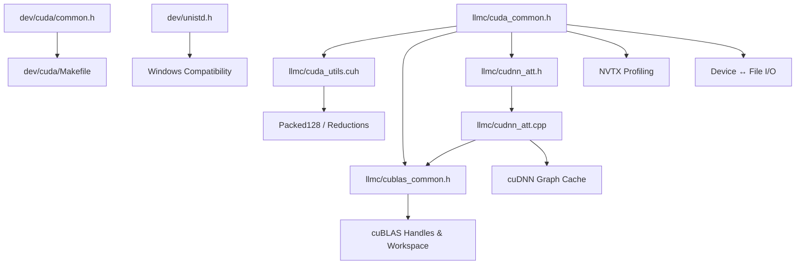

# CUDA Infrastructure

# CUDA Infrastructure

The CUDA infrastructure module provides the foundational layer for all GPU computation in the codebase. It spans three tiers: a **production library** under `llmc/` used by the training loop, a **development sandbox** under `dev/cuda/` for kernel prototyping and benchmarking, and **cross-platform shims** under `dev/` for Windows compatibility.

## Architecture Overview



---

## Precision Configuration

The entire codebase compiles in one of three precision modes, selected at compile time via defines:

| Define        | `floatX` type     | cuBLAS low-precision flag | `PrecisionMode` enum |
|---------------|-------------------|--------------------------|----------------------|
| `ENABLE_FP32` | `float`           | `CUDA_R_32F`             | `PRECISION_FP32`     |
| `ENABLE_FP16` | `half`            | `CUDA_R_16F`             | `PRECISION_FP16`     |
| *(default)*   | `__nv_bfloat16`   | `CUDA_R_16BF`            | `PRECISION_BF16`     |

In the production Makefile (`dev/test/Makefile`), this is controlled by the `PRECISION` variable (defaults to `BF16`), which translates to the `-DENABLE_BF16` / `-DENABLE_FP16` / `-DENABLE_FP32` compiler flag.

The `floatX` typedef in `llmc/cuda_common.h` is the canonical type used throughout kernel code and tensor allocations. The `floatN` alias exists in `dev/cuda/common.h` as a secondary name (identical to `floatX`).

### Cache-hint shims for bfloat16

Older nvcc (pre-12) does not provide `__ldcs` / `__stcs` intrinsics for `__nv_bfloat16`. Both `llmc/cuda_common.h` and `dev/cuda/common.h` conditionally define these overloads when:

```c
defined(ENABLE_BF16) && (__CUDACC_VER_MAJOR__ < 12) && !((__CUDA_ARCH__ >= 800) || !defined(__CUDA_ARCH__))
```

The implementations cast through `unsigned short` since bfloat16 has the same storage size.

---

## Error Checking

All CUDA runtime, cuBLAS, and cuDNN calls are wrapped with error-checking macros that print the file, line, and error string before calling `exit(EXIT_FAILURE)`.

| Macro            | Header               | Checks type            |
|------------------|----------------------|------------------------|
| `cudaCheck`      | `llmc/cuda_common.h` | `cudaError_t`          |
| `cudaFreeCheck`  | `llmc/cuda_common.h` | `cudaFree` + nulls ptr |
| `cublasCheck`    | `llmc/cublas_common.h` | `cublasStatus_t`     |
| `cuDNNCheck`     | `llmc/cudnn_att.cpp` | `cudnnStatus_t`        |
| `checkCudnnFE`   | `llmc/cudnn_att.cpp` | `fe::error_object`     |

`cudaFreeCheck` is a template function that frees device memory **and** resets the pointer to `nullptr`, preventing double-free bugs.

---

## Packed128 — Vectorized Memory Access

Defined in both `llmc/cuda_utils.cuh` and `dev/cuda/common.h`, `Packed128<ElementType>` forces the compiler to emit 128-bit load/store instructions (`LDG.128` / `STS.128`).

```c
template<class ElementType>
struct alignas(16) Packed128 {
    static constexpr const int size = sizeof(int4) / sizeof(ElementType);
    ElementType payload[size];
    // ...
};
```

For `float`, `size` = 4; for `__nv_bfloat16`, `size` = 8. The convenience typedefs are:

- `f128` → `Packed128<float>`
- `x128` → `Packed128<floatX>`

### Load/store helpers

| Function      | Cache hint                          | Use case                              |
|---------------|-------------------------------------|---------------------------------------|
| `load128`     | Default (cache normally)            | Reused data                           |
| `load128cs`   | Streaming (`__ldcs`)                | Read-once data                        |
| `store128`    | Default                             | Normal writes                         |
| `store128cs`  | Streaming (`__stcs`)               | Write-once, bypass L1/L2              |
| `store128cg`  | Cache-global (`__stcg`)            | Bypass L1, cache in L2                |

All addresses **must** be 16-byte aligned. Misaligned addresses cause undefined behavior (typically misaligned read/write errors or silent data corruption).

---

## Warp and Block Reductions

### `warpReduceSum` / `warpReduceMax`

Warp-level reductions using `__shfl_xor_sync`. All 32 threads in the warp must be active:

```c
__device__ float warpReduceSum(float val);   // sum across warp
__device__ float warpReduceMax(float val);   // max across warp
```

### `blockReduce`

A two-stage reduction: warp shuffle → shared memory → warp shuffle. It is a template that takes a warp-level reduction function pointer:

```c
using reduction_func_t = float (*) (float);

template<reduction_func_t warp_reduction>
__device__ float blockReduce(float val, bool final_sync = false, float out_of_bounds = 0.0f);
```

**Key details:**

- Uses `__shared__ float shared_val[WARP_SIZE]` (128 bytes of non-dynamic shared memory per call).
- The unique shared memory per call site avoids an extra `__syncthreads()` at the end — **unless** called inside a loop, where the same shared memory is implicitly reused across iterations. Set `final_sync = true` in that case.
- Supports up to 1024 threads per block (32 warps).
- `out_of_bounds` is the value returned by lanes that don't participate in the second warp reduction (lanes ≥ `num_warps`).

### `global_sum_deterministic`

A deterministic sum reduction that enforces a single-block launch:

```c
template<class Float>
void global_sum_deterministic(float* result, const Float* values, int count, cudaStream_t stream);
```

Launches `global_sum_single_block_kernel<<<1, 1024>>>` which uses grid-stride looping inside the single block, then `blockReduce<warpReduceSum>`.

---

## cuBLAS Setup

`llmc/cublas_common.h` declares the global cuBLAS state:

| Variable                  | Purpose                                              |
|---------------------------|------------------------------------------------------|
| `cublaslt_workspace_size` | 32 MiB (Hopper needs 32; older archs only need 4)    |
| `cublaslt_workspace`      | Device pointer for cuBLASLt workspace                |
| `cublas_compute`          | `CUBLAS_COMPUTE_32F` (or `CUBLAS_COMPUTE_32F_FAST_TF32` on Ampere+) |
| `cublaslt_handle`         | cuBLASLt handle                                      |

In `dev/cuda/common.h`, `setup_main()` additionally creates a `cublas_handle` (legacy cuBLAS) and configures TF32 math mode when `cuda_arch_major >= 8`.

---

## cuDNN Attention

`llmc/cudnn_att.cpp` / `llmc/cudnn_att.h` wrap cuDNN's fused scaled-dot-product-attention (SDPA) with a **graph cache** to amortize the expensive `build_operation_graph` call.

### Graph caching

Forward and backward graphs are cached in `std::map` instances keyed by `(B, H, T, HS, is_inference)` and `(B, NH, T, HS)` respectively. On first use, the graph is built, validated, and execution plans are created. Subsequent calls with the same dimensions reuse the cached graph.

Workspace is dynamically grown: if a new graph requires more workspace than currently allocated, the old workspace is freed and a larger one is allocated (up to ~256 MiB).

### Public API

```c
void create_cudnn();
void destroy_cudnn();

void attention_forward_cudnn(
    floatX* out,    // (B, T, NH, HS)
    float* stats,   // (B, NH, T) — pass nullptr for inference-only
    floatX* inp,    // (B, T, 3, NH, HS) interleaved QKV
    int B, int T, int NH, int C,
    cudaStream_t stream
);

void attention_backward_cudnn(
    floatX* dqkvr,  // output gradients, same layout as qkvr
    floatX* dout, floatX* qkvr, floatX* o, float* stats,
    int B, int T, int NH, int C,
    cudaStream_t stream
);
```

Both functions push an NVTX range for profiling. The QKV input layout is `(B, T, 3, NH, HS)` with strides that cuDNN interprets to extract Q, K, V as separate tensors without an external permute.

cuDNN is **not** supported in FP32 mode (static assert fires). It is disabled by default in the build; enable with `USE_CUDNN=1`.

---

## Device ↔ File I/O

`llmc/cuda_common.h` provides double-buffered async transfer functions for checkpoint I/O:

```c
void device_to_file(FILE* dest, void* src, size_t num_bytes,
                    size_t buffer_size, cudaStream_t stream);

void file_to_device(void* dest, FILE* src, size_t num_bytes,
                    size_t buffer_size, cudaStream_t stream);
```

Both allocate **pinned host memory** (`cudaMallocHost`) split into two buffers. While one buffer is being transferred over PCIe, the other is being read from / written to disk. `file_to_device` additionally uses `cudaHostAllocWriteCombined` for the write-combined cache hint, optimizing for the CPU-write / device-read pattern.

The `buffer_size` parameter controls the double-buffer chunk size. It need not evenly divide `num_bytes`; the functions handle partial final chunks correctly.

Test coverage is in `dev/test/device_file_io.cu`.

---

## NVTX Profiling

`llmc/cuda_common.h` provides an RAII wrapper for NVIDIA Tools Extension ranges:

```c
class NvtxRange {
public:
    NvtxRange(const char* s);
    NvtxRange(const std::string& base_str, int number);
    ~NvtxRange();
};

#define NVTX_RANGE_FN() NvtxRange nvtx_range(__FUNCTION__)
```

`NVTX_RANGE_FN()` creates a range named after the enclosing function. The destructor calls `nvtxRangePop()`, ensuring the range is closed even on early returns. Used extensively in `cudnn_att.cpp`.

---

## Memory Management

### `cudaMallocConditionallyManaged`

```c
int cudaMallocConditionallyManaged(void** out, size_t bytes);
```

Tries `cudaMalloc` first. On `cudaErrorMemoryAllocation` (OOM), falls back to `cudaMallocManaged` with `cudaMemAdviseSetPreferredLocation` set to CPU. Returns `0` on success, `1` if it fell back to managed memory. This allows the training loop to continue on memory-constrained systems at reduced performance.

---

## Stochastic Rounding

`llmc/cuda_utils.cuh` implements stochastic rounding for reduced-precision training using the SquirrelNoise5 hash function for per-thread random numbers:

```c
__device__ void stochastic_rounding(float in, __nv_bfloat16* out, unsigned int seed);
__device__ void stochastic_rounding(float in, half* out, unsigned int random);  // TODO
__device__ void stochastic_rounding(float in, float* out, unsigned int random); // identity
```

The bfloat16 version compares the lower 16 bits of the float representation against a random threshold to decide whether to round up or down. The seed should be updated per training step (e.g., via xorshift) to produce different random numbers across steps.

---

## Copy and Cast

`llmc/cuda_utils.cuh` provides a kernel for type conversion with stride support:

```c
template<typename Td, typename Ts>
__global__ void copy_and_cast_kernel(Td* dst, const Ts* src, size_t n,
                                     ptrdiff_t stride_dst, ptrdiff_t stride_src);
```

The `blockIdx.y` dimension indexes into strided batches. Device-side casting is handled by the `cast_value<Td, Ts>` specializations (float↔half↔bfloat16).

The `DType` enum (`FP32`, `FP16`, `BF16`) and `sizeof_dtype()` / `dtype_of()` helpers provide runtime type identification for tensor metadata.

---

## Build System

### `dev/cuda/Makefile` — Kernel development

Compiles individual `.cu` files into standalone test/benchmark binaries. Auto-detects GPU compute capability via `__nvcc_device_query`. Targets include all forward/backward kernels, the AdamW optimizer, and NCCL all-reduce.

Key flags: `-O3 --use_fast_math -lcublas -lcublasLt -std=c++17`. The `matmul_forward` and `matmul_backward` targets additionally link `-fopenmp`. The `nccl_all_reduce` target links `-lmpi -lnccl`.

Run `make all` to build everything, `make run_all` to build and execute, `make clean` to remove binaries. `make all_ptx` / `make all_sass` dump PTX/SASS via `cuobjdump`.

### `dev/test/Makefile` — Production build

More sophisticated: auto-detects OpenMP, OpenMPI+NCCL, cuDNN frontend, and precision mode. The `PRECISION` variable (default `BF16`) controls the `-DENABLE_*` flag. cuDNN is off by default (`USE_CUDNN=1` to enable). Multi-GPU support requires OpenMPI+NCCL at standard system paths.

---

## Windows Compatibility

`dev/unistd.h` provides POSIX shims for Windows builds:

- `clock_gettime` → `timespec_get` with `TIME_UTC`
- `mkdir` → `_mkdir`
- `access` → `_access`
- `glob` / `globfree` → Win32 `FindFirstFile` / `FindNextFile` implementation
- `opendir` / `readdir` / `closedir` → Win32 equivalents
- `TURN_OFF_FP_FAST` / `TURN_ON_FP_FAST` pragmas for controlling floating-point mode

The `glob` implementation converts forward slashes to backslashes and has a hard limit of 64,000 matched files.

---

## Development Workflow

The `dev/cuda/` directory is a scratch space for kernel development. Each `.cu` file contains multiple kernel versions (typically numbered 1, 2, 3...) in increasing optimization complexity. The standard workflow:

1. Compile and run a specific kernel version: `./layernorm_forward 4`
2. The binary runs a CPU reference, then the GPU kernel, validates correctness, and benchmarks various launch configurations
3. Copy the fastest kernel into the production training code (`train_gpt2.cu`)

For developers without local GPU access, `dev/cuda/benchmark_on_modal.py` runs benchmarks on the Modal platform with configurable GPU type (`GPU_NAME`), memory (`GPU_MEM`), and count (`N_GPUS`). It also supports Nsight Systems profiling with report download via Modal volumes.

---

## Utility Functions (dev/cuda/common.h)

These are used only in the development/test context:

- **`make_random_float_01`**, **`make_random_float`**, **`make_random_int`**, **`make_zeros_float`**, **`make_ones_float`** — host-side test data generation
- **`memcpy_convert`** — host-to-device copy with type conversion (returns `cudaError_t` for deferred checking)
- **`validate_result`** — compares device output against CPU reference with configurable tolerance, prints first 5 comparisons, exits on >10 mismatches
- **`benchmark_kernel`** — times a kernel over multiple repeats, flushing L2 cache between runs via a `cudaMemset` of a buffer sized to `deviceProp.l2CacheSize`
- **`setup_main`** — initializes CUDA device, cuBLAS handles, and TF32 math mode; seeds `srand(0)` for determinism

### Hardware-aware constants

`MAX_1024_THREADS_BLOCKS` is set to `2` on Ampere (`__CUDA_ARCH__ == 800`) and Hopper+ (`>= 900`) to ensure two thread blocks can reside on a single SM, maximizing latency tolerance. On older architectures it is `1`. This is used with `__launch_bounds__` in kernel definitions.