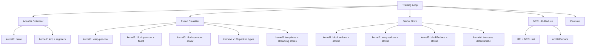

# CUDA Optimizer & Communication

# CUDA Optimizer & Communication Module

## Overview

This module provides hand-optimized CUDA kernels for the core computational bottlenecks in transformer training: the AdamW weight update, fused classifier loss/gradient computation, global gradient norm calculation, multi-GPU communication, and tensor permutation. Each operation ships multiple kernel variants — from reference implementations to heavily optimized versions — allowing developers to trade off simplicity for performance and study the optimization techniques applied at each step.

All kernels follow a consistent pattern: a CPU reference implementation for correctness checking, a series of progressively optimized GPU kernels, a dispatch function that selects the kernel by number, and a `main()` function that validates correctness then benchmarks across block sizes.

## Architecture



---

## AdamW Optimizer (`adamw.cu`)

Implements the AdamW optimizer following [PyTorch's specification](https://pytorch.org/docs/stable/generated/torch.optim.AdamW.html) and [NVIDIA Apex](https://github.com/nvidia/apex/blob/master/csrc/multi_tensor_adam.cu). The kernel fuses the moment updates, bias correction, and weight decay into a single pass — no intermediate tensors are written to global memory.

### Algorithm

For each parameter `i` at timestep `t`:

```
m[i] = β₁ · m[i] + (1 - β₁) · grad[i]
v[i] = β₂ · v[i] + (1 - β₂) · grad[i]²
m̂ = m[i] / (1 - β₁ᵗ)
v̂ = v[i] / (1 - β₂ᵗ)
param[i] -= lr · (m̂ / (√v̂ + ε) + weight_decay · param[i])
```

The bias correction terms `1 - β₁ᵗ` and `1 - β₂ᵗ` are computed once on the host and passed as `beta1_correction` / `beta2_correction` to avoid redundant `powf` calls per thread.

### Kernel Variants

| Kernel | Key Technique | Details |
|--------|--------------|---------|
| `adamw_kernel1` | Naive | Direct translation of the math. Each global-memory value is loaded/stored multiple times. |
| `adamw_kernel2` | Register caching + `lerp` | Loads `grad`, `m`, `v` into registers once. Uses optimized linear interpolation for moment updates. |

The `lerp` device function computes `start + weight * (end - start)` using two FMA operations instead of three arithmetic ops:

```cuda
__device__ inline float lerp(float start, float end, float weight) {
    return fma(weight, end, fma(-weight, start, start));
}
```

This is mathematically equivalent to `β * old + (1-β) * new` but maps to two hardware FMA instructions.

### Dispatch

`adamw()` computes the bias-correction scalars on the host, then dispatches to `adamw_dispatch1` or `adamw_dispatch2`. Both launch with a fixed block size of 512 threads and a grid sized via `ceil_div(num_parameters, 512)`.

### Limitations

- **amsgrad=True** is not yet supported.
- Only FP32 is implemented (no FP16/BF16 support yet).
- No thread coarsening or ILP (instruction-level parallelism) optimization.

---

## Fused Classifier (`classifier_fused.cu`)

Fuses softmax, cross-entropy loss, and logit gradient computation into one or two passes over the logits tensor. The key insight: the full `(B, T, V)` probability tensor never needs to be materialized in global memory. Probabilities are computed in registers and immediately consumed for loss and gradient calculation.

This is only possible when `dloss` is known in advance — which is almost always the case (constant `1/(B*T)` in pretraining, or a pre-determined mask in fine-tuning).

### Data Layout

- **logits**: shape `(B*T, P)` where `P` is the padded vocab size (`V` rounded up to a multiple of 64 for alignment)
- **targets**: shape `(B*T,)` — integer indices into the vocab
- **losses**: shape `(B*T,)` — scalar loss per position
- **dlogits**: shape `(B*T, P)` — gradient of loss w.r.t. logits
- **dlosses**: shape `(B*T,)` or `NULL` — upstream gradient; defaults to `1/(B*T)` when NULL

### Online Softmax

All kernels use the online softmax algorithm (from ["Online normalizer calculation for softmax"](https://arxiv.org/abs/1805.02867)) to compute the max value and sum in a single pass:

```cuda
float old_maxval = maxval;
maxval = fmaxf(maxval, v);
sumval *= expf(old_maxval - maxval);
sumval += expf(v - maxval);
```

This avoids a two-pass approach (one for max, one for sum) and is numerically stable.

### Kernel Variants

| Kernel | Threading Model | Softmax Prep | Load Width | Key Optimizations |
|--------|----------------|--------------|------------|-------------------|
| `fused_classifier_kernel1` | Warp-per-row | `prepare_softmax` (warp shuffle) | Scalar | Cooperative groups warp reduce |
| `fused_classifier_kernel2` | Block-per-row | `prepare_softmax_blockwide` | `float4` (128-bit) | Shared memory cross-warp reduce, `__ldcs` for 2nd logits read |
| `fused_classifier_kernel3` | Block-per-row | `prepare_softmax_blockwide_nofloat4` | Scalar | Same as kernel2 without float4 |
| `fused_classifier_kernel4` | Block-per-row | `prepare_softmax_blockwide2` | `x128` packed | `load128cs` streaming loads, `floatX` type support |
| `fused_classifier_kernel5` | Block-per-row | `prepare_softmax_blockwide3` | `x128` packed | `__launch_bounds__(1024)`, template flags for optional writes, split aligned/unaligned loops, `store128cs` streaming stores |

**Kernel 1** assigns one warp per row. Multiple rows are processed per block (e.g., 4 warps in a 128-thread block handle 4 rows). The `prepare_softmax` function uses cooperative_groups `cg::reduce` for warp-level max and sum.

**Kernels 2–5** assign one entire block per row, enabling up to 1024 threads to cooperatively process a single vocab row. This is critical for large vocabularies (V ≈ 50257) where a single warp cannot cover all elements efficiently.

**Kernel 5** is the most optimized variant:
- Template parameters `WriteLogits` and `WriteProbs` eliminate dead stores at compile time.
- The main loop processes elements in multiples of `x128::size` (8 for FP32, 16 for FP16/BF16) without bounds checking. A separate tail loop handles the remaining unaligned elements.
- `store128cs` uses cache-streaming stores to avoid polluting the L2 cache when writing dlogits (which will not be read again soon).
- `__launch_bounds__(1024, MAX_1024_THREADS_BLOCKS)` gives the compiler register-allocation hints.

### Reduction Strategy (Block-wide)

For kernels 2–5, the block-wide softmax reduction uses a three-phase approach:

1. **Warp-level reduce** via `cg::reduce` or `warpReduceMax`/`warpReduceSum` (shuffle instructions)
2. **Cross-warp reduce** via shared memory: thread 0 of each warp writes its result; all threads read and do a final warp reduce
3. **Final warp reduce** on the shared-memory values

This produces cleaner PTX assembly than a single multi-warp `cg::reduce` call.

### FP16/BF16 Support

Kernels 4 and 5 support `floatX` (configured at compile time via `ENABLE_BF16` or `ENABLE_FP16`). The softmax accumulation is always done in FP32 for numerical stability; only storage uses the reduced precision. Note: kernels 4/5 with FP16/BF16 are currently for performance testing only — format conversions are not fully implemented.

---

## Global Norm (`global_norm.cu`)

Computes the squared L2 norm of an entire parameter buffer in a single cooperative operation across all SMs. This is used for gradient clipping in training.

### CPU Reference

`global_norm_cpu` accumulates in `double` precision to provide an accurate numerical baseline.

### Grid Sizing Strategy

All launchers fill the GPU with exactly the number of blocks that can run concurrently:

```cuda
const int grid_size = maxThreadsPerMultiProcessor * multiProcessorCount / block_size;
```

No `DIV_CEIL` is used deliberately. Launching one block too many causes a second wave, which only starts after the first wave finishes — catastrophic for a reduction kernel where all blocks must contribute. Being one block short is a negligible performance loss.

### Kernel Variants

| Kernel | Reduction Level | Atomic Strategy | Determinism |
|--------|----------------|-----------------|-------------|
| `norm_kernel1` | Block (shared mem + warp) | 1 `atomicAdd` per block | No |
| `norm_kernel2` | Warp only | 1 `atomicAdd` per warp | No |
| `norm_kernel3` | Block via `blockReduce` | 1 `atomicAdd` per block | No |
| `norm_kernel4` | Block via `blockReduce` | None (two-pass) | **Yes** |

**Kernel 1** reduces within each block using shared memory and warp-level `cg::reduce`, then thread 0 of warp 0 performs a single `atomicAdd` per block.

**Kernel 2** skips shared memory entirely — each warp does its own `atomicAdd`. This results in more atomics (one per warp instead of one per block) but avoids shared-memory synchronization overhead. On GPUs with many SMs, this can be ~6,900 atomic operations for a typical configuration.

**Kernel 3** uses the `blockReduce` helper (defined in `common.h`) which combines warp shuffle reductions with shared memory, producing cleaner code.

**Kernel 4** is the deterministic variant. Instead of `atomicAdd`, each block writes its partial sum to `out[blockIdx.x]`. A second kernel, `global_norm_aggregate_kernel`, launches a single block of 1024 threads to sum all partial results. This avoids the non-determinism inherent in floating-point `atomicAdd` (which depends on the order blocks complete). The grid size is asserted to be < 1024 so the aggregate kernel can handle all partial sums in one block.

### Precision

All kernels accumulate in FP32 regardless of input type. The input buffer uses `floatX` (defaulting to `bfloat16` when `ENABLE_BF16` is defined), and each element is cast to `float` before squaring.

---

## Multi-GPU Communication (`nccl_all_reduce.cu`)

Provides multi-GPU training support via NCCL collective operations coordinated through MPI.

### MultiGpuConfig

```c
typedef struct {
    int process_rank;       // MPI rank (0-indexed)
    int num_processes;       // Total MPI processes across all hosts
    int local_device_idx;    // GPU index on the current machine
    ncclComm_t nccl_comm;    // NCCL communicator handle
} MultiGpuConfig;
```

### Initialization Flow

1. **`multi_gpu_config_init`**: Calls `MPI_Init`, gets rank and size, determines local device index, sets CUDA device, generates and broadcasts the NCCL unique ID, then initializes `ncclCommInitRank`.
2. **`multi_gpu_get_local_device_idx`**: Determines which GPU to use on the current machine. Processes on the same host (identified by hostname hash) get incrementing device indices. This is the standard NCCL pattern for one-device-per-process setups.
3. **`multi_gpu_config_free`**: Destroys the NCCL communicator and calls `MPI_Finalize`.

### All-Reduce

The primary operation is `ncclAllReduce` with `ncclSum`, which sums corresponding elements across all GPU buffers. The test fills each GPU's buffer with `(rank + 1)` and verifies the result equals the sum `1 + 2 + ... + num_processes`.

### Error Handling

Two custom check macros wrap NCCL and MPI calls:
- `ncclCheck(err)` — prints the NCCL error string and exits
- `mpiCheck(err)` — prints the MPI error string and exits

### Build & Run

```bash
nvcc -lmpi -lnccl -I/usr/lib/x86_64-linux-gnu/openmpi/include \
     -L/usr/lib/x86_64-linux-gnu/openmpi/lib/ \
     -lcublas -lcublasLt nccl_all_reduce.cu -o nccl_all_reduce

mpirun -np 2 ./nccl_all_reduce
```

The `-np` flag controls the number of GPUs/processes.

---

## Permute Operation (`permute.cu`)

Permutes a 4D tensor from layout `(dim1, dim2, dim3, dim4)` to `(dim4, dim3, dim1, dim2)`. This specific permutation arises in transformer attention, where the weight matrix layout differs between storage and computation order.

### Index Calculation

Given a linear index `idx` into the flattened source tensor:

```
i1 = (idx / (dim2 * dim3 * dim4)) % dim1
i2 = (idx / (dim3 * dim4)) % dim2
i3 = (idx / dim4) % dim3
i4 = idx % dim4
```

The permuted linear index in the target layout `(dim4, dim3, dim1, dim2)`:

```
permuted_idx = i4 * (dim3 * dim1 * dim2) + i3 * (dim1 * dim2) + i1 * dim2 + i2
```

Each thread computes both indices and writes `out[permuted_idx] = in[idx]`. The kernel is embarrassingly parallel with no shared memory or synchronization required.

### Kernel

`permute_kernel` uses a standard 1D grid-stride pattern with 256-thread blocks. Bounds checking is done via `if (idx < total_elements)`.

---

## Common Conventions

All files include `common.h` which provides shared utilities:

| Utility | Purpose |
|---------|---------|
| `ceil_div(a, b)` | Integer ceiling division |
| `cudaCheck(err)` | CUDA error checking macro |
| `make_random_float(n)` | Host allocation with random FP32 data |
| `make_random_float_01(n)` | Random data in [0, 1] |
| `make_random_int(n, maxval)` | Random integers in [0, maxval) |
| `validate_result(d_ptr, h_ptr, name, count, tol)` | GPU↔CPU correctness check |
| `benchmark_kernel(repeats, func, ...)` | Timed kernel execution over multiple runs |
| `blockReduce<ReduceFn>` | Block-level reduction helper |
| `warpReduceSum` / `warpReduceMax` | Warp-level reduction via shuffle |
| `Packed128<T>` / `x128` | 128-bit packed load/store utilities |
| `load128` / `load128cs` / `store128` / `store128cs` | Cached and streaming 128-bit memory ops |
| `memcpy_convert` | Type-converting host→device copy (e.g., float→bfloat16) |

### Kernel Numbering Convention

Every operation uses an integer `kernel_num` to select the implementation. Lower numbers are simpler/reference implementations; higher numbers incorporate more aggressive optimizations. This convention allows A/B performance comparison from the command line:

```bash
./adamw 2          # Run AdamW kernel 2
./classifier_fused 5  # Run fused classifier kernel 5
./global_norm 4       # Run global norm kernel 4
```