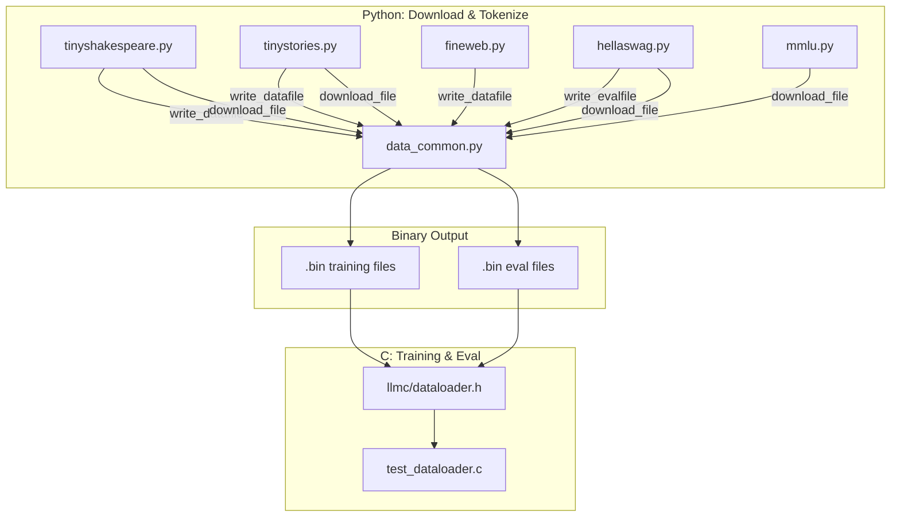

# Data Processing & Datasets

# Data Processing & Datasets

## Overview

This module handles downloading, tokenizing, and packaging datasets into binary `.bin` files consumed by the C training and evaluation code in `llmc/`. Each dataset has its own Python script that creates a local cache directory and writes `.bin` files inside it. Shared serialization logic lives in `data_common.py`.

The module supports two tokenizer configurations:

| Model descriptor | Token dtype | Magic number | Tokenizer |
|---|---|---|---|
| `gpt-2` | `uint16` | `20240520` | tiktoken `gpt2` |
| `llama-3` | `uint32` | `20240801` | HuggingFace `meta-llama/Meta-Llama-3.1-8B` |

All scripts default to `gpt-2`.

## Binary File Formats

### Training Data Format (`write_datafile`)

A flat stream of tokens with a fixed-size header, designed for efficient memory-mapped reading in C.

```
┌──────────────────────────────────┐
│  Header: 256 × int32 (1024 bytes) │
│    [0] = magic number             │
│    [1] = version                  │
│    [2] = token count              │
│    [3..255] = padding (zeros)     │
├──────────────────────────────────┤
│  Tokens: N × uint16 (gpt-2)      │
│          or N × uint32 (llama-3)  │
└──────────────────────────────────┘
```

Documents are delimited by an EOT token prepended to each one. The token count in header[2] must be less than 2³¹ (~2.1B tokens).

### Eval Data Format (`write_evalfile`)

Used for multiple-choice benchmarks (HellaSwag, MMLU). Each example encodes a shared context, multiple completions, and a label.

```
┌──────────────────────────────────┐
│  Header: 256 × int32 (1024 bytes) │
│    [0] = magic (20240522)         │
│    [1] = version (1)               │
│    [2] = number of examples        │
│    [3] = longest_example_bytes     │
├──────────────────────────────────┤
│  Stream of uint16 values:         │
│  Per example:                      │
│    <START_EXAMPLE>  (65535)        │
│    <EXAMPLE_BYTES>                 │
│    <EXAMPLE_INDEX>                 │
│    <LABEL>                         │
│    <NUM_COMPLETIONS> (always 4)    │
│    <len><CONTEXT_TOKENS...>        │
│    <len><COMPLETION_1_TOKENS...>  │
│    <len><COMPLETION_2_TOKENS...>  │
│    <len><COMPLETION_3_TOKENS...>  │
│    <len><COMPLETION_4_TOKENS...>  │
└──────────────────────────────────┘
```

The `<EXAMPLE_BYTES>` field allows the C reader to skip ahead to the next example. Token values must be in `[0, 65534]` since `65535` is reserved as the start delimiter.

## Common Utilities — `data_common.py`

### `download_file(url, fname, chunk_size=1024)`

Streams a file from `url` to `fname` with a tqdm progress bar. Used by all dataset download functions.

### `write_datafile(filename, toks, model_desc="gpt-2")`

Writes a training data `.bin` file. `toks` is a list of integer token IDs. `model_desc` selects the header format and token dtype via `HEADERS_INFO`.

### `write_evalfile(filename, datas)`

Writes an eval data `.bin` file. `datas` is a list of dicts, each containing:
- `"label"` — index of the correct completion (0–3)
- `"ctx_tokens"` — list of context token IDs
- `"ending_tokens"` — list of 4 lists, each a completion's token IDs

### `HEADERS_INFO`

Dictionary mapping model descriptors to their magic number, version, and numpy dtype:

```python
HEADERS_INFO = {
    "gpt-2":    {"magic": 20240520, "version": 1, "token_dtype": np.uint16},
    "llama-3":  {"magic": 20240801, "version": 7, "token_dtype": np.uint32},
}
```

## Dataset Scripts

### TinyShakespeare — `tinyshakespeare.py`

Small dataset for quick experiments and debugging. Downloads a single text file, splits it on double-newlines into "documents," and tokenizes each with a leading EOT token.

```bash
python dev/data/tinyshakespeare.py --model=gpt-2
# Creates: tinyshakespeare/tiny_shakespeare_val.bin   (32,768 tokens)
#          tinyshakespeare/tiny_shakespeare_train.bin  (~305K tokens)
```

The first 32,768 tokens become the validation split; the rest is training. A backwards-compatibility note: each section retains its trailing `\n\n` (except the last), and the EOT is inserted *after* the `\n\n` rather than replacing it.

### TinyStories — `tinystories.py`

Medium-scale dataset (~925M tokens for gpt-2). Downloads a tar.gz from HuggingFace, unpacks it into ~50 JSON shards, then tokenizes in parallel using `ProcessPoolExecutor`.

```bash
python dev/data/tinystories.py --model=gpt-2
# Creates: tinystories/TinyStories_val.bin    (~19M tokens)
#          tinystories/TinyStories_train.bin   (~926M tokens)
```

Shard 0 becomes the val split; shards 1–49 are train. Each shard is shuffled with a deterministic seed (`1337 + shard_index`) via `process_shard()`.

### FineWeb — `fineweb.py`

Large-scale pretraining dataset from HuggingFace (`HuggingFaceFW/fineweb` or `fineweb-edu`). Tokenizes documents in parallel with `multiprocessing.Pool` and writes output in fixed-size shards (default 100M tokens each).

```bash
python dev/data/fineweb.py -t edu -v 100B -m gpt-2
# -t:  edu | classic
# -v:  10B | 100B
# -m:  gpt-2 | llama-3
# -s:  shard size in tokens (default 10^8)
```

The first shard (index 0) is labeled `val`; all subsequent shards are `train`. Documents that span a shard boundary are split — the portion that fits goes into the current shard, the remainder starts the next one.

Output directory naming follows the pattern `{type}_fineweb{version}` (e.g., `edu_fineweb100B`).

### HellaSwag — `hellaswag.py`

Downloads the HellaSwag benchmark and evaluates a GPT-2 model in completion style (lowest loss wins). Also writes the tokenized eval data to a `.bin` file for C-side evaluation.

```bash
python dev/data/hellaswag.py -m gpt2 -d cuda
```

**Evaluation flow:**

1. `download(split)` fetches JSONL files from the HellaSwag repo
2. `iterate_examples(split)` yields parsed examples
3. `render_example(example)` tokenizes context + 4 completions, producing:
   - `tokens` — shape `(4, max_len)`, padded context+completion token IDs
   - `mask` — shape `(4, max_len)`, 1 in completion region, 0 in context
   - `label` — correct completion index
4. `evaluate(model_type, device)` computes autoregressive cross-entropy loss over the completion region for each candidate, picks the one with lowest loss

Two accuracy metrics are reported:
- **acc** — uses total loss (favors shorter completions)
- **acc_norm** — uses average loss per completion token

After evaluation, `write_evalfile` serializes all examples to `hellaswag/hellaswag_val.bin`.

### MMLU — `mmlu.py`

Downloads the MMLU benchmark and evaluates using the same completion-style approach as HellaSwag.

```bash
python dev/data/mmlu.py -m gpt2 -d cuda
```

**Key differences from HellaSwag:**
- Downloads a tar archive containing CSV files organized by subject
- `iterate_examples()` iterates over all CSV test files, yielding `{"question", "endings", "label"}` dicts
- Context is formatted as `"Question: {question}\n\nAnswer:"`
- Labels are letter indices (`"A"→0, "B"→1, "C"→2, "D"→3`)
- No `.bin` eval file is written (only HellaSwag writes one)

## Shell Scripts for Pre-tokenized Data

For large datasets, downloading pre-tokenized `.bin` shards is faster than re-tokenizing locally.

### `edu_fineweb.sh`

Downloads GPT-2 tokenized FineWeb-Edu 100B shards from HuggingFace.

```bash
cd dev/data
./edu_fineweb.sh 100   # download first 100 train shards + 1 val shard
./edu_fineweb.sh       # download all 1001 train shards
```

Saves to `edu_fineweb100B/`. Runs up to 40 parallel downloads.

### `fineweb.sh`

Same pattern for the standard FineWeb 100B dataset. Up to 1028 train shards, saves to `fineweb100B/`.

### `download_starter_pack.sh`

Downloads the minimal files needed to start training and evaluating:

```bash
./dev/download_starter_pack.sh
```

Files placed according to type:
- Model weights (`gpt2_124M.bin`, `gpt2_124M_bf16.bin`, `gpt2_124M_debug_state.bin`) → project root
- Tokenizer (`gpt2_tokenizer.bin`) → project root
- TinyShakespeare bins → `dev/data/tinyshakespeare/`
- HellaSwag eval bin → `dev/data/hellaswag/`

## C DataLoader Tests — `test_dataloader.c`

Tests the `DataLoader` struct from `llmc/dataloader.h` using synthetic shard files containing incrementing token sequences.

```bash
cd dev/test
gcc -O3 -I../../llmc -o test_dataloader test_dataloader.c -lm && ./test_dataloader
```

**Test cases:**

| Test | Shards | Processes | Shuffled | What it verifies |
|---|---|---|---|---|
| `test_simple` | 4 | 1 | No | Tokens returned in sequential order |
| `test_multiprocess_simple` | 4 | 2 | No | Two loaders interleave correctly in token space |
| `test_shuffled` | 4 | 1 | Yes | All expected tokens appear the correct number of times |
| `test_multiprocess_shuffled` | 4 | 2 | Yes | Multi-process shuffling covers all tokens without gaps |

Each test creates 4 shards of 140 tokens each (sequential IDs with per-shard offsets), runs 4 epochs, and verifies `inputs`/`targets` arrays from `dataloader_next_batch()`. The `checkRange` and `checkEquals` macros provide file/line info on failure.

## Architecture



## Quick Start

```bash
# Minimal setup — download starter pack (model weights + tiny datasets)
./dev/download_starter_pack.sh

# Or generate TinyShakespeare from scratch
python dev/data/tinyshakespeare.py --model=gpt-2

# Large-scale pretraining data (pre-tokenized, fastest)
cd dev/data && ./edu_fineweb.sh 10

# Or tokenize FineWeb yourself (slow, requires HuggingFace access)
python dev/data/fineweb.py -t edu -v 10B -m gpt-2

# Run HellaSwag evaluation
python dev/data/hellaswag.py -m gpt2 -d cuda

# Run MMLU evaluation
python dev/data/mmlu.py -m gpt2 -d cuda
```