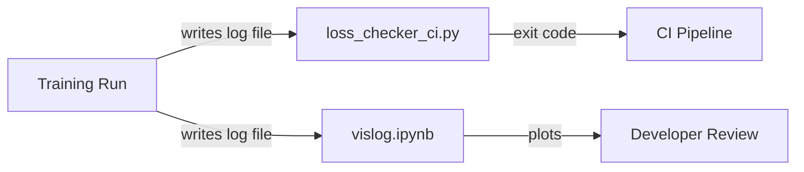

# GPT-2 Training — dev

# GPT-2 Training — dev Module

The `dev/` directory contains developer tooling for **CI validation** and **training log visualization**. These are not part of the training runtime itself — they are offline utilities that verify correctness of training runs and inspect their output.

## Components

### `loss_checker_ci.py` — CI Loss Regression Checker

A command-line script that validates a training run's loss values against a hardcoded set of reference values. It is designed to be called from CI pipelines to detect numerical regressions (e.g., from code changes that alter floating-point behavior).

**How it works:**

1. Reads a training output file and locates the 10 rows beginning with the line containing `"step    1/10"`.
2. Extracts a loss value from each row using a user-specified column range (`col_start` to `col_end`).
3. Compares each extracted value against the corresponding entry in a fixed reference array (the expected fp32 loss curve from `test_gpt2.cu`).
4. Fails (exit code 1) if any value deviates from its reference by more than the allowed percentage threshold.

**Reference values (fp32 precision, from `test_gpt2.cu`):**

| Step | Reference Loss |
|------|---------------|
| 1    | 5.270009      |
| 2    | 4.060681      |
| 3    | 3.320085      |
| 4    | 2.717550      |
| 5    | 2.181066      |
| 6    | 1.653923      |
| 7    | 1.168050      |
| 8    | 0.736873      |
| 9    | 0.401021      |
| 10   | 0.187493      |

**Usage:**

```bash
python dev/loss_checker_ci.py \
  -f train_gpt2cu_fp32_precision.txt \
  -s 20 -e 28 \
  -a 10.0
```

| Argument | Flag | Required | Description |
|----------|------|----------|-------------|
| `file` | `-f` | Yes | Path to the training output text file |
| `col_start` | `-s` | Yes | Starting column index (0-based) for loss extraction |
| `col_end` | `-e` | Yes | Ending column index (0-based, exclusive) for loss extraction |
| `percent_accuracy` | `-a` | Yes | Maximum allowed percent deviation from reference values |

**Exit codes:**

- `0` — All values within the allowed tolerance.
- `1` — One or more values exceed the tolerance, or a file/parse error occurred.

**Key functions:**

- **`read_numbers_from_file(file_path, col_start, col_end)`** — Scans the file for the marker line `"step    1/10"`, then reads the next 10 lines, slicing each at `[col_start:col_end]` and converting to `float`. Returns a list of 10 floats, or `None` on error.
- **`compare_numbers(read_values, fixed_values, percent_accuracy)`** — Computes percent difference for each pair `(read_values[i], fixed_values[i])` as `((read - fixed) / fixed) * 100`. Returns `1` if any absolute difference exceeds `percent_accuracy`, otherwise `0`.

**Limitations:**

- The reference values are hardcoded for fp32 precision only. A different precision or model configuration requires modifying the `fixed_values` list in `main()`.
- The anchor string `"step    1/10"` is exact — any change to the training log format will break detection.
- Column indices are positional, not parsed from headers, so they are fragile against format changes.

---

### `vislog.ipynb` — Training Log Visualizer

A Jupyter notebook that plots training loss, validation loss, and HellaSwag evaluation accuracy from log files produced by the training loop.

**How it works:**

1. **`parse_logfile(logfile)`** reads a log file where each line has the format:
   ```
   step:<N> <stream_key>:<value>
   ```
   It handles crash-restart scenarios: if the training job crashes and restarts, older steps get re-logged. The function stores data in dictionaries keyed by step number, so re-logged entries simply overwrite the old ones. The final output is a dict mapping stream names to `(xs, ys)` tuples of sorted step/value lists.

2. The notebook plots two panels:
   - **Left panel** — Training loss (`trl` stream) and validation loss (`tel` stream) on a log scale, with a horizontal reference line at the OpenAI GPT-2 checkpoint validation loss.
   - **Right panel** — HellaSwag evaluation accuracy (`eval` stream), with reference lines for both OpenAI GPT-2 and GPT-3 checkpoint baselines.

3. **`smooth_moving_average(signal, window_size)`** — An optional 1D moving-average smoother using edge-padded convolution. Available but commented out by default.

**Baseline reference values:**

| Model Size | Val Loss (GPT-2) | HellaSwag (GPT-2) | HellaSwag (GPT-3) |
|------------|-------------------|--------------------|--------------------|
| 124M       | 3.424958          | 0.294463           | 0.337              |
| 350M       | 3.083089          | 0.375224           | 0.436              |
| 774M       | 3.000580          | 0.431986           | 0.510              |
| 1558M      | 2.831273          | 0.488946           | 0.547              |

**Log file format expected by `parse_logfile`:**

```
step:100 trl:5.270009
step:100 tel:5.100000
step:200 trl:4.060681
step:200 eval:0.310000
```

Each line is whitespace-delimited. The first token contains `step:<int>`, the second token contains `<stream_key>:<float>`.

**Configuration:** Change the `sz` variable (`"124M"`, `"350M"`, `"774M"`, or `"1558M"`) and the `logfile` path to visualize different model runs.

---

## Relationship to the Codebase



- **`loss_checker_ci.py`** consumes the same training output files that the CUDA test harness (`test_gpt2.cu`) produces. It acts as a regression gate in CI — if a code change causes loss values to drift beyond the configured tolerance, the CI run fails.
- **`vislog.ipynb`** consumes the `main.log` files written by the training loop (stored under `log_gpt2_<size>/` or `log124M/` directories). It is an interactive tool for developers to visually assess training health and compare against published GPT-2/GPT-3 baselines.

Neither tool is imported by the training code; they are strictly consumers of its output.