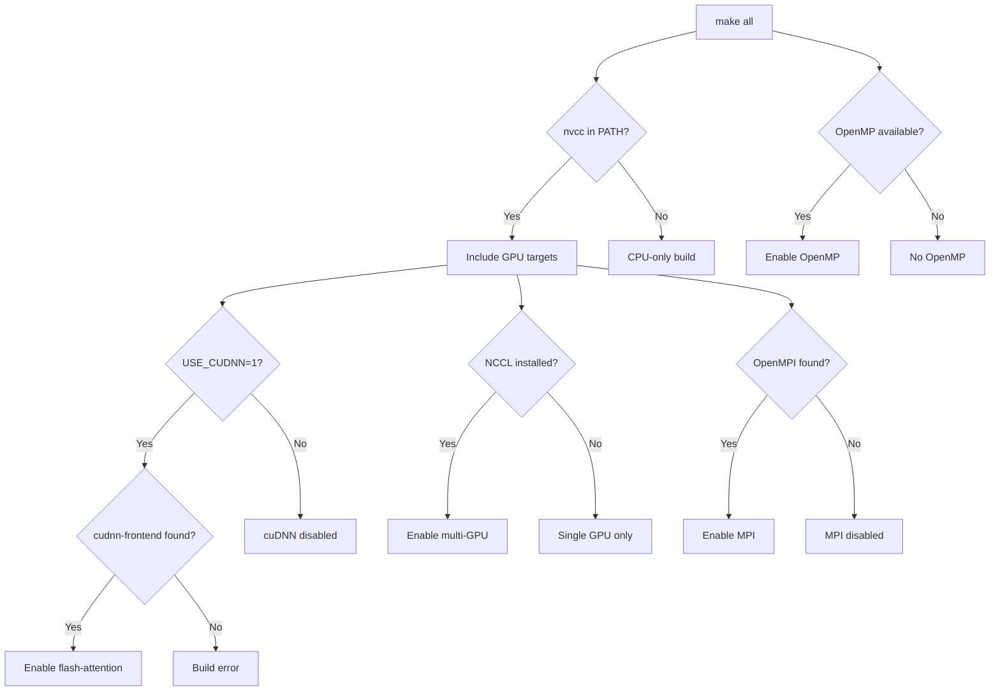

# GPT-2 Training — Makefile

# GPT-2 Training — Makefile

## Overview

This Makefile is the build system for the GPT-2 training project. It compiles both CPU-only and GPU-accelerated (CUDA) binaries for training and testing, with automatic detection of optional dependencies (OpenMP, cuDNN, NCCL, MPI) and configurable precision modes. It supports Linux, macOS, and Windows.

## Build Targets

| Target | Source | Description |
|--------|--------|-------------|
| `all` | — | Default. Builds all available targets (CPU + GPU if nvcc is found) |
| `train_gpt2` | `train_gpt2.c` | CPU-only training binary |
| `test_gpt2` | `test_gpt2.c` | CPU-only testing binary |
| `train_gpt2cu` | `train_gpt2.cu` | GPU training binary (precision-aware) |
| `test_gpt2cu` | `test_gpt2.cu` | GPU testing binary (precision-aware) |
| `train_gpt2fp32cu` | `train_gpt2_fp32.cu` | GPU training binary, FP32-only path |
| `test_gpt2fp32cu` | `test_gpt2_fp32.cu` | GPU testing binary, FP32-only path |
| `profile_gpt2cu` | `profile_gpt2.cu` | GPU profiling binary (includes `-lineinfo` for nsight) |
| `clean` | — | Removes all built targets and build artifacts |

The `train_gpt2cu` and `test_gpt2cu` targets link against the cuDNN attention object (`$(NVCC_CUDNN)`) when cuDNN is enabled. The FP32-specific CUDA targets do **not** use cuDNN or precision flags.

## Dependency Auto-Detection

The Makefile probes the system at build time and reports what it finds. The detection order and logic for each optional dependency is summarized below.



### CUDA / nvcc

- On non-Windows: resolved via `which nvcc`. On Windows: resolved via `where nvcc`.
- If not found, GPU targets are silently skipped.
- GPU compute capability is auto-detected via `nvidia-smi --query-gpu=compute_cap` (lowest capability across all GPUs is selected). This detection is skipped when `CI=true` or when `GPU_COMPUTE_CAPABILITY` is explicitly set.
- The detected capability is passed to nvcc as `--generate-code arch=compute_XX,code=[compute_XX,sm_XX]`.

### OpenMP

OpenMP significantly speeds up CPU execution. Detection varies by platform:

- **Linux**: Tests if `$(CC) -fopenmp` compiles successfully. If so, adds `-fopenmp -DOMP` and links `-lgomp`.
- **macOS (Apple Silicon)**: Checks `/opt/homebrew/opt/libomp/lib`.
- **macOS (Intel)**: Checks `/usr/local/opt/libomp/lib`.
- **Windows**: OpenMP is included via the MSVC `/openmp:llvm` flag unconditionally.

Disable with `NO_OMP=1`.

### cuDNN (Flash Attention)

cuDNN is **disabled by default** because it dramatically increases compile time (~1 minute vs. a few seconds). Enable with `USE_CUDNN=1`.

When enabled, the Makefile searches for the cuDNN frontend headers in this order:
1. `$HOME/cudnn-frontend/include` (or `%USERPROFILE%` on Windows)
2. `./cudnn-frontend/include` (local directory)

On success, it compiles `llmc/cudnn_att.cpp` into `$(BUILD_DIR)/cudnn_att.o`, adds `-DENABLE_CUDNN` to NVCC flags, and links `-lcudnn`. On failure, the build aborts with an error.

Override the frontend path with `CUDNN_FRONTEND_PATH=<path>`. On Windows, also set `CUDNN_INCLUDE_PATH` if cuDNN is not at the default `C:\Program Files\NVIDIA\CUDNN\v9.1\include\12.4`.

### NCCL (Multi-GPU)

- Detected on Linux via `dpkg -l | grep nccl`.
- When found, adds `-DMULTI_GPU` and links `-lnccl`.
- Not supported on macOS. Not checked on Windows.
- Disable with `NO_MULTI_GPU=1`.
- Install hint: `sudo apt install libnccl2 libnccl-dev`.

### MPI

- Looks for OpenMPI at `/usr/lib/x86_64-linux-gnu/openmpi` (override with `OPENMPI_DIR`).
- When found, adds `-DUSE_MPI`, includes the MPI headers, and links `-lmpi`.
- Disable with `NO_USE_MPI=1`.

## Precision Configuration

Controlled by the `PRECISION` variable. Default is `BF16`.

| Value | Define Set | Effect |
|-------|-----------|--------|
| `FP32` | `-DENABLE_FP32` | 32-bit floating point |
| `FP16` | `-DENABLE_FP16` | 16-bit half precision |
| `BF16` | `-DENABLE_BF16` | Bfloat16 (default) |

Only the `train_gpt2cu`, `test_gpt2cu`, and `profile_gpt2cu` targets receive precision flags. The dedicated FP32 CUDA targets (`train_gpt2fp32cu`, `test_gpt2fp32cu`) are always FP32 and do not use these flags.

Invalid precision values cause a build error.

## Compiler Flags

### CPU (clang / GCC / MSVC)

- **Linux/macOS**: Defaults to `clang`. Uses `-Ofast` plus conditional flags tested via `check_and_add_flag` (currently `-march=native`).
- **Windows**: Uses `cl.exe` with MSVC optimization flags (`/O2 /Ot /GL /fp:fast /openmp:llvm`, etc.).

### GPU (nvcc)

Key NVCC flags:
- `--threads=0 -t=0` — parallel compilation using all CPU cores
- `--use_fast_math` — faster but less precise math intrinsics
- `-std=c++17` — C++17 standard
- `-O$(FORCE_NVCC_O)` — optimization level, default `3` (override with `FORCE_NVCC_O=0` for faster compile)
- `-lineinfo` — added only to `profile_gpt2cu` for NVIDIA Nsight profiling

## Build Directory

Object files are placed in `build/`. The directory is created automatically at Makefile parse time. On clean, only the object files inside `build/` are removed (not the directory itself).

## Common Usage

```bash
# Default build (CPU + GPU if available, BF16 precision)
make

# CPU-only build (when no CUDA toolkit is installed)
make train_gpt2 test_gpt2

# GPU build with cuDNN flash attention
make USE_CUDNN=1

# GPU build with FP16 precision
make PRECISION=FP16

# Force a specific GPU compute capability
make GPU_COMPUTE_CAPABILITY=80

# Faster nvcc compile time (lower optimization)
make FORCE_NVCC_O=0

# Disable OpenMP
make NO_OMP=1

# Disable multi-GPU and MPI
make NO_MULTI_GPU=1 NO_USE_MPI=1

# Profile build for nsight
make profile_gpt2cu

# Clean all artifacts
make clean
```

## Environment Variables Summary

| Variable | Default | Purpose |
|----------|---------|---------|
| `CC` | `clang` | C compiler (CPU targets) |
| `PRECISION` | `BF16` | Numerical precision (`FP32`, `FP16`, `BF16`) |
| `USE_CUDNN` | `0` | Enable cuDNN flash attention |
| `CUDNN_FRONTEND_PATH` | auto-detected | Path to cuDNN frontend headers |
| `GPU_COMPUTE_CAPABILITY` | auto-detected | NVIDIA GPU arch (e.g. `80`, `89`) |
| `FORCE_NVCC_O` | `3` | NVCC optimization level |
| `NO_OMP` | — | Set to `1` to disable OpenMP |
| `NO_MULTI_GPU` | — | Set to `1` to disable NCCL |
| `NO_USE_MPI` | — | Set to `1` to disable MPI |
| `OPENMPI_DIR` | `/usr/lib/x86_64-linux-gnu/openmpi` | OpenMPI root directory |
| `CI` | — | Set to `true` to skip GPU capability auto-detection |