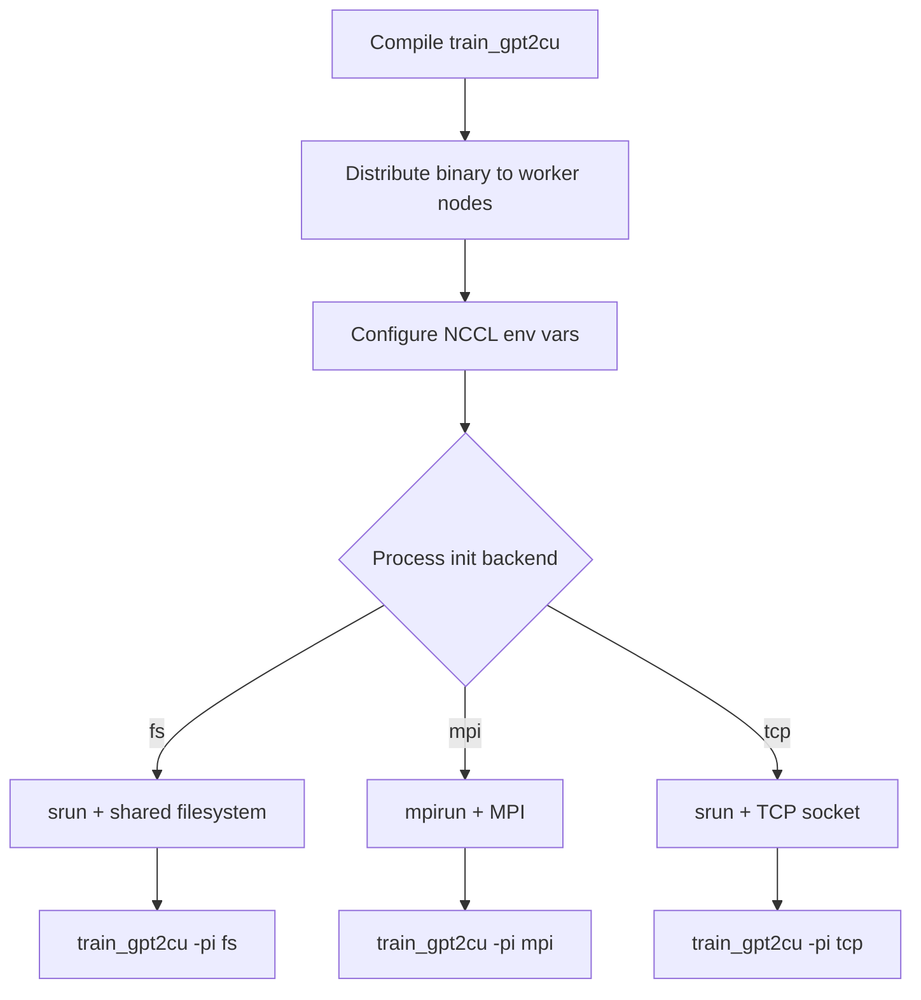

# GPT-2 Training — multi_node

# GPT-2 Training — Multi-Node

Distributed training scripts for the GPT-2 124M model across multiple GPU nodes. The module provides three launch scripts, each using a different process initialization backend to coordinate the distributed run.

## Architecture

All three scripts follow the same general pattern: compile the binary, distribute it to worker nodes, configure NCCL, then launch `train_gpt2cu` across all processes. They differ only in how processes discover and coordinate with each other.



## Communication Backends

### Filesystem (`run_gpt2_124M_fs.sbatch`)

Uses a shared filesystem path for process rendezvous. The rank-0 process writes coordination data to a directory that all other processes poll.

- **Launcher:** SLURM `srun`
- **Build flag:** `NO_USE_MPI=1` (avoids MPI dependency)
- **Key flags:** `-pi fs` and `-pf <sync_fs_path>` (shared filesystem path accessible from all nodes)
- **Process identity:** derived from SLURM environment variables (`$SLURM_NTASKS`, `$SLURM_PROCID`, `$SLURM_NTASKS_PER_NODE`)

Requires a shared filesystem (e.g., NFS) mounted at the same path on every node. If your cluster already shares `$HOME`, point `-pf` there.

### MPI (`run_gpt2_124M_mpi.sh`)

Uses MPI for process spawning and coordination. MPI handles rank assignment and inter-process communication natively, so no additional rendezvous flags are needed.

- **Launcher:** `mpirun` with `--host` specifying node names and slot counts
- **Build flag:** default (MPI linked in)
- **Key flag:** `-pi mpi`
- **Process identity:** handled entirely by the MPI runtime

Hostnames and slot counts are specified directly on the `mpirun` command line (e.g., `--host h100-node-1-0:8,h100-node-1-1:8`). This script does **not** require SLURM and can run on bare-metal clusters with MPI installed.

### TCP (`run_gpt2_124M_tcp.sbatch`)

Uses a TCP socket on the rank-0 node as the rendezvous point. All worker processes connect to that IP address to exchange coordination information.

- **Launcher:** SLURM `srun`
- **Build flag:** `NO_USE_MPI=1`
- **Key flags:** `-pi tcp` and `-ps <server_ip>` (IP address of the rank-0 machine)
- **Process identity:** derived from SLURM environment variables

Use this when you have SLURM but no shared filesystem. You must set `-ps` to the IP address of the node running process zero.

## Common Configuration

### Build

| Script | Make command |
|--------|-------------|
| `run_gpt2_124M_fs.sbatch` | `make train_gpt2cu USE_CUDNN=1 NO_USE_MPI=1` |
| `run_gpt2_124M_mpi.sh` | `make train_gpt2cu USE_CUDNN=1` |
| `run_gpt2_124M_tcp.sbatch` | `make train_gpt2cu USE_CUDNN=1 NO_USE_MPI=1` |

`NO_USE_MPI=1` is required for the filesystem and TCP backends to avoid linking against an MPI library that won't be used at runtime.

### Binary Distribution

All scripts copy the compiled `train_gpt2cu` binary to worker nodes via `scp` before launching. If the filesystem is already shared across nodes, these copies are redundant but harmless. The SLURM scripts iterate over `$SLURM_JOB_NODELIST`; the MPI script copies to the single worker host explicitly.

### NCCL Environment Variables

All three scripts set the same NCCL tuning flags:

| Variable | Value | Purpose |
|----------|-------|---------|
| `CUDA_VISIBLE_DEVICES` | `0,1,2,3,4,5,6,7` | Expose all 8 GPUs per node |
| `NCCL_NET_GDR_LEVEL` | `2` | Enable GPUDirect RDMA — bypasses CPU for cross-node GPU memory access |
| `NCCL_IB_DISABLE` | `0` | Use InfiniBand if available |
| `NCCL_SOCKET_IFNAME` | `ens17` | Network interface for NCCL sockets |
| `OMPI_MCA_btl_tcp_if_include` | `ens17` | Network interface for MPI TCP transport |
| `NCCL_P2P_LEVEL` | `PXB` | Peer-to-peer GPU communication scope (PCI expander bridge level) |

**You must change `NCCL_SOCKET_IFNAME` and `OMPI_MCA_btl_tcp_if_include`** to match your cluster's network interface. Run `ip addr` or `ifconfig` on a compute node to find the correct name (e.g., `eth0`, `ib0`, `enp1s0`).

For debugging NCCL issues, uncomment:
```bash
export NCCL_DEBUG=INFO
export NCCL_DEBUG_SUBSYS=ALL
```

## Training Arguments

The shared training configuration across all three scripts:

| Flag | Value | Meaning |
|------|-------|---------|
| `-i` | `fineweb_train_*.bin` | Training data glob |
| `-j` | `fineweb_val_*.bin` | Validation data glob |
| `-o` | `log_gpt2_124M_multi` | Output directory |
| `-v` | `250` | Val loss evaluation interval (steps) |
| `-s` | `20000` | Sample generation interval (steps) |
| `-g` | `144` | Grad accumulation steps (effective batch = 64 × 1024 × 144) |
| `-h` | `1` | Hours to run |
| `-b` | `64` | Micro-batch size per GPU |
| `-t` | `1024` | Sequence length |
| `-d` | `2097152` | Data reshuffle seed |
| `-r` | `0` | Random seed |
| `-z` | `1` | Zero optimizer state (sharding) |
| `-c` | `0.1` | Grad clip value |
| `-l` | `0.0006` | Learning rate |
| `-u` | `700` | Warmup steps |
| `-e` | `d12` | Distributed data-parallel mode (12-layer model) |
| `-y` | `1` / `0` | Overwrite output dir (varies by script) |

Minor differences in `-q` (weight decay), `-n` (val steps), and `-y` between scripts reflect per-run tuning choices, not backend requirements.

### Distributed-Specific Flags

These flags are only used by the filesystem and TCP backends (MPI handles them internally):

| Flag | Source | Meaning |
|------|--------|---------|
| `-pn` | `$SLURM_NTASKS` | Total number of processes |
| `-pr` | `$SLURM_PROCID` | Rank of this process |
| `-pg` | `$SLURM_NTASKS_PER_NODE` | Processes per node |
| `-pf` | filesystem path | Shared directory for rendezvous (fs backend only) |
| `-ps` | IP address | Rank-0 IP for rendezvous (tcp backend only) |
| `-pi` | `fs` / `mpi` / `tcp` | Process initialization backend |

## How to Run

### SLURM (filesystem or TCP backend)

```bash
sbatch scripts/multi_node/run_gpt2_124M_fs.sbatch
sbatch scripts/multi_node/run_gpt2_124M_tcp.sbatch
```

### MPI

```bash
bash scripts/multi_node/run_gpt2_124M_mpi.sh
```

Ensure passwordless SSH is configured between all nodes, and that the training data binaries exist at the same path on every node.

## Adapting to Your System

Before running, update the following in whichever script you choose:

1. **SLURM resource directives** — `--partition`, `--ntasks`, `--nodes`, `--ntasks-per-node`, `--gres` to match your cluster's GPU count and partition names.
2. **Paths** — `binary_path`, `out_dir`, `train_data_path`, `val_data_path` to match your filesystem layout.
3. **Network interface** — `NCCL_SOCKET_IFNAME` and `OMPI_MCA_btl_tcp_if_include` to match your cluster's RDMA/Ethernet interface.
4. **Hostnames** (MPI script) — `host1`, `host2` to match your node names.
5. **Server IP** (TCP script) — `server_ip` to the IP of the rank-0 node.
6. **NCCL_P2P_LEVEL** — adjust based on your GPU topology (`SYS`, `NODE`, `PXB`, `PHB`, `PXP`). Use `nvidia-smi topo -m` to inspect.