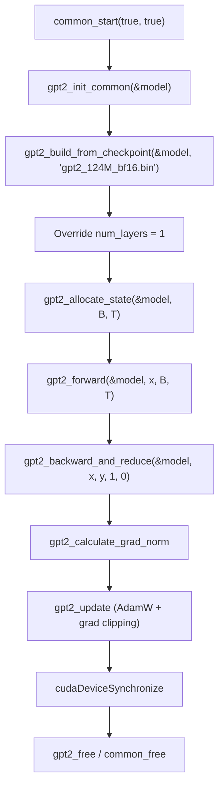

# GPT-2 Training — profile_gpt2.cu

# profile_gpt2.cu — GPT-2 CUDA Kernel Profiling Harness

## Purpose

`profile_gpt2.cu` is a convenience tool for profiling the CUDA kernels executed during a single GPT-2 training step. It constructs a minimal model, runs one complete forward–backward–update pass with synthetic data, and exits — providing a clean, reproducible target for NVIDIA Nsight Compute (`ncu`).

The goal is to capture kernel-level metrics (memory throughput, occupancy, warp efficiency, etc.) for every CUDA kernel in the training loop without the noise of multi-epoch iteration or real data loading.

## Compilation

```bash
make profile_gpt2cu NO_MULTI_GPU=1
```

`NO_MULTI_GPU=1` is required because this harness is designed for single-GPU profiling. The resulting executable is `profile_gpt2cu`.

## Usage with NVIDIA Nsight Compute

```bash
sudo ncu --set full --import-source yes -o profile -f ./profile_gpt2cu
```

| Flag | Meaning |
|------|---------|
| `--set full` | Collect all available hardware metrics. Remove for a lighter, faster profile. |
| `--import-source yes` | Embed CUDA source lines into the report for inline viewing. |
| `-o profile` | Write results to `profile.ncu-rep`. |
| `-f` | Force overwrite of an existing report file. |

The output file `profile.ncu-rep` can be opened in the **NVIDIA Nsight Compute UI** (local or remote). A common workflow is to `rsync` the `.ncu-rep` file from a GPU server to a local machine for analysis.

## Execution Flow



### Step-by-step

1. **Multi-GPU config initialization** — `multi_gpu_config_init` is called with placeholder values (`num_processes = -1`, etc.). Since MPI is the init method, these values are irrelevant; the config is only needed to satisfy downstream function signatures.

2. **Common startup** — `common_start(true, true)` initializes CUDA and the process environment. The two `true` flags enable profiling-related setup paths inside `train_gpt2.cu`.

3. **Model construction** — `gpt2_init_common` + `gpt2_build_from_checkpoint` loads the GPT-2 124M BF16 checkpoint and allocates model weights on the GPU.

4. **Layer count override** — `model.config.num_layers = 1` is set **after** checkpoint load but **before** state allocation. This is the critical optimization for profiling (see [Design Decisions](#key-design-decisions) below).

5. **State allocation** — `gpt2_allocate_state` allocates activation buffers, gradients, and optimizer state for batch size `B` and sequence length `T`.

6. **Synthetic data** — Input tokens `x` and target tokens `y` are filled with `i % vocab_size`. No real data is loaded; the values only need to be valid token indices.

7. **Single training step** — Forward pass, backward pass with gradient reduction, gradient norm calculation, and AdamW parameter update are each called exactly once.

8. **Synchronize** — `cudaDeviceSynchronize` ensures all CUDA work completes before the process exits, so `ncu` captures the full timeline.

9. **Cleanup** — `gpt2_free` and `common_free` release all GPU and CPU memory.

## Key Design Decisions

### Single-layer profiling (`num_layers = 1`)

All transformer layers execute identical kernels — same shapes, same arithmetic intensity. Profiling all 12 (or 24, 48, etc.) layers would produce redundant kernel instances and dramatically inflate report size and collection time. Reducing to 1 layer captures representative metrics for every unique kernel while keeping the profile compact.

The override is applied **after** `gpt2_build_from_checkpoint` (which reads the real layer count from the checkpoint file) and **before** `gpt2_allocate_state` (which uses `num_layers` to size activation and gradient buffers). This means the model weights for all original layers are loaded into GPU memory, but only the first layer's activations are allocated and exercised. If memory is tight, this still reduces activation memory proportionally.

### Synthetic input data

The training step uses `i % model.config.vocab_size` for both inputs and targets. This guarantees:
- Every token index is in the valid range `[0, vocab_size)`.
- No file I/O or tokenization overhead contaminates the profile.
- Results are deterministic across runs.

The loss value is meaningless; only kernel performance matters.

### `#define TESTING`

The file defines `TESTING` before including `train_gpt2.cu`. This macro likely exposes internal symbols, disables certain runtime checks or multi-GPU coordination paths, and makes the training loop functions directly callable from a minimal `main()`.

## OOM Tuning

If the profiling run runs out of GPU memory, reduce the batch size `B` (default 24) and/or sequence length `T` (default 1024). Suggested progression:

| Attempt | B | T | Notes |
|---------|---|---|-------|
| Default | 24 | 1024 | Full-scale profile target |
| First fallback | 4 | 1024 | Reduced batch |
| Second fallback | 4 | 512 | Reduced batch and context |

Keep values at powers of 2 where possible for clean memory alignment.

## Relationship to train_gpt2.cu

`profile_gpt2.cu` is not a standalone module — it is a thin wrapper that `#include`s the entire `train_gpt2.cu` source. It reuses every training function (`gpt2_forward`, `gpt2_backward_and_reduce`, `gpt2_update`, etc.) without modification. The only additions are:

- A custom `main()` that drives a single training step.
- The `num_layers` override to eliminate redundant kernel launches.
- Synthetic data generation instead of data loader calls.

Any changes to kernel implementations in `train_gpt2.cu` are automatically reflected in the profiling harness.