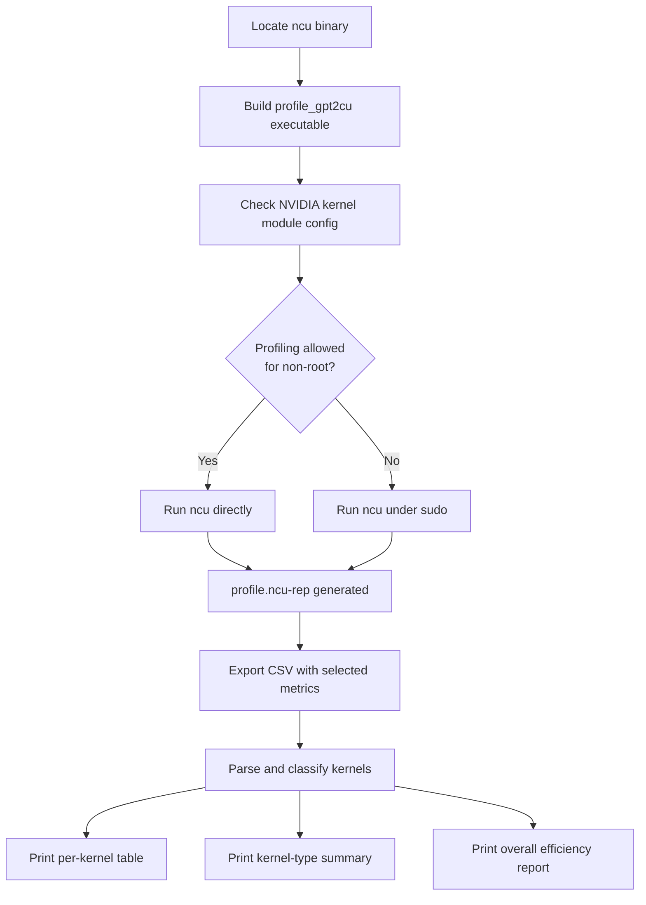

# GPT-2 Training — profile_gpt2cu.py

# GPT-2 Training Profiler — `profile_gpt2cu.py`

## Purpose

This script profiles a single training step of the GPT-2 CUDA implementation using NVIDIA Nsight Compute (`ncu`). It produces two outputs:

1. **`profile.ncu-rep`** — a full Nsight Compute report file for interactive inspection in the Nsight Compute GUI.
2. **Console output** — a printed breakdown of per-kernel timing, memory bandwidth, tensor core utilization, and an overall efficiency summary.

The script is designed to answer the question: *how efficiently is this training step using the GPU's memory bandwidth and tensor cores?*

## Prerequisites

- **`ncu`** on `PATH` or at `/usr/local/cuda/bin/ncu`
- **`make`** and the GPT-2 CUDA build environment (compiles `profile_gpt2cu` target)
- **Root access** may be required if `NVreg_RestrictProfilingToAdminUsers=1` is set in the NVIDIA kernel module configuration. The script detects this and prefixes the `ncu` invocation with `sudo` when necessary. See [NVIDIA's documentation on profiling permissions](https://developer.nvidia.com/nvidia-development-tools-solutions-err_nvgpuctrperm-permission-issue-performance-counters#SolnAdminTag) for how to grant non-root access.

## Execution Flow



## Step-by-Step Operation

### 1. Locate `ncu`

The script searches for `ncu` using `shutil.which()`. If not found on `PATH`, it falls back to `/usr/local/cuda/bin/ncu`.

### 2. Build the Profiling Target

```python
subprocess.check_call(["make", "profile_gpt2cu", "NO_MULTI_GPU=1", "USE_CUDNN=1"])
```

This compiles a dedicated profiling binary with multi-GPU disabled and cuDNN enabled. The `profile_gpt2cu` target is expected to run exactly one training step and exit.

### 3. Check Profiling Permissions

The script reads the NVIDIA kernel module configuration via `modprobe -c nvidia` and checks whether `NVreg_RestrictProfilingToAdminUsers=0` is present. If not, the `ncu` command is prefixed with `sudo`.

### 4. Run Nsight Compute

```python
cmd = [NCU, "--set", "full", "--import-source", "yes", "-o", "profile", "-f", "./profile_gpt2cu"]
```

- `--set full` — collects the full metric set.
- `--import-source yes` — embeds source code in the report for GUI inspection.
- `-o profile` — writes output to `profile.ncu-rep`.
- `-f` — overwrites any existing report file.

### 5. Export and Parse CSV

The script re-invokes `ncu` in CSV export mode with a targeted set of metrics:

| Metric | Meaning |
|--------|---------|
| `gpu__time_duration.sum` | Total kernel execution time |
| `dram__bytes_read.sum` | Bytes read from DRAM |
| `dram__bytes_write.sum` | Bytes written to DRAM |
| `lts__t_sectors_srcunit_tex_op_read.sum` | L2 cache read sectors (32 B each) |
| `lts__t_sectors_srcunit_tex_op_write.sum` | L2 cache write sectors (32 B each) |
| `sm__pipe_tensor_op_hmma_cycles_active.avg.pct_of_peak_sustained_active` | Tensor core utilization as % of peak |
| `smsp__inst_executed.sum` | Total instructions executed |

The CSV is parsed with Python's `csv.reader`. Rows 0–2 are header/unit/ID rows; data starts at row index 3.

### 6. Kernel Classification

Kernels are classified into training phases based on their names and position in the execution trace:

| Phase | Identifier | Description |
|-------|-----------|-------------|
| `enc` | `"encoder"` in kernel name | Encoder forward/backward |
| `cls` | Position in `CLS_START`..`CLS_START+CLS_NUM-1` | Classifier block (layernorm → matmul → fused → backward) |
| `opt` | `"adamw"`, `"global_norm"`, or `"copy_and_cast"` in name | Optimizer and norm operations |
| `init` | Weight copies during `bwd-enc` phase | One-time setup, excluded from totals |
| `fwd` | Default before classifier | Forward pass (per-layer, multiplied by `N_LAYERS`) |
| `bwd` | Default after classifier | Backward pass (per-layer, multiplied by `N_LAYERS`) |

**Layer multiplication**: Since the profiling target runs a single transformer layer, forward and backward kernel metrics are multiplied by `N_LAYERS` (12) to estimate full-model cost. Encoder, classifier, and optimizer kernels are counted once.

**Classifier detection**: The script locates the `fused_classifier` kernel and sets `CLS_START = kid - 2` to mark the beginning of the classifier block. The classifier spans `CLS_NUM = 6` kernels.

### 7. Kernel Name Normalization

Raw kernel names are cleaned for grouping:

- Split at `(` to remove argument lists.
- Split at ` ` to remove return-type prefixes.
- Split at `<` to remove template parameters.
- `cutlass` kernels keep their full names.
- `ampere_bf16*` kernels are grouped under `"ampere_bf16"`.
- `cudnn_generated_fort_native_sdpa*` kernels are grouped under `"cudnn_generated_fort_native_sdpa"`.

Time spent in non-CUTLASS/non-ampere kernels is accumulated in `no_cutlass` (printed indirectly via the summary).

### 8. Efficiency Calculation

The script computes a per-kernel efficiency metric as:

```
efficiency = max(dram_bw / max_dram_bw, tensor_util / max_tensor)
```

Where:
- `max_dram_bw` is the highest observed DRAM bandwidth across all kernels.
- `max_tensor` is the peak tensor core utilization, rounded to either 50% or 100%. Consumer GPUs typically achieve only 50% of peak tensor throughput on this counter, so the script rounds up: if any kernel exceeds 50%, `max_tensor` is set to 100%; otherwise 50%. This also avoids division by zero on GPUs without tensor cores.

The overall efficiency is the time-weighted average of per-kernel efficiencies.

### 9. Output

The script prints three sections:

**Per-kernel table** — one row per kernel invocation showing ID, phase, name, time (ms), DRAM bandwidth (GB/s), tensor core utilization (%), DRAM read/write (GiB), L2 read/write (GiB), and instruction count (MInst).

**Kernel type summary** — kernels grouped by normalized name, sorted by total time descending, showing time, fraction of total, and invocation count.

**Overall summary** — total training step time broken down by phase (encoder, forward, classifier, backward, optimizer), aggregate memory traffic and bandwidth for DRAM and L2, instruction throughput, and the computed overall efficiency percentage.

## Key Constants

| Constant | Value | Meaning |
|----------|-------|---------|
| `N_LAYERS` | 12 | Number of transformer layers; multiplier for per-layer kernels |
| `CLS_NUM` | 6 | Number of kernels in the classifier block |
| `CLS_START` | Auto-detected | Kernel ID where the classifier block begins |

## Output Files

| File | Description |
|------|-------------|
| `profile.ncu-rep` | Nsight Compute report; open with `ncu-ui` for interactive analysis |

## Limitations

- The script profiles a **single training step**. Startup/compilation overhead is not included.
- Layer multiplication assumes all 12 layers have identical kernel performance. In practice, the first and last layers may differ slightly.
- The `init` phase (weight copies during encoder backward) is excluded from totals, so the reported time slightly underestimates the true step cost.
- The efficiency metric assumes every kernel *should* be either DRAM-bandwidth-bound or tensor-core-bound. Compute-bound kernels that are neither will report low efficiency even if they are running optimally.
- `no_cutlass` is accumulated but never printed directly — it represents time in kernels that are neither CUTLASS matmuls nor the explicitly grouped names.