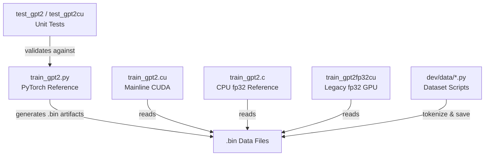

# GPT-2 Training — README.md

# llm.c — GPT-2 Training in Pure C/CUDA

## Overview

llm.c implements LLM pretraining in C and CUDA without any dependency on PyTorch (245MB) or CPython (107MB). The primary focus is reproducing the GPT-2 (124M) and GPT-3 model series. A parallel PyTorch reference implementation in `train_gpt2.py` (derived from [nanoGPT](https://github.com/karpathy/nanoGPT)) is maintained for correctness validation.

The mainline CUDA implementation (`train_gpt2.cu`) currently outperforms PyTorch Nightly by approximately 7%. A clean CPU fp32 reference in roughly 1,000 lines is available in `train_gpt2.c`.

## Architecture



### Key Files

| File | Role |
|---|---|
| `train_gpt2.cu` | Mainline training loop — CUDA, mixed precision, multi-GPU, cuDNN flash attention |
| `train_gpt2.c` | CPU fp32 reference implementation (~1K lines, frozen early checkpoint) |
| `train_gpt2fp32cu` | Single-GPU fp32 CUDA implementation (frozen early checkpoint) |
| `train_gpt2.py` | PyTorch reference — used to generate validation artifacts and as correctness baseline |
| `test_gpt2` / `test_gpt2cu` | Unit tests comparing C/CUDA outputs against PyTorch reference |
| `dev/data/*.py` | Dataset download/tokenization scripts producing `.bin` files |
| `doc/layernorm/layernorm.md` | Step-by-step tutorial for implementing a single GPT-2 layer in C |
| `dev/cuda/` | Library of hand-written, documented CUDA kernels for individual layers |

### Binary Data Artifacts

The `.bin` files consumed by the C training loops are produced by the Python tooling:

- **Model weights** — GPT-2 124M saved in fp32 and bfloat16
- **Debug state** — Small batch of data plus target activations and gradients for unit testing (`gpt2_124M_debug_state.bin`)
- **Tokenizer** — GPT-2 tokenizer data
- **Tokenized datasets** — Stream of `uint16` token IDs preceded by a 1024-byte header

## Getting Started

### Prerequisites

Download the starter pack (model weights, tokenizer, debug state, tokenized TinyShakespeare):

```bash
chmod u+x ./dev/download_starter_pack.sh
./dev/download_starter_pack.sh
```

Or reproduce the artifacts manually:

```bash
pip install -r requirements.txt
python dev/data/tinyshakespeare.py   # tokenizes dataset → .bin files
python train_gpt2.py                 # writes model weights + debug state
```

### Mainline CUDA (Multi-GPU, Mixed Precision)

This is the primary, actively developed path. See [Discussion #481](https://github.com/karpathy/llm.c/discussions/481) for a detailed GPT-2 124M reproduction walkthrough.

```bash
make train_gpt2cu
./train_gpt2cu
```

**Debug builds:** Replace `-O3` with `-g` in the `make` command to enable stepping through code in an IDE (e.g. VS Code).

### Single-GPU fp32 (Legacy)

A frozen checkpoint from early in the project's history. Simpler, more portable, and useful for learning CUDA without the complexity of mixed precision or multi-GPU support.

```bash
./dev/download_starter_pack.sh
make train_gpt2fp32cu
./train_gpt2fp32cu
```

### CPU Only

The earliest checkpoint — a pure C reference implementation. Suitable for finetuning GPT-2 124M on small datasets (e.g. TinyShakespeare) but impractical for training from scratch.

```bash
./dev/download_starter_pack.sh
make train_gpt2
OMP_NUM_THREADS=8 ./train_gpt2
```

Expected output on Apple Silicon M3 Max:

```
[GPT-2]
max_seq_len: 1024
vocab_size: 50257
num_layers: 12
num_heads: 12
channels: 768
num_parameters: 124439808
train dataset num_batches: 1192
val dataset num_batches: 128
num_activations: 73323776
val loss 5.252026
step 0: train loss 5.356189 (took 1452.121000 ms)
step 1: train loss 4.301069 (took 1288.673000 ms)
...
step 39: train loss 3.970751 (took 1323.779000 ms)
val loss 4.107781
```

## Data Pipeline

Dataset scripts in `dev/data/` handle downloading, tokenizing, and writing tokens to `.bin` files readable from C. Example:

```bash
python dev/data/tinyshakespeare.py
```

Output:
```
writing 32,768 tokens to ./dev/data/tinyshakespeare/tiny_shakespeare_val.bin
writing 305,260 tokens to ./dev/data/tinyshakespeare/tiny_shakespeare_train.bin
```

**Binary format:** 1024-byte header followed by a stream of `uint16` token IDs using the GPT-2 tokenizer vocabulary (50,257 tokens).

Additional datasets are available in `dev/data/`.

## Testing

Unit tests validate that the C/CUDA implementations match the PyTorch reference by loading `gpt2_124M_debug_state.bin`, running a forward pass, comparing logits and loss, then performing 10 Adam training iterations and verifying loss agreement.

**CPU:**
```bash
make test_gpt2
./test_gpt2
```

**GPU — fp32 path:**
```bash
make test_gpt2cu PRECISION=FP32 && ./test_gpt2cu
```

**GPU — mixed precision with cuDNN:**
```bash
make test_gpt2cu USE_CUDNN=1 && ./test_gpt2cu
```

A passing test prints `overall okay: 1`.

## Build Configuration

### cuDNN Flash Attention

Flash Attention via cuDNN is available but disabled by default because it increases compile time from seconds to approximately one minute. Enable it at build time:

```bash
make train_gpt2cu USE_CUDNN=1
```

**cuDNN installation** (Ubuntu 22.04, CUDA 12.x):

```bash
wget https://developer.download.nvidia.com/compute/cuda/repos/ubuntu2204/x86_64/cuda-keyring_1.1-1_all.deb
sudo dpkg -i cuda-keyring_1.1-1_all.deb
sudo apt-get update
sudo apt-get -y install libcudnn9-dev-cuda-12
```

**cuDNN frontend** (header-only) must also be available. Clone [cudnn-frontend](https://github.com/NVIDIA/cudnn-frontend) to your home directory or current directory. If placed elsewhere:

```bash
make train_gpt2cu USE_CUDNN=1 CUDNN_FRONTEND_PATH=/path/to/your/cudnn-frontend/include
```

## Multi-GPU Training

Install MPI and NCCL:

```bash
sudo apt install openmpi-bin openmpi-doc libopenmpi-dev
# Install NCCL per https://developer.nvidia.com/nccl/nccl-download
```

Then launch:

```bash
make train_gpt2cu
mpirun -np <number of GPUs> ./train_gpt2cu
```

Or use the scripts under `./scripts/`.

## Multi-Node Training

Three NCCL initialization strategies are supported:

| Method | Mechanism | Example Script |
|---|---|---|
| OpenMPI | Exchanges NCCL ID via MPI | `scripts/multi_node/run_gpt2_124M_mpi.sh` |
| Shared filesystem | NCCL init via shared file | `scripts/multi_node/run_gpt2_124M_fs.sbatch` |
| TCP sockets | NCCL init via TCP | `scripts/multi_node/run_gpt2_124M_tcp.sbatch` |

**Slurm compatibility note:** If your Slurm installation lacks PMIx support (check with `srun --mpi=list`), use the filesystem or TCP approach rather than MPI. Without Slurm, use `mpirun` directly.

## Hyperparameter Sweeps

Example: sweeping learning rates across 4 GPUs on TinyStories using screen sessions:

```bash
#!/bin/bash
learning_rates=(3e-5 1e-4 3e-4 1e-3)
for i in {0..3}; do
    export CUDA_VISIBLE_DEVICES=$i
    screen -dmS "tr$i" bash -c \
      "./train_gpt2cu -i data/TinyStories -v 250 -s 250 -g 144 -l ${learning_rates[$i]} -o stories$i.log"
done
```

Log files can be parsed and plotted using `dev/vislog.ipynb`. Clean up sessions with:

```bash
screen -ls | grep -E "tr[0-3]" | cut -d. -f1 | xargs -I {} screen -X -S {} quit
```

## Project Philosophy

The repository balances two goals:

1. **Education** — The `dev/cuda/` directory hosts a library of hand-written, well-documented CUDA kernels ranging from simple to advanced. Contributions of kernels with different performance tradeoffs are welcome here.

2. **Practical performance** — The mainline code should be fast enough to reproduce large training runs (e.g. GPT-2 1.6B). This means using optimized libraries (cuBLAS, cuBLASLt, CUTLASS, cuDNN) where appropriate. These also serve as expert upper bounds for measuring hand-written kernel efficiency (e.g. "my kernel achieves 80% of cuBLAS throughput").

**Complexity constraint:** The root directory must remain simple and readable. A PR that improves performance by 2% at the cost of 500 lines of complex C code or an exotic dependency will likely be rejected. The `dev/` folder is the appropriate place for experimental or locally complex code.

## Ecosystem

Community ports to other languages and hardware platforms (not maintained in this repo):

| Language / Platform | Repository | Notes |
|---|---|---|
| AMD ROCm | [anthonix/llm.c](https://github.com/anthonix/llm.c) | AMD device support (7900 XTX) |
| C# | [azret/llm.cs](https://github.com/azret/llm.cs) | C# port |
| C# | [nietras/Llm.cs](https://github.com/nietras/Llm.cs) | C# port, easy cross-platform start |
| CUDA C++ | [gevtushenko/llm.c](https://github.com/gevtushenko/llm.c) | Uses [CCCL](https://github.com/NVIDIA/cccl) |
| C++/Eigen | [zhangpiu/llm.cpp](https://github.com/zhangpiu/llm.cpp/tree/master/llmcpp) | CPU/CUDA via Eigen |
| WebGPU C++ | [AnswerDotAI/gpu.cpp](https://github.com/AnswerDotAI/gpu.cpp) | Portable GPU compute, llm.c kernels in WGSL |
| C++ | [GaoYusong/llm.cpp](https://github.com/GaoYusong/llm.cpp) | Single-header `tinytorch.hpp` library |
| Go | [joshcarp/llm.go](https://github.com/joshcarp/llm.go) | Go port |
| Java | [harryjackson/llm.java](https://github.com/harryjackson/llm.java) | Java port |
| Metal | [regrettable-username/llm.metal](https://github.com/regrettable-username/llm.metal) | C/Metal Shading Language |
| Mojo | [dorjeduck/llm.mojo](https://github.com/dorjeduck/llm.mojo) | Mojo port |
| OpenCL | [krrishnarraj/llm.c](https://github.com/krrishnarraj/llm.c) | OpenCL port |
| Rust | [yijunyu/llm.rs](https://github.com/yijunyu/llm.rs) | Rust rewrite, performance parity goal |
| Rust | [ToJen/llm.rs](https://github.com/ToJen/llm.rs) | Rust port |
| Swift | [otabuzzman/llm.swift](https://github.com/otabuzzman/llm.swift) | Swift port |
| Zig | [Saimirbaci/llm.zig](https://github.com/Saimirbaci/llm.zig) | Zig port |
| Habana Gaudi2 | [abhilash1910/llm.tpc](https://github.com/abhilash1910/llm.tpc) | Habana Gaudi2 port |
| Nim | [Vindaar/llm.nim](https://github.com/Vindaar/llm.nim) | Nim port |

## Communication

| Channel | Use For |
|---|---|
| [GitHub Issues](https://github.com/karpathy/llm.c/issues) | Concrete bugs and problems |
| [GitHub PRs](https://github.com/karpathy/llm.c/pulls) | Code contributions |
| [GitHub Discussions](https://github.com/karpathy/llm.c/discussions) | Questions, design discussion |
| `#llmc` on [Zero to Hero Discord](https://discord.gg/3zy8kqD9Cp) | Real-time chat |
| `#llmdotc` on [GPU MODE Discord](https://discord.gg/gpumode) | GPU-focused discussion |

## License

MIT