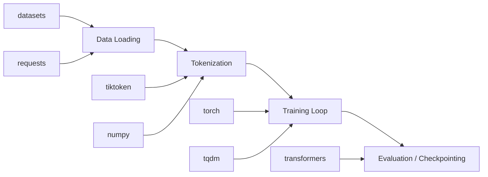

# GPT-2 Training — requirements.txt

# GPT-2 Training — requirements.txt

## Purpose

This file declares the Python package dependencies required to run the GPT-2 training pipeline. It is installed via:

```bash
pip install -r requirements.txt
```

All dependencies are unpinned to specific versions except for `numpy`, which carries an upper-bound constraint. This reflects a trade-off: the project targets a reproducible environment without locking to exact patch versions, while guarding against a known breaking change in a critical dependency.

---

## Dependency Breakdown

### Core Deep Learning

| Package | Role in the Project |
|---------|-------------------|
| **torch** | The primary deep learning framework. Provides tensor operations, autograd, and GPU-accelerated training for the GPT-2 model. |
| **numpy<2** | Foundational numerical computing library. Used directly for data manipulation and indirectly as a dependency of `torch`, `datasets`, and others. The `<2` constraint prevents NumPy 2.x breaking changes (API removals, dtype promotions, C API incompatibilities) from breaking `torch` or `datasets` internals. |

### Tokenization

| Package | Role in the Project |
|---------|-------------------|
| **tiktoken** | OpenAI's fast BPE tokenizer. Provides the same tokenization scheme used by GPT-2/GPT-3/GPT-4, ensuring the training pipeline tokenizes text identically to the original model's byte-pair encoding. |

### Data & Preprocessing

| Package | Role in the Project |
|---------|-------------------|
| **datasets** | Hugging Face Datasets library. Used to load, stream, and preprocess training corpora (e.g., OpenWebText) efficiently with memory-mapped datasets and on-the-fly tokenization. |
| **requests** | HTTP client library. Used by `datasets` internally for downloading remote dataset files, and may be used directly in the project for fetching training data or model checkpoints. |

### Model Utilities

| Package | Role in the Project |
|---------|-------------------|
| **transformers** | Hugging Face Transformers library. Provides reference GPT-2 model configurations, pretrained weight loading, and tokenizer compatibility layers. Used for comparing against or initializing from official GPT-2 checkpoints. |

### Training UX

| Package | Role in the Project |
|---------|-------------------|
| **tqdm** | Progress bar library. Wraps training loops and data loading iterators to display real-time loss, token throughput, and epoch progress during long training runs. |

---

## The `numpy<2` Constraint

NumPy 2.0 introduced backward-incompatible changes including removal of deprecated APIs, changes to dtype promotion rules, and a rewritten C API. Many downstream packages — including versions of `torch` and `datasets` that this project relies on — have not fully adapted to these changes. The `<2` upper bound prevents `pip` from resolving to a NumPy 2.x release that would cause runtime errors or subtle numerical differences.

Once all transitive dependencies support NumPy 2.x, this constraint can be relaxed.

---

## Installation

```bash
# Create and activate a virtual environment first
python -m venv .venv
source .venv/bin/activate

# Install all dependencies
pip install -r requirements.txt
```

For GPU support, ensure a CUDA-compatible version of `torch` is installed. The default `pip install torch` pulls a CUDA-enabled wheel on most platforms, but verify with:

```bash
python -c "import torch; print(torch.cuda.is_available())"
```

If GPU support is missing, install PyTorch with the appropriate CUDA index from [pytorch.org](https://pytorch.org/get-started/locally/) before running the requirements file, or reinstall afterward.

---

## Dependency Map

The following diagram shows how each package supports a specific phase of the GPT-2 training pipeline:



---

## Notes for Contributors

- **Do not add version pins** (e.g., `torch==2.1.0`) unless a specific bug requires it. Range constraints like `numpy<2` are preferred.
- **New dependencies** should be added only when they are imported by the training code. Utility packages already available through transitive dependencies (e.g., `packaging` via `torch`) should not be duplicated here.
- **When upgrading `torch`**, re-test with the current `numpy<2` bound, as PyTorch releases frequently update their NumPy compatibility window.