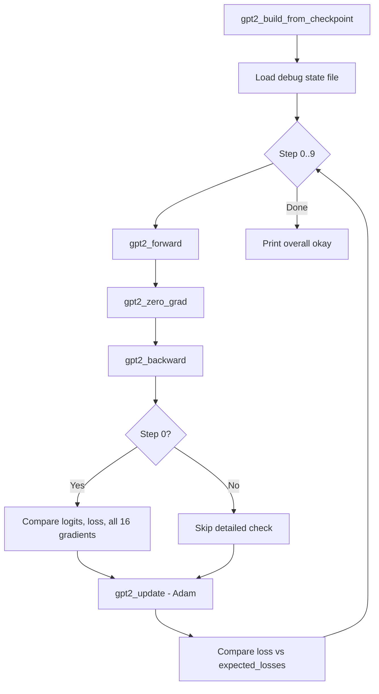

# GPT-2 Training — test_gpt2.c

# test_gpt2.c — GPT-2 C Implementation Verification Harness

## Purpose

This module validates that the C GPT-2 training implementation (`train_gpt2.c`) produces numerically correct results by comparing its outputs against a Python (PyTorch) reference. It serves as the primary correctness gate: if this test passes, the C forward pass, backward pass, and optimizer update are all consistent with the reference implementation.

## How It Works

The test follows a deterministic replay strategy:

1. **Load model** — Build the GPT-2 model from `gpt2_124M.bin` checkpoint via `gpt2_build_from_checkpoint`.
2. **Load reference state** — Read `gpt2_124M_debug_state.bin`, a binary file produced by `train_gpt2.py`, containing pre-recorded inputs, expected logits, expected loss, and expected gradients.
3. **Run 10 training steps** — Each step calls `gpt2_forward`, `gpt2_zero_grad`, `gpt2_backward`, then `gpt2_update` with Adam hyperparameters.
4. **Validate at step 0** — Detailed comparison of logits, loss, and all 16 parameter gradient tensors against the Python reference.
5. **Validate loss trajectory** — All 10 steps compare `model.mean_loss` against hardcoded expected loss values.
6. **Report** — Print per-tensor and per-step results; final `overall okay` verdict.

## Reference State File Format

The file `gpt2_124M_debug_state.bin` must be generated by running `train_gpt2.py`. Its layout:

| Offset | Content | Type | Count |
|--------|---------|------|-------|
| 0 | Header (magic + version + B + T) | `int` | 256 |
| — | Magic number | `int` | 1 (must be `20240327`) |
| — | Version | `int` | 1 (must be `2`) |
| — | Batch size B | `int` | 1 |
| — | Sequence length T | `int` | 1 |
| 1024 | Input token IDs `x` | `int` | B×T |
| 1024+B×T | Target token IDs `y` | `int` | B×T |
| … | Expected logits | `float` | B×T×V |
| … | Expected loss | `float` | 1 |
| … | Expected gradients | `float` | `model.num_parameters` |

If the version is wrong, the test prints a hint to re-run `train_gpt2.py`.

## Key Functions

### `check_tensor`

```c
int check_tensor(float *a, float *b, int n, const char* label);
```

Element-wise comparison of two float tensors with tolerance `2e-2`. Prints the first 5 element pairs for visual inspection, then reports `TENSOR OK` or `TENSOR NOT OK` with the maximum absolute difference. Returns `1` if all elements are within tolerance, `0` otherwise.

**Tolerance rationale:** A relative tolerance of 2% accounts for floating-point differences between the C and Python implementations (different operation ordering, fused operations, etc.) while still catching genuine bugs.

### `main`

Orchestrates the full test. Returns `0` implicitly (no explicit return code based on `allok` — the result is printed to stdout).

## Validation Details

### Step 0 — Full Reference Comparison

At the first training step (before any weight update), three categories are checked:

**Logits** — Compares `model.acts.logits` against the reference. Note the indexing subtlety: the model's logits buffer is sized `B×T×Vp` (padded vocab), but the reference only contains `B×T×V` entries. The comparison loops to `V` and indexes the model buffer with `Vp` strides, correctly skipping padding columns. Tolerance: `1e-2`.

**Loss** — Compares `model.mean_loss` against the scalar reference loss. Tolerance: `1e-2`.

**Gradients** — All 16 parameter gradient tensors are compared via `check_tensor`:

| Index | Gradient | Size | Label |
|-------|----------|------|-------|
| 0 | `grads.wte` | V×C | `dwte` |
| 1 | `grads.wpe` | maxT×C | `dwpe` |
| 2 | `grads.ln1w` | L×C | `dln1w` |
| 3 | `grads.ln1b` | L×C | `dln1b` |
| 4 | `grads.qkvw` | L×3×C×C | `dqkvw` |
| 5 | `grads.qkvb` | L×3×C | `dqkvb` |
| 6 | `grads.attprojw` | L×C×C | `dattprojw` |
| 7 | `grads.attprojb` | L×C | `dattprojb` |
| 8 | `grads.ln2w` | L×C | `dln2w` |
| 9 | `grads.ln2b` | L×C | `dln2b` |
| 10 | `grads.fcw` | L×4×C×C | `dfcw` |
| 11 | `grads.fcb` | L×4×C | `dfcb` |
| 12 | `grads.fcprojw` | L×C×4×C | `dfcprojw` |
| 13 | `grads.fcprojb` | L×C | `dfcprojb` |
| 14 | `grads.lnfw` | C | `dlnfw` |
| 15 | `grads.lnfb` | C | `dlnfb` |

### Steps 0–9 — Loss Trajectory

After each step's weight update, the actual loss is compared against a hardcoded sequence:

```
5.270, 4.060, 3.375, 2.801, 2.315, 1.849, 1.395, 0.999, 0.624, 0.377
```

This monotonically decreasing curve confirms that the Adam optimizer update (`gpt2_update` with `lr=1e-4`, `beta1=0.9`, `beta2=0.999`, `eps=1e-8`, `weight_decay=0.01`) is working correctly over multiple steps.

## Execution Flow



## Relationship to the Codebase

This file is compiled by defining `TESTING` before including `train_gpt2.c`:

```c
#define TESTING
#include "train_gpt2.c"
```

This gives the test direct access to all internal structures (`GPT2`, `ParameterTensors`, `model.acts.logits`, `model.grads`, etc.) without needing a separate header. The `TESTING` macro may also alter behavior in `train_gpt2.c` (e.g., disabling random dropout for deterministic outputs).

The test depends on two external artifacts that must be produced before running:

| File | Generated by | Purpose |
|------|-------------|---------|
| `gpt2_124M.bin` | `train_gpt2.py` | Model weights checkpoint |
| `gpt2_124M_debug_state.bin` | `train_gpt2.py` | Reference inputs, logits, loss, gradients |

## Running the Test

```bash
# First, generate the reference files
python train_gpt2.py

# Then compile and run the test
gcc -O2 -o test_gpt2 test_gpt2.c -lm
./test_gpt2
```

Expected output ends with:

```
overall okay: 1
```

If any check fails, the output identifies which tensor or step failed and the maximum difference observed, allowing targeted debugging.

## Known Design Considerations

- **No explicit exit code:** The process always returns 0 regardless of `allok`. For CI integration, pipe stdout and check for `overall okay: 1`.
- **Logits comparison uses `1e-2` tolerance** while `check_tensor` uses `2e-2`. The stricter tolerance for logits reflects their role as the primary forward-pass output.
- **Padding handling:** The logits comparison correctly accounts for `Vp` (padded vocab size) vs `V` (actual vocab size) in index arithmetic, ensuring padding elements are not compared.
- **Early exit on logits mismatch:** If any logit element exceeds tolerance, both loops break immediately (`bt = B*T`), preventing flood of mismatch output.