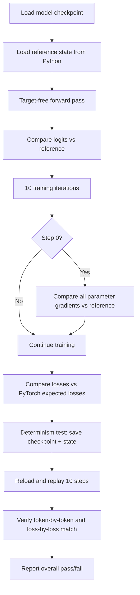

# GPT-2 Training — test_gpt2.cu

# GPT-2 Training — test_gpt2.cu

## Purpose

`test_gpt2.cu` is the correctness and determinism validation suite for the GPT-2 training implementation. It compiles the full training codebase (via `#define TESTING` followed by `#include "train_gpt2.cu"`) and layers verification checks on top of it. The test answers two questions:

1. **Numerical correctness** — Do the CUDA forward pass, backward pass, and optimizer produce results that match a PyTorch reference within acceptable tolerances?
2. **Determinism** — Does saving and restoring a checkpoint reproduce identical training behavior?

A passing test returns `EXIT_SUCCESS` (0); any failure returns `EXIT_FAILURE` (1).

## Test Flow Overview



## Key Components

### `check_tensor`

```c
int check_tensor(float *a, float *b, int n, const char* label, float threshold=1e-0)
```

Compares a calculated tensor `a` against a reference tensor `b`, element by element. Rather than using a flat threshold, it applies a **relative threshold** that accounts for BF16 quantization noise:

```
t_eff = threshold + |b[i]| * epsilon    (epsilon = 0.079, the BF16 machine epsilon)
```

This means larger reference values are allowed proportionally larger absolute differences, which is the expected behavior under reduced-precision arithmetic.

**Outputs:**
- Prints the first 10 element comparisons with OK/NOT OK status
- Prints a summary with max absolute difference, max relative error, and how close the worst element came to the threshold (as a percentage)
- Returns `1` if all elements pass, `0` otherwise

### `FloatParameterTensors`

A CPU-side, float32 mirror of the GPU's parameter tensor struct. Contains the same 16 pointer fields (`wte`, `wpe`, `ln1w`, `ln1b`, `qkvw`, `qkvb`, `attprojw`, `attprojb`, `ln2w`, `ln2b`, `fcw`, `fcb`, `fcprojw`, `fcprojb`, `lnfw`, `lnfb`) but typed as `float*` instead of `floatX*`. Used to hold reference gradients read from the Python-generated state file.

A `static_assert` verifies that the struct size matches `NUM_PARAMETER_TENSORS * sizeof(void*)`, ensuring the layout stays in sync with the training code.

### `float_cpu_malloc_and_point_parameters`

```c
float* float_cpu_malloc_and_point_parameters(FloatParameterTensors* params, size_t* param_sizes)
```

Allocates a single contiguous block of CPU memory for all float32 reference parameters and distributes pointers into the `FloatParameterTensors` struct. This mirrors the GPU-side `malloc_and_point_parameters` but uses `malloc` instead of `cudaMalloc` and stores `float` instead of `floatX`.

## Test Phases in Detail

### Phase 1: Setup and Reference Data Loading

The test loads two files:

| File | Contents |
|------|----------|
| `gpt2_124M.bin` (or `gpt2_124M_bf16.bin`) | Model weights checkpoint |
| `gpt2_124M_debug_state.bin` | Reference inputs, targets, logits, loss, and parameter gradients from PyTorch |

The debug state file has a magic number `20240327` and version `2`. It contains:
- Header (256 ints): magic, version, batch size `B`, sequence length `T`
- Input token IDs: `B * T` ints
- Target token IDs: `B * T` ints
- Expected logits: `B * T * V` floats (unpadded vocab dimension)
- Expected loss: 1 float
- Expected parameter gradients: `num_parameters` floats

### Phase 2: Logit Verification (Target-Free Forward Pass)

A forward pass is run **without targets** (the `y` pointer is not passed to `gpt2_forward` in this call — the model computes logits but not the cross-entropy loss). The output logits are copied to CPU, cast from `floatX` to `float`, and compared element-by-element against the PyTorch reference.

**Tolerance thresholds** depend on precision mode:

| Mode | Logit threshold | Loss threshold |
|------|-----------------|----------------|
| FP32 | `1e-3` | `1e-5` |
| BF16 / FP16 | `25.0` | `0.05` |

The padded vocab columns (`V` through `Vp`) are excluded from comparison. On mismatch, the first failing index is printed and the check aborts early.

### Phase 3: Gradient Verification (Step 0 of Training Loop)

During the first training step, after `gpt2_backward_and_reduce`, all parameter gradients are copied from GPU to CPU, converted from `floatX` to `float` if needed, and compared against the PyTorch reference gradients using `check_tensor`.

Each parameter tensor has its own tolerance, reflecting the varying sensitivity of different parts of the model to reduced-precision arithmetic:

| Parameter | Threshold | Parameter | Threshold |
|-----------|-----------|-----------|-----------|
| `wte` | 5e-1 | `attprojw` | 2e-2 |
| `wpe` | 4e-3 | `attprojb` | 3e-2 |
| `ln1w` | 1e-1 | `ln2w` | 5e-2 |
| `ln1b` | 4e-2 | `ln2b` | 3e-2 |
| `qkvw` | 5e-2 | `fcw` | 3e-2 |
| `qkvb` | 3.5e-2 | `fcb` | 3e-2 |
| `fcprojw` | 2e-2 | `lnfw` | 1e-1 |
| `fcprojb` | 1e-2 | `lnfb` | 2e-2 |

In FP32 mode, all thresholds are tightened to `1e-6`.

**Important caveat** (from the source comments): Stochastic rounding introduces non-deterministic noise, and different GPUs may use different matrix multiplication algorithms. If a threshold is tripped after a code change, it may be acceptable after manual review — tolerances can be relaxed slightly.

### Phase 4: Loss Trajectory Verification

After 10 training steps with AdamW (lr=1e-4, β1=0.9, β2=0.95, eps=1e-8), the per-step losses are compared against these PyTorch reference values:

```
Step  1: 5.270009    Step  6: 1.653923
Step  2: 4.060681    Step  7: 1.168050
Step  3: 3.320085    Step  8: 0.736873
Step  4: 2.717550    Step  9: 0.401021
Step  5: 2.181066    Step 10: 0.187493
```

Losses are rounded to 6 decimal places before comparison (matching PyTorch's print formatting). The comparison uses the same `loss_diff_threshold` as Phase 2.

Gradient norm scaling is applied during the update: if the gradient norm exceeds 1.0, gradients are scaled down by `1/grad_norm`.

### Phase 5: Determinism Verification

This phase verifies that the training pipeline is fully reproducible after a checkpoint save/restore cycle:

1. Save model checkpoint to `test_gpt2cu_model.ckpt` via `gpt2_write_to_checkpoint`
2. Save training state (step counter, model state, dataloader state) to `test_gpt2cu_state.ckpt` via `save_state`
3. Run 10 steps on the validation dataset (`tiny_shakespeare_val.bin`), recording per-step loss and the first input token
4. Free the model, rebuild from the checkpoint, restore the dataloader state
5. Replay the same 10 steps and verify **exact** match on both the first input token and the loss value at every step

Any mismatch is reported as nondeterminism and causes test failure. Intermediate checkpoint files are deleted at the end.

## Command-Line Flags

The test accepts optional flags to control model behavior during the run:

| Flag | Field | Description |
|------|-------|-------------|
| `-w <0\|1>` | `model.use_master_weights` | Enable master weights (FP32 copy) for mixed-precision training |
| `-r <0\|1>` | `model.recompute` | Enable gradient checkpointing / activation recomputation |
| `-ge <0\|1>` | `model.gelu_fusion` | Enable fused GELU kernel |

Flags are parsed in pairs (`argv[i]` is the flag, `argv[i+1]` is the value).

## Relationship to the Codebase

`test_gpt2.cu` is not a unit test in the traditional sense — it is a **full integration test** that exercises the entire training pipeline:

- `gpt2_init_common` / `gpt2_build_from_checkpoint` — model construction
- `gpt2_allocate_state` — activation/gradient memory allocation
- `gpt2_forward` — forward pass
- `gpt2_backward_and_reduce` — backward pass with gradient reduction
- `gpt2_calculate_grad_norm` — gradient norm for scaling
- `gpt2_update` — AdamW optimizer step
- `gpt2_write_to_checkpoint` / `gpt2_build_from_checkpoint` — checkpoint I/O
- `save_state` / `load_state` — full training state persistence
- `DataLoader` — batch iteration and state management
- `common_start` / `common_free` — multi-GPU initialization and teardown

The `#define TESTING` macro is set before including `train_gpt2.cu`, which may alter compilation behavior in the training code (e.g., disabling certain side effects or enabling test-specific code paths).

## Prerequisites

Before running the test, the following files must exist in the working directory:

- `gpt2_124M.bin` (FP32) or `gpt2_124M_bf16.bin` (BF16) — model weights
- `gpt2_124M_debug_state.bin` — reference data generated by `python train_gpt2.py`
- `dev/data/tinyshakespeare/tiny_shakespeare_val.bin` — validation data for the determinism test

If the state file has an incorrect magic number or version, the test prints a hint to re-run the Python training script.