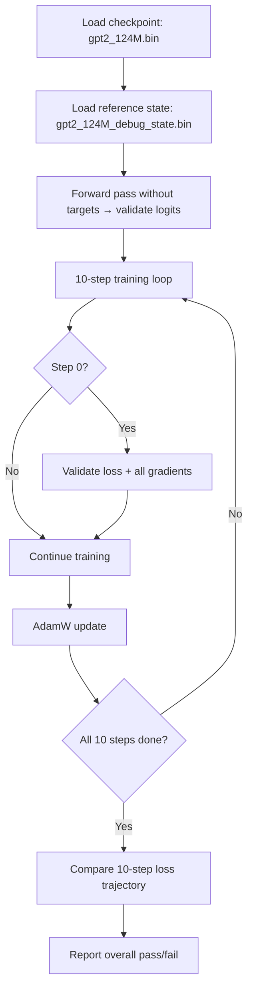

# GPT-2 Training — test_gpt2_fp32.cu

# GPT-2 FP32 Correctness Test (`test_gpt2_fp32.cu`)

## Purpose

This module is a **reference correctness test** that validates the CUDA GPT-2 implementation against PyTorch-generated ground truth. It verifies that the forward pass, backward pass, and optimizer update produce numerically equivalent results to a known-good Python implementation, using a tolerance of **1e-2**.

The test is not a unit test framework — it is a standalone executable that loads pre-computed reference data, runs the CUDA model, compares outputs, and reports pass/fail.

## How It Works

The test includes the entire training implementation by `#define TESTING` before including `train_gpt2_fp32.cu`. This gives it access to all model construction, forward/backward, and optimizer functions while preventing the training binary's own `main()` from conflicting.



## Required Input Files

| File | Contents | Generated By |
|------|----------|-------------|
| `gpt2_124M.bin` | Model weights and config (vocab size, layers, channels, etc.) | `train_gpt2.py` export |
| `gpt2_124M_debug_state.bin` | Reference inputs, expected logits, expected loss, expected gradients | `train_gpt2.py` with debug export |

The debug state file has a 256-int header:
- `state_header[0]` — magic number `20240327`
- `state_header[1]` — version number (must be `2`; re-run `train_gpt2.py` if mismatch)
- `state_header[2]` — batch size `B`
- `state_header[3]` — sequence length `T`

Following the header, the file contains (in order):
1. `x` — input token IDs (`B * T` ints)
2. `y` — target token IDs (`B * T` ints)
3. Expected logits (`B * T * V` floats, where `V` is the unpadded vocab size)
4. Expected loss (1 float)
5. Expected gradients for all parameters (`model.num_parameters` floats)

## Key Design Decisions

### TF32 Disabled

TF32 is **explicitly forced off** regardless of GPU capability:

```c
enable_tf32 = 0; // NOTE: disable TF32 for testing!!!
```

This ensures the CUDA implementation runs in strict FP32 mode, matching the PyTorch reference which also uses standard FP32. Without this, Ampere+ GPUs would use TF32 tensor cores, introducing small numerical differences that could cause false test failures.

### Padded Vocab Handling

The model uses a padded vocab size `Vp` (aligned for performance), but PyTorch reference logits use the actual vocab size `V`. The logit comparison accounts for this by indexing the CUDA output with `bt * Vp + v` while indexing the reference with `bt * V + v`:

```c
float diff = fabsf(expected_logits[bt*V + v] - logits_cpu[i]); // i = bt * Vp + v
```

Only the first `V` columns are compared; padded columns are skipped.

### Bulk Gradient Comparison

At step 0, all parameter gradients are compared in a single bulk operation rather than per-parameter:

```c
cudaMemcpy(calculated_grads_memory, model.grads_memory,
           model.num_parameters * sizeof(float), cudaMemcpyDeviceToHost);
check_tensor(calculated_grads_memory, expected_grads_memory,
             model.num_parameters, "grads");
```

The per-parameter `cudaMemcpy` + `check_tensor` calls are preserved as commented-out code for debugging specific gradient mismatches.

## Test Validation Points

### 1. Logit Correctness (Forward Pass)

A target-free forward pass (`y = NULL`) is run first. The output logits are copied to CPU and compared element-wise against the PyTorch reference. A single mismatch above 1e-2 triggers failure and breaks out of the comparison loop early.

### 2. Loss Correctness (Step 0)

After the first forward pass **with targets**, `model.mean_loss` is compared against the reference loss value.

### 3. Gradient Correctness (Step 0)

After the first backward pass, all parameter gradients are transferred to host and compared against the PyTorch-computed gradients using `check_tensor`.

### 4. Training Trajectory (Steps 0–9)

Ten full training iterations are executed with AdamW (lr=1e-4, β1=0.9, β2=0.999, eps=1e-8, weight_decay=0.01). The loss at each step is compared against hardcoded expected values:

```
Step 0:  5.2700    Step 5:  1.8490
Step 1:  4.0597    Step 6:  1.3947
Step 2:  3.3751    Step 7:  0.9991
Step 3:  2.8008    Step 8:  0.6241
Step 4:  2.3154    Step 9:  0.3765
```

This validates that the optimizer update is numerically correct — a wrong gradient or update rule would cause the loss trajectory to diverge.

## Helper: `check_tensor`

```c
int check_tensor(float *a, float *b, int n, const char* label);
```

Compares two float arrays element-wise with a tolerance of **1e-2**. Prints the first 5 elements (OK/NOT OK with values), then reports `TENSOR OK` or `TENSOR NOT OK`. Returns 1 if all elements match, 0 otherwise.

## Overall Result

The variable `allok` accumulates results from all three validation points (logits, loss at step 0, 10-step loss trajectory). The final line prints:

```
overall okay: 1    # all checks passed
overall okay: 0    # one or more checks failed
```

Note: gradient correctness at step 0 is printed by `check_tensor` but does **not** feed into `allok` — it is informational only. The 10-step loss trajectory serves as the indirect gradient validation.

## Relationship to `train_gpt2_fp32.cu`

This test is a consumer of the training module, not a peer. It accesses:

- **Types**: `GPT2`, `ParameterTensors`
- **Functions**: `gpt2_build_from_checkpoint`, `gpt2_forward`, `gpt2_zero_grad`, `gpt2_backward`, `gpt2_update`, `gpt2_free`, `malloc_and_point_parameters`
- **Macros**: `cudaCheck`, `cublasCheck`, `freadCheck`, `fopenCheck`, `fcloseCheck`, `mallocCheck`
- **Globals**: `cublas_handle`, `cublas_compute_type`

The `#define TESTING` guard in `train_gpt2_fp32.cu` prevents its `main()` from being compiled, allowing this test to provide its own entry point.