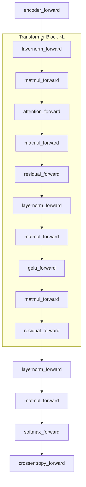

# GPT-2 Training — train_gpt2.c

# GPT-2 Training — `train_gpt2.c`

A clean, minimal, CPU-based reference implementation of GPT-2 training. All transformer layer operations are written as explicit forward/backward C functions with no framework dependencies. OpenMP pragmas provide low-cost parallelism where it matters most (matmul, attention). This file is the algorithmic baseline; optimized variants will derive from it.

## Architecture Overview



The forward pass flows top-to-bottom; the backward pass (`gpt2_backward`) reverses this exactly, calling each layer's `_backward` counterpart in reverse order.

## Dimension Conventions

Throughout the code, these symbols are used consistently:

| Symbol | Meaning | Typical GPT-2 124M value |
|--------|---------|--------------------------|
| `B` | Batch size | 4 |
| `T` | Sequence length | 64 (max 1024) |
| `C` | Channels (hidden dim) | 768 |
| `V` | Vocab size | 50257 |
| `Vp` | Padded vocab size (for alignment) | 50304 |
| `L` | Number of transformer layers | 12 |
| `NH` | Number of attention heads | 12 |
| `hs` | Head size (`C / NH`) | 64 |

All tensors are stored in row-major order. Multi-dimensional indexing follows the pattern `base + dim0 * stride0 + dim1 * stride1 + ...`.

## Layer Operations

Each layer operation is a standalone function pair (`*_forward` / `*_backward`) with no shared state. Gradients are accumulated (+=) into caller-provided buffers, matching the standard autograd convention.

### `encoder_forward` / `encoder_backward`

Token + positional embedding lookup. Adds `wte[token_id]` and `wpe[position]` elementwise.

- **Forward**: `out[b,t,i] = wte[inp[b,t], i] + wpe[t, i]`
- **Backward**: Accumulates `dout` into `dwte` (indexed by token id) and `dwpe` (indexed by position). Multiple occurrences of the same token in the batch will accumulate gradients.

### `layernorm_forward` / `layernorm_backward`

Layer normalization with learnable scale (`weight`) and shift (`bias`). Caches `mean` and `rstd` (reciprocal standard deviation) per `(b,t)` position for the backward pass.

- **Forward**: Normalizes the C-dimensional vector at each `(b,t)`, then applies `out = norm * weight + bias`. Uses `eps = 1e-5f` for numerical stability.
- **Backward**: Computes gradients for `dinp`, `dweight`, `dbias` using the standard three-term decomposition (direct gradient, mean correction, variance correction).

### `matmul_forward` / `matmul_backward`

General matrix multiplication: `out[B,T,OC] = inp[B,T,C] @ weight[OC,C] + bias[OC]`. This is the most time-critical operation.

**Forward optimization**: The non-naive `matmul_forward` collapses the `B` and `T` loops into a single strided loop and tiles it with `LOOP_UNROLL = 8`. This keeps 8 output values in registers while iterating over the shared weight row, enabling FMA generation by the compiler. Falls back to `matmul_forward_naive` when `B*T` is not divisible by 8.

**Backward strategy**: Split into two separate parallel regions for better parallelization:
1. `dinp` computation — parallelized over `(B, T)` with `collapse(2)`
2. `dweight`/`dbias` computation — parallelized over output channels `OC`

### `attention_forward` / `attention_backward`

Multi-head causal self-attention. The only operation that mixes information across time.

- **Input layout**: `inp` is `(B, T, 3C)` — Q, K, V concatenated along the channel dimension. For head `h`, Q starts at offset `h*hs`, K at `h*hs + C`, V at `h*hs + 2*C`.
- **Causal mask**: Positions `t2 > t` are explicitly zeroed in the attention matrix (for debuggability), and the forward loops only iterate `t2 <= t`.
- **Numerical stability**: Max-val subtraction before `expf` in softmax.
- **Scaling**: Dot products are scaled by `1/sqrt(hs)`.

**Backward** reverses the four forward passes in order: value accumulation → softmax → Q·K matmul. The softmax backward uses the identity `∂L/∂pre_ij = Σ_k att_kj * (δ_jk - att_ik) * datt_kj` without needing the pre-attention values.

### `gelu_forward` / `gelu_backward`

Approximate GELU activation: `0.5 * x * (1 + tanh(sqrt(2/π) * (x + 0.044715 * x³)))`.

**Important**: `gelu_backward` is compiled with `#pragma float_control(precise, on)` and `__attribute__((optimize("no-finite-math-only")))` on GCC. This is necessary because `-Ofast` enables finite-math-only assumptions that break the `tanhf`/`coshf` computations in the GELU derivative (see issue #168).

### `residual_forward` / `residual_backward`

Elementwise addition of two streams. Backward copies `dout` into both `dinp1` and `dinp2` (accumulated).

### `softmax_forward` / `crossentropy_forward` / `crossentropy_softmax_backward`

- `softmax_forward`: Computes softmax over the vocab dimension with max-val subtraction. Only processes the first `V` elements; padded positions are explicitly zeroed.
- `crossentropy_forward`: `-log(probs[target])` per position.
- `crossentropy_softmax_backward`: Fused backward through both softmax and cross-entropy. The combined gradient simplifies to `dlogits[i] = (probs[i] - indicator[i==target]) * dloss`, which is more numerically stable than separate backward passes.

## Model Structure

### `GPT2Config`

Holds the immutable hyperparameters read from the checkpoint header:

```c
typedef struct {
    int max_seq_len;        // e.g. 1024
    int vocab_size;         // e.g. 50257
    int padded_vocab_size;  // e.g. 50304 (aligned for efficiency)
    int num_layers;         // e.g. 12
    int num_heads;          // e.g. 12
    int channels;           // e.g. 768
} GPT2Config;
```

### `ParameterTensors`

16 weight tensors stored as a struct of pointers into a single contiguous allocation:

| Field | Shape | Description |
|-------|-------|-------------|
| `wte` | `(Vp, C)` | Token embeddings |
| `wpe` | `(maxT, C)` | Positional embeddings |
| `ln1w`, `ln1b` | `(L, C)` | Pre-attention layer norm |
| `qkvw`, `qkvb` | `(L, 3C, C)` / `(L, 3C)` | QKV projection |
| `attprojw`, `attprojb` | `(L, C, C)` / `(L, C)` | Attention output projection |
| `ln2w`, `ln2b` | `(L, C)` | Pre-MLP layer norm |
| `fcw`, `fcb` | `(L, 4C, C)` / `(L, 4C)` | MLP up-projection |
| `fcprojw`, `fcprojb` | `(L, C, 4C)` / `(L, C)` | MLP down-projection |
| `lnfw`, `lnfb` | `(C)` | Final layer norm |

Layer-specific weights are accessed by offsetting the base pointer: `params.ln1w + l * C`.

### `ActivationTensors`

23 activation buffers, also pointing into a single contiguous allocation. Per-layer activations are indexed by layer offset (e.g., `acts.ln1 + l * B * T * C`). The `preatt` and `att` tensors at `(L, B, NH, T, T)` dominate memory usage for long sequences.

### `GPT2`

The top-level struct tying everything together:

```c
typedef struct {
    GPT2Config config;
    ParameterTensors params;       // model weights
    size_t param_sizes[16];
    float* params_memory;          // contiguous backing allocation
    size_t num_parameters;
    ParameterTensors grads;        // weight gradients
    float* grads_memory;
    float* m_memory, *v_memory;    // AdamW first/second moment estimates
    ActivationTensors acts;        // forward-pass activations
    size_t act_sizes[23];
    float* acts_memory;
    size_t num_activations;
    ActivationTensors grads_acts;  // activation gradients
    float* grads_acts_memory;
    int batch_size, seq_len;       // current B, T (fixed after first forward)
    int* inputs, *targets;         // cached input/target token ids
    float mean_loss;               // -1.0f if no loss computed
} GPT2;
```

## Model Lifecycle

### Initialization

```c
GPT2 model;
gpt2_build_from_checkpoint(&model, "gpt2_124M.bin");
```

Reads the binary checkpoint file (magic `20240326`, version `3`), populates `GPT2Config` from the 7-element header, allocates parameter memory via `malloc_and_point_parameters`, and reads all weights. Activation and gradient memory is **not** allocated yet — it's done lazily on the first forward/backward call.

### Forward Pass

```c
gpt2_forward(&model, inputs, targets, B, T);
```

1. Validates all token IDs are in `[0, V)`.
2. Lazily allocates activation memory on first call. Subsequent calls require the same `B` and `T`.
3. Caches `inputs` and `targets` (needed by `encoder_backward` and `crossentropy_softmax_backward`).
4. Executes the full forward pass through all `L` transformer blocks.
5. If `targets != NULL`, computes cross-entropy loss and sets `model.mean_loss`. Otherwise sets `mean_loss = -1.0f`.

The logits layer reuses `wte` as the output projection (weight tying): `matmul_forward(acts.logits, acts.lnf, params.wte, NULL, B, T, C, Vp)`.

### Backward Pass

```c
gpt2_zero_grad(&model);
gpt2_backward(&model);
```

1. Requires `mean_loss != -1.0f` (i.e., forward was called with targets).
2. Lazily allocates gradient memory on first call, then zeros it.
3. Seeds the backward chain with `dloss = 1/(B*T)` at every position (mean loss gradient).
4. Fuses softmax + cross-entropy backward via `crossentropy_softmax_backward`.
5. Propagates gradients in reverse through the final layer norm, then each transformer block from `l = L-1` down to `0`, and finally the encoder.

**Gradient accumulation pattern**: All backward functions use `+=` to accumulate into gradient buffers. This means `gpt2_zero_grad` must be called before each backward pass to avoid stale gradients.

### Parameter Update

```c
gpt2_update(&model, lr, beta1, beta2, eps, weight_decay, step);
```

Implements AdamW with decoupled weight decay. The `step` parameter (`t`) is 1-indexed for bias correction. Weight decay is applied as `lr * weight_decay * param` (added to the Adam step, not to the gradient).

### Cleanup

```c
gpt2_free(&model);
```

Frees all contiguous memory blocks (`params_memory`, `grads_memory`, `m_memory`, `v_memory`, `acts_memory`, `grads_acts_memory`) plus the cached `inputs` and `targets` arrays. All pointer fields in `ParameterTensors` and `ActivationTensors` become dangling — do not access them after free.

## Checkpoint File Format

The binary checkpoint has this layout:

| Offset | Size | Content |
|--------|------|---------|
| 0 | 256 × `int` | Header: `[magic, version, maxT, V, L, NH, C, Vp, ...]` |
| 1024 | `num_parameters` × `float` | All model weights, in `ParameterTensors` field order |

Magic number: `20240326`. Version: `3`. If you get a version mismatch, re-run the Python export script (`train_gpt2.py`).

## Training Loop

The `main()` function demonstrates the complete training workflow:

1. **Model loading**: `gpt2_build_from_checkpoint` from `gpt2_124M.bin`
2. **Data loading**: Prefers TinyShakespeare if available, falls back to TinyStories. Uses `DataLoader` from `llmc/dataloader.h` with `B=4, T=64`.
3. **Validation**: Every 10 steps, runs 5 batches through the val loader (forward only) and reports mean loss.
4. **Generation**: Every 20 steps, does autoregressive sampling for 64 tokens starting from the EOT token. Uses `sample_mult` for categorical sampling from the probability distribution. Note: generation re-runs the full forward pass for each token — this is intentionally simple, not optimized.
5. **Training step**: `dataloader_next_batch` → `gpt2_forward` → `gpt2_zero_grad` → `gpt2_backward` → `gpt2_update` with `lr=1e-4, beta1=0.9, beta2=0.999, eps=1e-8, weight_decay=0.0`.

## Utilities

### Random Number Generation

- `random_u32`: xorshift* PRNG — fast, no external dependency.
- `random_f32`: Returns a float in `[0, 1)` by taking the upper 24 bits of `random_u32`.
- `sample_mult`: Categorical sampling from a probability vector using a coin flip.

### Memory Helpers

- `fill_in_parameter_sizes` / `fill_in_activation_sizes`: Populate size arrays from config.
- `malloc_and_point_parameters` / `malloc_and_point_activations`: Single `malloc` + pointer arithmetic to set up the struct-of-pointers layout. Returns the base pointer for later `free`.

## External Dependencies

| Header | Functions Used |
|--------|---------------|
| `llmc/utils.h` | `fopenCheck`, `freadCheck`, `fcloseCheck`, `fseekCheck`, `mallocCheck` |
| `llmc/tokenizer.h` | `tokenizer_init`, `tokenizer_decode`, `tokenizer_free`, `safe_printf` |
| `llmc/dataloader.h` | `dataloader_init`, `dataloader_reset`, `dataloader_next_batch`, `dataloader_free` |

Compile with `-DOMP` and link `-fopenmp` to enable OpenMP parallelization. Without it, the `#ifdef OMP` guard disables `omp.h` and all pragmas degrade to serial execution.

## Testing

When the macro `TESTING` is defined, the `main()` function is excluded, allowing `test_gpt2.c` to link against the layer functions and model API directly. All public functions (`gpt2_build_from_checkpoint`, `gpt2_forward`, `gpt2_backward`, `gpt2_update`, `gpt2_zero_grad`, `gpt2_free`, and all individual layer forward/backward functions) are accessible for unit testing.