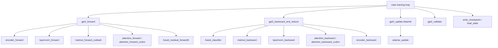

# GPT-2 Training — train_gpt2.cu

# GPT-2 Training — `train_gpt2.cu`

## Overview

This module implements the full training loop for GPT-2 and GPT-3 family transformer models, written in CUDA for maximum GPU performance. It covers model construction, forward/backward passes, AdamW optimization, checkpointing, multi-GPU training (ZeRO-1), validation, inference sampling, and HellaSwag evaluation.

The design philosophy is **single-allocation, pointer-arithmetic memory layout**: all parameter tensors and all activation tensors are each allocated as one contiguous `cudaMalloc` block, with individual tensor pointers set to offsets within that block. This minimizes allocation overhead and enables efficient device-to-disk I/O.

---

## Architecture



---

## Key Data Structures

### `GPT2Config`

Holds the immutable model hyperparameters:

| Field | Description | Example (GPT-2 124M) |
|---|---|---|
| `max_seq_len` | Maximum context length | 1024 |
| `vocab_size` | Actual vocabulary size | 50257 |
| `padded_vocab_size` | Padded to multiple of 128 for kernel efficiency | 50304 |
| `num_layers` | Transformer block count (L) | 12 |
| `num_heads` | Attention head count (NH) | 12 |
| `channels` | Hidden dimension (C) | 768 |

### `ParameterTensors`

Contains 16 individual `floatX*` pointers into a single contiguous GPU allocation. The tensors, in memory order:

| Index | Name | Shape | Notes |
|---|---|---|---|
| 0 | `wte` | (Vp, C) | Token embeddings (weight-tied with classifier) |
| 1 | `wpe` | (maxT, C) | Position embeddings |
| 2 | `ln1w` | (L, C) | LayerNorm 1 weights |
| 3 | `ln1b` | (L, C) | LayerNorm 1 biases |
| 4 | `qkvw` | (L, 3C, C) | QKV projection weights |
| 5 | `qkvb` | (L, 3C) | QKV projection biases |
| 6 | `attprojw` | (L, C, C) | Attention output projection weights |
| 7 | `attprojb` | (L, C) | Attention output projection biases |
| 8 | `ln2w` | (L, C) | LayerNorm 2 weights |
| 9 | `ln2b` | (L, C) | LayerNorm 2 biases |
| 10 | `fcw` | (L, 4C, C) | MLP up-projection weights |
| 11 | `fcb` | (L, 4C) | MLP up-projection biases |
| 12 | `fcprojw` | (L, C, 4C) | MLP down-projection weights |
| 13 | `fcprojb` | (L, C) | MLP down-projection biases |
| 14 | `lnfw` | (C) | Final LayerNorm weight |
| 15 | `lnfb` | (C) | Final LayerNorm bias |

### `ActivationTensors`

Contains 21 tensors for the forward/backward pass. Sizes depend on batch size B, sequence length T, and the `recompute` setting. Key tensors:

| Name | Shape | Notes |
|---|---|---|
| `encoded` | (B, T, C) | Output of token+position embedding |
| `ln1` | (L, B, T, C) | LayerNorm 1 output (NULL if recompute ≥ 2) |
| `ln1_mean`, `ln1_rstd` | (L, B, T) | LayerNorm 1 statistics |
| `atty` | (L, B, T, C) | Attention output values |
| `att` | (L, B, NH, T, T) or (L, B, NH, T) | Attention weights (smaller with cuDNN) |
| `residual2` | (L, B, T, C) | Residual after attention + LN2 |
| `ln2` | (L, B, T, C) | LayerNorm 2 output (NULL if recompute ≥ 2) |
| `fch` | (L, B, T, 4C) | Pre-GELU MLP activations |
| `fch_gelu` | (L, B, T, 4C) or (B, T, 4C) | Post-GELU (shared buffer if recompute ≥ 1) |
| `residual3` | (L, B, T, C) | Residual after MLP |
| `lnf` | (B, T, C) | Final LayerNorm output |
| `output` | (B, T, max(3C, NH·T, Vp)) | Multi-purpose scratch: logits / QKV scratch / grad buffer |
| `scratch_bt4c`, `scratch_btc` | (B, T, 4C) / (B, T, C) | Backward pass scratch buffers |

### `GPT2`

The top-level struct that owns all state:

- `config` — Model hyperparameters
- `params` / `grads` — `ParameterTensors` pointing into contiguous GPU memory
- `acts` — `ActivationTensors` pointing into contiguous GPU memory
- `m_memory`, `v_memory` — AdamW first/second moment estimates (always FP32)
- `master_weights` — Optional FP32 master copy of parameters (for mixed-precision training)
- `inputs`, `targets` — Current batch data on GPU
- `mean_loss` — Loss after the most recent backward pass
- `rng_state` — RNG state for stochastic rounding
- `recompute` — Activation recomputation level (0/1/2)
- `gelu_fusion` — cuBLASLt GELU fusion level (0/1/2)

---

## Model Construction

### From a checkpoint file: `gpt2_build_from_checkpoint`

Reads a 256-int header (magic `20240326`, version 3=FP32 or 5=BF16, then config fields), allocates parameter memory, and loads weights from disk to GPU via `file_to_device`.

### From a descriptor string: `gpt_build_from_descriptor`

Supports three formats:

| Format | Example | Meaning |
|---|---|---|
| `dX` (legacy) | `d12` | GPT-2 with X layers |
| `gpt2:dX` | `gpt2:d48` | GPT-2 with X layers |
| `gpt3:cX` | `gpt3:c768` | GPT-3 with X channels |

GPT-2 models are keyed by layer depth; GPT-3 models by channel count. Both use `vocab_size=50257` and `padded_vocab_size=50304`. Weights are initialized on CPU following the GPT-2 scheme: weights ~N(0, 0.02), biases = 0, residual projections scaled by `0.02/√(2L)`.

---

## Forward Pass: `gpt2_forward`

Executes the full transformer forward pass, producing logits in `acts.output`.

**Per-layer operations:**

1. **QKV projection**: `matmul_forward_cublaslt` on `ln1` output → `qkvr` (or scratch buffer)
2. **Attention**: `attention_forward` (custom CUDA) or `attention_forward_cudnn` → `atty`
3. **Output projection**: `matmul_forward_cublaslt` on `atty` → scratch
4. **Residual + LN2 fusion**: `fused_residual_forward5` combines residual add + LayerNorm 2 → `residual2`, `ln2`
5. **MLP up + GELU**: `matmul_forward_cublaslt` with optional GELU fusion → `fch_gelu`
6. **MLP down**: `matmul_forward_cublaslt` → scratch
7. **Residual + next LN1/final LN fusion**: `fused_residual_forward5` → `residual3`, next `ln1` or `lnf`

After all layers: final classifier matmul `lnf × wte^T` → logits in `acts.output`.

**Key design choices:**
- The first LayerNorm is computed outside the loop (not fused with a residual).
- `acts.output` serves as a scratch buffer during the layer loop (for QKV, attention projection, MLP projection) and only holds the final logits at the end.
- When `T < model->seq_len`, the attention buffer must be zeroed because the custom attention kernel assumes zero-initialized memory for unused positions.

---

## Backward Pass: `gpt2_backward_and_reduce`

Called once per micro-step within the gradient accumulation loop. Supports `grad_accum_steps` micro-batches before the optimizer step.

**Gradient accumulation flow:**

1. On `micro_step == 0`: zero `grads_memory` and `acts.losses`
2. `fused_classifier` computes cross-entropy loss and the initial gradient of logits (scaled by `1/(B·T·grad_accum_steps)`)
3. Classifier matmul backward → `dlogits` in `scratch_bt4c`, `grads.wte` accumulated
4. Final LayerNorm backward → `dresidual` in `scratch_btc`
5. **Per layer (L-1 → 0):**
   - If `recompute ≥ 1`: recompute GELU from `fch`
   - MLP down-projection backward → `grads.fcprojw`, `grads.fcprojb`, `dl_bt4c`
   - If `recompute ≥ 2`: recompute `ln2` from `residual2`
   - MLP up-projection backward → `grads.fcw`, `grads.fcb`
   - LN2 backward (accumulates into `dresidual`)
   - Attention projection backward → `grads.attprojw`, `grads.attprojb`
   - Attention backward → `dl_bt4c`
   - If `recompute ≥ 2`: recompute `ln1` from residual
   - QKV projection backward → `grads.qkvw`, `grads.qkvb`
   - LN1 backward (accumulates into `dresidual`)
   - On `last_step`: async multi-GPU gradient reduce for this layer's parameters
6. `encoder_backward` → `grads.wte`, `grads.wpe`
7. On `last_step`: reduce loss across GPUs, reduce non-layer gradients (`wte`, `wpe`, `lnfw`, `lnfb`)

**Scratch buffer reuse:** After the final LayerNorm backward, the last `residual3` buffer is no longer needed and is reused as `dl_btc` — a generic scratch for intermediate gradients within each layer's backward pass.

---

## Optimizer Update: `gpt2_update`

Implements AdamW with optional FP32 master weights and stochastic rounding.

**Weight decay policy:** Only 2D weight tensors are decayed (indices 0, 1, 4, 6, 10, 12). All biases and LayerNorm parameters are excluded.

**ZeRO-1 integration:** Each GPU owns a shard of the optimizer states (`m_memory`, `v_memory`, `master_weights`). After updating its local shard, an `ncclAllGather` distributes the updated parameter shards to all ranks.

**Master weights:** When enabled, the optimizer updates FP32 master weights and stochastically rounds back to `floatX`. The RNG state is saved before each update (`rng_state_last_update`) so that weights can be identically re-rounded when resuming from a checkpoint.

---

## Activation Recomputation

Controlled by the `recompute` flag, trading memory for compute:

| Value | Strategy | Memory savings |
|---|---|---|
| 0 | Store all activations | None |
| 1 | Recompute GELU during backward; share `fch_gelu` buffer across layers | ~L × B × T × 4C elements |
| 2 | Additionally recompute both LayerNorms during backward; share `lnf` buffer for all LN outputs | ~2L × B × T × C elements more |

At `recompute ≥ 2`, `acts.ln1` and `acts.ln2` are allocated as NULL, and `acts.lnf` is used as a single buffer that each LayerNorm forward recomputes into on demand during the backward pass.

---

## Checkpointing and Resume

### Checkpoint format

A checkpoint consists of three files per step:

1. **`model_XXXXX.bin`** (rank 0 only) — Model weights via `gpt2_write_to_checkpoint`
   - 256-int header: magic `20240326`, version, config fields
   - Raw parameter bytes (device → disk via `device_to_file`)

2. **`state_XXXXX_YYYYY.bin`** (per rank) — Optimizer + dataloader state via `save_state`
   - 256-int header: magic `20240527`, version, rank info, step, RNG states, dataloader position
   - AdamW `m_memory`, `v_memory` (FP32)
   - Optional `master_weights` (FP32)
   - Dataloader shuffle state (shard indices, intra-shard indices, RNG)

3. **`DONE_XXXXX`** (rank 0 only) — Empty sentinel file signaling the checkpoint is complete

### Resume logic

When `-y 1` is set, `find_max_step` scans the output directory for the highest step with a `DONE_*` file. The model weights are loaded, then `load_state` restores optimizer states. If master weights are present, `gpt2_update` is called with `init_from_master_only=true` to re-round the FP32 masters into the model's `floatX` parameters using the saved RNG state, ensuring bit-exact resumption.

### Checkpoint retention

`-nk N` keeps at most N recent checkpoints on disk. `-nm M` marks every M-th step as a "major" checkpoint that is never deleted.

---

## Multi-GPU Training

### Configuration

Set via CLI flags `-pn`, `-pr`, `-pg` and initialized with `multi_gpu_config_init`. Supports NCCL initialization methods: `mpi`, `tcp`, `fs`.

### ZeRO Stage 1

When `-z 1` is enabled:
- Optimizer states (`m`, `v`, `master_weights`) are sharded across ranks
- Gradients are reduced via `ncclReduceScatter` during backward (each rank only keeps its shard)
- After `gpt2_update`, updated parameter shards are gathered via `ncclAllGather`
- `gpt2_calculate_grad_norm` only sums squared norms over local shards, then reduces across GPUs

### Gradient reduction

During `gpt2_backward_and_reduce`, per-layer gradient reductions are launched asynchronously on the last micro-step. Non-layer parameters (`wte`, `wpe`, `lnfw`, `lnfb`) are reduced after the loop. This overlaps communication with computation where possible.

---

## Validation and Evaluation

### `gpt2_validate`

Runs a forward pass then computes per-token cross-entropy losses via `fused_classifier` (with `dloss = 1/(B·T)`). Returns the mean loss and populates `model->cpu_losses` with per-token losses for downstream evals (e.g., HellaSwag).

### HellaSwag

When `-h 1` is set and the HellaSwag data file exists, `evalloader_next_batch` provides context+completion pairs. Per-token losses from `gpt2_validate` are compared via `evalloader_stat_losses` to determine if the correct completion has the lowest normalized loss.

---

## Inference Sampling

Every `sample_every` steps, rank 0 generates text autoregressively:

1. Initialize `gen_tokens` with the EOT token
2. For each position `t = 1..genT-1`:
   - Call `gpt2_forward` with `B=1` and a T rounded up to a multiple of 256 (for cuDNN algorithm stability)
   - Copy logits at position `t-1` to CPU
   - Sample via `sample_softmax` with a random coin
   - Decode and print the token

**Note:** There is no KV cache, so each generation step recomputes the full sequence. This is intentionally simple — generation is only for qualitative monitoring, not production inference.

---

## Training Loop Flow

```
for step = 0..train_num_batches:
    ├── Validation loss (every val_loss_every steps)
    ├── HellaSwag eval (every val_loss_every steps, if enabled)
    ├── Text generation (every sample_every steps, rank 0 only)
    ├── Checkpoint write (every checkpoint_every steps)
    ├── TRAINING STEP:
    │   ├── for micro_step = 0..grad_accum_steps-1:
    │   │   ├── dataloader_next_batch
    │   │   ├── gpt2_forward
    │   │   └── gpt2_backward_and_reduce
    │   ├── Outlier detection (loss z-score, grad norm z-score)
    │   ├── Learning rate from scheduler
    │   ├── Gradient norm calculation + clipping (max norm = 1.0)
    │   └── gpt2_update (AdamW)
    └── Timing, MFU estimation, logging
```

### Gradient accumulation

`total_batch_size` determines how many tokens constitute one optimizer step. The number of micro-steps is:

```
grad_accum_steps = total_batch_size / (B × T × num_processes)
```

Gradients and losses accumulate with `+=` across micro-steps, then are averaged by the `1/grad_accum_steps` scaling inside `fused_classifier`.

### Outlier detection

`-sl Z` and `-sg Z` flags enable z-score-based skipping of optimizer updates when the loss or gradient norm is statistically anomalous. The `OutlierDetector` maintains a running mean/variance and computes z-scores online.

### MFU estimation

`gpt2_estimate_mfu` computes Model FLOPs Utilization as:

```
flops_per_token = 6N + 6·L·C·T
flops_achieved  = flops_per_token × num_tokens / dt
mfu             = flops_achieved / peak_flops
```

Where `N` is the total parameter count and peak FLOPs are looked up from `get_flops_promised` based on the GPU model and precision mode.

---

## CLI Reference

| Flag | Default | Description |
|---|---|---|
| `-i` | `tiny_shakespeare_train.bin` | Training data pattern |
| `-j` | `tiny_shakespeare_val.bin` | Validation data pattern |
| `-e` | `gpt2_124M_bf16.bin` | Model file or descriptor |
| `-o` | NULL | Output log directory |
| `-b` | 4 | Micro batch size (per GPU) |
| `-t` | 1024 | Sequence length |
| `-d` | B×T×num_processes | Total batch size |
| `-l` | 3e-4 | Learning rate |
| `-u` | 0 | Warmup iterations |
| `-q` | 1.0 | Final LR fraction |
| `-c` | 0.0 | Weight decay |
| `-k` | cosine | LR scheduler type |
| `-x` | -1 | Max steps (-1 = 1 epoch) |
| `-v` | 20 | Val loss evaluation frequency |
| `-m` | 20 | Max val batches |
| `-s` | 20 | Sample generation frequency |
| `-g` | 64 | Generation length |
| `-r` | 1 | Recompute level (0/1/2) |
| `-w` | 1 | Keep FP32 master weights |
| `-z` | 0 | ZeRO stage (0/1) |
| `-n` | 0 | Checkpoint frequency |
| `-nk` | 0 | Max checkpoints to keep |
| `-nm` | 0 | Major checkpoint interval |
| `-y` | 0 | Resume from checkpoint |
| `-a` | 0 | Overfit single batch |
| `-h` | 0 | Run HellaSwag eval |
| `-f` | 1 | Enable TF32 override |
| `-ge` | 0 | GELU fusion level |
| `-sl` | 0.0 | Skip-update loss z-score threshold |
| `-sg` | 0.0 | Skip-update grad norm z-score threshold |
| `-pn` | 1 | Number of processes |
| `-pr` | 0 | Process rank |
| `-pg` | 8 | GPUs per node |

---

## Memory Layout and Allocation

All GPU memory is allocated in a few large contiguous blocks:

1. **Parameters** — `malloc_and_point_parameters` allocates one block and sets 16 pointers at offsets
2. **Gradients** — Same layout as parameters, allocated lazily in `gpt2_allocate_state`
3. **Activations** — `malloc_and_point_activations` allocates one block (zeroed via `cudaMemset`), sets 21 pointers; sizes depend on `recompute` level
4. **Optimizer state** — `m_memory`, `v_memory`, `master_weights` allocated via `cudaMallocConditionallyManaged` (falls back to managed memory on OOM)

`gpt2_allocate_state` is called once with the first (B, T) and prints memory diagnostics including estimated maximum batch size.

---

## Precision Modes

Controlled at compile time via `PRECISION_MODE`:

| Mode | `floatX` | Checkpoint version | Notes |
|---|---|---|---|
| `PRECISION_FP32` | `float` | 3 | TF32 enabled by default on SM80+ |
| `PRECISION_BF16` | `__nv_bfloat16` | 5 | Master weights in FP32 recommended |
| `PRECISION_FP16` | `half` | Not supported | Cannot load from checkpoint |

When using BF16 with master weights (`-w 1`), the optimizer updates FP32 copies and stochastically rounds back to BF16, matching the approach used in production training of large models.