# GPT-2 Training — train_gpt2_fp32.cu

# GPT-2 Training — `train_gpt2_fp32.cu`

A self-contained GPT-2 (124M parameter) trainer written in raw CUDA with custom kernels for every operation. No deep learning framework is used — the forward pass, backward pass, optimizer, and loss computation are all implemented from scratch using CUDA kernels and cuBLAS.

## Architecture Overview

```mermaid
graph TD
    subgraph "Training Loop"
        DL[DataLoader] --> FWD[gpt2_forward]
        FWD --> ZG[gpt2_zero_grad]
        ZG --> BWD[gpt2_backward]
        BWD --> UPD[gpt2_update / AdamW]
    end

    subgraph "Forward Pass (per layer)"
        ENC[encoder_forward] --> LN1[layernorm_forward]
        LN1 --> MM1[matmul_forward QKV]
        MM1 --> ATT[attention_forward]
        ATT --> MM2[matmul_forward attproj]
        MM2 --> RES1[residual_forward]
        RES1 --> LN2[layernorm_forward]
        LN2 --> MM3[matmul_forward fc]
        MM3 --> GELU[gelu_forward]
        GELU --> MM4[matmul_forward fcproj]
        MM4 --> RES2[residual_forward]
    end

    subgraph "Backward Pass (per layer, reverse)"
        B_MM4[matmul_backward fcproj] --> B_GELU[gelu_backward]
        B_GELU --> B_MM3[matmul_backward fc]
        B_MM3 --> B_LN2[layernorm_backward +=]
        B_LN2 --> B_MM2[matmul_backward attproj]
        B_MM2 --> B_ATT[attention_backward]
        B_ATT --> B_MM1[matmul_backward QKV]
        B_MM1 --> B_LN1[layernorm_backward +=]
    end

    FWD --> FC[fused_classifier3]
    FC --> BWD
```



## Model Definition

### `GPT2Config`

Holds the hyperparameters read from the checkpoint file header:

| Field | Description | GPT-2 124M Value |
|---|---|---|
| `max_seq_len` | Maximum sequence length | 1024 |
| `vocab_size` | Vocabulary size | 50257 |
| `padded_vocab_size` | Vocab padded to multiple of 128 | 50304 |
| `num_layers` | Transformer block count | 12 |
| `num_heads` | Attention heads per block | 12 |
| `channels` | Hidden dimension | 768 |

### `GPT2` struct

The top-level model container. Owns all GPU memory and tracks training state:

- **`params` / `params_memory`** — Model weights as a single contiguous GPU allocation, with `ParameterTensors` pointing into it.
- **`grads` / `grads_memory`** — Weight gradients, same layout. Allocated lazily on first backward.
- **`m_memory` / `v_memory`** — AdamW first/second moment buffers. Allocated lazily on first update.
- **`acts` / `acts_memory`** — Forward-pass activations. Allocated lazily on first forward with the given `(B, T)`.
- **`grads_acts` / `grads_acts_memory`** — Backward-pass activation gradients. Only 3 tensors (see [Memory Strategy](#memory-strategy)).
- **`inputs` / `targets`** — GPU-side copies of the current batch's token IDs.
- **`cpu_losses`** — Pinned host memory for reading per-position losses back to CPU.
- **`mean_loss`** — Set to `-1.0f` when no loss has been computed; otherwise the mean cross-entropy over `(B, T)`.

### Parameter Layout (`ParameterTensors`)

All 16 parameter tensors are packed into one allocation. Per-layer weights are indexed by offsetting with `l * <stride>`:

| Index | Tensor | Shape | Per-layer stride |
|---|---|---|---|
| 0 | `wte` | `(Vp, C)` | — |
| 1 | `wpe` | `(maxT, C)` | — |
| 2 | `ln1w` | `(L, C)` | `C` |
| 3 | `ln1b` | `(L, C)` | `C` |
| 4 | `qkvw` | `(L, 3C, C)` | `3*C*C` |
| 5 | `qkvb` | `(L, 3C)` | `3*C` |
| 6 | `attprojw` | `(L, C, C)` | `C*C` |
| 7 | `attprojb` | `(L, C)` | `C` |
| 8 | `ln2w` | `(L, C)` | `C` |
| 9 | `ln2b` | `(L, C)` | `C` |
| 10 | `fcw` | `(L, 4C, C)` | `4*C*C` |
| 11 | `fcb` | `(L, 4C)` | `4*C` |
| 12 | `fcprojw` | `(L, C, 4C)` | `C*4*C` |
| 13 | `fcprojb` | `(L, C)` | `C` |
| 14 | `lnfw` | `(C,)` | — |
| 15 | `lnfb` | `(C,)` | — |

### Activation Layout (`ActivationTensors`)

21 tensors stored for the forward pass. Layer-indexed activations use `l * B*T*C` (or similar) offsets. The `output` tensor serves triple duty:

1. **During transformer blocks** — scratch buffer for QKV input `(B, T, 3C)`, pre-attention scores `(B, NH, T, T)`, and attention×value output `(B, NH, T, HS)`.
2. **After final layernorm** — logits `(B, T, Vp)`.
3. **After `fused_classifier3`** — logit *gradients* (overwritten in-place).

Its allocation size is `B * T * max(3C, NH*T, Vp)` to accommodate all three uses.

## Memory Strategy

The backward pass is designed to minimize GPU memory:

- **Forward activations** are stored per-layer (e.g., `ln1` has `L * B * T * C` entries).
- **Backward activation gradients** reuse a single set of 3 buffers across all layers:

| Buffer | Shape | Purpose |
|---|---|---|
| `bt4c` | `(B, T, 4C)` | Gradient workspace for 4C-wide tensors (fch, QKV) |
| `preatt` | `(B, NH, T, T)` | Pre-softmax attention gradients |
| `residual3` | `(B, T, C)` | Residual stream gradient (carried across layers) |

Additionally, the backward pass reuses forward activation memory that is no longer needed:
- `acts.lnf` is reused as a `B×T×C` gradient buffer (`dl_btc`).
- `l_atty` and `l_fch` are reused as scratch buffers inside the attention backward.

## Gradient Accumulation Semantics

A critical design choice noted in the source:

- **Parameter gradients** use `+=` (accumulate), enabling gradient accumulation across multiple micro-batches before an optimizer step.
- **Activation gradients** use `=` (overwrite), which is faster because it avoids a read-before-write.
- **Exception**: The residual stream gradient must accumulate contributions from both the attention and MLP sub-blocks. This is handled by `layernorm_backward`, which does `+=` into `dresidual`, correctly merging the two gradient paths.

## Lifecycle

### `gpt2_build_from_checkpoint`

Reads a binary checkpoint file (magic `20240326`, version `3`). The header contains 5 ints of config, followed by `num_parameters` floats of weights. Allocates GPU memory for parameters only; all other buffers are allocated lazily.

### `gpt2_forward`

```
gpt2_forward(model, inputs, targets, B, T)
```

Runs the full forward pass. On first call, allocates activation memory for the given `(B, T)` and pins that shape — subsequent calls must use the same dimensions.

**Forward pass per layer:**
1. `layernorm_forward` — LayerNorm on residual stream
2. `matmul_forward` — Project to Q, K, V (output channels = 3C)
3. `attention_forward` — Multi-head self-attention (permute → batched GEMM → softmax → batched GEMM → unpermute)
4. `matmul_forward` — Attention output projection
5. `residual_forward` — Add attention output to residual
6. `layernorm_forward` — Second LayerNorm
7. `matmul_forward` — FC up-projection (C → 4C)
8. `gelu_forward` — GELU activation
9. `matmul_forward` — FC down-projection (4C → C)
10. `residual_forward` — Add MLP output to residual

After all layers: final LayerNorm → logits matmul → `fused_classifier3` (if targets provided).

### `gpt2_backward`

Must be called after a forward pass with targets (enforced by `mean_loss != -1.0f`). On first call, allocates gradient and AdamW buffers.

**Backward pass per layer (reverse order):**
1. `matmul_backward` — fcproj
2. `gelu_backward`
3. `matmul_backward` — fc
4. `layernorm_backward` — **`+=` into `dresidual`** (merges MLP gradient)
5. `matmul_backward` — attproj
6. `attention_backward` — unpermute_backward → batched GEMMs → softmax_backward → batched GEMMs → permute_backward
7. `matmul_backward` — QKV
8. `layernorm_backward` — **`+=` into `dresidual`** (merges attention gradient)

After all layers: `matmul_backward` for final logits → `layernorm_backward` for final LN → `encoder_backward` for embedding gradients.

### `gpt2_update`

Runs the AdamW optimizer via a single kernel (`adamw_kernel2`). Uses an optimized `lerp` for the momentum and RMSprop updates:

```
m = lerp(grad, m, beta1)     // equivalent to m = beta1 * m + (1 - beta1) * grad
v = lerp(grad*grad, v, beta2) // equivalent to v = beta2 * v + (1 - beta2) * grad^2
param -= lr * (m_hat / (sqrt(v_hat) + eps) + weight_decay * param)
```

### `gpt2_zero_grad`

Memsets both `grads_memory` and `grads_acts_memory` to zero. Must be called before `gpt2_backward` to avoid accumulating stale gradients.

### `gpt2_free`

Releases all GPU allocations and pinned host memory.

## CUDA Kernels

### Encoder

| Kernel | Direction | Notes |
|---|---|---|
| `encoder_forward_kernel3` | Forward | Uses `float4` vectorized loads for 128-bit LDG/STG. Adds token + position embeddings. |
| `encoder_backward_kernel` | Backward | Uses `atomicAdd` into `dwte` and `dwpe` because multiple token positions map to the same embedding row. |

### LayerNorm

| Kernel | Direction | Notes |
|---|---|---|
| `layernorm_forward_kernel3` | Forward | One warp per row. Uses `cg::reduce` for sum/variance. Streaming cache hints (`__ldcs`/`__stcs`) for input/output; weight/bias stay in cache. |
| `layernorm_backward_kernel2` | Backward | Shared memory for per-row `dbias`/`dweight` partial sums, then `atomicAdd` to global. Does `+=` into `dinp` for residual accumulation. |

### Attention

| Kernel | Direction | Notes |
|---|---|---|
| `permute_kernel` | Forward | Rearranges `(B, N, 3, NH, d)` → three `(B, NH, N, d)` tensors. |
| `unpermute_kernel` | Forward | Rearranges `(B, NH, N, d)` → `(B, N, NH, d)`. |
| `softmax_forward_kernel5` | Forward | Online softmax over the lower-triangular (autoregressive) mask. Fuses `1/√d` scaling. Iterates blocks in reverse order to keep upper-left cache lines warm for the subsequent matmul. |
| `permute_kernel_backward` | Backward | Inverse of `permute_kernel`. |
| `unpermute_kernel_backward` | Backward | Inverse of `unpermute_kernel`. |
| `softmax_autoregressive_backward_kernel` | Backward | Computes `dpreatt = scale * att * (datt - sum(att * datt))`. Processes 4 time steps per block for cache reuse. |

The batched matrix multiplications (`QK^T`, `att·V`, and their backward counterparts) use `cublasSgemmStridedBatched`.

### Matmul

| Kernel | Direction | Notes |
|---|---|---|
| `matmul_forward_kernel4` | Forward | Tiled shared-memory kernel: 128×128 blocks, 8×8 per thread. Uses `float4` for bias broadcast and result stores. `__launch_bounds__(256, 2)` ensures 2 blocks per SM. |
| `matmul_backward_bias_kernel4` | Backward | Column-parallel reduction for `dbias = dout.sum(dim=(0,1))`. One block per 32 columns; shared memory for cross-warp reduction. |

Weight/input backward matmuls use `cublasSgemm`.

### GELU

| Kernel | Direction | Notes |
|---|---|---|
| `gelu_forward_kernel` | Forward | `0.5 * x * (1 + tanh(√(2/π) * (x + 0.044715 * x³)))` |
| `gelu_backward_kernel` | Backward | Analytical derivative of the GELU approximation. |

### Residual

| Kernel | Direction | Notes |
|---|---|---|
| `residual_forward_kernel` | Forward | Elementwise `out = inp1 + inp2` with streaming loads. |

### Fused Classifier

| Kernel | Direction | Notes |
|---|---|---|
| `fused_classifier_kernel3` | Forward + partial backward | Computes softmax, cross-entropy loss, and logit gradients in one kernel. Replaces logits in-place with `(prob - indicator) * dloss`. Uses block-wide online softmax via `prepare_softmax_blockwide_nofloat4`. |

### AdamW

| Kernel | Notes |
|---|---|
| `adamw_kernel2` | Single-pass per-parameter update. Uses `lerp(a, b, t) = fma(t, b, fma(-t, a, a))` for 2-op linear interpolation instead of the naive 3-op form. |

## cuBLAS Configuration

- On Ampere+ GPUs (compute capability ≥ 8.0), TF32 tensor operations are enabled for matmuls (`CUBLAS_TF32_TENSOR_OP_MATH`), equivalent to PyTorch's `torch.set_float32_matmul_precision('high')`.
- On older GPUs, standard FP32 compute is used.

## Training Loop

The `main` function implements a single-epoch training loop:

1. **Validation** — Every `val_loss_every` steps, run forward passes on the validation set and report mean loss.
2. **Sampling** — Every `sample_every` steps, autoregressively generate `genT` tokens. Note: inference is naive (full `(B, T)` forward per token, only position `t-1` is used).
3. **Training step** — `dataloader_next_batch` → `gpt2_forward` → `gpt2_zero_grad` → `gpt2_backward` → `gpt2_update`. Reports per-step loss, wall-clock time, and tokens/second.

### CLI Arguments

| Flag | Default | Description |
|---|---|---|
| `-i` | `dev/data/tinyshakespeare/tiny_shakespeare_train.bin` | Training data pattern |
| `-j` | `dev/data/tinyshakespeare/tiny_shakespeare_val.bin` | Validation data pattern |
| `-o` | `NULL` | Output log file path |
| `-b` | `4` | Batch size |
| `-t` | `1024` | Sequence length |
| `-l` | `3e-4` | Learning rate |
| `-v` | `20` | Validate every N steps |
| `-m` | `20` | Max validation batches |
| `-s` | `20` | Sample every N steps |
| `-g` | `64` | Number of generation steps |

## Dependencies

| Header | Provides |
|---|---|
| `llmc/utils.h` | `fopenCheck`, `freadCheck`, `fcloseCheck`, `fseekCheck`, `mallocCheck` |
| `llmc/tokenizer.h` | `tokenizer_init`, `tokenizer_decode`, `tokenizer_free` |
| `llmc/dataloader.h` | `DataLoader` init/reset/next_batch/free |

## Checkpoint File Format

Binary file with a 256-int header:
- `[0]` = magic number `20240326`
- `[1]` = version `3` (includes padded vocab size)
- `[2]` = `max_seq_len`
- `[3]` = `vocab_size`
- `[4]` = `num_layers`
- `[5]` = `num_heads`
- `[6]` = `channels`
- `[7]` = `padded_vocab_size`

Followed by `num_parameters` float32 values in the order defined by `fill_in_parameter_sizes`.

## Testing

When compiled with `TESTING` defined, the `main` function is excluded so that test files (e.g., `test_gpt2.cu`) can link against the kernels and model functions directly.