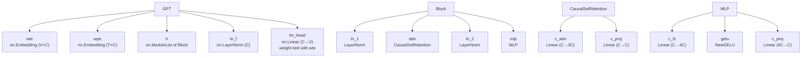

# GPT-2 Training — train_gpt2.py

# GPT-2 Training — train_gpt2.py

## Purpose

This module implements a from-scratch GPT-2 training and inference pipeline in PyTorch. It serves two roles:

1. **Train or fine-tune GPT-2 models** with support for single-GPU and multi-GPU distributed training, mixed precision, flash attention, `torch.compile`, and ZeRO optimization.
2. **Export model weights, gradients, and debug state to binary files** that can be loaded by a companion C inference engine for cross-language verification.

The implementation follows the original OpenAI GPT-2 architecture and weight layout, with weight-loading compatibility against HuggingFace `transformers` checkpoints.

---

## Model Architecture



### GPTConfig

```python
@dataclass
class GPTConfig:
    block_size: int = 1024    # maximum sequence length
    vocab_size: int = 50257   # GPT-2 BPE vocabulary size
    n_layer: int = 12         # number of transformer blocks
    n_head: int = 12          # number of attention heads
    n_embd: int = 768         # embedding / hidden dimension
```

The defaults match the 124M-parameter `gpt2` variant. Four size presets are available:

| Preset | `n_layer` | `n_head` | `n_embd` | ~Params |
|--------|-----------|----------|----------|---------|
| `gpt2` / `d12` | 12 | 12 | 768 | 124M |
| `gpt2-medium` / `d24` | 24 | 16 | 1024 | 350M |
| `gpt2-large` / `d36` | 36 | 20 | 1280 | 774M |
| `gpt2-xl` / `d48` | 48 | 25 | 1600 | 1558M |

The `d*` variants initialize from scratch with random weights; the `gpt2*` variants load pretrained weights from HuggingFace via `GPT.from_pretrained()`.

### GPT

The top-level `nn.Module` that assembles the full model:

- **Token + position embeddings** are summed: `tok_emb + pos_emb`.
- **Transformer blocks** are applied sequentially via `nn.ModuleList`.
- **Final LayerNorm** (`ln_f`) is applied after all blocks.
- **Weight tying**: `lm_head.weight` is the same tensor as `transformer.wte.weight`, following the GPT-2 paper.
- **Initialization**: Uses a deterministic `torch.Generator` (seed 42). Residual projections (`c_proj` in both attention and MLP) receive scaled initialization with `std = 0.02 / sqrt(2 * n_layer)`, per the GPT-2 paper. The tied `lm_head` is skipped during init (marked with `LLMC_SKIP_INIT`).

**Forward signature:**

```python
def forward(self, idx, targets=None, return_logits=True) -> (logits, loss)
```

- When `targets` is provided, cross-entropy loss is computed over the full sequence and all logits are returned.
- When `targets` is `None` (inference mode), only the last-position logits are computed as an optimization: `self.lm_head(x[:, [-1], :])`.
- Set `return_logits=False` to skip returning logits (saves memory when only the loss is needed).

### CausalSelfAttention

- Single fused `c_attn` linear projects to Q, K, V in one batch (`3 * n_embd` output), then splits.
- Heads are reshaped to `(B, n_head, T, head_dim)` for parallel computation.
- **Flash attention** (`F.scaled_dot_product_attention` with `is_causal=True`) is toggled by the global `FLASH` flag (set from `--flash` CLI arg).
- **Manual attention** materializes the full `(T, T)` attention matrix, applies the causal mask from the registered `bias` buffer, then softmax and multiply by V.
- Output projection `c_proj` is marked with `LLMC_RESIDUAL_SCALE_FLAG` for scaled init.

### MLP

Standard GPT-2 MLP: `c_fc` (4× expansion) → `NewGELU` → `c_proj` (back to `n_embd`). The `c_proj` layer uses scaled initialization.

### NewGELU

The exact GELU approximation used by OpenAI:

```
0.5 * x * (1 + tanh(sqrt(2/π) * (x + 0.044715 * x³)))
```

This differs from `torch.nn.GELU` (which uses the exact erf-based formula or the `tanh` approximation with different coefficients).

### Block

Pre-norm transformer block:

```python
x = x + self.attn(self.ln_1(x))
x = x + self.mlp(self.ln_2(x))
```

---

## Data Loading

### Binary Data Format

Training data is stored in `.bin` files with a custom format:

| Offset | Size | Content |
|--------|------|---------|
| 0 | 256 × int32 | Header (1024 bytes) |
| 0 | int32 | Magic number: `20240520` |
| 4 | int32 | Version: `1` |
| 8 | int32 | Number of tokens (`ntok`) |
| 12–1023 | — | Unused padding |
| 1024 | ntok × uint16 | Token IDs |

Each shard must contain at least `num_processes * B * T + 1` tokens to guarantee every rank gets a full batch.

### DistributedDataLoader

A lightweight data loader that partitions shards across ranks without overlap:

- **Construction**: `DistributedDataLoader(filename_pattern, B, T, process_rank, num_processes)` — globs all matching `.bin` files and validates each shard header.
- **`next_batch()`**: Returns `(x, y)` where `x` is tokens `[0..T-1]` and `y` is tokens `[1..T]` for next-token prediction. Each rank reads from its own offset (`process_rank * B * T`) and strides by `num_processes * B * T` between batches.
- **`advance()`**: Moves to the next shard (wraps around cyclically).
- **`reset()`**: Returns to shard 0, position `process_rank * B * T`. Skips re-loading shard 0 if already in memory.

---

## Training Loop

### Gradient Accumulation

The effective batch size is controlled by `--total_batch_size` (in tokens). The number of micro-steps is computed as:

```
grad_accum_steps = total_batch_size // (B * T * ddp_world_size)
```

Loss is divided by `grad_accum_steps` so that the accumulated gradient corresponds to a mean rather than a sum.

### DDP Gradient Synchronization

When running under DDP, gradient synchronization across ranks is deferred to the last micro-step only:

```python
model.require_backward_grad_sync = (micro_step == grad_accum_steps - 1)
```

This avoids redundant all-reduce operations during accumulation.

### Learning Rate Schedule

Cosine decay with linear warmup, implemented in `get_lr(it)`:

1. **Warmup** (`it < warmup_iters`): linear ramp from 0 to `learning_rate`.
2. **Cosine decay** (`warmup_iters ≤ it ≤ num_iterations`): decays from `learning_rate` down to `min_lr = learning_rate * learning_rate_decay_frac`.
3. **Post-training** (`it > num_iterations`): clamps to `min_lr`.

### Optimizer Configuration

`GPT.configure_optimizers()` creates an AdamW optimizer with two parameter groups:

| Group | Parameters | Weight Decay |
|-------|-----------|--------------|
| Decay | All 2D tensors (weight matrices, embeddings) | `weight_decay` |
| No decay | All <2D tensors (biases, LayerNorm params) | 0.0 |

When `zero_stage == 1`, the optimizer wraps into `ZeroRedundancyOptimizer` to shard optimizer state across ranks. Fused AdamW is used automatically when available on CUDA.

### Mixed Precision

An `torch.amp.autocast` context manager wraps the forward pass when `--dtype` is `float16` or `bfloat16` and the device is CUDA. The `--tensorcores` flag enables TF32 matmul precision via `torch.set_float32_matmul_precision('high')`.

---

## Python → C Bridge

The module exports three types of binary files for consumption by a C inference/testing engine.

### Model Checkpoint: `write_model()`

Writes a standalone binary containing the full model configuration and parameters.

**Header** (256 int32s, 1024 bytes):

| Index | Value |
|-------|-------|
| 0 | Magic: `20240326` |
| 1 | Version: `3` (fp32) or `5` (bf16) |
| 2 | `block_size` |
| 3 | `vocab_size` (50257) |
| 4 | `n_layer` |
| 5 | `n_head` |
| 6 | `n_embd` |
| 7 | Padded vocab size (e.g., 50304) |

**Vocab padding**: The raw vocab size of 50257 is padded up to the nearest multiple of 128 (default 50304) via `pad_vocab()`. This is a no-op algorithmically — the extra rows are zero-filled — but enables efficient GPU matrix operations in the C engine. Both `wte.weight` and its gradient are padded consistently.

**Parameter layout** (written sequentially after header):

```
wte.weight (Vp, C)
wpe.weight (T, C)
for i in range(L):
    h{i}.ln_1.weight (C)
for i in range(L):
    h{i}.ln_1.bias (C)
for i in range(L):
    h{i}.attn.c_attn.weight (3C, C)
for i in range(L):
    h{i}.attn.c_attn.bias (3C)
for i in range(L):
    h{i}.attn.c_proj.weight (C, C)
for i in range(L):
    h{i}.attn.c_proj.bias (C)
for i in range(L):
    h{i}.ln_2.weight (C)
for i in range(L):
    h{i}.ln_2.bias (C)
for i in range(L):
    h{i}.mlp.c_fc.weight (4C, C)
for i in range(L):
    h{i}.mlp.c_fc.bias (4C)
for i in range(L):
    h{i}.mlp.c_proj.weight (C, 4C)
for i in range(L):
    h{i}.mlp.c_proj.bias (C)
ln_f.weight (C)
ln_f.bias (C)
```

Note: `lm_head.weight` is **not** written separately because it is weight-tied with `wte.weight`.

### Debug State: `write_state()`

Writes input, targets, logits, loss, and all parameter gradients for numerical verification against the C implementation. Always stored in float32 for maximum precision. The header uses magic `20240327` and version `2`. Gradients are vocab-padded identically to the model checkpoint.

### Tokenizer: `write_tokenizer()`

Writes the GPT-2 BPE tokenizer to binary. Each token is stored as a 1-byte length prefix followed by the raw UTF-8 bytes. Header uses magic `20240328`, version `2` (includes EOT token ID in `header[3]`).

---

## Pretrained Weight Loading

`GPT.from_pretrained(model_type)` loads weights from HuggingFace's `GPT2LMHeadModel`. Key details:

- HuggingFace uses `Conv1D` layers (transposed weight layout) for attention and MLP projections. The four transposed weight keys are: `attn.c_attn.weight`, `attn.c_proj.weight`, `mlp.c_fc.weight`, `mlp.c_proj.weight`. These are transposed (`.t()`) during copy.
- The causal attention mask buffer (`.attn.bias` / `.attn.masked_bias`) is excluded from the copy — it's re-created by the `CausalSelfAttention` constructor.
- An assertion verifies that the key counts match between the two state dicts.

---

## Text Generation

`GPT.generate()` performs autoregressive sampling:

```python
model.eval()
output = model.generate(idx, max_new_tokens, temperature=1.0, top_k=None)
```

- Sequences longer than `block_size` are truncated from the left.
- Temperature scales logits before softmax.
- Top-k filtering zeros out logits below the k-th highest value.
- Sampling uses `torch.multinomial` on the resulting probability distribution.

---

## CLI Reference

| Argument | Default | Description |
|----------|---------|-------------|
| `--input_bin` | `dev/data/tinyshakespeare/tiny_shakespeare_val.bin` | Training data `.bin` file pattern |
| `--input_val_bin` | `""` | Validation data `.bin` file pattern |
| `--output_dir` | `""` | Directory for logs and checkpoints |
| `--model` | `gpt2` | Model variant: `gpt2`, `gpt2-medium`, `gpt2-large`, `gpt2-xl`, `d12`, `d24`, `d36`, `d48` |
| `--batch_size` | `4` | Micro-batch size (B) |
| `--sequence_length` | `64` | Sequence length (T) |
| `--total_batch_size` | `256` | Desired total batch size in tokens |
| `--num_iterations` | `10` | Number of training iterations |
| `--inference_only` | `0` | Skip backward pass and optimizer step |
| `--learning_rate` | `1e-4` | Peak learning rate |
| `--warmup_iters` | `0` | Linear warmup iterations |
| `--learning_rate_decay_frac` | `1.0` | Fraction of LR at end of decay (1.0 = no decay) |
| `--weight_decay` | `0.0` | AdamW weight decay |
| `--grad_clip` | `1.0` | Gradient norm clipping threshold |
| `--val_loss_every` | `0` | Evaluate val loss every N steps (0 = disabled) |
| `--val_max_steps` | `20` | Number of val batches to average |
| `--sample_every` | `0` | Generate text every N steps (0 = disabled) |
| `--overfit_single_batch` | `1` | Reset data loader each step to overfit one batch |
| `--tensorcores` | `0` | Enable TF32 matmul precision on CUDA |
| `--device` | `""` | Override auto-detected device |
| `--compile` | `0` | Apply `torch.compile` to the model |
| `--flash` | `0` | Use flash attention (`F.scaled_dot_product_attention`) |
| `--dtype` | `float32` | Precision: `float32`, `float16`, `bfloat16` |
| `--zero_stage` | `0` | ZeRO optimizer stage (0 or 1) |
| `--write_tensors` | `1` | Write model weights and debug state to disk |

---

## Example Launches

**Single-GPU benchmark (bf16, compiled, flash attention):**

```bash
python train_gpt2.py --write_tensors=0 --num_iterations=50 \
    --sequence_length=1024 --compile=1 --tensorcores=1 --dtype=bfloat16 --flash=1
```

**4-GPU distributed benchmark:**

```bash
torchrun --standalone --nproc_per_node=4 train_gpt2.py \
    --write_tensors=0 --num_iterations=50 --sequence_length=1024 \
    --compile=1 --tensorcores=1 --dtype=bfloat16
```

**Overfit a single batch (default behavior):**

```bash
python train_gpt2.py --model=gpt2 --batch_size=4 --sequence_length=64 \
    --num_iterations=10
```

This writes `gpt2_124M.bin`, `gpt2_124M_bf16.bin`, `gpt2_124M_debug_state.bin`, and `gpt2_tokenizer.bin` to the working directory on the first iteration.

---

## Key Design Decisions

- **Weight tying** between `wte` and `lm_head` is enforced at construction time by assigning the same `nn.Parameter` object. The `LLMC_SKIP_INIT` flag prevents double-initialization.
- **Residual scaling**: Projections at the end of each residual path (`c_proj` in attention and MLP) use `std = 0.02 / sqrt(2 * n_layer)` to counteract variance growth with depth, as specified in the GPT-2 paper.
- **Inference optimization**: When `targets` is `None`, only the last token position is passed through `lm_head`, avoiding unnecessary computation for all other positions.
- **DDP gradient sync control**: `model.require_backward_grad_sync` is toggled per micro-step rather than using `model.no_sync()` as a context manager, keeping the accumulation loop cleaner.
- **Vocab padding** is applied only at export time (in `write_model` / `write_state`), not during training, so the model itself always uses the true vocab size of 50257.