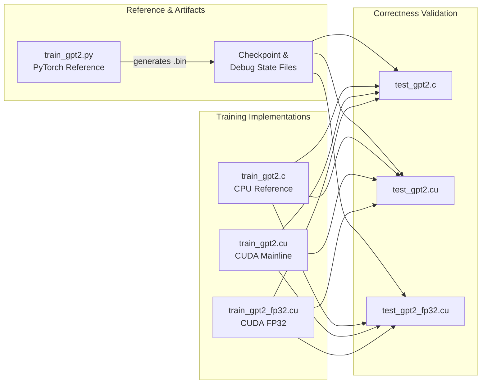

# GPT-2 Training

# GPT-2 Training

A from-scratch GPT-2 (124M–1558M) training implementation in C, CUDA, and PyTorch — with no framework dependencies in the C/CUDA paths. The project reproduces GPT-2 and GPT-3 family pretraining, and the mainline CUDA implementation currently outperforms PyTorch Nightly by ~7%.

## Architecture

The module is organized as a layered system: a PyTorch reference generates ground-truth artifacts, C and CUDA implementations provide the production training path, and test harnesses validate numerical equivalence across all layers.

## Sub-Modules

### Training Implementations

| Module | Role |
|--------|------|
| [train_gpt2.py](train_gpt2.py.md) | PyTorch reference. Trains/fine-tunes GPT-2 with distributed training, mixed precision, flash attention, and ZeRO. **Exports `.bin` checkpoint and debug-state files** that the C/CUDA test harnesses load for cross-language verification. |
| [train_gpt2.c](train_gpt2.c.md) | Clean CPU-only reference (~1,000 lines). Explicit forward/backward C functions with OpenMP parallelism. The algorithmic baseline that all optimized variants derive from. |
| [train_gpt2.cu](train_gpt2.cu.md) | Mainline CUDA implementation. Single-allocation pointer-arithmetic memory layout, custom kernels, cuBLAS, multi-GPU via ZeRO-1, checkpointing, and HellaSwag evaluation. The production training path. |
| [train_gpt2_fp32.cu](train_gpt2_fp32.cu.md) | Self-contained CUDA FP32 trainer with custom kernels for every operation. No framework or cuDNN dependency — pure CUDA + cuBLAS. |

### Correctness Testing

Each test harness loads the same PyTorch-generated `.bin` reference data and compares forward pass, backward pass, and optimizer outputs against it:

| Module | Validates |
|--------|-----------|
| [test_gpt2.c](test_gpt2.c.md) | `train_gpt2.c` — CPU forward/backward/update vs. PyTorch reference |
| [test_gpt2.cu](test_gpt2.cu.md) | `train_gpt2.cu` — CUDA numerical correctness + checkpoint determinism |
| [test_gpt2_fp32.cu](test_gpt2_fp32.cu.md) | `train_gpt2_fp32.cu` — FP32 CUDA vs. PyTorch (tolerance 1e-2) |

### Profiling

| Module | Role |
|--------|------|
| [profile_gpt2.cu](profile_gpt2.cu.md) | Minimal single-step CUDA harness designed as a clean target for NVIDIA Nsight Compute (`ncu`). |
| [profile_gpt2cu.py](profile_gpt2cu.py.md) | Python wrapper that invokes `ncu` on the profiling binary, producing an `.ncu-rep` report and a console summary of per-kernel bandwidth and tensor core utilization. |

### Infrastructure

| Module | Role |
|--------|------|
| [Makefile](Makefile.md) | Build system. Compiles all CPU and GPU targets with auto-detection of OpenMP, cuDNN, NCCL, and MPI. Supports Linux, macOS, and Windows. |
| [requirements.txt](requirements.txt.md) | Python dependencies for the PyTorch reference path. |
| [scripts](scripts.md) | Shell scripts encoding exact hyperparameters and hardware estimates for training GPT-2 124M through GPT-3 1558M on FineWeb datasets. |
| [multi_node](multi_node.md) | Multi-node distributed launch scripts (filesystem, MPI, and TCP process initialization backends). |
| [dev](dev.md) | CI loss regression checker (`loss_checker_ci.py`) and training log visualization. Offline utilities, not part of the runtime. |

## Key Cross-Module Workflows

**Correctness validation pipeline.** [train_gpt2.py](train_gpt2.py.md) exports model weights and a debug-state snapshot (inputs, expected logits, expected gradients, expected updated weights) to `.bin` files. The test harnesses — [test_gpt2.c](test_gpt2.c.md), [test_gpt2.cu](test_gpt2.cu.md), and [test_gpt2_fp32.cu](test_gpt2_fp32.cu.md) — each load these artifacts, run their respective implementation's forward/backward/update, and compare within tolerance. A passing test confirms the entire training loop is numerically equivalent to PyTorch.

**Profiling pipeline.** [profile_gpt2.cu](profile_gpt2.cu.md) compiles a single-step training harness. [profile_gpt2cu.py](profile_gpt2cu.py.md) wraps it with `ncu` to capture kernel-level metrics — memory throughput, occupancy, warp efficiency, and tensor core utilization — without the noise of multi-epoch iteration.

**Multi-node training.** [multi_node](multi_node.md) scripts compile [train_gpt2.cu](train_gpt2.cu.md), distribute the binary to worker nodes, configure NCCL, and launch distributed training across three process-init backends (shared filesystem, MPI, TCP sockets).

**CI regression detection.** After a training run, [dev/loss_checker_ci.py](dev.md) validates loss values against hardcoded references, catching numerical regressions from code changes.