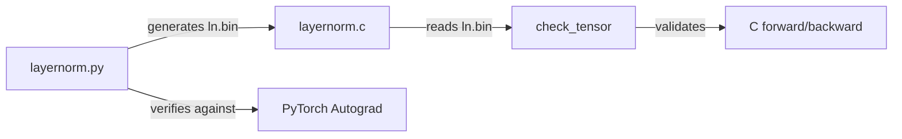

# LayerNorm Tutorial

# LayerNorm Tutorial

## Overview

This module provides a step-by-step walkthrough of Layer Normalization — one of the foundational layers in Transformer-based language models. It implements both the forward and backward passes from scratch in two forms: a PyTorch version for clarity and verification, and a pure C version that strips away the tensor abstraction to expose the raw memory layout and pointer arithmetic.

The tutorial serves as the template for how every layer in the training codebase is developed: derive the math, implement in PyTorch, verify against autograd, port to C, and validate against the PyTorch reference.

## Workflow



Running `layernorm.py` produces two outputs: it prints gradient errors against PyTorch autograd, and it writes a binary file `ln.bin` containing all reference tensors. The C program reads `ln.bin`, recomputes everything independently, and compares element-by-element.

## File Inventory

| File | Language | Purpose |
|------|----------|---------|
| `layernorm.py` | Python | PyTorch reference implementation, autograd verification, binary data generation |
| `layernorm.c` | C | Standalone forward/backward implementation, reads `ln.bin` for correctness checking |
| `layernorm.md` | Markdown | Prose tutorial explaining the math, design decisions, and differences from inference |

## Build and Run

```bash
# Step 1: generate reference data (requires PyTorch)
python layernorm.py

# Step 2: compile the C version
gcc layernorm.c -o layernorm -lm

# Step 3: run and verify
./layernorm
```

The Python script writes `ln.bin` to the current directory. The C program expects this file to exist and will exit with an error if it cannot open it.

## Forward Pass

### Mathematical Form

$$\text{LayerNorm}(x) = w \odot \frac{x - \mu}{\sqrt{\sigma^2 + \epsilon}} + b$$

where $\mu$ is the mean, $\sigma^2$ is the variance (both computed over the channel dimension), $\epsilon = 10^{-5}$ prevents division by zero, and $w$, $b$ are learnable parameters.

### Algorithm

For each position `(b, t)` in the batch/time grid:

1. **Mean**: $\mu = \frac{1}{C}\sum_{i=0}^{C-1} x_i$
2. **Variance**: $\sigma^2 = \frac{1}{C}\sum_{i=0}^{C-1}(x_i - \mu)^2$
3. **Reciprocal std**: $s = (\sigma^2 + \epsilon)^{-1/2}$
4. **Normalize, scale, shift**: $o_i = s \cdot (x_i - \mu) \cdot w_i + b_i$

The mean and reciprocal standard deviation are cached for the backward pass.

### PyTorch Implementation

`LayerNorm.forward(x, w, b)` in `layernorm.py` implements the above using native PyTorch operations (`sum`, subtraction, exponentiation). It returns the output tensor and a `cache` tuple of `(x, w, mean, rstd)`.

### C Implementation

`layernorm_forward(out, mean, rstd, inp, weight, bias, B, T, C)` in `layernorm.c` implements the same algorithm with explicit loops and pointer arithmetic. The key detail is how 3D tensor indexing maps to the 1D storage:

```
offset for (b, t, c) = b * T * C + t * C + c
```

The channel dimension `C` is the innermost (stride-1) dimension. A pointer to position `(b, t)` is computed as `inp + b * T * C + t * C`, and the next `C` elements are the channels at that position.

## Backward Pass

### Derivation

The backward pass receives `dout` (gradient of loss with respect to the output) and must compute gradients for the input (`dx`), weights (`dw`), and biases (`db`). Working through the chain rule and simplifying analytically yields three terms for the input gradient:

$$dx_i = rstd \cdot \left( dnorm_i - \frac{1}{C}\sum_j dnorm_j - \hat{x}_i \cdot \frac{1}{C}\sum_j dnorm_j \cdot \hat{x}_j \right)$$

where $dnorm_i = w_i \cdot dout_i$ and $\hat{x}_i = (x_i - \mu) \cdot rstd$ is the normalized input.

### PyTorch Implementation

`LayerNorm.backward(dout, cache)` computes:

- `db = dout.sum((0, 1))` — sum over batch and time
- `dw = (dout * norm).sum((0, 1))` — sum of output gradient times normalized input
- `dnorm = dout * w` — chain rule through the weight multiplication
- `dx = rstd * (dnorm - dnorm.mean(-1, keepdim=True) - norm * (dnorm * norm).mean(-1, keepdim=True))`

### C Implementation

`layernorm_backward(dinp, dweight, dbias, dout, inp, weight, mean, rstd, B, T, C)` performs the same computation in two passes per `(b, t)` position:

**First pass** — compute the two reduction terms:
- `dnorm_mean = (1/C) * Σ(weight[i] * dout[i])`
- `dnorm_norm_mean = (1/C) * Σ(weight[i] * dout[i] * norm[i])`

**Second pass** — accumulate all three gradients:
- `dbias[i] += dout[i]`
- `dweight[i] += norm[i] * dout[i]`
- `dinp[i] += rstd * (dnorm_i - dnorm_mean - norm[i] * dnorm_norm_mean)`

All gradient accumulations use `+=` rather than `=`. This is the correct convention for backward passes: if a variable is consumed multiple times in the forward graph, gradients from each use must sum. Even though this codebase doesn't have such branching, the `+=` pattern is maintained for correctness.

## Checkpointing Tradeoff

The `cache` returned by the forward pass stores `(x, w, mean, rstd)` but **not** the normalized activations `norm`. The backward pass recomputes `norm = (x - mean) * rstd` from the cached values. This is a deliberate tradeoff:

| Cached | Shape | Cost to recompute |
|--------|-------|-------------------|
| `mean`, `rstd` | `B × T` | Expensive (requires full reduction) |
| `norm` | `B × T × C` | Cheap (elementwise from cached values) |

Saving `norm` would avoid the recompute but consume `C` times more memory. This memory-vs-compute tradeoff appears throughout the codebase under the name "checkpointing" (unrelated to saving model weights to disk).

## Verification

### Python-side

`layernorm.py` compares the manual backward pass against PyTorch autograd by constructing a fake loss `(out * dout).sum()` and calling `.backward()`. It prints the maximum absolute error for each gradient:

```
dx error: <tiny number>
dw error: <tiny number>
db error: <tiny number>
```

### C-side

`layernorm.c` reads all reference tensors from `ln.bin` (written by the Python script), recomputes forward and backward passes, and compares every element using `check_tensor(a, b, n, label)` with a tolerance of `1e-5`. Each element prints `OK` or `NOT OK` along with both values.

## Comparison with RMSNorm (Inference)

This training implementation differs from the inference-only `rmsnorm` in [llama2.c](https://github.com/karpathy/llama2.c) in several ways:

| Aspect | LayerNorm (training, this module) | RMSNorm (inference, llama2.c) |
|--------|-----------------------------------|-------------------------------|
| Mean subtraction | Yes | No — normalizes by RMS only |
| Bias parameter | Yes | No |
| Batch dimension | Loops over `B` | Assumed `B=1` |
| Time dimension | Loops over `T` inside the layer | Handled by outer generation loop |
| Backward pass | Required | Not needed |
| Intermediate caching | Stores `mean`, `rstd` | Stores nothing |

The absence of mean subtraction and bias in RMSNorm simplifies the code significantly. The lack of batch and time loops in inference reflects the autoregressive generation pattern: tokens are produced one at a time, so each layer processes a single position per call.

## Tensor Shapes

| Tensor | Shape | Notes |
|--------|-------|-------|
| `inp` / `out` / `dout` / `dinp` | `B × T × C` | 3D activation tensors |
| `weight` / `bias` / `dweight` / `dbias` | `C` | Shared across all positions |
| `mean` / `rstd` | `B × T` | One scalar per (batch, time) position |

The toy example uses `B=2, T=3, C=4`. Real GPT-2 settings would be on the order of `B=8, T=1024, C=768`.