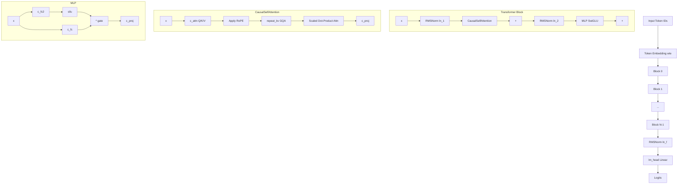

# LLaMA Training

# LLaMA Training Module

## Overview

This module implements LLaMA 3.1 training and inference in PyTorch, closely following Meta's reference implementation. It serves a dual purpose: training/fine-tuning LLaMA models and exporting model weights as binary files for initialization in a companion C implementation. The code is structured as a self-contained training script with distributed data parallel support, gradient accumulation, and validation/inference hooks.

Three architectural differences distinguish this from a standard GPT-2 implementation:

1. **RoPE** — Rotary Positional Encoding instead of absolute positional embeddings
2. **GQA** — Grouped Query Attention, reducing the number of key/value heads
3. **SwiGLU** — Swish-Gated Linear Unit activation in the MLP

## Architecture



## Configuration

`LlamaConfig` is a dataclass with defaults matching the LLaMA 3.1 8B model:

| Parameter | Default | Description |
|---|---|---|
| `block_size` | 8192 | Maximum sequence length |
| `vocab_size` | 128256 | Vocabulary size |
| `n_layer` | 32 | Number of transformer blocks |
| `n_head` | 32 | Number of query attention heads |
| `n_kv_head` | 8 | Number of key/value heads (GQA) |
| `n_embd` | 4096 | Embedding dimension |
| `ffn_dim_multiplier` | 1.3 | MLP hidden dimension multiplier |
| `multiple_of` | 1024 | Round MLP hidden dim to multiple of this |
| `norm_eps` | 1e-5 | RMSNorm epsilon |
| `rope_theta` | 500000.0 | Base for RoPE frequency computation |
| `use_scaled_rope` | True | Apply frequency scaling for extended context |
| `max_gen_batch_size` | 4 | Max batch size during generation |
| `use_kv` | True | Enable KV cache for inference |
| `flash` | False | Use Flash Attention |

The constructor accepts `**kwargs` to override any field. It asserts that `n_kv_head <= n_head`, `n_head % n_kv_head == 0`, and `n_embd % n_head == 0`.

## Model Components

### RMSNorm

`RMSNorm` replaces LayerNorm from GPT-2. It normalizes by the reciprocal square root of the mean of squared values, then scales by a learned weight:

```python
# _norm: x * rsqrt(mean(x^2) + eps)
# forward: _norm(x.float()).type_as(x) * weight
```

The computation is cast to float32 for numerical stability, then cast back to the input dtype. This matches Meta's reference implementation rather than `nn.RMSNorm` which has slightly different numeric properties.

### CausalSelfAttention

Implements Grouped Query Attention with RoPE and optional KV caching.

**Projection:** `c_attn` projects input to `(n_head + 2 * n_kv_head) * head_dim` dimensions, then splits into Q, K, V. Q has shape `(B, T, n_head, head_dim)` while K and V have shape `(B, T, n_kv_head, head_dim)`.

**RoPE:** Applied to Q and K via `apply_rotary_emb` before any attention computation.

**KV Cache:** When `use_kv=True` and the model is in eval mode with `start_pos >= 0`, K and V are stored in pre-allocated static caches (`self.cache_k`, `self.cache_v`) of shape `(max_gen_batch_size, block_size, n_kv_head, head_dim)`. On subsequent forward passes, the cached values are concatenated with new K/V.

**GQA:** `repeat_kv` broadcasts K and V from `n_kv_head` to `n_head` by expanding along the head dimension. The repeat factor is `n_rep = n_head // n_kv_head` (4 for the default 8B config).

**Attention computation:** When `flash=True`, uses `F.scaled_dot_product_attention`. Otherwise falls back to a manual implementation that materializes the full `(T, T)` attention matrix. The causal mask is an upper-triangular boolean tensor; for Flash Attention the mask is inverted (True = attend), while the manual path uses `masked_fill_` with the original mask.

### MLP with SwiGLU

The MLP hidden dimension is computed as:

```
hidden_dim = int(2 * (4 * n_embd) / 3)
if ffn_dim_multiplier: hidden_dim = int(ffn_dim_multiplier * hidden_dim)
hidden_dim = multiple_of * ceil(hidden_dim / multiple_of)
```

The SwiGLU computation is:

```
output = c_proj(silu(c_fc2(x)) * c_fc(x))
```

`c_fc2` produces the gate (passed through SiLU), `c_fc` produces the value, and their element-wise product is projected back by `c_proj`. All three linear layers are bias-free.

### Block

Standard pre-norm transformer block:

```
x = x + attn(ln_1(x), freqs_cis, start_pos, mask)
x = x + mlp(ln_2(x))
```

### LLaMA (Top-Level Model)

The `LLaMA` module assembles:
- `transformer.wte` — token embedding
- `transformer.h` — list of `Block` modules
- `transformer.ln_f` — final RMSNorm
- `lm_head` — output projection (no bias)

RoPE frequencies (`freqs_cis`) are precomputed at initialization for `block_size * 2` positions and sliced during forward passes to support KV-cached generation.

**Forward pass** (`forward`):
1. Embed tokens via `wte`
2. Slice `freqs_cis` for positions `[start_pos : start_pos + t]`
3. Create upper-triangular causal mask
4. Pass through all blocks
5. Apply final RMSNorm
6. If `targets` provided: compute logits for all positions and cross-entropy loss (ignoring index -1). Otherwise: compute logits only for the last position (inference optimization).
7. Return `(logits, loss)` — logits can be suppressed via `return_logits=False` for performance.

## Rotary Positional Encoding (RoPE)

### precompute_freqs_cis

```python
precompute_freqs_cis(dim, end, theta=10000.0, use_scaled=False)
```

Computes complex exponentials `e^(i * t * freq)` for all positions up to `end` and all frequency bands. `dim` is the head dimension (`n_embd // n_head`). Returns a tensor of shape `(end, dim // 2)` in complex64.

When `use_scaled=True`, `apply_scaling` adjusts frequencies for extended context lengths (8K → 64K scaling per LLaMA 3.1):

- Frequencies with wavelength < `high_freq_wavelen` (2048) are kept unchanged
- Frequencies with wavelength > `low_freq_wavelen` (8192) are divided by `scale_factor` (8)
- Frequencies in between are smoothly interpolated

### apply_rotary_emb

Applies RoPE by treating Q and K as complex numbers and multiplying element-wise with the precomputed `freqs_cis`. The reshaping via `reshape_for_broadcast` ensures the frequency tensor broadcasts correctly across batch and head dimensions.

### repeat_kv

Broadcasts K/V tensors from `n_kv_heads` to `n_heads` for GQA. Uses expand+reshape instead of `torch.repeat_interleave` for the same effect. Returns early (no-op) when `n_rep == 1` (standard MHA).

## Tokenizer

The `Tokenizer` class wraps tiktoken with LLaMA 3.1-specific configuration:

- **Pattern:** Custom regex splitting contractions, Unicode letters, numbers, and special characters
- **Special tokens:** 11 defined tokens (BOS, EOS, pad, step, header markers, EOM, EOT, python_tag) plus 245 reserved special tokens, totaling 256 special tokens
- **Key token IDs:** `bos_id`, `eos_id`, `eot_id`, `eom_id`, `python_tag_id`, `pad_id` (128004)
- **Stop tokens:** BOS and EOS for generation termination

**Encoding** handles tiktoken's limits by splitting input into chunks of at most 400,000 characters, and further splitting runs of consecutive whitespace/non-whitespace exceeding 25,000 characters. BOS/EOS tokens are optionally prepended/appended.

**Decoding** delegates directly to tiktoken's decode.

## Data Loading

### DistributedShardedDataLoader

A minimal distributed data loader that reads binary shard files. Each shard has a 1024-byte header (256 int32 values) with magic number `20240801`, version `7`, and token count, followed by `uint32` token data.

**Distributed behavior:** Each process reads the same shard but starts at offset `process_rank * B * T` and advances by `B * T * num_processes` per batch, ensuring no overlap.

**Shard management:** When the current position would overflow the shard, `advance()` loads the next shard (cycling). `reset()` returns to shard 0 without reloading if already loaded.

**Batch format:** Each batch returns `(x, y)` where `x` is tokens `[0:T]` and `y` is tokens `[1:T+1]` (next-token prediction), both shaped `(B, T)`.

## Training

### Distributed Setup

Uses PyTorch's `torchrun`-based DDP with NCCL backend. The script detects DDP via the `RANK` environment variable. Each process is assigned a CUDA device by `LOCAL_RANK`. The master process (rank 0) handles logging, checkpointing, and sampling.

### Gradient Accumulation

The effective batch size is controlled by `--total_batch_size` (in tokens). The number of gradient accumulation steps is computed as:

```
grad_accum_steps = total_batch_size / (B * T * ddp_world_size)
```

Loss is divided by `grad_accum_steps` so that accumulated gradients produce a mean rather than a sum. DDP gradient synchronization is disabled for all micro-steps except the last via `model.require_backward_grad_sync`.

### Optimizer

`configure_optimizers` creates AdamW with two parameter groups:
- **Decay group:** All 2D+ tensors (weight matrices, embeddings) — receives `weight_decay`
- **No-decay group:** All <2D tensors (RMSNorm weights) — zero weight decay

Supports fused AdamW on CUDA and `ZeroRedundancyOptimizer` (ZeRO stage 1) for memory-efficient distributed training.

### Learning Rate Schedule

Cosine decay with linear warmup:

1. **Warmup** (`it < warmup_iters`): linear ramp from 0 to `learning_rate`
2. **Decay** (`warmup_iters < it < num_iterations`): cosine decay from `learning_rate` to `min_lr = learning_rate * learning_rate_decay_frac`
3. **Post-decay** (`it > num_iterations`): constant at `min_lr`

### Training Loop

Each iteration:
1. Zero gradients
2. Optionally reset loader (for `--overfit_single_batch`)
3. Accumulate gradients over `grad_accum_steps` micro-batches
4. All-reduce loss across DDP ranks
5. Clip gradient norm to `--grad_clip`
6. Set per-iteration learning rate
7. Step optimizer
8. Log timing and throughput (tokens/second)

Validation loss is evaluated every `--val_loss_every` steps by averaging over `--val_max_steps` batches. Text sampling runs every `--sample_every` steps on the master process.

## Inference / Generation

`LLaMA.generate` performs autoregressive generation with KV caching:

1. **Prefill:** Tokenize prompts and pad to uniform length. Run a full forward pass if the shortest prompt fills the entire context.
2. **Decode loop:** For each position from `min_prompt_len` to `total_len`:
   - Forward pass with `start_pos` for KV cache indexing
   - Sample next token via top-p nucleus sampling (or argmax if temperature=0)
   - Replace token only where the prompt hasn't already provided one (via `input_text_mask`)
   - Track EOS reached per sequence
   - Break early if all sequences have hit a stop token
3. **Post-processing:** Trim output to `max_gen_len`, cut at stop tokens, optionally exclude the prompt (`echo=False`)

`sample_top_p` sorts probabilities descending, computes cumulative sum, masks tokens where `cumsum - current > p`, renormalizes, and samples from the filtered distribution.

## Weight Loading

### from_pretrained_llama3_hf

Loads the `meta-llama/Meta-Llama-3.1-8B` model from HuggingFace. Key adaptation via `adapt_llama_state_dict_keys_hf`:

- Renames layer norm keys (`input_layernorm` → `ln_1`, `post_attention_layernorm` → `ln_2`)
- Merges separate Q/K/V projections into a single `c_attn.weight` (concatenated along dim 0)
- **Unpermutes** Q and K weights to undo HuggingFace's RoPE-related permutation (see HuggingFace's conversion script)
- Maps FFN keys: `gate_proj` → `c_fc2`, `up_proj` → `c_fc`, `down_proj` → `c_proj`

### from_pretrained_llama3_meta

Loads from Meta's native checkpoint format. Key adaptation via `adapt_llama_state_dict_keys`:

- Same norm renaming as HF
- Merges Q/K/V into `c_attn.weight` (no unpermutation needed)
- Maps FFN keys: `w1` → `c_fc2`, `w3` → `c_fc`, `w2` → `c_proj`

Both methods load weights in BFloat16 on CUDA for speed, then restore the default tensor type.

## C Bridge (Weight Export)

The module exports model state as binary files for verification against a C implementation.

### write_model

Writes a standalone model checkpoint with a 1024-byte header (256 int32 values):

| Header Index | Value |
|---|---|
| 0 | Magic: 20240803 |
| 1 | Version: 3 (fp32) or 5 (bf16) |
| 2–7 | block_size, vocab_size, n_layer, n_head, n_kv_head, n_embd |
| 8–12 | ffn_dim_multiplier, multiple_of, norm_eps, rope_theta, use_scaled_rope |
| 13 | max_gen_batch_size |
| 14–15 | Major/minor version (3, 1) |

Parameters are written in a fixed order: `wte`, per-layer (`ln_1`, `c_attn`, `c_proj`, `ln_2`, `c_fc`, `c_fc2`, `c_proj`), `ln_f`, `lm_head`. BFloat16 tensors are reinterpreted as int16 for numpy serialization since numpy lacks a native bf16 dtype.

### write_state

Writes a debug state file containing input tokens, targets, logits, loss, and all parameter gradients (always in fp32). Used to verify numerical correctness of the C implementation against the PyTorch reference.

## Command-Line Arguments

| Argument | Default | Description |
|---|---|---|
| `--use_hf` | 1 | Load from HuggingFace (1) or Meta checkpoint (0) |
| `--ckpt_dir` | None | Path to Meta checkpoint directory |
| `--tokenizer_path` | None | Path to Meta tokenizer model file |
| `--input_bin` | `tiny_shakespeare_val.bin` | Training data shard pattern |
| `--input_val_bin` | "" | Validation data shard pattern |
| `--output_dir` | "" | Directory for logs and checkpoints |
| `--model` | `meta-llama/Meta-Llama-3.1-8B` | HuggingFace model identifier |
| `--batch_size` | 4 | Micro-batch size |
| `--sequence_length` | 64 | Sequence length per micro-batch |
| `--total_batch_size` | 256 | Total batch size in tokens |
| `--num_iterations` | 10 | Training iterations |
| `--inference_only` | 0 | Skip training, only run inference |
| `--learning_rate` | 1e-5 | Peak learning rate |
| `--warmup_iters` | 0 | Linear warmup steps |
| `--learning_rate_decay_frac` | 1.0 | Fraction of LR at end of decay |
| `--weight_decay` | 0.0 | Weight decay for 2D+ parameters |
| `--grad_clip` | 1.0 | Gradient norm clipping threshold |
| `--val_loss_every` | 0 | Validation evaluation frequency |
| `--val_max_steps` | 20 | Batches to average for validation |
| `--sample_every` | 0 | Text generation frequency |
| `--overfit_single_batch` | 1 | Reset loader each step (overfitting test) |
| `--tensorcores` | 0 | Enable TF32 for matmuls |
| `--device` | "" | Override device autodetection |
| `--compile` | 0 | Apply `torch.compile` |
| `--dtype` | bfloat16 | Floating point precision |
| `--zero_stage` | 0 | ZeRO optimizer stage (0/1) |
| `--write_tensors` | 0 | Export model weights and debug state |