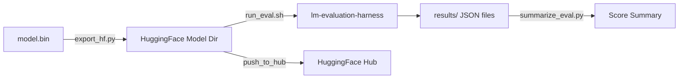

# Model Evaluation & Export

# Model Evaluation & Export

This module bridges llm.c-trained GPT-2 models and the HuggingFace ecosystem. It converts llm.c binary checkpoints into loadable HuggingFace models, then evaluates them against the same benchmark suite used by the Open LLM Leaderboard.

## Pipeline Overview



The workflow is strictly sequential: export first, then evaluate, then summarize.

---

## Export: `export_hf.py`

Converts a GPT-2 model from llm.c's binary format into a standard HuggingFace `GPT2LMHeadModel`, complete with tokenizer and safetensors weights.

### Binary Format

The input `.bin` file starts with a 256-int32 header:

| Offset | Field | Description |
|--------|-------|-------------|
| 0 | Magic number | Must be `20240326` |
| 1 | Version | `3` = float32, `5` = bfloat16 (stored as int16) |
| 2 | `maxT` | Maximum sequence length |
| 3 | `V` | Vocab size (actual) |
| 4 | `L` | Number of transformer layers |
| 5 | `H` | Number of attention heads |
| 6 | `C` | Hidden dimension (channels) |
| 7 | `Vp` | Padded vocab size |

After the header, all parameters are stored contiguously in a fixed order (see `shapes` dict in `convert()`). Version 3 files store float32 arrays; version 5 files store bfloat16 values packed as int16. The padded vocab rows (`Vp - V` extra rows) are stripped during loading to match GPT-2's actual vocabulary.

### Weight Mapping

The llm.c parameter names map to HuggingFace state dict keys as follows:

| llm.c key | HuggingFace key | Transpose |
|-----------|----------------|-----------|
| `wte` | `transformer.wte.weight` | No |
| `wpe` | `transformer.wpe.weight` | No |
| `ln1w[i]` | `transformer.h.{i}.ln_1.weight` | No |
| `ln1b[i]` | `transformer.h.{i}.ln_1.bias` | No |
| `qkvw[i]` | `transformer.h.{i}.attn.c_attn.weight` | **Yes** |
| `qkvb[i]` | `transformer.h.{i}.attn.c_attn.bias` | No |
| `attprojw[i]` | `transformer.h.{i}.attn.c_proj.weight` | **Yes** |
| `attprojb[i]` | `transformer.h.{i}.attn.c_proj.bias` | No |
| `ln2w[i]` | `transformer.h.{i}.ln_2.weight` | No |
| `ln2b[i]` | `transformer.h.{i}.ln_2.bias` | No |
| `fcw[i]` | `transformer.h.{i}.mlp.c_fc.weight` | **Yes** |
| `fcb[i]` | `transformer.h.{i}.mlp.c_fc.bias` | No |
| `fcprojw[i]` | `transformer.h.{i}.mlp.c_proj.weight` | **Yes** |
| `fcprojb[i]` | `transformer.h.{i}.mlp.c_proj.bias` | No |
| `lnfw` | `transformer.ln_f.weight` | No |
| `lnfb` | `transformer.ln_f.bias` | No |

The four transposed weights (`qkvw`, `attprojw`, `fcw`, `fcprojw`) reflect a layout difference: llm.c stores them as `(out, in)` while HuggingFace expects `(in, out)` for `Conv1D` layers.

Weight tying is enforced: `lm_head.weight` is set to the same tensor as `transformer.wte.weight`.

### Tensor Decoding

Two helper functions handle the format-specific decoding, both returning float32 tensors:

- **`tensor_bf16(data_int16, transpose=False)`** — Reinterprets int16 bytes as bfloat16, then converts to float32. Used for version 5 files.
- **`tensor_fp32(data_float32, transpose=False)`** — Passes float32 data through directly. Used for version 3 files.

Both accept an optional `transpose` flag that swaps axes before conversion.

### CLI Usage

```bash
python export_hf.py --input model.bin --output output_dir [--dtype bfloat16] [--push false] [--spin true]
```

| Argument | Default | Description |
|----------|---------|-------------|
| `--input` / `-i` | *required* | Path to llm.c `.bin` checkpoint |
| `--output` / `-o` | *required* | Output directory for HuggingFace model files |
| `--dtype` / `-d` | `bfloat16` | Output dtype: `bfloat16` or `float32` |
| `--push` / `-p` | `False` | Push model and tokenizer to HuggingFace Hub |
| `--spin` / `-s` | `True` | Run a quick generation test after export |

### Quick Validation (`spin`)

When `--spin` is enabled (the default), `spin()` loads the exported model with FlashAttention 2 on CUDA and generates 64 tokens from the prompt `"During photosynthesis in green plants"`. This provides a fast sanity check that the export succeeded and the model produces coherent text.

### Hub Upload

To push to HuggingFace Hub, install the CLI and authenticate first:

```bash
pip install -U "huggingface_hub[cli]"
huggingface-cli login
```

Then pass `--push true`. Both the model and the GPT-2 tokenizer will be uploaded.

---

## Evaluation: `run_eval.sh`

Runs the six benchmark tasks used by the [Open LLM Leaderboard](https://huggingface.co/spaces/open-llm-leaderboard/open_llm_leaderboard) via the EleutherAI `lm-evaluation-harness`.

### Prerequisites

The harness must be checked out at a pinned commit for reproducibility:

```bash
git clone https://github.com/EleutherAI/lm-evaluation-harness/
cd lm-evaluation-harness
git checkout b281b0921b636bc36ad05c0b0b0763bd6dd43463
pip install -e .
cd ..
```

### Usage

Run from the **root of the llm.c repo**:

```bash
./dev/eval/run_eval.sh <model_path_or_name> <result_name>
```

- `model_path_or_name` — Local directory (output of `export_hf.py`) or a HuggingFace repo ID (e.g., `openai-community/gpt2`)
- `result_name` — Folder name under `lm-evaluation-harness/results/` where JSON results are written

For long-running evaluations, use `nohup` or a `screen` session:

```bash
nohup ./dev/eval/run_eval.sh ./my_model my_result > run.txt 2> err.txt &
```

### Benchmark Tasks

The script runs each task individually with its standard few-shot setting:

| Task | Few-shot | Metric | Output file |
|------|----------|--------|-------------|
| TruthfulQA | 0 | `mc2` | `truthfulqa_0shot.json` |
| Winogrande | 5 | `acc` | `winogrande_5shot.json` |
| ARC-Challenge | 25 | `acc_norm` | `arc_challenge_25shot.json` |
| HellaSwag | 10 | `acc_norm` | `hellaswag_10shot.json` |
| GSM8k | 5 | `acc` | `gsm8k_5shot.json` |
| MMLU | 5 | `acc` | `mmlu_5shot.json` |

MMLU is evaluated across all 57 subtasks (listed explicitly in the script) with 5-shot prompting.

All tasks use `--model hf-causal-experimental`, batch size 1, no caching, and CUDA.

### FlashAttention 2 Requirement

When evaluating bfloat16 models, add the following to the exported model's `config.json`:

```json
"_attn_implementation": "flash_attention_2"
```

Without FlashAttention 2, bfloat16 evaluation scores are significantly lower. This is a known issue and the config edit is the current workaround.

---

## Summarization: `summarize_eval.py`

Re-prints evaluation scores from the JSON result files produced by `run_eval.sh`. Useful when the original console output is no longer available.

### Usage

```bash
python dev/eval/summarize_eval.py <result_dir>
```

Where `result_dir` is the path under `lm-evaluation-harness/results/` (e.g., `lm-evaluation-harness/results/result774M`).

### Output

Reads each of the six expected JSON files, extracts the appropriate metric, and prints per-task percentages plus an average:

```
----------------------------------------
arc_challenge_25shot.json      : 30.4608
gsm8k_5shot.json               : 0.1516
hellaswag_10shot.json          : 57.8072
mmlu_5shot.json                : 25.8682
truthfulqa_0shot.json          : 35.7830
winogrande_5shot.json          : 59.3528
----------------------------------------
Average Score                  : 34.9039
```

The metric key used for each task is hardcoded in the `key` dict and matches the Open LLM Leaderboard convention.

---

## Known Issues

- **Slow evaluation**: The full benchmark suite takes 1–3 hours even for small models. This is unresolved and may be related to the `use_accelerate=True` flag or batch-size-1 inference.
- **bfloat16 accuracy without FlashAttention 2**: Scores degrade noticeably. Always use FlashAttention 2 for bfloat16 evaluation by editing `config.json` as described above.
- **`--push` argument type**: The `argparse` definition uses `type=bool`, which means any non-empty string (including `"false"`) evaluates to `True`. Pass `0` or omit the flag to keep it `False`.