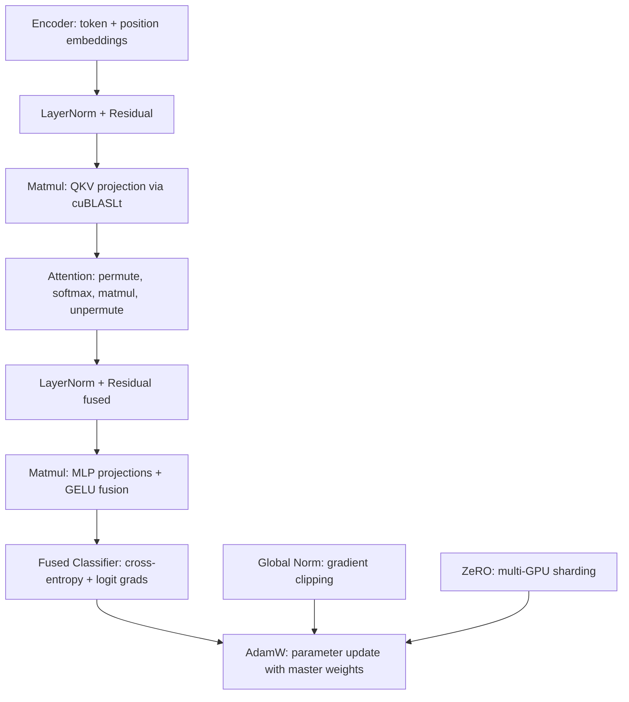

# Neural Network Operations

# Neural Network Operations

CUDA kernel implementations for the core operations in a GPT-2-style transformer training loop. Each sub-module is a self-contained `.cuh` header providing forward and backward kernel launchers for a specific layer or operation. All kernels target mixed-precision training with configurable `floatX` (BF16 by default, also supports FP16, FP32, FP8) and use stochastic rounding when writing back to low-precision parameter storage.

## Architecture Overview



---

## Sub-Modules

### AdamW (`adamw.cuh`)

Implements the AdamW optimizer as a single fused CUDA kernel. Each thread updates one parameter using the Adam algorithm with decoupled weight decay.

**Key design decisions:**

- **Linear interpolation (`lerp`)** — Uses the two-FMA formulation `fma(weight, end, fma(-weight, start, start))` instead of the naive three-op `start + weight * (end - start)`, following [NVIDIA's recommendation](https://developer.nvidia.com/blog/lerp-faster-cuda).
- **Master weights** — When `master_params_memory` is non-null, the optimizer maintains an FP32 master copy of parameters. The update is computed in FP32 against the master copy, then stochastically rounded down to `floatX` for the next forward pass.
- **Multi-slice support** — `adamw_kernel3` uses `blockIdx.y` to iterate over parameter slices (different layers), with separate strides (`w_stride`, `g_stride`, `s_stride`) for weights, gradients, and state. This enables a single kernel launch to update all layers.
- **Bias correction** — Precomputes `beta1_correction = 1 - β₁ᵗ` and `beta2_correction = 1 - β₂ᵗ` on the host and passes them to the kernel.

**API:**

| Function | Description |
|----------|-------------|
| `adamw_update<Tp, Tg>(...)` | Host launcher. Computes bias corrections, launches `adamw_kernel3` with 512-thread blocks. |
| `init_from_master<Tp>(...)` | Copies master FP32 params back to low-precision storage using stochastic rounding. Block size must match `adamw_update` (512) so RNG seeds align. |

**Update formula per parameter:**

```
m = lerp(grad, m_old, β₁)
v = lerp(grad², v_old, β₂)
m̂ = m / (1 - β₁ᵗ)
v̂ = v / (1 - β₂ᵗ)
param = old_param - lr * (m̂ / (√v̂ + ε) + λ · old_param)
```

---

### Attention (`attention.cuh`)

Fallback multi-head self-attention when cuDNN Flash Attention is unavailable. Implements the full forward and backward pass using cuBLASLt batched matmuls and custom permute/softmax kernels.

**Forward pass flow:**

1. **Permute** — `permute_kernel` reshapes the fused QKV tensor from `(B, T, 3, NH, HS)` into three separate tensors `Q, K, V` of shape `(B, NH, T, HS)`.
2. **QK matmul** — `matmul_cublaslt` computes `preatt = K^T @ Q` as a strided-batched GEMM over `B * NH` batches.
3. **Causal softmax** — `softmax_forward_kernel5` applies online softmax row-by-row with autoregressive masking. Only the lower-triangular portion is computed. The scale `1/√HS` is fused into the softmax rather than applied separately.
4. **Att-V matmul** — `matmul_cublaslt` computes `vaccum = V @ att^T`.
5. **Unpermute** — `unpermute_kernel` reshapes from `(B, NH, T, HS)` back to `(B, T, C)`.

**Backward pass flow:**

1. Unpermute backward → `scratch`
2. `datt = V @ scratch^T`, `dv = scratch @ att^T`
3. Softmax backward in-place on `datt` (becomes `dpreatt`)
4. `dq = K @ dpreatt^T`, `dk = Q^T @ dpreatt` (transposed GEMMs)
5. Permute backward → `dinp`

**Softmax implementation details:**

- `softmax_forward_kernel5` uses the online softmax algorithm with warp-level reductions. It iterates backwards over rows to keep the upper-left cache lines warm for the subsequent matmul.
- `softmax_autoregressive_backward_inplace_kernel` processes 4 timesteps per block in reverse order. It computes the local dot product `Σ att[t2] * datt[t2]` via block reduction, then writes `scale * att[t3] * (datt[t3] - local_sum)` in-place. Non-causal positions are explicitly zeroed.

**Scratch buffer reuse:** The `inp` buffer (QKV) is not needed in the backward pass, so the forward pass reuses it as scratch for `preatt` and `vaccum`.

---

### Encoder (`encoder.cuh`)

Implements the input embedding layer: `out = wte[token_id] + wpe[position]`.

**Forward:** `encoder_forward_kernel3` vectorizes with `x128` loads. Each thread processes `x128::size` channels, loading the token embedding and position embedding and summing them.

**Backward — deterministic gradient accumulation:**

The backward pass is fully deterministic (no `atomicAdd`), which is critical for reproducible training.

- **`wpe_backward_kernel`** — Each `(t, c)` position is handled by exactly one thread, which sums gradients across the batch dimension in registers, then does a read-modify-write with stochastic rounding to `dwpe`.
- **`wte_backward_kernel`** — More complex because multiple batch positions may reference the same vocabulary token. The CPU preprocesses inputs into **buckets**: each bucket groups all `(batch, time)` positions that share the same vocabulary index and channel group. Buckets are sorted by size (largest first) to maximize GPU occupancy. Within a bucket, warps accumulate partial sums in shared memory, then warp 0 performs the final reduction and stochastic-rounded write to `dwte`.

**CPU-side bucket construction** (in `encoder_backward`):

1. Build a hash map: key = `(c_group, vocab_index)`, value = list of `(bt, c_group)` pairs.
2. Sort buckets by size descending.
3. Pack bucket metadata into `int4` arrays and `workload_indices`, copy to device async.
4. Launch `wpe_backward_kernel` first (it runs on GPU in parallel with the CPU bucket preprocessing).

---

### Fused Classifier (`fused_classifier.cuh`)

Fuses cross-entropy loss computation with the backward pass into a single kernel, avoiding materialization of the full softmax probability matrix.

**Forward + backward in one kernel (`fused_classifier_kernel5`):**

1. **Softmax** — `prepare_softmax_blockwide3` computes the row-wise max and sum using the online softmax algorithm with block-level reductions, returning `{Scale = 1/sum, Offset = max}`.
2. **Loss** — Thread 0 computes `loss = -log(prob_target)` where `prob_target = exp(logit_target - Offset) * Scale`.
3. **`__syncthreads()`** — Critical barrier. Without it, the logits read for the loss would race with the in-place overwrite by gradient values. Since gradients are in `[-1, 1]` and `Offset` can be `< -90`, reading a partially overwritten logit would compute `exp(90+)` → infinity.
4. **Logit gradients** — Each element gets `dlogit = (prob - indicator) * dloss`, written in-place over the logits buffer. The `store128cs` (cache-streaming store) is used to reduce cache persistence on the overwritten data, maximizing the chance that the original logits remain in cache between the softmax read and the gradient write.

**Template parameters:**

- `WriteDLogits` — When true, overwrites logits with gradients (training mode). When false, logits are preserved (inference/debugging).
- `WriteProbs` — When true, writes the full probability vector (for inference). Typically false during training to save bandwidth.

**Unaligned tail handling:** The main loop processes elements in chunks of `x128::size`. A separate loop handles the remaining elements (e.g., last 3 elements when `V = 8003` and `x128::size = 8`).

---

### GELU (`gelu.cuh`)

Implements the approximate GELU activation: `0.5 * x * (1 + tanh(√(2/π) * (x + 0.044715x³)))`.

**Forward:** `gelu_forward_kernel2` — Vectorized with `x128` loads. Uses `load128cs` (streaming load, data not reused) and `store128` (non-streaming store, data may be reused by the next operation).

**Backward:** `gelu_backward_inplace_kernel` — In-place operation on `d_in_out`. Computes the local gradient:

```
sech = 1 / cosh²(tanh_arg)
local_grad = 0.5 * (1 + tanh_out) + 0.5 * x * sech * √(2/π) * (1 + 3 * 0.044715 * x²)
d_in = local_grad * d_out
```

GELU can also be fused into cuBLASLt matmul epilogues (see Matmul section).

---

### Global Norm (`global_norm.cuh`)

Computes the squared L2 norm across parameter slices, used for gradient clipping.

**Two-phase reduction:**

1. `global_norm_squared_kernel` — Each block computes a partial sum of squares for one slice (using `blockIdx.y` for slice indexing). Partial sums are written to an output buffer indexed by `blockIdx.y * gridDim.x + blockIdx.x`.
2. `global_norm_aggregate_kernel` — A single block sums all partial block sums into `out[0]`.

**Grid sizing:** The number of blocks is set to `maxThreadsPerSM * multiProcessorCount / block_size` to fill the GPU without over-subscribing. The `num_slices` dimension splits the grid via `dim3(CEIL_DIV(grid_size, num_slices), num_slices)`.

**`get_max_num_block_sums`** — Helper to pre-allocate the output buffer. Must be kept in sync with `global_norm_squared`.

---

### LayerNorm + Residual (`layernorm.cuh`)

Implements LayerNorm, residual addition, and their fused combination. The backward pass uses `+=` for parameter gradients (accumulation) and `=` for activation gradients (overwrite), except for residual stream activations which use `+=`.

**Forward kernels:**

| Kernel | Description |
|--------|-------------|
| `layernorm_forward_kernel6` | Shared-memory version. Loads weight/bias into shared memory, processes `blockDim.y` rows per block. Falls back to `layernorm_forward_kernel3` if shared memory allocation fails (>48 KiB requires `cudaFuncSetAttribute`). |
| `fused_residual_forward_kernel5` | Fuses `residual = inp1 + inp2` with `normed = LayerNorm(residual)`. Stores the residual sum in shared memory for immediate normalization. Falls back to separate `residual_forward` + `layernorm_forward` if shared memory is insufficient. |
| `layernorm_forward_kernel3` | No shared memory fallback. Each warp handles one row. |

**Backward kernel (`layernorm_backward_kernel10`):**

This is the most complex kernel in the module. Key aspects:

- **Shared memory layout:** First half for `dbias`, second half for `dweight`, with temporary buffers for cross-warp reduction.
- **Two-pass reduction:** Warps 1..N write partial `dbias`/`dweight` to shared memory; warp 0 accumulates them. This avoids shared-memory bank conflicts.
- **Multi-block coordination:** Each block writes partial sums to a scratch buffer. The last block to finish (determined via `atomicInc` on a flag) performs the final cross-block reduction and converts from FP32 to `floatX` with stochastic rounding.
- **Input gradient:** `dinp` uses `+=` (residual stream accumulation). The formula per element is:
  ```
  dval = (weight * dout - dnorm_mean - norm * dnorm_norm_mean) * rstd
  ```

**Launcher functions:**

- `layernorm_forward` — Tries shared-memory kernel first, falls back on allocation failure.
- `fused_residual_forward5` — Same fallback pattern.
- `layernorm_backward` — Resets the scratch flag to 0, launches with `2 * blocks_per_sm` grid size.

---

### Matmul (`matmul.cuh`)

Wraps cuBLASLt for all matrix multiplications, with support for bias fusion, GELU fusion, strided-batched GEMM, and gradient accumulation.

**`matmul_cublaslt` — Core wrapper:**

Handles:
- Transpose configuration via `CUBLASLT_MATMUL_DESC_TRANSA/TRANSB`
- Strided batched GEMM for attention (sets `CUBLASLT_MATRIX_LAYOUT_BATCH_COUNT` and stride attributes)
- Epilogue fusion:
  - `CUBLASLT_EPILOGUE_BIAS` — Forward with bias
  - `CUBLASLT_EPILOGUE_GELU_AUX_BIAS` — Forward with GELU + bias
  - `CUBLASLT_EPILOGUE_BGRADB` — Backward bias gradient
  - `CUBLASLT_EPILOGUE_DGELU` — Backward through GELU
- Accumulation mode (`beta = 1.0` for `+=`, `0.0` for overwrite)
- FP8 special handling: forces bias to BF16 and accumulator to appropriate types

**`matmul_forward_cublaslt`:**

Dispatches based on `gelu_fusion` flag:
- `gelu_fusion >= 1` (default): cuBLASLt fuses GELU into the matmul epilogue.
- `gelu_fusion < 1`: Separate `matmul_cublaslt` + `gelu_forward` calls.

**`matmul_backward`:**

1. **Bias gradient** — `matmul_backward_bias_kernel9` reduces `dout` over the `B*T` dimension. If only one grid block in Y, writes directly to `dbias`. Otherwise, writes to `dbias_buffer` and `reduce_add_sum_kernel` performs the final reduction.
2. **Input gradient** — `matmul_cublaslt(dinp, weight, dout, ...)` with optional GELU backward fusion (`gelu_fusion >= 2`).
3. **Weight gradient** — `matmul_cublaslt(dweight, inp, dout, ..., accumulate=true)` — always accumulates with `+=`.

---

### ZeRO / Multi-GPU (`zero.cuh`)

Multi-GPU training infrastructure with ZeRO Stage 1 optimizer state sharding and NCCL-based communication.

**`MultiGpuConfig` struct:**

| Field | Description |
|-------|-------------|
| `process_rank` | Rank of this process (0 for single-GPU) |
| `num_processes` | Total process count |
| `local_device_idx` | GPU index on this machine |
| `zero_stage` | 0=disabled, 1=optimizer state sharding |
| `shard_num_parameters` | Parameters per shard after sharding |
| `nccl_comm` | NCCL communicator |
| `nccl_stream` | Dedicated stream for NCCL ops |
| `compute_nccl_sync` | Event to synchronize compute → NCCL |
| `unified_buffer` | Small managed-memory buffer for scalar reductions |

**NCCL initialization methods:**

| Method | Function | Description |
|--------|----------|-------------|
| TCP | `get_nccl_id_via_tcp` | Rank 0 acts as TCP server, distributes `ncclUniqueId` to clients. Supports Windows (`get_nccl_id_via_tcp_windows`). |
| Filesystem | `get_nccl_id_via_fs` | Rank 0 writes `ncclUniqueId` to a shared filesystem file. Other ranks poll until the file appears. |
| MPI | `multi_gpu_get_local_device_idx` | Uses `MPI_Allgather` of hostname hashes to assign local GPU indices. Broadcasts `ncclUniqueId` via `MPI_Bcast`. |

**`multi_gpu_async_reduce_gradient<N>`:**

Template function that reduces gradient tensors. Uses an event-based synchronization pattern:

1. Record `compute_nccl_sync` event on the compute stream.
2. Wait for that event on the NCCL stream (avoids host synchronization).
3. Start an NCCL group, reducing all `N` pointer/size pairs:
   - **ZeRO Stage 0:** `ncclAllReduce` with `ncclAvg`.
   - **ZeRO Stage 1:** `ncclReduceScatter` with `ncclAvg`. Each process keeps only its shard at `pointers[i] + shard_offset`.

The sized-array syntax `floatX* const (&pointers)[N]` ensures compile-time size matching between pointers and sizes.

**`multi_gpu_get_shard_offset`:**

Returns `{offset, size}` for a tensor. When `zero_stage >= shard_at_stage`, the tensor is split evenly across processes. Otherwise, the full tensor is returned (offset=0, size=elements).

**`set_zero_configs`:**

Configures ZeRO sharding. Currently only Stage 1 is implemented. Stage 2 and 3 are acknowledged but not yet supported. If parameters cannot be evenly divided by `num_processes`, ZeRO is silently disabled.

---

## Common Patterns

### Vectorized Memory Access

Nearly all kernels use `x128` (128-bit vector) loads/stores for memory throughput. The `x128::size` constant varies by precision (8 for BF16, 4 for FP16, 2 for FP32). Load/store variants:

| Function | Hint |
|----------|------|
| `load128` | Standard load |
| `load128cs` | Cache-streaming load (data not reused soon) |
| `store128` | Standard store |
| `store128cs` | Cache-streaming store (reduce persistence) |
| `store128cg` | Cache-global store (bypass L1, cache in L2) |

### Stochastic Rounding

When training in low precision, `stochastic_rounding(fp32_value, &floatX_ptr, seed)` converts FP32 accumulations back to `floatX` with randomized rounding. Seeds are deterministic per-parameter to guarantee reproducibility.

### Warp/Block Reductions

`warpReduceSum`, `warpReduceMax`, and their block-level wrappers `blockReduce<>` are used throughout for normalization statistics, softmax, and gradient accumulation.

### NVTX Profiling

All launcher functions call `NVTX_RANGE_FN()` for NVIDIA Nsight profiling annotation.

### Error Checking

`cudaCheck`, `cublasCheck`, and `ncclCheck` macros wrap all API calls, printing file/line information on failure.