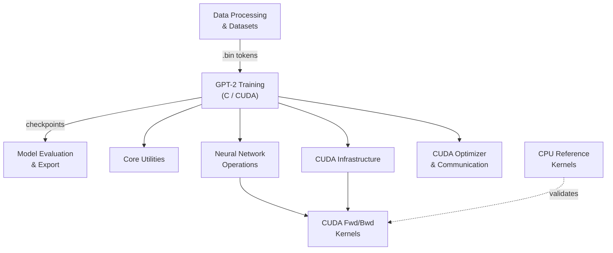

# llm.c — Wiki

# llm.c

llm.c trains GPT-2 and GPT-3 family language models in pure C and CUDA — no PyTorch, no Python runtime, no 245MB framework. The mainline CUDA implementation in `train_gpt2.cu` currently outperforms PyTorch Nightly by ~7%, while the CPU reference in `train_gpt2.c` fits in ~1,000 lines of clean, readable C. A parallel PyTorch reference (`train_gpt2.py`) is maintained for correctness validation and ground-truth artifact generation.

## Architecture

## How It Works

At the top level is [GPT-2 Training](gpt-2-training.md) — the `train_gpt2.c` and `train_gpt2.cu` entry points that orchestrate the full pretraining loop. This layer depends heavily on [Core Utilities](core-utilities.md) for safe I/O wrappers, memory checking, a PyTorch-compatible Mersenne Twister RNG, data loading, learning rate scheduling, and GPU monitoring. Every other module in the codebase builds on these headers.

Below that sits the compute stack. [CUDA Infrastructure](cuda-infrastructure.md) provides the foundational GPU layer — cuBLAS/cuDNN wrappers, device management, and a development sandbox under `dev/cuda/` for kernel prototyping and benchmarking. [Neural Network Operations](neural-network-operations.md) implements each transformer layer (encoder embeddings, LayerNorm, attention, MLP with GELU) as self-contained `.cuh` headers with forward and backward kernel launchers targeting mixed-precision training with configurable `floatX` (BF16 by default, also FP16/FP32/FP8). The actual GPU kernel implementations live in [CUDA Forward Kernels](cuda-forward-kernels.md) and [CUDA Backward Kernels](cuda-backward-kernels.md), each shipping multiple variants — from naive CPU ports to fused, vectorized, low-precision kernels — so you can study each optimization step. Weight updates and multi-GPU communication are handled by [CUDA Optimizer & Communication](cuda-optimizer-and-communication.md), which provides hand-optimized AdamW, fused classifier loss, gradient norm, and all-reduce kernels.

On the data side, [Data Processing & Datasets](data-processing-and-datasets.md) handles downloading, tokenizing, and packaging datasets into binary `.bin` files consumed by the C training code. It supports both GPT-2 (tiktoken, `uint16`) and LLaMA 3 (`uint32`) tokenizer configurations.

For correctness, [CPU Reference Kernels](cpu-reference-kernels.md) provides ground-truth implementations against which all GPU kernels are validated. The [LayerNorm Tutorial](layernorm-tutorial.md) walks through the development workflow used across the entire codebase: derive the math, implement in PyTorch, verify against autograd, then port to C/CUDA.

Once a model is trained, [Model Evaluation & Export](model-evaluation-and-export.md) converts binary checkpoints into loadable HuggingFace models and evaluates them against the Open LLM Leaderboard benchmark suite. [LLaMA Training](llama-training.md) extends the project to LLaMA 3.1 training and inference in PyTorch, with weight export for a companion C implementation — distinguished from GPT-2 by RoPE embeddings, SwiGLU activation, and RMSNorm.

## Key End-to-End Flows

**Pretraining loop.** The dataloader (in Core Utilities) reads tokenized `.bin` shards, shuffles them via the Mersenne Twister RNG, and feeds batches into the training loop. The forward pass runs through encoder embeddings → LayerNorm → attention → residual → LayerNorm → MLP → residual, all in mixed precision with stochastic rounding. The backward pass reverses through these layers. AdamW updates the weights, gradient norms are computed for logging, and checkpoints are saved periodically as binary files.

**Correctness validation.** The PyTorch reference (`train_gpt2.py`) generates ground-truth weight and gradient artifacts. The C test harness (`test_gpt2.c`) runs each layer in isolation, compares outputs against these artifacts, and reports numerical divergence. GPU kernels are additionally validated against their CPU reference counterparts.

**Model evaluation.** Binary checkpoints are converted to HuggingFace format by `export_hf.py`, run through `lm-evaluation-harness` via `run_eval.sh`, and results are summarized by `summarize_eval.py`.

## Getting Started

**Prerequisites:** A C compiler (gcc/clang), CUDA toolkit (12.x recommended), and Python 3 with PyTorch (for data preparation and reference validation).

1. **Prepare data** — Run the data preparation scripts to download and tokenize training data into `.bin` files
2. **Train on CPU** — Compile and run the reference implementation: `gcc -O3 -o train_gpt2 train_gpt2.c -lm && ./train_gpt2`
3. **Train on GPU** — Compile the CUDA version: `nvcc -O3 -o train_gpt2 train_gpt2.cu -lcublas -lcudnn -lcurand && ./train_gpt2`
4. **Validate** — Run `test_gpt2.c` against PyTorch-generated reference artifacts to verify numerical equivalence
5. **Evaluate** — Export checkpoints and run the evaluation pipeline