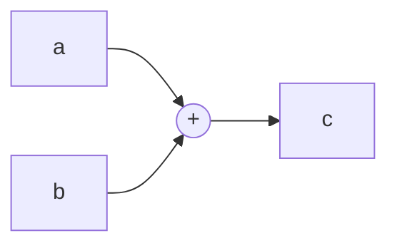

# Autograd Engine

# Autograd Engine

## Overview

The autograd engine provides reverse-mode automatic differentiation for scalar computations. It builds a dynamic computational graph as operations execute, then propagates gradients backward through that graph on demand. This is the core mechanism that enables gradient-based optimization in micrograd's neural network layers.

The entire engine is built around a single class: `Value`.

## Computational Graph Model

Every `Value` instance is a node in a directed acyclic graph. Edges point from child nodes (inputs) to parent nodes (outputs). When you write `c = a + b`, the graph looks like this:



Each node stores:
- `data` — the forward-pass scalar value
- `grad` — the accumulated gradient (initialized to `0`)
- `_backward` — a closure that propagates gradient from this node to its children
- `_prev` — the set of child nodes (inputs to the operation)
- `_op` — a string label for the operation (used for debugging and visualization)

## Forward Operations

Each operation creates a new `Value` node and attaches a `_backward` closure that encodes the local derivative via the chain rule. Non-`Value` operands are automatically wrapped.

### Addition (`__add__`)

```
out = self + other
```

Gradient rule: both inputs receive the full output gradient (derivative of addition is 1).

```python
self.grad += out.grad
other.grad += out.grad
```

### Multiplication (`__mul__`)

```
out = self * other
```

Gradient rule: each input's gradient is the other input's data times the output gradient (product rule).

```python
self.grad += other.data * out.grad
other.grad += self.data * out.grad
```

### Power (`__pow__`)

```
out = self ** other
```

Only `int` and `float` exponents are supported — the exponent is **not** tracked as a differentiable node.

```python
self.grad += (other * self.data**(other-1)) * out.grad
```

### ReLU (`relu`)

```
out = max(0, self)
```

Gradient rule: pass through the output gradient if the forward value was positive, zero otherwise.

```python
self.grad += (out.data > 0) * out.grad
```

## Backward Pass

Calling `backward()` on a `Value` computes gradients for every reachable node in the graph. The algorithm:

1. **Topological sort** — `build_topo` recursively visits children before parents, producing an ordering where every node appears after all nodes it depends on.

2. **Seed the root** — sets `self.grad = 1` (the base case: the derivative of a node with respect to itself is 1).

3. **Reverse traversal** — iterates through the topological ordering in reverse, calling each node's `_backward` closure. This guarantees that when a node propagates its gradient, that gradient is already fully accumulated from all downstream consumers.

```python
def backward(self):
    topo = []
    visited = set()
    def build_topo(v):
        if v not in visited:
            visited.add(v)
            for child in v._prev:
                build_topo(child)
            topo.append(v)
    build_topo(self)

    self.grad = 1
    for v in reversed(topo):
        v._backward()
```

### Gradient Accumulation

Note that `_backward` closures use `+=` rather than `=`. This is critical: if a `Value` is consumed by multiple downstream operations, its gradient must accumulate contributions from all of them. For example, in `y = x + x`, the node `x` appears as both children of `+`, and its gradient correctly receives `out.grad` twice.

### Important: Reset Gradients Between Calls

`backward()` does **not** zero out gradients before computing. If you call `backward()` multiple times, gradients will accumulate across calls. You must manually zero all node gradients before re-running backward:

```python
# Reset before each backward pass
for v in model_parameters:
    v.grad = 0
loss.backward()
```

## Derived Operators

Several operators are implemented by composing the primitive operations above. This means they get correct backward pass behavior for free:

| Expression | Implementation | Notes |
|---|---|---|
| `-a` | `a * -1` | Negation via scalar multiply |
| `a + b` (reversed) | `b + a` | `__radd__` handles `2 + Value(3)` |
| `a - b` | `a + (-b)` | Subtraction via addition and negation |
| `b - a` (reversed) | `b + (-a)` | `__rsub__` handles `5 - Value(3)` |
| `a * b` (reversed) | `b * a` | `__rmul__` handles `2 * Value(3)` |
| `a / b` | `a * b**-1` | Division via multiply and power |
| `b / a` (reversed) | `b * a**-1` | `__rtruediv__` handles `6 / Value(3)` |

Because division is expressed as `a * b**-1`, the gradient flows through both the multiplication and power backward rules. This works correctly but creates an extra intermediate node compared to a native division operation.

## Usage Example

```python
from micrograd.engine import Value

# Forward pass
x = Value(2.0)
y = Value(3.0)
z = x * y + x.relu()   # graph: mul -> add <- relu

# Backward pass
z.backward()

print(x.grad)  # dz/dx = y + (1 if x > 0 else 0) = 3 + 1 = 4
print(y.grad)  # dz/dy = x = 2
```

## Integration with the Codebase

The `Value` class is the foundation for micrograd's neural network module (`micrograd/nn.py`). Network parameters are `Value` instances, and loss computations produce a single `Value` whose `backward()` method drives parameter updates in training loops:

```python
# Typical training step
for p in model.parameters():
    p.grad = 0          # zero gradients
loss = ...              # forward pass (builds graph of Values)
loss.backward()         # backward pass (fills .grad on all parameters)
for p in model.parameters():
    p.data -= lr * p.grad  # gradient descent step
```