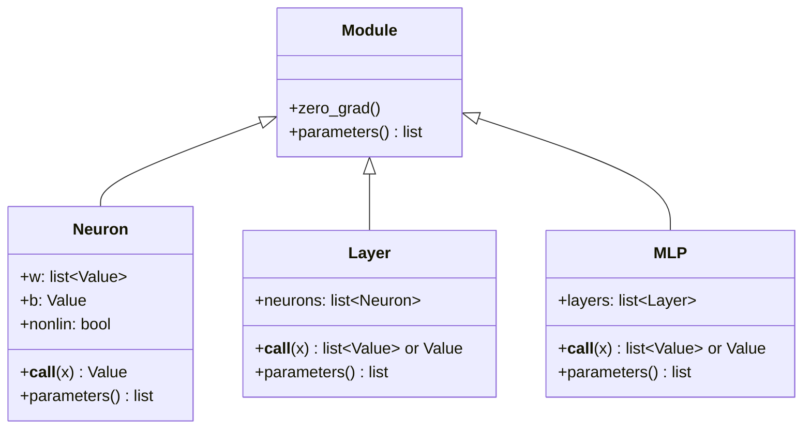

# Neural Network

# Neural Network Module

## Overview

The `micrograd.nn` module provides a layered neural network API built on top of the `Value` autograd engine. It implements a classic feedforward architecture — `Neuron` → `Layer` → `MLP` — where every weight, bias, and activation is a differentiable `Value` object. This means the entire computation graph is traceable, and gradients flow through the network automatically.

## Class Hierarchy



All network components inherit from `Module`, which provides two shared behaviors:

- **`parameters()`** — returns all trainable `Value` objects in the component. Subclasses override this to aggregate parameters from their sub-components.
- **`zero_grad()`** — resets the gradient of every parameter to `0`. Call this before each backward pass to avoid accumulating gradients across training steps.

## Neuron

A single neuron computes `act = Σ(wᵢ · xᵢ) + b`, then optionally applies a ReLU activation.

```python
from micrograd.nn import Neuron

n = Neuron(nin=3, nonlin=True)  # 3 inputs, ReLU activation
out = n([0.5, -0.3, 0.8])       # returns a Value
```

**Constructor:** `Neuron(nin, nonlin=True)`

| Parameter | Type | Default | Description |
|-----------|------|---------|-------------|
| `nin` | `int` | required | Number of input connections |
| `nonlin` | `bool` | `True` | If `True`, applies `relu()` to the output; if `False`, returns the raw linear activation |

**Internal state:**

- `self.w` — list of `nin` `Value` objects, initialized with `random.uniform(-1, 1)`
- `self.b` — a single `Value` initialized to `0`

**Behavior notes:**

- The `nonlin` flag controls whether the neuron is nonlinear. When `nonlin=True`, the neuron applies `Value.relu()` to the weighted sum, making it a `ReLUNeuron`. When `False`, it's a `LinearNeuron`. This distinction is reflected in `__repr__`.
- The `sum()` built-in is used with `self.b` as the start value, so the bias is included directly in the accumulation rather than added separately.

## Layer

A `Layer` wraps multiple `Neuron` objects that all share the same input dimension.

```python
layer = Layer(nin=3, nout=2, nonlin=True)
out = layer([0.5, -0.3, 0.8])  # returns a list of 2 Values
```

**Constructor:** `Layer(nin, nout, **kwargs)`

| Parameter | Type | Description |
|-----------|------|-------------|
| `nin` | `int` | Number of inputs per neuron |
| `nout` | `int` | Number of neurons in the layer |
| `**kwargs` | | Forwarded to each `Neuron` constructor (e.g., `nonlin=True`) |

**Output behavior:**

- If `nout == 1`, `__call__` returns a single `Value` (unwrapped from the list).
- If `nout > 1`, `__call__` returns a `list[Value]`.

This unwrapping convention means single-output layers integrate seamlessly into both the internal MLP pipeline and direct usage.

## MLP (Multi-Layer Perceptron)

An `MLP` stacks multiple `Layer` objects into a fully-connected feedforward network.

```python
model = MLP(nin=3, nouts=[4, 4, 1])
out = model([0.5, -0.3, 0.8])  # returns a single Value (last layer has nout=1)
```

**Constructor:** `MLP(nin, nouts)`

| Parameter | Type | Description |
|-----------|------|-------------|
| `nin` | `int` | Dimension of the input |
| `nouts` | `list[int]` | Sizes of each hidden layer and the output layer |

**Activation convention:** All layers use ReLU activation (`nonlin=True`) **except the final layer**, which is linear (`nonlin=False`). This is the standard convention for regression and binary classification — hidden layers learn nonlinear representations, and the output layer produces raw scores.

The implementation achieves this via:

```python
self.layers = [Layer(sz[i], sz[i+1], nonlin=i!=len(nouts)-1) for i in range(len(nouts))]
```

For `MLP(3, [4, 4, 1])`, this produces:

| Layer | Shape | Activation |
|-------|-------|------------|
| 0 | 3 → 4 | ReLU |
| 1 | 4 → 4 | ReLU |
| 2 | 4 → 1 | Linear |

**Forward pass:** `__call__` sequentially feeds the output of each layer as input to the next, returning the final result.

## Parameter Collection

Every component implements `parameters()` by aggregating from its children:

| Component | Implementation |
|-----------|---------------|
| `Module` | Returns `[]` (base case) |
| `Neuron` | Returns `self.w + [self.b]` — all weights and the bias |
| `Layer` | Returns `[p for n in self.neurons for p in n.parameters()]` |
| `MLP` | Returns `[p for layer in self.layers for p in layer.parameters()]` |

This recursive aggregation means calling `model.parameters()` on an `MLP` collects every trainable `Value` in the entire network into a flat list. This is used by `zero_grad()` and is typically what you iterate over in a training loop for parameter updates.

## Typical Training Loop

```python
from micrograd.nn import MLP

model = MLP(nin=2, nouts=[16, 1])

for step in range(100):
    # Forward pass
    predictions = [model(x) for x in inputs]

    # Loss computation (example: MSE)
    loss = sum((pred - target) ** 2 for pred, target in zip(predictions, targets))

    # Backward pass
    model.zero_grad()
    loss.backward()

    # Parameter update (SGD)
    for p in model.parameters():
        p.data -= learning_rate * p.grad
```

**Important:** Always call `model.zero_grad()` *before* `loss.backward()`. The `Value` gradient accumulates by default — skipping `zero_grad()` causes gradients from previous steps to persist and corrupt the update.

## Relationship to the Autograd Engine

This module depends on `micrograd.engine.Value` for all differentiable computation. Every weight and bias is a `Value`, and all arithmetic in `Neuron.__call__` (`wi * xi`, `sum`, `relu`) is performed through `Value`'s overloaded operators. This means the neural network module has no knowledge of gradient computation — it simply builds the forward graph, and `Value.backward()` handles the rest.