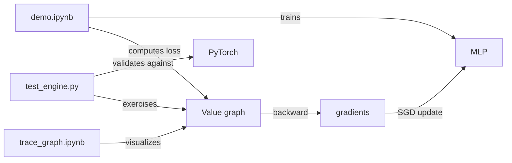

# Other

# Supporting Infrastructure

The micrograd repository includes several supporting files beyond the core `engine` and `nn` modules: a demo notebook, a graph visualization utility, unit tests, and packaging configuration. This document covers each of these components.

## Demo Notebook (`demo.ipynb`)

The demo notebook provides an end-to-end walkthrough of training a binary classifier on the two-moons dataset using micrograd's neural network API.

### Workflow

1. **Dataset generation** — Uses `sklearn.datasets.make_moons` to create 100 samples with `noise=0.1`. Labels are transformed from `{0, 1}` to `{-1, 1}` to match the SVM max-margin loss convention.

2. **Model initialization** — Creates a 2-layer MLP:
   ```python
   model = MLP(2, [16, 16, 1])
   ```
   This yields 337 total parameters (weights + biases across all neurons).

3. **Loss computation** — The `loss()` function computes:
   - **Data loss**: SVM max-margin loss — `sum((1 + -yi * scorei).relu()) / N`
   - **Regularization**: L2 penalty — `1e-4 * sum(p*p for p in model.parameters())`
   - **Accuracy**: Fraction of samples where `sign(score) == sign(label)`

   An optional `batch_size` argument enables mini-batch SGD by randomly sampling a subset of indices.

4. **Optimization loop** — Vanilla SGD with a linearly decaying learning rate:
   ```python
   learning_rate = 1.0 - 0.9 * k / 100
   for p in model.parameters():
       p.data -= learning_rate * p.grad
   ```
   The model reaches 100% accuracy within ~50 steps on this dataset.

5. **Decision boundary visualization** — Evaluates the model on a dense grid and plots the resulting classification regions using `matplotlib.contourf`.

### Key pattern: wrapping raw data as `Value` objects

The demo shows the essential pattern for feeding data into micrograd models:

```python
inputs = [list(map(Value, xrow)) for xrow in Xb]
scores = list(map(model, inputs))
```

Each row of the input array is converted into a list of `Value` objects, then passed through the model. This wrapping is necessary because `Value` is the only type that participates in the autograd computation graph.

---

## Graph Visualization (`trace_graph.ipynb`)

The trace graph notebook provides utilities for rendering the computation DAG produced by `Value` objects using Graphviz.

### `trace(root)`

Recursively walks backward through the computation graph starting from `root`, collecting all `Value` nodes and the edges between them.

**Parameters:**
- `root` — A `Value` node (typically the output of a forward pass)

**Returns:**
- A tuple `(nodes, edges)` where `nodes` is a `set` of `Value` objects and `edges` is a `set` of `(child, parent)` tuples representing `_prev` relationships.

### `draw_dot(root, format='svg', rankdir='LR')`

Generates a Graphviz `Digraph` from the computation graph rooted at `root`.

**Parameters:**
- `root` — A `Value` node to trace from
- `format` — Output format (`'svg'`, `'png'`, etc.)
- `rankdir` — Graph direction: `'LR'` (left-to-right) or `'TB'` (top-to-bottom)

**Node rendering:**
Each `Value` node is drawn as a record-shaped box displaying both `data` and `grad` to 4 decimal places. Operation nodes (labeled with the `_op` string) are inserted between operands and their result.

**Usage:**
```python
from micrograd.engine import Value
from micrograd import nn

n = nn.Neuron(2)
x = [Value(1.0), Value(-2.0)]
y = n(x)
y.backward()
dot = draw_dot(y)
dot.render('gout')  # writes gout.svg
```

**Dependencies:** Requires the `graphviz` Python package and the Graphviz system binary (install via `brew install graphviz` on macOS).

---

## Unit Tests (`test/test_engine.py`)

The test suite validates micrograd's gradient computation against PyTorch as a reference implementation. Both tests follow the same pattern: construct an identical expression graph in micrograd and PyTorch, run forward and backward passes, then assert numerical equivalence.

### `test_sanity_check()`

Constructs the expression:
```
x = -4.0
z = 2*x + 2 + x
q = relu(z) + z*x
h = relu(z*z)
y = h + q + q*x
```

Asserts that `y.data` and `x.grad` match between micrograd and PyTorch exactly (floating-point equality).

### `test_more_ops()`

Constructs a more complex expression exercising addition, multiplication, exponentiation, ReLU, subtraction, and division:
```
a = -4.0, b = 2.0
c = a + b
d = a*b + b**3
c += c + 1
c += 1 + c + (-a)
d += d*2 + relu(b + a)
d += 3*d + relu(b - a)
e = c - d
f = e**2
g = f / 2.0
g += 10.0 / f
```

Asserts that `g.data`, `a.grad`, and `b.grad` match PyTorch within a tolerance of `1e-6`.

### Running the tests

PyTorch must be installed as a test dependency:

```bash
pip install torch
python -m pytest
```

---

## Package Configuration (`setup.py`)

The package is configured for distribution via `setuptools`:

| Field | Value |
|---|---|
| Name | `micrograd` |
| Version | `0.1.0` |
| Author | Andrej Karpathy |
| Python | >= 3.6 |
| License | MIT |
| Long description | Sourced from `README.md` |

The `micrograd` package itself is discovered automatically via `setuptools.find_packages()`. The empty `__init__.py` means the package namespace is flat — users import directly from submodules:

```python
from micrograd.engine import Value
from micrograd.nn import Neuron, Layer, MLP
```

---

## Architecture Overview



The demo and test notebooks are the primary consumers of the core library. The demo exercises the full training loop (forward → loss → backward → update), while the tests focus on correctness of individual gradient computations. The trace graph utility is a debugging/education tool that renders the `Value` DAG after a backward pass.