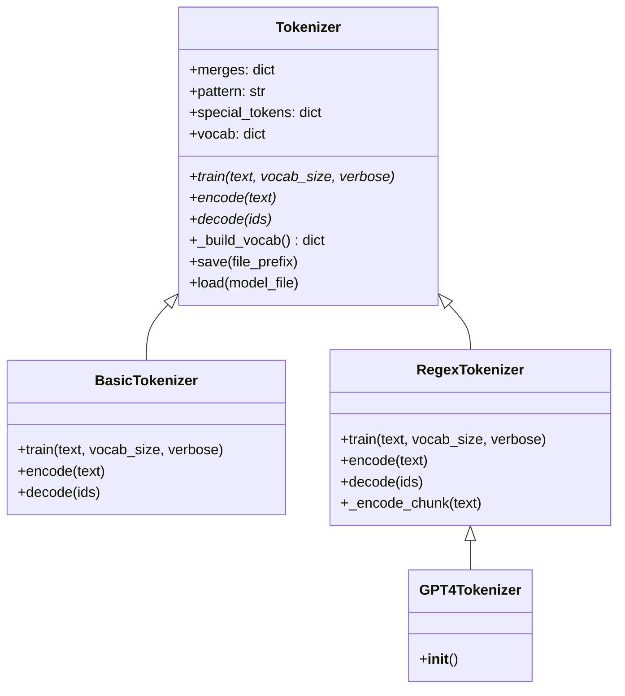

# Core Tokenizer

# Core Tokenizer (`minbpe/base.py`)

## Purpose

This module provides the foundational layer for all tokenizers in minbpe. It defines the abstract `Tokenizer` base class that `BasicTokenizer`, `RegexTokenizer`, and `GPT4Tokenizer` inherit from, and it contains the shared BPE helper functions (`get_stats`, `merge`) that power the core byte-pair encoding algorithm. It also handles serialization — saving and loading trained tokenizer models.

## Architecture



All concrete tokenizers delegate to the base class for vocabulary construction and model persistence. The BPE primitives (`get_stats`, `merge`) are free functions called by both `BasicTokenizer` and `RegexTokenizer` during training and encoding.

## BPE Helper Functions

### `get_stats(ids, counts=None)`

Counts consecutive byte pairs in a token ID sequence. This is the core statistics-gathering step for BPE training and encoding.

**Parameters:**
- `ids` — `list[int]`: A sequence of integer token IDs.
- `counts` — `dict | None`: An existing pair-count dictionary to update. If `None`, a fresh dictionary is created.

**Returns:** `dict[tuple[int, int], int]` — Mapping of each consecutive pair to its frequency.

**Example:**
```python
get_stats([1, 2, 3, 1, 2])
# {(1, 2): 2, (2, 3): 1, (3, 1): 1}
```

**Callers:** `BasicTokenizer.train`, `BasicTokenizer.encode`, `RegexTokenizer.train`, `RegexTokenizer._encode_chunk`.

### `merge(ids, pair, idx)`

Replaces all consecutive occurrences of `pair` in `ids` with the single integer `idx`. This is the core merge operation in BPE — once a pair is selected for merging, every instance of that pair collapses into one token.

**Parameters:**
- `ids` — `list[int]`: The current token ID sequence.
- `pair` — `tuple[int, int]`: The pair to merge.
- `idx` — `int`: The new token ID to substitute for the pair.

**Returns:** `list[int]` — A new list with all occurrences of `pair` replaced by `idx`.

**Example:**
```python
merge([1, 2, 3, 1, 2], (1, 2), 4)
# [4, 3, 4]
```

**Callers:** `BasicTokenizer.train`, `BasicTokenizer.encode`, `RegexTokenizer.train`, `RegexTokenizer._encode_chunk`.

### `replace_control_characters(s)`

Escapes Unicode control characters (category starting with `"C"`) into `\uXXXX` escape sequences. Used internally by `render_token` to ensure display strings don't contain invisible or disruptive characters.

### `render_token(t: bytes)`

Converts a raw byte token into a human-readable string for display. Decodes bytes as UTF-8 (with replacement for invalid sequences) and escapes control characters. Used in `save` to write the `.vocab` file and by `GPT4Tokenizer.save_vocab`.

> **Note:** This is a lossy transformation — partial UTF-8 sequences get replaced with `�`. The `.vocab` file is for human inspection only and cannot be used to reconstruct the tokenizer.

## Tokenizer Base Class

### Initialization

```python
tokenizer = Tokenizer()
```

Sets up the default state:
- `merges` — `dict[tuple[int, int], int]`: Empty. Maps a pair of token IDs to the merged token ID. Populated during `train` or `load`.
- `pattern` — `str`: Empty. Set by `RegexTokenizer` subclasses to hold the pre-tokenization regex.
- `special_tokens` — `dict[str, int]`: Empty. Maps special token strings (e.g. `"<|endoftext