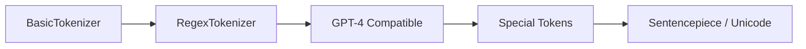

# Other — exercise.md

# Exercise: Build Your Own GPT-4 Tokenizer

## Overview

This exercise walks through implementing a Byte Pair Encoding (BPE) tokenizer from scratch, progressing from a basic implementation to one that exactly matches OpenAI's GPT-4 tokenizer (`cl100k_base`). Each step builds on the previous, introducing new concepts and complexity.

## Progression



---

## Step 1 — BasicTokenizer

Implement the foundational BPE tokenizer with three methods:

- **`train(text, vocab_size, verbose=False)`** — Learns merge rules from raw text by iteratively finding the most frequent byte pair and merging it, until `vocab_size` is reached.
- **`encode(text)`** — Converts text to a sequence of integer token IDs using the learned merges.
- **`decode(ids)`** — Reconstructs text from a sequence of token IDs.

**Test data:** `tests/taylorswift.txt` is provided as a default corpus.

At this stage, merges operate on raw UTF-8 bytes with no preprocessing. Inspect the merged tokens visually — they should reflect common byte sequences in the training data, but may span across categories (e.g., letters merging with punctuation).

---

## Step 2 — RegexTokenizer

Upgrade `BasicTokenizer` into a `RegexTokenizer` by introducing a regex-based pre-splitting step. The text is split into chunks matching the pattern, and BPE is applied independently to each chunk before concatenating results.

**GPT-4 split pattern:**

```python
GPT4_SPLIT_PATTERN = r"""'(?i:[sdmt]|ll|ve|re)|[^\r\n\p{L}\p{N}]?+\p{L}+|\p{N}{1,3}| ?[^\s\p{L}\p{N}]++[\r\n]*|\s*[\r\n]|\s+(?!\S)|\s+"""
```

This pattern ensures tokens never cross category boundaries (letters, numbers, punctuation, whitespace). After retraining, verify that no merged token contains mixed categories.

---

## Step 3 — Match tiktoken Output

Load GPT-4's merges and verify that `encode` and `decode` produce identical results to `tiktoken`:

```python
import tiktoken
enc = tiktoken.get_encoding("cl100k_base")
ids = enc.encode("hello world!!!? (안녕하세요!) lol123 😉")
text = enc.decode(ids)
```

### Two complications

1. **Recovering merges from ranks.** The GPT-4 tokenizer stores `_mergeable_ranks` (a mapping of byte sequences to their rank), not raw merge pairs. Use the `recover_merges` function in `minbpe/gpt4.py` to reconstruct the ordered list of merges. See [tiktoken issue #60](https://github.com/openai/tiktoken/issues/60) and [minbpe issue #11](https://github.com/karpathy/minbpe/issues/11#issuecomment-1950805306) for the algorithmic details.

2. **Byte permutation.** GPT-4 applies a shuffle to the raw 256 byte values. Recover it from the first 256 entries of `_mergeable_ranks`:

   ```python
   byte_shuffle = {i: enc._mergeable_ranks[bytes([i])] for i in range(256)}
   ```

   Both `encode` and `decode` must apply this permutation. Reference `minbpe/gpt4.py` for the implementation pattern.

---

## Step 4 — Special Tokens (Optional)

Add support for special tokens (e.g., `<|endoftext