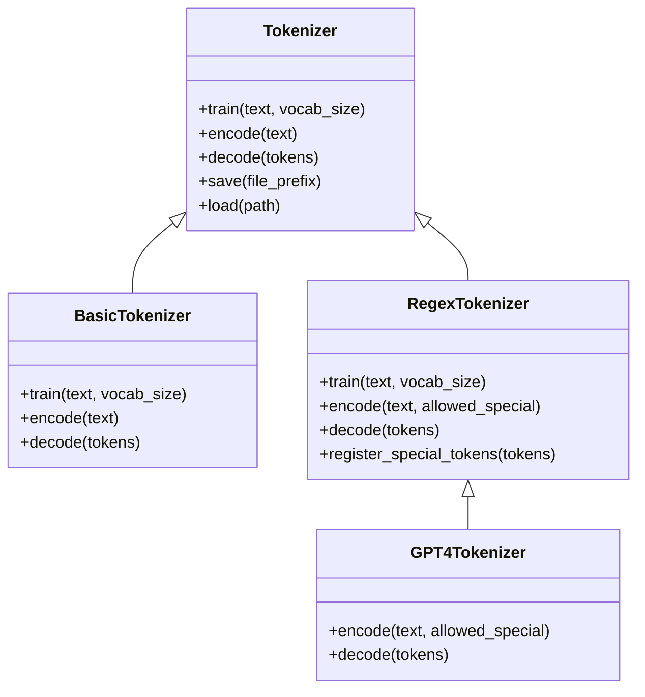

# Other — README.md

# minbpe

Minimal, clean implementation of the byte-level Byte Pair Encoding (BPE) algorithm used in LLM tokenization. The algorithm operates on UTF-8 encoded strings and was popularized for LLMs by the [GPT-2 paper](https://d4mucfpksywv.cloudfront.net/better-language-models/language_models_are_unsupervised_multitask_learners.pdf), with origins in [Sennrich et al. 2015](https://arxiv.org/abs/1508.07909). All modern LLMs (GPT, Llama, Mistral) use this algorithm for tokenizer training.

## Architecture



## Token ID Layout

All tokenizers reserve the first 256 token IDs (0–255) for individual byte values. Merge tokens begin at ID 256 and increment sequentially. Special tokens, if any, are appended after the last merge token.

| Range | Content | Example |
|---|---|---|
| 0–255 | Raw byte tokens | `a` → 97, `b` → 98 |
| 256–(vocab_size − 1) | Merge tokens | `(a, a)` → 256 |
| vocab_size+ | Special tokens | `<\|endoftext\|>` → 100257 |

## Module Reference

### `minbpe/base.py` — `Tokenizer`

Base class providing the interface contract and shared utilities. Contains `train`, `encode`, and `decode` stubs (raise `NotImplementedError`), plus `save`/`load` for serialization. Not intended for direct instantiation — inherit from this class to create a concrete tokenizer.

### `minbpe/basic.py` — `BasicTokenizer`

Straightforward BPE implementation operating directly on text. No regex preprocessing, no special token handling. Suitable for simple use cases or educational exploration.

```python
from minbpe import BasicTokenizer
tokenizer = BasicTokenizer()
tokenizer.train(text, vocab_size=256 + 3)  # 256 byte tokens + 3 merges
tokens = tokenizer.encode("aaabdaaabac")  # → [258, 100, 258, 97, 99]
text = tokenizer.decode(tokens)            # → "aaabdaaabac"
tokenizer.save("toy")  # writes toy.model and toy.vocab
```

### `minbpe/regex.py` — `RegexTokenizer`

BPE with a regex-based preprocessing stage that splits input text by category (letters, numbers, punctuation) before applying merges. This prevents merges across category boundaries — the approach introduced in GPT-2 and still used in GPT-4. Also handles special tokens.

```python
from minbpe import RegexTokenizer
tokenizer = RegexTokenizer()
tokenizer.train(very_long_string, vocab_size=32768)
tokenizer.encode("hello world")
tokenizer.decode([1000, 2000, 3000])
tokenizer.save("tok32k")
tokenizer.load("tok32k.model")
```

**Special tokens** are registered after training, with IDs starting at `vocab_size`:

```python
tokenizer.register_special_tokens({"<|endoft