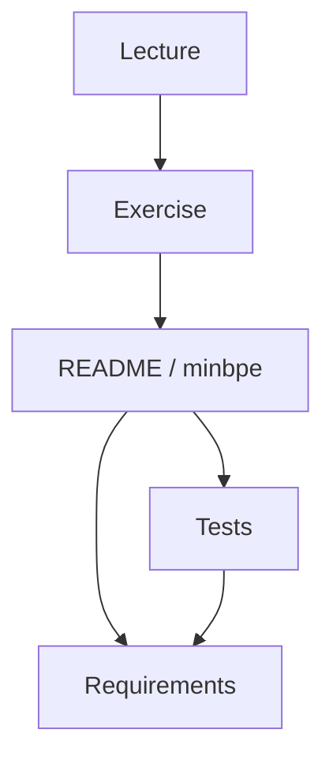

# Other

# Other Module

The **Other** module provides a complete implementation and learning resource for Byte Pair Encoding (BPE) tokenization as used in modern LLMs. It combines a working tokenizer library with instructional materials and test coverage.

## Sub-modules

- **[README](README.md)** — The `minbpe` library: a minimal BPE implementation with `Tokenizer`, `BasicTokenizer`, and `RegexTokenizer` classes providing `train`, `encode`, `decode`, `save`, and `load` operations.
- **[Exercise](exercise.md)** — A step-by-step guide to building a GPT-4–compatible BPE tokenizer from scratch, progressing from `BasicTokenizer` through regex-based splitting, special token handling, and Unicode/Sentencepiece considerations.
- **[Lecture](lecture.md)** — Conceptual background on LLM tokenization, covering character-level baselines, BPE motivation, and visual demonstrations of modern tokenizer behavior.
- **[Requirements](requirements.md)** — Python dependency declarations (`regex` for advanced pattern matching, `tiktoken` for GPT-4 parity verification).
- **[Tests](tests.md)** — Test suite validating encoding/decoding identity, GPT-4 tiktoken parity, special token handling, and save/load serialization using a real-world text fixture.

## How It Fits Together

The module is structured as a learning pipeline that also produces a usable library:

1. **[Lecture](lecture.md)** provides the conceptual foundation — why tokenization matters and how BPE works.
2. **[Exercise](exercise.md)** guides you through implementing each concept, arriving at a GPT-4–compatible tokenizer.
3. **[README](README.md)** documents the finished `minbpe` library that results from that implementation work.
4. **[Tests](tests.md)** validates the library against correctness properties (encode/decode round-trip) and external reference (`tiktoken` GPT-4 parity).
5. **[Requirements](requirements.md)** declares the runtime dependencies (`regex`, `tiktoken`) needed by both the library and its tests.

## Key Cross-Module Workflows

- **Training and encoding**: The `BasicTokenizer.train` and `RegexTokenizer.train` methods (documented in [README](README.md)) consume raw text to learn merge rules; the resulting tokenizers are then exercised by the test suite in [Tests](tests.md).
- **GPT-4 parity verification**: [Tests](tests.md) imports `tiktoken` (from [Requirements](requirements.md)) to compare `minbpe` output against OpenAI's `cl100k_base` model, ensuring the implementation matches production behavior.
- **Serialization round-trip**: Tokenizers saved via `save`/`load` (see [README](README.md)) are validated for identity in [Tests](tests.md), confirming that persisted state reproduces identical encoding.