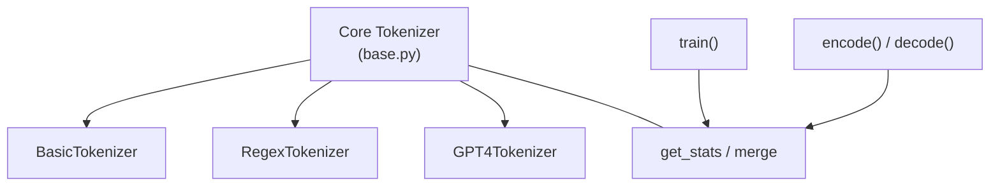

# minbpe — Wiki

# minbpe

Welcome! **minbpe** is a minimal, clean implementation of the byte-level Byte Pair Encoding (BPE) algorithm used by all modern LLM tokenizers (GPT-4, Llama, Mistral, etc.). If you've ever wondered how text becomes tokens in an LLM pipeline, you're in the right place.

The repository provides working tokenizer implementations you can train, encode with, and decode with — plus an [exercise](exercise.md) to build one from scratch yourself.

## Architecture



Everything rests on the [Core Tokenizer](core-tokenizer.md) (`minbpe/base.py`), which defines the abstract `Tokenizer` base class and the shared BPE utilities `get_stats` and `merge`. The three concrete implementations — `BasicTokenizer`, `RegexTokenizer`, and `GPT4Tokenizer` — all inherit from it. You can read about their differences and capabilities in [Tokenizer Implementations](tokenizer-implementations.md).

## Key Flows

There are two end-to-end flows that matter:

**Training** — When you call `train(text)` on a tokenizer, it repeatedly finds the most frequent byte-pair across the input, records that pair as a merge rule, and replaces all occurrences. This loop relies on `get_stats` to count pairs and `merge` to apply replacements, both living in the core module.

**Encoding / Decoding** — Once a tokenizer has merges (either trained or loaded), `encode(text)` splits the input, applies all learned merge rules in priority order, and emits integer tokens. `decode(tokens)` reverses the process. Under the hood, both paths flow through the same `get_stats` → `merge` pipeline that training uses.

The [GPT4Tokenizer](tokenizer-implementations.md) adds one wrinkle: its `__init__` immediately loads a pretrained vocabulary and calls `_build_vocab`, which triggers `encode` to build the initial token mapping. This is why you see the `__init__ → encode` cross-module path.

## Getting Started

```bash
git clone https://github.com/karpathy/minbpe.git
cd minbpe
python -c "from minbpe.regex import RegexTokenizer; t = RegexTokenizer(); t.train(open('some_text.txt').read(), 256); print(t.encode('hello world'))"
```

No external dependencies are required — the project runs on the Python standard library alone.

## Where to Go Next

- **[Core Tokenizer](core-tokenizer.md)** — Understand the base class, serialization, and the `get_stats`/`merge` helpers.
- **[Tokenizer Implementations](tokenizer-implementations.md)** — Compare `BasicTokenizer`, `RegexTokenizer`, and `GPT4Tokenizer` and learn when to use each.
- **[Exercise](exercise.md)** — Build a GPT-4–compatible tokenizer step by step.