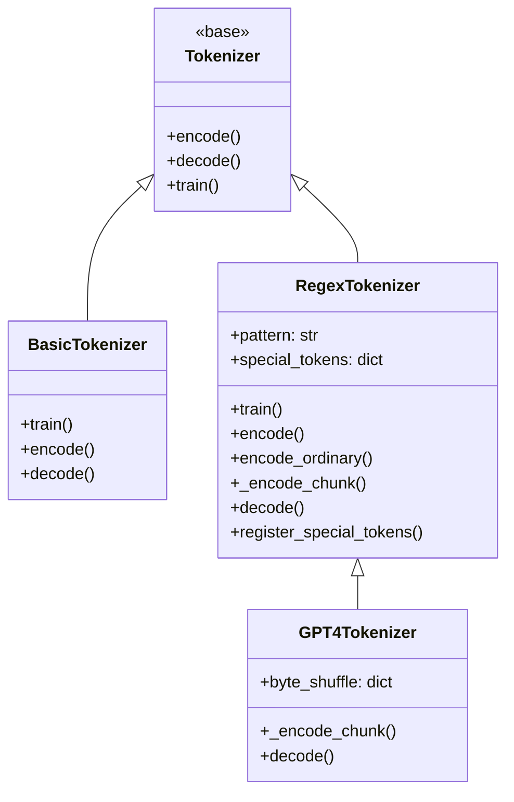

# Tokenizer Implementations

# Tokenizer Implementations

## Overview

This module provides three byte-level Byte Pair Encoding (BPE) tokenizer implementations with increasing capability. All three inherit from the `Tokenizer` base class and rely on the shared utilities `get_stats` and `merge` from `minbpe/base.py`.

| Tokenizer | Regex Splitting | Special Tokens | Pretrained | Byte Shuffling |
|---|---|---|---|---|
| `BasicTokenizer` | ✗ | ✗ | ✗ | ✗ |
| `RegexTokenizer` | ✓ | ✓ | ✗ | ✗ |
| `GPT4Tokenizer` | ✓ | ✓ | ✓ (cl100k_base) | ✓ |

---

## BasicTokenizer

The simplest BPE implementation. It operates directly on raw UTF-8 bytes with no preprocessing — no regex splitting, no special tokens. This is useful for understanding the core BPE algorithm in isolation.

### Training

`train(text, vocab_size, verbose=False)` builds the merge table from scratch:

1. Encodes the input text to raw bytes (integers 0–255).
2. Iteratively finds the most frequent consecutive pair via `get_stats`.
3. Merges all occurrences of that pair into a new token (starting at ID 256) via `merge`.
4. Repeats for `vocab_size - 256` merges.

The resulting `merges` dict maps `(int, int) → int` and `vocab` maps `int → bytes`.

### Encoding

`encode(text)` converts a string to token IDs by:

1. Converting text to a list of byte integers.
2. Repeatedly finding the pair with the **lowest merge index** (i.e., the pair that was learned earliest during training) and merging it.
3. Stopping when no mergeable pair remains.

This lowest-index-first strategy ensures deterministic, order-preserving encoding that matches the training merge sequence.

### Decoding

`decode(ids)` joins the byte sequences for each token ID from `self.vocab`, then decodes the resulting bytes as UTF-8 (with replacement for invalid sequences).

---

## RegexTokenizer

Extends `BasicTokenizer` with two critical features for practical tokenization: regex-based text splitting and special token handling.

### Regex Splitting

The constructor accepts an optional `pattern` string (defaults to `GPT4_SPLIT_PATTERN`). The pattern is compiled and used in both training and encoding to split text into chunks before BPE is applied. This prevents merges from crossing chunk boundaries — for example, a merge won't span across a word boundary or a number sequence.

Two predefined patterns are provided as module-level constants:

- **`GPT2_SPLIT_PATTERN`** — the original GPT-2 splitting rule.
- **`GPT4_SPLIT_PATTERN`** — the updated GPT-4 rule (default). Handles contractions case-insensitively, limits number tokenization to 1–3 digits, and improves whitespace handling.

### Training

`train(text, vocab_size, verbose=False)` differs from `BasicTokenizer.train` in one key way: the text is first split into chunks via `re.findall(self.compiled_pattern, text)`. Each chunk is independently converted to byte IDs, and pair statistics are aggregated across all chunks. Merges still operate globally, but the chunk structure is preserved so that `merge` only replaces pairs within each chunk.

### Encoding

Three methods form the encoding pipeline:

**`_encode_chunk(text_bytes)`** — the core BPE merge loop. Takes raw bytes, applies merges in lowest-index-first order (identical logic to `BasicTokenizer.encode`), and returns token IDs. This is the method that `GPT4Tokenizer` overrides to inject byte shuffling.

**`encode_ordinary(text)`** — splits text into regex chunks, encodes each chunk via `_encode_chunk`, and concatenates the results. Ignores special tokens entirely.

**`encode(text, allowed_special="none_raise")`** — the full encoding path with special token handling. The `allowed_special` parameter controls behavior:

| Value | Behavior |
|---|---|
| `"none_raise"` (default) | Raises `AssertionError` if any special token appears in text |
| `"none"` | Silently ignores special tokens, encodes them as ordinary text |
| `"all"` | Recognizes all registered special tokens |
| `set` (e.g., `{"<|endoftext