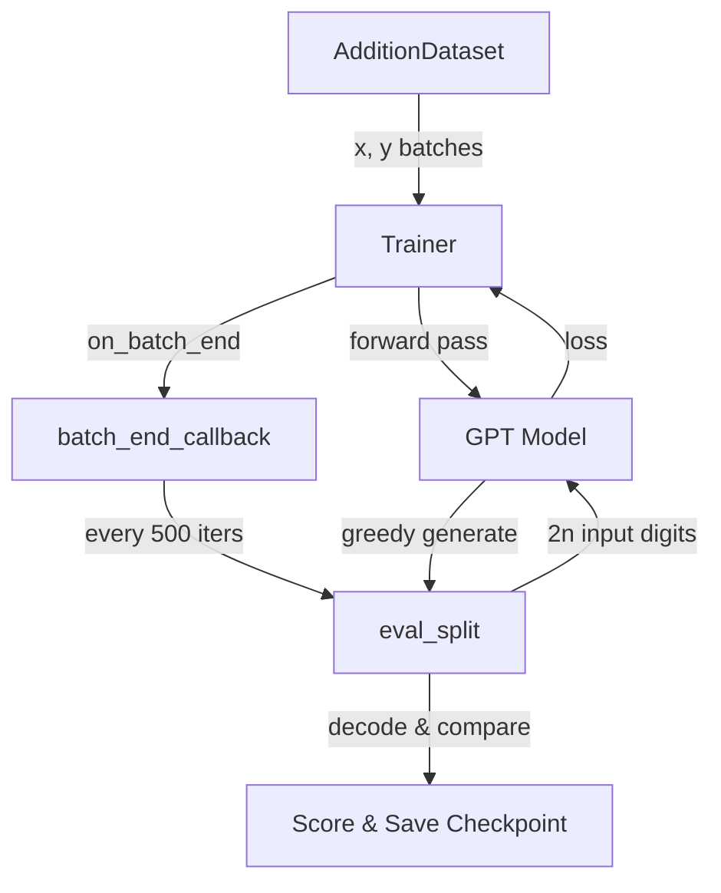

# Addition Project

# Addition Project

Trains a GPT model to perform n-digit addition by encoding arithmetic problems as flat digit sequences and learning to predict the result autoregressively.

## Overview

Rather than teaching a model symbolic math, this project frames addition as a sequence completion task. Two n-digit numbers are concatenated into a token sequence, and the model must generate the digits of their sum. The key insight is that the sum's digits are **reversed** during encoding, aligning the causal generation order with the right-to-left carry propagation of manual addition — making the pattern far easier for an autoregressive model to learn.

## Encoding Scheme

For `ndigit=2`, every example is a string of exactly `3 * ndigit + 1 - 1 = 6` tokens (input to the model) predicting 6 next-token targets, though only the result positions contribute to loss.

**Example**: `85 + 50 = 135`

| Component | Raw | Encoded | Notes |
|-----------|-----|---------|-------|
| First number (a) | 85 | `85` | Zero-padded to `ndigit` |
| Second number (b) | 50 | `50` | Zero-padded to `ndigit` |
| Sum (c) | 135 | `531` | Zero-padded to `ndigit+1`, then **reversed** |
| Full sequence | — | `8550531` | Concatenation of a + b + reversed(c) |

**Example**: `6 + 39 = 45` → encoded as `0639054` (padding ensures uniform length).

At inference, the first `2 * ndigit` digits are fed to the model, which generates the remaining `ndigit + 1` digits via greedy decoding. The generated digits are then reversed back to recover the sum in normal order.

## Architecture



## Configuration

`get_config()` assembles a nested configuration from three sources:

| Section | Source | Key Defaults |
|---------|--------|-------------|
| `system` | Inline | `seed=3407`, `work_dir='./out/adder'` |
| `data` | `AdditionDataset.get_default_config()` | `ndigit=2` |
| `model` | `GPT.get_default_config()` | `model_type='gpt-nano'` |
| `trainer` | `Trainer.get_default_config()` | `learning_rate=5e-4` |

Config values can be overridden from the command line via `config.merge_from_args(sys.argv[1:])`.

## AdditionDataset

`AdditionDataset` is a `torch.utils.data.Dataset` that enumerates all possible n-digit addition problems and splits them into train/test sets.

### Problem Space

For `ndigit=n`, there are `(10^n)^2` unique addition problems (every pair of n-digit numbers). A fixed random permutation (seed 1337) shuffles these, and the first 20% (capped at 500) become the test set. The remainder is training data.

> **Note**: `ndigit` is limited to ≤ 3 because the full problem space is materialized in memory. At `ndigit=3`, this is 1,000,000 entries — manageable but approaching limits.

### Key Methods

| Method | Returns | Description |
|--------|---------|-------------|
| `get_vocab_size()` | `10` | Digits 0–9 |
| `get_block_size()` | `3 * ndigit` | Sequence length minus 1 (no EOS token) |
| `__len__()` | `int` | Number of examples in the split |
| `__getitem__(idx)` | `(x, y)` | Input/target tensors for one problem |

### `__getitem__` Details

Given a problem index from the permutation:

1. Recover operands: `a = idx // (10^ndigit)`, `b = idx % (10^ndigit)`
2. Compute sum: `c = a + b`
3. Encode: zero-pad `a` and `b` to `ndigit` digits; zero-pad `c` to `ndigit+1` digits and reverse it
4. Concatenate into a single digit list: `astr + bstr + cstr`
5. Build `x` = all tokens except the last; `y` = all tokens except the first (standard next-token prediction)
6. **Mask the input portion** of `y` with `-1`: positions `0` through `2*ndigit - 2` are set to `-1`, so the loss function ignores them. Only the result digits contribute to training.

This masking is critical — without it, the model would waste capacity predicting the input digits it already has.

## Training Loop

The main script wires together the dataset, model, and trainer:

1. **Setup**: Seed, logging, config resolution
2. **Model construction**: `vocab_size` and `block_size` are set from the dataset before instantiating `GPT`
3. **Trainer construction**: `Trainer` handles the optimization loop
4. **Evaluation callback**: Registered via `trainer.set_callback('on_batch_end', batch_end_callback)`

### Callback Behavior

`batch_end_callback` runs after every training batch:

- **Every 10 iterations**: Prints iteration time and training loss
- **Every 500 iterations**: Runs full evaluation on both splits, saves checkpoint if score improves

### Evaluation (`eval_split`)

`eval_split(trainer, split, max_batches)` measures addition accuracy:

1. Feeds the first `2 * ndigit` digits of each example to `model.generate()` with `do_sample=False` (greedy argmax)
2. Extracts the generated `ndigit + 1` result digits and reverses them back to normal order
3. Decodes all digit sequences back into integers using positional weighting (`10^i` factors)
4. Compares predicted sum against ground truth `a + b`
5. Prints up to 5 example mistakes for debugging
6. Returns the count of correct predictions

The `max_batches` parameter limits evaluation cost for larger `ndigit` values (set to 5 batches for `ndigit=3`, unlimited for smaller values).

### Checkpointing

The model is saved to `{work_dir}/model.pt` whenever the combined train + test correct count exceeds the previous best. Only the model's `state_dict` is saved.

## Dependencies on minGPT

| Component | Import | Role |
|-----------|--------|------|
| `GPT` | `mingpt.model` | Transformer model with `generate()` method |
| `Trainer` | `mingpt.trainer` | Training loop with callback hooks |
| `set_seed` | `mingpt.utils` | Reproducibility |
| `setup_logging` | `mingpt.utils` | Logging configuration |
| `CfgNode` | `mingpt.utils` | Hierarchical config system |

The primary integration points are `GPT.get_default_config()` for model defaults, `Trainer.get_default_config()` for trainer defaults, and `model.generate()` for autoregressive sampling during evaluation.

## Running

```bash
python projects/adder/adder.py
```

Command-line overrides follow the `CfgNode` convention (e.g., `--model.model_type gpt-micro --data.ndigit 3`).