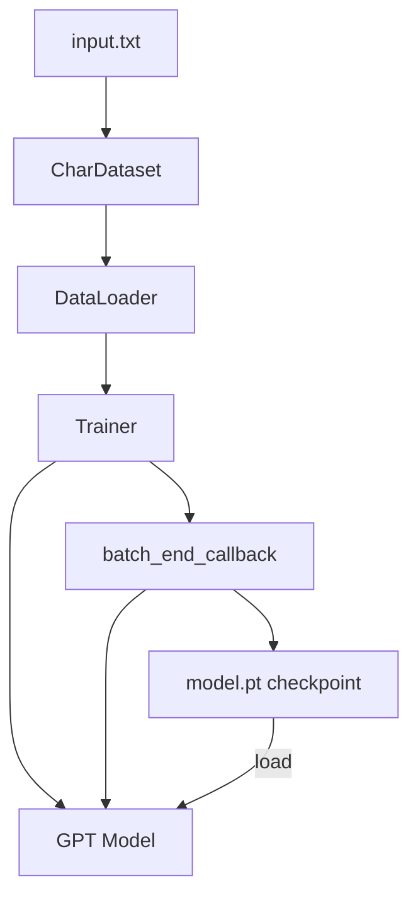

# Character-Level GPT Project

# Character-Level GPT

A training script that builds a character-level language model on top of the minGPT framework. It reads a raw text file, tokenizes it at the character level, and trains a GPT model to predict the next character in a sequence.

## Architecture Overview



## Configuration

### `get_config()`

Assembles the full training configuration from defaults provided by each subsystem, with project-level overrides:

| Section | Source | Key Overrides |
|---------|--------|---------------|
| `system` | Local | `seed=3407`, `work_dir='./out/chargpt'` |
| `data` | `CharDataset.get_default_config()` | `block_size=128` |
| `model` | `GPT.get_default_config()` | `model_type='gpt-mini'` |
| `trainer` | `Trainer.get_default_config()` | `learning_rate=5e-4` |

The learning rate is raised from the Trainer default because `gpt-mini` is small enough to safely converge at a faster pace.

All values can be overridden from the command line via `config.merge_from_args(sys.argv[1:])`, which parses `--key=value` style arguments.

## CharDataset

A `torch.utils.data.Dataset` that converts a raw text string into fixed-length training examples for autoregressive modeling.

### Construction

```python
train_dataset = CharDataset(config, data)
```

- **`config`** — A `CfgNode` containing at minimum `block_size` (the context window length in characters).
- **`data`** — A single string of raw text (the entire corpus).

On construction, the dataset builds a sorted vocabulary from the unique characters in `data` and creates two lookup tables:

| Attribute | Type | Description |
|-----------|------|-------------|
| `stoi` | `dict[str, int]` | Character → integer index |
| `itos` | `dict[int, str]` | Integer index → character |
| `vocab_size` | `int` | Number of unique characters |
| `data` | `str` | The full raw text |

### Key Methods

- **`get_vocab_size()`** — Returns the vocabulary size. Called by the main script to set `config.model.vocab_size`.
- **`get_block_size()`** — Returns `config.block_size`. Called by the main script to set `config.model.block_size`.
- **`__len__()`** — Returns `len(data) - block_size`. Each valid starting index produces one training example.
- **`__getitem__(idx)`** — Extracts a chunk of `block_size + 1` characters starting at `idx`, encodes them to integers, and returns `(x, y)` where:
  - `x` = characters `[idx, idx + block_size)` — the input context
  - `y` = characters `[idx + 1, idx + block_size + 1]` — the shifted targets

  This is the standard next-token prediction setup: position `i` in `x` should predict position `i` in `y`.

### Default Config

```python
CharDataset.get_default_config()
# → CfgNode with block_size = 128
```

## Training Pipeline

The `__main__` block executes the following sequence:

1. **Configuration** — `get_config()` builds defaults, then `merge_from_args` applies any CLI overrides.
2. **Logging & Seed** — `setup_logging(config)` and `set_seed(config.system.seed)` for reproducibility.
3. **Dataset** — Reads `input.txt`, constructs a `CharDataset`, then propagates `vocab_size` and `block_size` into the model config.
4. **Model** — Instantiates `GPT(config.model)`. The model's `vocab_size` and `block_size` are now matched to the data.
5. **Trainer** — Instantiates `Trainer(config.trainer, model, train_dataset)`.
6. **Callback** — Registers `batch_end_callback` on the `on_batch_end` event.
7. **Run** — `trainer.run()` starts the optimization loop.

### Callback Behavior

The `batch_end_callback` is invoked after every training batch and handles two concerns:

**Logging** (every 10 iterations): Prints the iteration number, wall-clock time per iteration (`iter_dt`), and training loss.

**Sampling & Checkpointing** (every 500 iterations):
- Switches the model to eval mode.
- Generates 500 characters conditioned on the prompt `"O God, O God!"` using `model.generate()` with `temperature=1.0` and `top_k=10`.
- Decodes the generated token indices back to a string via `train_dataset.itos`.
- Saves the model state dict to `{work_dir}/model.pt`.
- Switches the model back to training mode.

## Integration Points

This module depends on three external minGPT components:

| Component | Import | Usage |
|-----------|--------|-------|
| `GPT` | `mingpt.model` | The transformer model. Receives `config.model` and exposes `generate()` for sampling. |
| `Trainer` | `mingpt.trainer` | Drives the training loop. Accepts `config.trainer`, the model, and the dataset. Exposes `iter_num`, `iter_dt`, `loss`, and `device`. Supports event callbacks via `set_callback`. |
| `set_seed`, `setup_logging`, `CfgNode` | `mingpt.utils` | Reproducibility, logging setup, and hierarchical configuration objects. |

## Running

```bash
python -m projects.chargpt.chargpt --model.model_type=gpt-mini --trainer.learning_rate=5e-4
```

The input file `input.txt` must exist in the current working directory. Model checkpoints are written to `./out/chargpt/model.pt` by default (configurable via `--system.work_dir`).