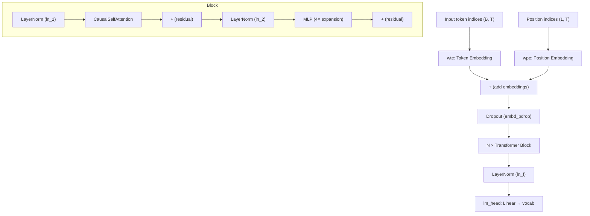

# Model Architecture

# Model Architecture (`mingpt/model.py`)

A complete GPT language model implementation in a single file, following the architecture of OpenAI's GPT-2 and HuggingFace's `GPT2LMHeadModel`. The design prioritizes clarity over abstraction — every component is explicit and auditable.

## Architecture Overview



The model uses **pre-norm** residual connections (LayerNorm before each sub-layer, not after), matching the GPT-2 convention. Each `Block` applies:

```
x = x + Attention(LayerNorm(x))
x = x + MLP(LayerNorm(x))
```

## Configuration

`GPT.get_default_config()` returns a `CfgNode` with all hyperparameters. You must provide **either** a `model_type` string **or** explicit `n_layer`/`n_head`/`n_embd` values — never both (enforced by XOR assertion).

### Predefined Model Types

| `model_type` | `n_layer` | `n_head` | `n_embd` | Approx. Params |
|---|---|---|---|---|
| `openai-gpt` | 12 | 12 | 768 | 117M |
| `gpt2` | 12 | 12 | 768 | 124M |
| `gpt2-medium` | 24 | 16 | 1024 | 350M |
| `gpt2-large` | 36 | 20 | 1280 | 774M |
| `gpt2-xl` | 48 | 25 | 1600 | 1558M |
| `gopher-44m` | 8 | 16 | 512 | 44M |
| `gpt-mini` | 6 | 6 | 192 | — |
| `gpt-micro` | 4 | 4 | 128 | — |
| `gpt-nano` | 3 | 3 | 48 | — |

Two parameters must always be set externally (they depend on your dataset):

- **`vocab_size`** — number of tokens in your tokenizer vocabulary
- **`block_size`** — maximum sequence length (context window)

### Dropout Parameters

| Parameter | Default | Applied To |
|---|---|---|
| `embd_pdrop` | 0.1 | After token + position embedding sum |
| `resid_pdrop` | 0.1 | After attention output projection and after MLP output |
| `attn_pdrop` | 0.1 | On attention weight matrix before value multiplication |

## Key Components

### `NewGELU`

The GELU activation used in the original GPT-2 and BERT implementations. This is the **approximate** form from the [GELU paper](https://arxiv.org/abs/1606.08415), not PyTorch's built-in `nn.GELU()` (which defaults to the exact erf-based form). The MLP in each `Block` uses this exclusively.

### `CausalSelfAttention`

A from-scratch multi-head causal self-attention layer. Key design choices:

- **Fused QKV projection**: A single `nn.Linear(n_embd, 3 * n_embd)` produces query, key, and value in one batch, then `.split()` separates them. This matches the HuggingFace/OpenAI convention and is more efficient than three separate linear layers.
- **Causal mask**: A lower-triangular buffer of shape `(1, 1, block_size, block_size)` is registered once. During forward, positions where `bias == 0` are filled with `-inf` before softmax, preventing attention to future tokens. The mask is sliced to the actual sequence length `T` at runtime.
- **Scaled dot-product**: Attention scores are divided by `√(head_dim)` before softmax.
- **Head reassembly**: After per-head attention, outputs are transposed back and concatenated along the embedding dimension, then passed through a linear projection + dropout.

The constraint `n_embd % n_head == 0` is enforced at construction time.

### `Block`

A single transformer block containing:

1. `ln_1` → `attn` (CausalSelfAttention) → residual add
2. `ln_2` → `mlp` → residual add

The MLP is stored as an `nn.ModuleDict` with keys `c_fc`, `c_proj`, `act`, `dropout`. The forward is composed as a lambda: `dropout(c_proj(act(c_fc(x))))`. The MLP expands to `4 * n_embd` internally (the standard 4× expansion factor from the original transformer paper).

### `GPT`

The top-level model class. The full sub-module tree:

```
GPT
├── transformer (ModuleDict)
│   ├── wte        — Embedding(vocab_size, n_embd)
│   ├── wpe        — Embedding(block_size, n_embd)
│   ├── drop       — Dropout(embd_pdrop)
│   ├── h          — ModuleList of N Blocks
│   └── ln_f       — LayerNorm(n_embd)
└── lm_head        — Linear(n_embd, vocab_size, bias=False)
```

Note that `lm_head` sits **outside** `self.transformer`. This matters: the parameter count printed at init only counts `self.transformer` parameters, excluding the decoder head. Weight-tied `lm_head` setups are not used here — `wte` and `lm_head` have independent weights.

## Weight Initialization

`_init_weights` is applied recursively via `self.apply()`:

| Module Type | Weight Init | Bias Init |
|---|---|---|
| `nn.Linear` | Normal(0, 0.02) | Zeros |
| `nn.Embedding` | Normal(0, 0.02) | — |
| `nn.LayerNorm` | Ones | Zeros |

After the recursive init, a **scaled residual projection** override is applied: any parameter whose name ends with `c_proj.weight` is re-initialized with `std = 0.02 / √(2 * n_layer)`. This is the GPT-2 paper's recommendation — it stabilizes training in deep transformers by reducing the variance growth through residual additions.

## Forward Pass

```python
logits, loss = model(idx, targets=None)
```

**Inputs:**
- `idx` — LongTensor of shape `(B, T)` with token indices
- `targets` — optional LongTensor of shape `(B, T)` with target token indices. Use `-1` for positions that should be ignored in loss computation.

**Returns:**
- `logits` — FloatTensor of shape `(B, T, vocab_size)`
- `loss` — scalar cross-entropy loss, or `None` if no targets provided

**Flow:**
1. Token embeddings (`wte`) + position embeddings (`wpe`) are summed
2. Embedding dropout is applied
3. The sequence passes through all `Block` layers sequentially
4. Final LayerNorm (`ln_f`) is applied
5. `lm_head` projects to vocabulary logits
6. If targets are given, `F.cross_entropy` computes loss with `ignore_index=-1`

An assertion enforces `T <= block_size` — sequences longer than the configured context window will raise an error.

## Generation

```python
output = model.generate(idx, max_new_tokens, temperature=1.0, do_sample=False, top_k=None)
```

Autoregressive token generation that feeds predictions back one step at a time:

1. If the sequence exceeds `block_size`, it is cropped to the last `block_size` tokens (sliding window)
2. Forward pass produces logits; only the **last timestep** logits are used
3. Logits are divided by `temperature` (lower = sharper, higher = more random)
4. If `top_k` is set, logits below the k-th highest value are masked to `-inf`
5. Softmax converts logits to probabilities
6. If `do_sample=True`, the next token is sampled via `torch.multinomial`; otherwise the greedy argmax is taken
7. The new token is appended and the loop repeats

Call `model.eval()` before generation to disable dropout.

## Loading Pretrained Weights

```python
model = GPT.from_pretrained('gpt2')  # also: gpt2-medium, gpt2-large, gpt2-xl
```

This class method downloads a HuggingFace `GPT2LMHeadModel` checkpoint and copies its weights into a freshly constructed minGPT model. The key complication is that OpenAI's checkpoints use a `Conv1D` module whose weight shape is transposed relative to `nn.Linear`. The method handles this by transposing weights for four specific parameter names:

- `attn.c_attn.weight`
- `attn.c_proj.weight`
- `mlp.c_fc.weight`
- `mlp.c_proj.weight`

The HuggingFace `attn.masked_bias` parameter is skipped (minGPT uses a registered buffer instead). All other parameters are copied directly after shape verification.

## Optimizer Configuration

`configure_optimizers(train_config)` separates parameters into two groups for proper weight decay:

| Group | Modules | Weight Decay |
|---|---|---|
| **Decay** | `nn.Linear` weights | `train_config.weight_decay` |
| **No decay** | All biases, `nn.LayerNorm` weights, `nn.Embedding` weights | 0.0 |

The method walks `named_modules()` and `named_parameters()` to classify each parameter by its parent module type and name suffix. It asserts that every parameter falls into exactly one group with no overlap. Returns a `torch.optim.AdamW` optimizer configured with `train_config.learning_rate` and `train_config.betas`.

## Integration Points

The model module connects to the rest of the codebase through these entry points:

- **`GPT.get_default_config()`** — called by project config builders (e.g., `projects/chargpt/chargpt.py`, `projects/adder/adder.py`) to obtain the default configuration node before overriding dataset-specific fields
- **`GPT.from_pretrained()`** — called from test suites (`tests/test_huggingface_import.py`) to validate weight loading against HuggingFace checkpoints
- **`GPT.generate()`** — called by training callbacks (`batch_end_callback` in adder, `batch_end_callback` in chargpt) and evaluation functions (`eval_split` in adder) to produce sample outputs during or after training