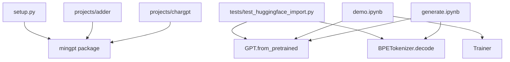

# Other

# Supporting Infrastructure — Demos, Projects, Tests & Packaging

This module covers the non-core supporting files in minGPT: the interactive demos, example projects, test suite, and package configuration. These components exercise and validate the core library (`mingpt.model`, `mingpt.trainer`, `mingpt.bpe`) and serve as reference implementations for common workflows.

## Architecture Overview



---

## Package Setup (`setup.py`)

The package is configured as an editable install with minimal dependencies:

- **Package name**: `minGPT`
- **Version**: `0.0.1`
- **Author**: Andrej Karpathy
- **Required dependencies**: `torch` only

Install as an editable package so `import mingpt` works across projects:

```bash
git clone https://github.com/karpathy/minGPT.git
cd minGPT
pip install -e .
```

No additional dependencies are declared — `transformers` is only needed for the HuggingFace compatibility test and the `generate.ipynb` comparison path, and must be installed separately.

---

## Demo Notebook (`demo.ipynb`)

A self-contained walkthrough that trains a GPT model to sort sequences of digits. Runs in about a minute on a MacBook Air.

### The Sorting Task

The `SortDataset` constructs input/output pairs where the model must sort a sequence of integers. For a problem of length 6 with 3 possible digit values (0, 1, 2):

```
Input:  0 0 2 1 0 1
Output: 0 0 0 1 1 2
```

The input and output are concatenated into a single sequence fed to the transformer. The model predicts the next token at every position, but loss is only computed at output positions (input positions are masked with `-1`):

```
Transformer input:  0 0 2 1 0 1 0 0 0 1 1
Target:            I I I I I 0 0 0 1 1 2
                   (I = -1, ignored in loss)
```

### SortDataset API

| Method | Description |
|--------|-------------|
| `__init__(split, length=6, num_digits=3)` | `split` is `'train'` or `'test'`. Train/test split is deterministic via hashing — 25% of examples are held out as test. |
| `get_vocab_size()` | Returns `num_digits` (the number of distinct token values). |
| `get_block_size()` | Returns `length * 2 - 1` — the total sequence length minus one (since the transformer predicts one step ahead). |
| `__getitem__(idx)` | Returns `(x, y)` tensors. `x` is the concatenated input-output offset by one; `y` has `-1` at input positions so loss is masked there. |

**Rejection sampling**: 50% of the time, examples with too many unique digits are rejected to boost the frequency of repeated-digit patterns, which the model struggles with.

### Training Flow

1. Instantiate `GPT` with `model_type='gpt-nano'`, setting `vocab_size` and `block_size` from the dataset.
2. Create a `Trainer` with `learning_rate=5e-4`, `max_iters=2000`.
3. Register an `on_batch_end` callback to print loss every 100 iterations.
4. Call `trainer.run()`.

### Evaluation

After training, evaluation uses `model.generate()` with `do_sample=False` (greedy decoding). The model receives only the input portion and must autoregressively produce the sorted output. Correctness is checked element-wise against the ground truth.

---

## Generation Notebook (`generate.ipynb`)

Demonstrates conditional and unconditional text generation using either minGPT or HuggingFace's `GPT2LMHeadModel`, allowing side-by-side comparison.

### Model Selection

The `use_mingpt` flag switches between the two backends:

```python
use_mingpt = True   # uses GPT.from_pretrained() + BPETokenizer
use_mingpt = False  # uses GPT2LMHeadModel.from_pretrained() + GPT2Tokenizer
```

Both paths support the same `model_type` values: `'gpt2'`, `'gpt2-medium'`, `'gpt2-large'`, `'gpt2-xl'`.

### The `generate` Function

```python
generate(prompt='', num_samples=10, steps=20, do_sample=True)
```

| Parameter | Description |
|-----------|-------------|
| `prompt` | Text prompt. Empty string triggers unconditional generation (uses the `<|endoftext|>` token as seed). |
| `num_samples` | Number of independent samples to produce in a single batch. |
| `steps` | Number of new tokens to generate (`max_new_tokens`). |
| `do_sample` | `True` for sampling with `top_k=40`; `False` for greedy argmax. |

**Tokenization paths**:
- **minGPT path**: `BPETokenizer` encodes the prompt. For unconditional generation, the `<|endoftext|>` token is manually extracted from `tokenizer.encoder.encoder` and used as the seed.
- **HuggingFace path**: `GPT2Tokenizer` encodes the prompt. For unconditional generation, the string `'<|endoftext|>'` is passed (the tokenizer special-cases it).

Both paths call `model.generate(x, max_new_tokens=steps, do_sample=do_sample, top_k=40)` and decode the output token indices back to strings.

---

## Projects

### `projects/adder`

Trains a GPT model from scratch to perform n-digit addition, inspired by the addition task described in the GPT-3 paper. See `projects/adder/` for implementation details.

### `projects/chargpt`

Trains a character-level language model on a text file. Supports three configurations:

| Setting | Description |
|---------|-------------|
| Custom `input.txt` | User-supplied text file (e.g. [tinyshakespeare](https://raw.githubusercontent.com/karpathy/char-rnn/master/data/tinyshakespeare/input.txt), ~1.1MB). |
| text8 | Wikipedia-derived benchmark, lowercased to 26 characters. |
| enwik8 | Hutter Prize benchmark — first 100MB of Wikipedia XML dump, 205 unique tokens. |

> **Note**: text8 and enwik8 benchmarks are listed as TODO and not yet implemented.

---

## Test Suite (`tests/`)

### `test_huggingface_import.py`

Validates that minGPT can load pretrained GPT-2 weights from HuggingFace and produce **identical** outputs to the reference `GPT2LMHeadModel`.

**Test: `test_gpt2`**

The test performs three equivalence checks:

1. **Logit equivalence**: Tokenize a prompt with both `BPETokenizer` and `GPT2Tokenizer`, forward through both models, and assert `torch.allclose` on the output logits.

2. **Generation equivalence**: Run `model.generate()` with `do_sample=False` (greedy) for 20 new tokens on both models and assert `torch.equal` on the raw index sequences.

3. **Decoded string equivalence**: Decode both output sequences to strings and assert exact equality.

This test is the primary correctness gate for the `GPT.from_pretrained()` weight-loading path and the `BPETokenizer` encoding/decoding path.

**Running the tests**:

```bash
python -m unittest discover tests
```

---

## Cross-Module Dependencies

| Component | Depends on |
|-----------|-----------|
| `demo.ipynb` | `GPT`, `Trainer`, `mingpt.utils.set_seed` |
| `generate.ipynb` | `GPT.from_pretrained`, `BPETokenizer`, `mingpt.utils.set_seed`, `transformers` (optional) |
| `test_huggingface_import.py` | `GPT.from_pretrained`, `BPETokenizer.decode`, `transformers` (required) |
| `projects/adder` | `mingpt` package |
| `projects/chargpt` | `mingpt` package |

The `transformers` library is a test-time and demo-time dependency only — it is not required for core training or inference with minGPT's own components.