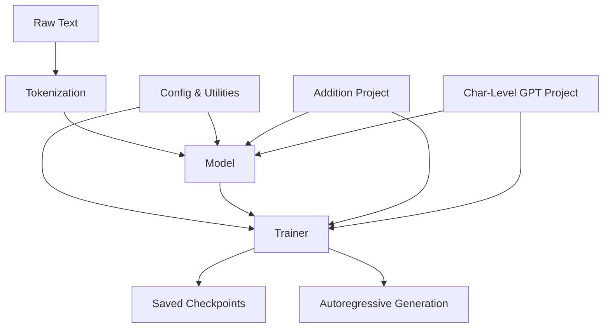

# minGPT — Wiki

# minGPT

A minimal, clean PyTorch re-implementation of GPT for both training and inference. minGPT strips the architecture down to its essentials — roughly 300 lines of model code — so you can actually read and understand every component. A sequence of indices goes in, a probability distribution over the next index comes out. That's the whole game.

> **Note (Jan 2023):** minGPT is in a semi-archived state. For active development, see [nanoGPT](https://github.com/karpathy/nanoGPT).

## Architecture at a Glance



The core library lives in `mingpt/` and consists of three pieces: the [Model Architecture](model-architecture.md) (the GPT transformer itself), the [Trainer](training.md) (a generic training loop), and [Tokenization](tokenization.md) (a BPE encoder matching OpenAI's GPT-2). A shared [Utilities & Configuration](utilities-and-configuration.md) module provides reproducibility helpers and `CfgNode`, a lightweight hierarchical config system.

Two example projects demonstrate end-to-end workflows: the [Addition Project](addition-project.md) trains GPT to perform n-digit addition by framing it as sequence completion, and the [Character-Level GPT Project](character-level-gpt-project.md) trains a next-character predictor on raw text files. Both projects wire together the same core modules — they configure a GPT model, hand it to the Trainer, and use generation callbacks to inspect progress.

## Key End-to-End Flows

**Tokenization pipeline:** Raw text is pre-tokenized with a regex pattern, byte-encoded, and iteratively merged via BPE. The [BPETokenizer](tokenization.md) wraps this process and returns PyTorch tensors ready for the model. The flow descends through `encode_and_show_work → encode → bpe → get_pairs`.

**Training loop:** The [Trainer](training.md) handles device placement, optimizer setup (delegated to the model via `configure_optimizers`), dataloader construction, gradient clipping, and iteration management. It calls a user-provided `batch_end_callback` after each step — this is where projects hook in evaluation and generation.

**Generation (inference):** After training, the model's `generate` method performs autoregressive sampling. In the Addition Project, for example, the callback flow is `batch_end_callback → eval_split → generate`, producing digit-by-digit predictions of arithmetic results.

## Getting Started

Install the package:

```bash
pip install -e .
```

Or run the interactive `demo.ipynb` notebook, which walks through loading a pretrained GPT-2 model and generating text. See [Other / Supporting Infrastructure](other.md) for details on demos, tests, and package layout.

To train your own model, start from one of the two projects — they serve as ready-made templates. The [Character-Level GPT Project](character-level-gpt-project.md) is the simpler entry point if you just want to train on a text file.