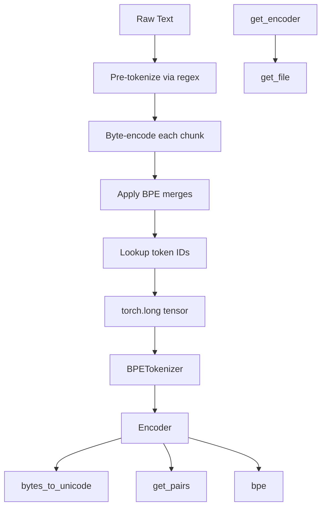

# Tokenization

# Tokenization Module

The BPE (Byte Pair Encoding) tokenizer converts between raw text strings and integer sequences suitable for transformer input. It is a reimplementation of OpenAI's GPT-2 encoder with added commentary and a PyTorch-friendly wrapper.

## Architecture

The module has three layers: low-level byte mapping utilities, the core `Encoder` class that implements the BPE algorithm, and a `BPETokenizer` wrapper that produces PyTorch tensors.



## Encoding Pipeline

Encoding a string passes through four stages:

### 1. Pre-tokenization

The regex pattern splits input text into chunks before BPE is applied. The pattern handles:

| Pattern segment | What it matches | Example |
|---|---|---|
| `'s\|'t\|'re\|'ve\|'m\|'ll\|'d` | English contractions | `I'm` → `I`, `'m` |
| ` ?\p{L}+` | Optional space + letters | ` Hello` |
| ` ?\p{N}+` | Optional space + digits | ` 2022` |
| ` ?[^\s\p{L}\p{N}]+` | Optional space + punctuation/symbols | `!!`, ` :` |
| `\s+(?!\S)` | Trailing whitespace (not before non-whitespace) | internal spaces |
| `\s+` | Remaining whitespace | trailing spaces |

This ensures BPE merges never cross word boundaries or mix letters with numbers.

### 2. Byte Encoding

Each pre-tokenized chunk is UTF-8 encoded into raw bytes, then every byte is mapped to a unicode character via `bytes_to_unicode()`. The 188 "printable" bytes (ASCII printable range, Latin-1 supplement) keep their `chr()` representation. The remaining 68 bytes (control characters, etc.) are shifted by 256 to avoid invisible or ambiguous characters. For example, the space byte (32) maps to `Ġ` (chr 288).

This guarantees every byte has a visible single-character representation and that the space character (` `) is never present in the encoded data — it is reserved as a delimiter within the BPE algorithm.

### 3. BPE Merging

The `bpe()` method iteratively merges the highest-priority bigram in the token:

1. Compute all adjacent character pairs (bigrams) via `get_pairs()`.
2. Find the bigram with the lowest rank in `self.bpe_ranks`. If none is found, stop.
3. Replace all occurrences of that `(first, second)` pair with the merged string `first+second`.
4. Repeat until no mergeable bigrams remain or the token collapses to a single symbol.

Results are memoized in `self.cache` keyed by the input token string.

### 4. Token ID Lookup

Each merged BPE symbol is looked up in `self.encoder` (loaded from `encoder.json`) to produce an integer. All integers across all pre-tokenized chunks are concatenated into the final output list.

## Decoding Pipeline

Decoding reverses the process:

1. Map each integer back to its BPE string via `self.decoder`.
2. Concatenate all BPE strings into one flat unicode string.
3. Map each unicode character back to its original byte via `self.byte_decoder`.
4. Decode the resulting `bytearray` as UTF-8.

## API Reference

### `bytes_to_unicode()`

Returns `dict[int, str]` — a one-to-one mapping from every byte value (0–255) to a visible unicode character. The 188 printable bytes map to themselves; the remaining 68 map to `chr(256 + n)`.

### `get_pairs(word: tuple) -> set[tuple[str, str]]`

Returns the set of all adjacent character pairs in the input tuple. Used internally by `Encoder.bpe()`.

### `Encoder`

Core BPE encoder/decoder. Constructed with a token-to-index dictionary and a list of merge tuples.

**Constructor:** `Encoder(encoder: dict[str, int], bpe_merges: list[tuple[str, str]])`

| Attribute | Type | Description |
|---|---|---|
| `byte_encoder` | `dict[int, str]` | Byte value → unicode char |
| `byte_decoder` | `dict[str, int]` | Unicode char → byte value |
| `encoder` | `dict[str, int]` | BPE token string → integer ID |
| `decoder` | `dict[int, str]` | Integer ID → BPE token string |
| `bpe_ranks` | `dict[tuple[str,str], int]` | Merge priority (lower = merge first) |
| `pat` | `re.Pattern` | Pre-tokenization regex |
| `cache` | `dict[str, str]` | Memoized BPE results |

**Methods:**

- **`bpe(token: str) -> str`** — Applies all eligible BPE merges to a single pre-tokenized, byte-encoded chunk. Returns space-separated merged symbols. Memoized.
- **`encode(text: str) -> list[int]`** — Full encoding pipeline: pre-tokenize → byte-encode → BPE merge → ID lookup.
- **`encode_and_show_work(text: str) -> dict`** — Same as `encode` but returns all intermediate results for debugging. Output structure:
  ```python
  {
      'bpe_idx': [15496, 3228, ...],   # final integer sequence
      'tokens': ['Hello', '!!', ...], # pre-tokenized chunks
      'parts': [                      # per-chunk intermediates
          {
              'token': ' Andrej',
              'token_bytes': b' Andrej',
              'token_translated': 'ĠAndrej',
              'token_merged': ['ĠAndre', 'j'],
              'token_ix': [10948, 73],
          },
          ...
      ]
  }
  ```
- **`decode(bpe_idx: list[int]) -> str`** — Reverses encoding: ID lookup → byte decode → UTF-8 string.

### `get_encoder() -> Encoder`

Factory function that downloads (if not cached) and loads the GPT-2 124M vocabulary files from OpenAI's blob storage, then constructs and returns an `Encoder`.

- **`encoder.json`** — 50,257 entries (256 byte tokens + 50,000 merges + 1 special `<|endoftext|>` token).
- **`vocab.bpe`** — 50,000 merge rules defining the BPE tree.

Files are cached at `~/.cache/mingpt/`.

### `get_file(local_file: str, remote_file: str)`

Downloads `remote_file` to `local_file` if the local file does not exist. Used by `get_encoder()`.

### `BPETokenizer`

PyTorch-aware wrapper around `Encoder`. Matches the HuggingFace `transformers` tokenizer interface.

**Constructor:** `BPETokenizer()` — Internally calls `get_encoder()`.

**`__call__(text: str, return_tensors='pt') -> torch.Tensor`** — Encodes a single string into a `torch.long` tensor with a batch dimension of 1 (shape `[1, seq_len]`). Only `return_tensors='pt'` is supported.

**`decode(idx: torch.Tensor) -> str`** — Decodes a 1D tensor of token IDs back to a string.

## Usage

```python
from mingpt.bpe import BPETokenizer

tokenizer = BPETokenizer()

# Encode text to a tensor
idx = tokenizer("Hello world", return_tensors='pt')
# tensor([[15496,  1159]])

# Decode back
text = tokenizer.decode(idx[0])
# "Hello world"
```

For debugging the intermediate steps:

```python
from mingpt.bpe import get_encoder

enc = get_encoder()
result = enc.encode_and_show_work("Hello!! I'm Andrej")
print(result['tokens'])       # pre-tokenized chunks
print(result['parts'])        # byte encoding, BPE merges, IDs per chunk
print(result['bpe_idx'])      # final integer sequence
```

## Integration with the Codebase

`BPETokenizer` is the primary entry point used by the rest of minGPT. It is instantiated in model configuration and used to convert training text into `torch.long` tensors fed to the transformer, and to decode model output indices back to human-readable text. External tests (e.g., `test_gpt2`) call `Encoder.decode` directly to verify round-trip correctness against reference implementations.