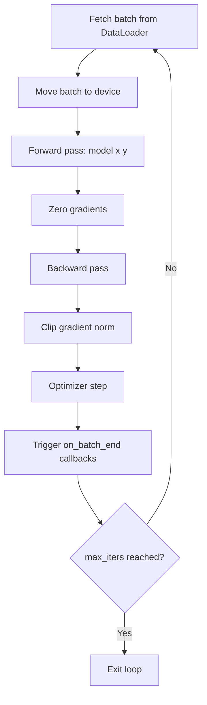

# Training

# Trainer

A generic, framework-agnostic training loop for PyTorch models. The `Trainer` class handles device placement, optimizer configuration, dataloader setup, gradient clipping, and iteration management. It is not GPT-specific — any model conforming to the expected interface can be trained with it.

## Model Interface Contract

The `Trainer` expects the passed model to implement two things:

1. **`model.configure_optimizers(config)`** — Must return a `torch.optim.Optimizer` instance. The trainer passes its full config object, so the model can read optimizer-relevant fields (e.g., `learning_rate`, `betas`, `weight_decay`).

2. **`model(x, y)`** — Forward pass that accepts input `x` and target `y`, and returns a tuple of `(logits, loss)` where `loss` is a scalar tensor for backpropagation.

## Configuration

`Trainer.get_default_config()` returns a `CfgNode` with the following defaults:

| Field | Default | Description |
|---|---|---|
| `device` | `'auto'` | `'auto'` selects CUDA if available, otherwise CPU. Pass `'cuda'` or `'cpu'` to force. |
| `num_workers` | `4` | Number of DataLoader worker processes. |
| `max_iters` | `None` | Maximum training iterations. `None` means train forever (must be stopped via callback or external interruption). |
| `batch_size` | `64` | Batch size per iteration. |
| `learning_rate` | `3e-4` | Learning rate. Consumed by `model.configure_optimizers`, not directly by the trainer. |
| `betas` | `(0.9, 0.95)` | Adam beta parameters. Also consumed by the model's optimizer config. |
| `weight_decay` | `0.1` | Weight decay, applied only on matmul weights (model-side logic). |
| `grad_norm_clip` | `1.0` | Maximum gradient norm for `clip_grad_norm_`. |

These config values are typically merged into a larger project config. Projects like `chargpt` and `adder` call `Trainer.get_default_config()` and incorporate it into their own `CfgNode` hierarchy.

## Initialization

```python
Trainer(config, model, train_dataset)
```

- Moves the model to the resolved device.
- Prints the selected device.
- Initializes iteration counters to zero: `iter_num`, `iter_time`, `iter_dt`.
- Creates an empty callback registry.

The optimizer is **not** created at init time — it is deferred to `run()` so that the model can configure it with access to the full config.

## Training Loop

```python
trainer.run()
```

The core training loop follows this flow each iteration:



### DataLoader Strategy

The trainer uses `RandomSampler` with `replacement=True` and `num_samples=int(1e10)`. This creates an effectively infinite stream of randomly sampled batches, which:

- Avoids epoch boundaries and the need for epoch-level logic.
- Means the `StopIteration` handler in the loop is a safety net — in practice the iterator should never exhaust given the 10 billion sample cap.
- `shuffle=False` is set because `RandomSampler` already handles randomization.

### Per-Iteration Steps

1. **Batch fetch** — Gets the next `(x, y)` pair from the dataloader iterator. On `StopIteration`, re-creates the iterator.
2. **Device transfer** — Moves all tensors in the batch to the training device.
3. **Forward** — Calls `model(x, y)`, storing `self.loss` as the returned loss scalar.
4. **Backward** — Zeros gradients (`set_to_none=True` for memory efficiency), calls `loss.backward()`, clips gradients to `config.grad_norm_clip`, and steps the optimizer.
5. **Callbacks** — Fires the `on_batch_end` event.
6. **Bookkeeping** — Increments `iter_num`, computes `iter_dt` (wall time for this iteration) and updates `iter_time`.

### Termination

The loop exits only when `config.max_iters` is set and `iter_num >= max_iters`. If `max_iters` is `None`, the loop runs indefinitely. To stop training without `max_iters`, use a callback that raises an exception or otherwise interrupts execution.

## Callback System

The trainer provides a lightweight event-based callback mechanism for extending training behavior (logging, checkpointing, early stopping, etc.).

### API

```python
# Append a callback to an event (multiple callbacks can stack)
trainer.add_callback('on_batch_end', my_callback)

# Replace all callbacks for an event with a single one
trainer.set_callback('on_batch_end', my_callback)
```

### Callback Signature

Every callback receives the `Trainer` instance as its sole argument:

```python
def my_callback(trainer):
    # Access trainer.loss, trainer.iter_num, trainer.iter_dt, etc.
    if trainer.iter_num % 100 == 0:
        print(f"iter {trainer.iter_num}, loss {trainer.loss.item():.4f}")
```

### Available Events

| Event | When it fires |
|---|---|
| `on_batch_end` | After optimizer step, before iteration bookkeeping |

The event system uses a `defaultdict(list)`, so any arbitrary event name can be used — but `on_batch_end` is the only one triggered by the built-in training loop. Custom events can be triggered manually via `trainer.trigger_callbacks('my_event')`.

## Trainer State Attributes

These attributes are useful for callbacks and monitoring:

| Attribute | Type | Description |
|---|---|---|
| `iter_num` | `int` | Current iteration count (0-indexed, incremented after each batch). |
| `iter_time` | `float` | Wall-clock timestamp of the most recent iteration start. |
| `iter_dt` | `float` | Wall-clock duration of the most recent iteration (seconds). |
| `loss` | `Tensor` | Loss scalar from the most recent forward pass. Available after forward, readable in `on_batch_end`. |
| `optimizer` | `Optimizer` | Set during `run()`. `None` before training starts. |

## Integration with Projects

Projects integrate the trainer by merging its default config and constructing it with a compatible model and dataset:

```python
from mingpt.trainer import Trainer

# In project config setup
C = CN()
C.trainer = Trainer.get_default_config()
C.trainer.max_iters = 5000

# At training time
trainer = Trainer(config.trainer, model, train_dataset)
trainer.run()
```

The model's `configure_optimizers` method reads the trainer config fields it needs (learning rate, betas, weight decay) and returns an optimizer — keeping model-specific optimizer logic (e.g., weight decay filtering) in the model where it belongs.