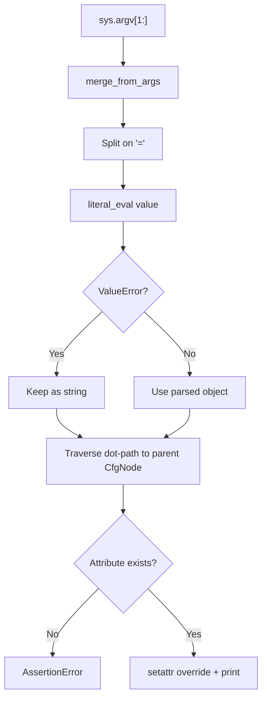

# Utilities & Configuration

# Utilities & Configuration

This module provides foundational infrastructure for the minGPT project: deterministic reproducibility via seed management, experiment logging, and a lightweight hierarchical configuration system.

## Configuration with `CfgNode`

`CfgNode` is a lightweight, nestable configuration object inspired by [yacs](https://github.com/rbgirshick/yacs). It allows you to define structured, hierarchical configs that can be overridden from the command line.

### Creating a Config

`CfgNode` accepts keyword arguments and stores them as attributes:

```python
from mingpt.utils import CfgNode

config = CfgNode(
    system=CfgNode(
        work_dir="./output",
        seed=42,
    ),
    model=CfgNode(
        n_layer=8,
        n_head=8,
        n_embd=512,
    ),
    trainer=CfgNode(
        batch_size=64,
        learning_rate=3e-4,
    ),
)
```

Nested `CfgNode` instances form a tree. Leaf values can be any Python type (int, float, bool, str, list, None, etc.).

### Accessing Values

Standard attribute access works at any depth:

```python
config.model.n_layer  # 8
config.trainer.batch_size  # 64
```

### Pretty Printing

`str(config)` produces an indented representation of the full hierarchy:

```
system:
    work_dir: ./output
    seed: 42
model:
    n_layer: 8
    n_head: 8
    n_embd: 512
trainer:
    batch_size: 64
    learning_rate: 0.0003
```

This is driven by `_str_helper`, which recursively indents nested `CfgNode` instances.

### Serialization

**`to_dict()`** recursively converts the entire config tree into a plain `dict`:

```python
config.to_dict()
# {'system': {'work_dir': './output', 'seed': 42}, ...}
```

This is used by `setup_logging` to write the config as JSON.

### Merging Configs

**`merge_from_dict(d)`** updates the config from a flat dict via `__dict__.update`. Note that this operates on the top-level object's namespace — it does not recursively merge nested `CfgNode` instances.

**`merge_from_args(args)`** parses a list of command-line-style strings (typically `sys.argv[1:]`) and overwrites matching config attributes. This is the primary mechanism for experiment overrides.

#### Command-Line Override Syntax

Arguments must follow the form `--key=value`, where `key` uses dot notation to traverse nested attributes:

```
--model.n_layer=10 --trainer.batch_size=32
```

The method:

1. Splits each argument on `=` to extract key and value.
2. Uses `ast.literal_eval` to parse the value into a Python object. This means `3` becomes an int, `3.14` a float, `True`/`False`/`None` their respective types, and `[1,2,3]` a list. If `literal_eval` raises `ValueError` (i.e., the value is a plain string), the raw string is kept.
3. Traverses the dot-separated path to find the parent `CfgNode`, then sets the leaf attribute.
4. Asserts that the target attribute already exists in the config — you cannot add new keys via command-line overrides, only change existing ones.

Each override prints a confirmation: `command line overwriting config attribute model.n_layer with 10`.



## Utility Functions

### `set_seed(seed)`

Sets the random seed across all sources for reproducibility:

- `random.seed(seed)` — Python's built-in RNG
- `np.random.seed(seed)` — NumPy RNG
- `torch.manual_seed(seed)` — PyTorch CPU RNG
- `torch.cuda.manual_seed_all(seed)` — PyTorch RNG on all CUDA devices

Call this once at the start of any experiment before any random operations occur.

### `setup_logging(config)`

Prepares the experiment output directory and writes two log files:

| File | Contents |
|------|----------|
| `{work_dir}/args.txt` | The full `sys.argv` command line, joined by spaces |
| `{work_dir}/config.json` | The complete config serialized as pretty-printed JSON |

`work_dir` is read from `config.system.work_dir`. The directory is created with `exist_ok=True`, so re-runs into the same directory will overwrite the log files but won't fail.

## Integration with the Codebase

This module is imported by the training scripts and model setup code throughout minGPT. The typical flow is:

1. Define a default `CfgNode` hierarchy.
2. Call `set_seed(config.system.seed)`.
3. Call `setup_logging(config)` to create the output directory and persist the config.
4. Call `config.merge_from_args(sys.argv[1:])` to apply any command-line overrides.
5. Pass the config to model constructors and trainer setup.

## Known Limitations

- **No freezing.** `CfgNode` attributes can be modified freely after creation. There is no mechanism to lock the config, so accidental mutation is possible.
- **No existence checks on `merge_from_dict`.** Unlike `merge_from_args`, `merge_from_dict` does not validate that keys already exist — it can silently introduce new attributes.
- **Shallow merge only.** `merge_from_dict` calls `__dict__.update`, which replaces top-level keys rather than recursively merging nested `CfgNode` instances.