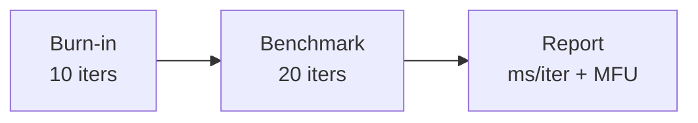
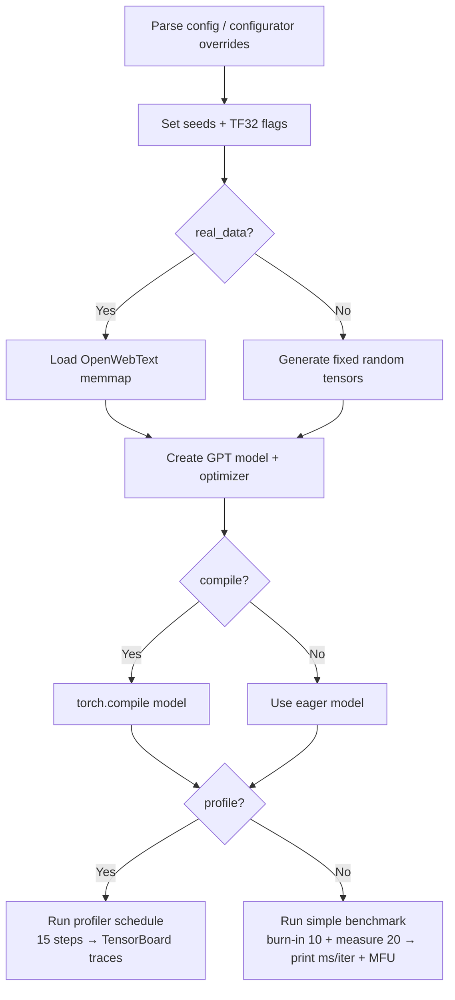

# Benchmarking

# Benchmarking Module

## Overview

`bench.py` is a lightweight, self-contained benchmarking script for measuring GPT training throughput. It strips down the full training loop in `train.py` to its essentials — forward pass, backward pass, optimizer step — and reports **time per iteration** and **MFU (Model FLOPs Utilization)**. This is the tool to reach for when evaluating hardware performance, comparing PyTorch compilation strategies, or validating that a code change hasn't introduced a regression in training speed.

## Quick Start

```bash
# Default benchmark (compiled, bfloat16, real data, simple timing)
python bench.py

# With overrides via configurator
python bench.py --compile=False --profile=True --batch_size=8

# Profiled benchmark (writes TensorBoard traces to ./bench_log)
python bench.py --profile=True
```

## Configuration

All configuration is set at the top of the file as module-level variables. The `configurator.py` mechanism (`exec(open('configurator.py').read())`) allows any of these to be overridden from the command line or a config file at runtime.

| Variable | Default | Description |
|---|---|---|
| `batch_size` | `12` | Number of sequences per batch |
| `block_size` | `1024` | Context length (sequence length in tokens) |
| `bias` | `False` | Whether linear layers use bias (must match model config) |
| `real_data` | `True` | Load from disk (`True`) or use synthetic random data (`False`) |
| `seed` | `1337` | Random seed for reproducibility |
| `device` | `'cuda'` | Compute device — `'cpu'`, `'cuda'`, `'cuda:0'`, etc. |
| `dtype` | auto | `'bfloat16'` if supported, else `'float16'`. Also accepts `'float32'` |
| `compile` | `True` | Apply `torch.compile` (PyTorch 2.0+) for kernel fusion |
| `profile` | `False` | Enable PyTorch profiler output (vs. simple timing) |

### dtype Auto-Detection

The script automatically selects the fastest supported precision:

```python
dtype = 'bfloat16' if torch.cuda.is_available() and torch.cuda.is_bf16_supported() else 'float16'
```

This is resolved into a PyTorch dtype and used with `torch.amp.autocast` for mixed-precision training. On CPU, autocast is disabled (a `nullcontext` is used instead).

## Data Loading

Two modes are available, controlled by `real_data`:

### Real Data Mode (`real_data=True`)

Loads the OpenWebText dataset from a memory-mapped file at `data/openwebtext/train.bin` (uint16 encoded tokens). Each batch is constructed by:

1. Sampling `batch_size` random starting indices uniformly across the dataset.
2. Slicing `block_size` tokens for input `x` and an offset-by-one slice for targets `y`.
3. Transferring to GPU via `pin_memory().to(device, non_blocking=True)` for async host-to-device copies.

The `split` argument to `get_batch` is intentionally ignored — benchmarking only uses training data.

### Synthetic Data Mode (`real_data=False`)

Generates fixed random tensors once at startup:

```python
x = torch.randint(50304, (batch_size, block_size), device=device)
y = torch.randint(50304, (batch_size, block_size), device=device)
```

The vocabulary size `50304` matches the GPT-2 tokenizer. Since the same `x` and `y` are reused every iteration, this eliminates data loading as a variable and isolates pure compute performance. Use this mode when you want to measure GPU throughput without I/O noise.

## Model Setup

The benchmark uses a fixed GPT-2 Small configuration:

```python
GPTConfig(
    block_size=1024,
    n_layer=12,
    n_head=12,
    n_embd=768,
    dropout=0,   # disabled for determinism
    bias=False,
)
```

The model is instantiated from `model.GPT`, moved to the target device, and optionally compiled with `torch.compile(model)`. Compilation adds startup overhead but significantly improves iteration speed on modern GPUs.

The optimizer is configured identically to training:

```python
model.configure_optimizers(weight_decay=1e-2, learning_rate=1e-4, betas=(0.9, 0.95), device_type=device_type)
```

## Benchmarking Modes

### Simple Timing (`profile=False`)

The default mode runs a two-stage loop:



1. **Burn-in** (10 iterations): Warms up the GPU, fills caches, and lets `torch.compile` finish any remaining JIT compilation. Results are discarded.
2. **Benchmark** (20 iterations): Timed with `time.time()` and bracketed by `torch.cuda.synchronize()` to ensure all GPU work completes before the clock is read.

After the benchmark stage, the script reports:

- **Time per iteration**: `(dt / num_steps) * 1000` in milliseconds
- **MFU**: Computed via `model.estimate_mfu(batch_size * num_steps, dt)`, which estimates the ratio of actual FLOPs achieved to theoretical peak hardware FLOPs

Each iteration consists of the full training step:

```
forward  →  backward  →  optimizer.step  →  zero_grad
```

### PyTorch Profiler (`profile=True`)

When enabled, the script uses `torch.profiler.profile` with a three-phase schedule:

| Phase | Steps | Purpose |
|---|---|---|
| `wait` | 5 | Skip — lets the pipeline stabilize |
| `warmup` | 5 | Warm up the profiler itself |
| `active` | 5 | Record traces |

The profiler records both CPU and CUDA activities, computes FLOPs (`with_flops=True`), and writes TensorBoard-compatible traces to `./bench_log`. To view the results:

```bash
tensorboard --logdir=./bench_log
```

Stack traces and memory profiling are disabled to reduce overhead. The `prof.step()` call at the end of each iteration advances the profiler's internal schedule.

## Execution Flow



## Key Design Decisions

- **`torch.cuda.synchronize()`** is called before and after the timed section. Without this, CUDA kernel launches are asynchronous and `time.time()` would only measure launch overhead, not actual computation.
- **`optimizer.zero_grad(set_to_none=True)`** is used instead of `zero_grad()` to avoid a memset — the gradient tensors are set to `None` instead of zeroed, which is slightly faster and matches production training.
- **`dropout=0`** ensures deterministic, reproducible timing across runs.
- **TF32 is enabled** (`allow_tf32 = True` for both matmul and cuDNN) to match production training behavior on Ampere+ GPUs.

## Dependencies

- `model.GPT` and `model.GPTConfig` — the model implementation being benchmarked
- `configurator.py` — runtime configuration override mechanism
- `data/openwebtext/train.bin` — required only when `real_data=True`
- PyTorch 2.0+ for `torch.compile` support