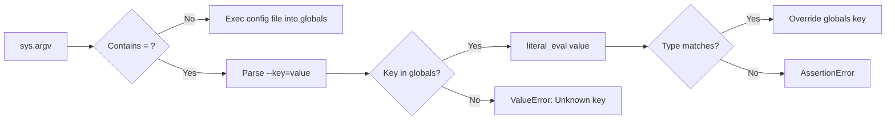

# Configuration Utility

# Configuration Utility

## Overview

The Configuration Utility (`configurator.py`) is a minimalist, convention-over-configuration system for overriding script settings at runtime. It processes command-line arguments to either execute a Python config file or apply individual key-value overrides — all directly into the caller's global namespace.

This is **not** a standard Python module. It is designed to be `exec`'d by the calling script, meaning its code runs in the caller's `globals()` scope. This eliminates the need to prefix every configuration variable with `config.`.

## How It Works



### Execution Model

From the calling script (e.g., `train.py`):

```python
exec(open('configurator.py').read())
```

Because `exec` runs the configurator's code in the caller's scope, any variable assignments made by config files or CLI overrides are written directly to the caller's `globals()`. This is the core trade-off: simplicity at the cost of conventional module encapsulation.

### Argument Processing

The configurator iterates over `sys.argv[1:]` and classifies each argument:

| Argument Form | Interpretation | Example |
|---|---|---|
| `filename.py` | Path to a config file to execute | `config/base.py` |
| `--key=value` | Inline override of a single config key | `--batch_size=32` |

**Config file arguments** must not start with `--`. The file is opened, its contents are printed to stdout for transparency, and then `exec`'d — setting variables directly in the caller's globals.

**Key-value arguments** must start with `--`. The value is parsed via `ast.literal_eval` to recover native Python types (ints, floats, bools, lists, etc.). If `literal_eval` fails (e.g., for plain strings), the raw string value is used instead. A type check then ensures the parsed value matches the type of the existing global variable before assignment.

## Usage

### Basic Override

```bash
python train.py --batch_size=32 --learning_rate=1e-4
```

This requires that `batch_size` and `learning_rate` already exist as globals in `train.py` before the `exec` call.

### Config File Override

```bash
python train.py config/experiment.py
```

Where `config/experiment.py` might contain:

```python
batch_size = 64
learning_rate = 3e-4
block_size = 256
n_layer = 8
```

### Combined

```bash
python train.py config/experiment.py --batch_size=32
```

The config file is processed first (based on argument order), then `--batch_size=32` overrides the value set by the file. Argument order matters — overrides are applied sequentially.

## Value Parsing

The configurator uses `ast.literal_eval` to convert string arguments into Python objects:

| CLI Input | Parsed Type | Result |
|---|---|---|
| `--batch_size=32` | `int` | `32` |
| `--lr=0.001` | `float` | `0.001` |
| `--use_gpu=True` | `bool` | `True` |
| `--name=hello` | `str` (literal_eval fails, fallback) | `"hello"` |
| `--layers=[4,8,12]` | `list` | `[4, 8, 12]` |

If `literal_eval` raises `SyntaxError` or `ValueError`, the raw string is used as-is.

## Type Safety

Overrides are guarded by a strict type check:

```python
assert type(attempt) == type(globals()[key])
```

This means:

- An `int` global cannot be overridden with a `float` (e.g., `--n_layer=8.0` will fail)
- A `bool` global cannot be overridden with an `int` (e.g., `--use_gpu=1` will fail)
- Subtypes are **not** accommodated — the check uses `type()` identity, not `isinstance()`

This is intentional: silent type coercion in configuration is a common source of subtle bugs.

## Error Conditions

| Condition | Exception | Message |
|---|---|---|
| Config file arg starts with `--` | `AssertionError` | — |
| Key-value arg lacks `--` prefix | `AssertionError` | — |
| Override key not in globals | `ValueError` | `Unknown config key: {key}` |
| Override type doesn't match existing | `AssertionError` | — |

## Design Rationale & Caveats

**Why `exec` instead of a module?** The author explicitly dislikes the verbosity of `config.every_variable` patterns and the complexity of formal configuration frameworks. This approach lets calling scripts reference config values as bare names.

**Security**: Config files are `exec`'d with full Python privileges. Only use config files from trusted sources. This is acceptable in a research/training context where the operator controls the config files, but would be unsafe for production-facing or multi-user systems.

**No validation schema**: There is no declarative schema for valid keys or value ranges. The only validation is that the key already exists in `globals()` and the type matches. Defaults must be set in the calling script before the `exec` call.

**No nested config**: The flat globals approach does not support hierarchical configuration. All config values are top-level variables.

**Argument ordering**: Overrides are applied in the order they appear in `sys.argv`. A later argument always wins over an earlier one, regardless of whether it comes from a file or a CLI flag.